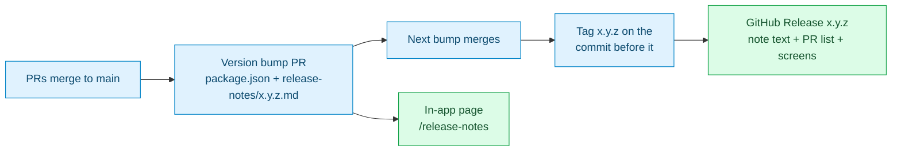

# Plan: Release Notes With Tags, Linked PRs, and Screens (#634)

Issue: https://github.com/mieweb/timehuddle/issues/634
Branch: `docs/634-release-notes-process` (cut from `main`)

## Goal

Every TimeHuddle version gets:

1. A **git tag** (`1.0.5`, with no `v` prefix, which matches the existing tag) on the **last** `main` commit that shipped under that version (decided while doing Milestone 3: every push to `main` republishes under the current version, so a version keeps picking up changes until the next bump).
2. A **GitHub Release** on that tag. Its title and text match the in-app note, and it adds the list of pull requests and their screenshots and videos.
3. An **in-app note** (`release-notes/<version>.md`) that now also shows screenshots from the PRs and a short list of the PRs it covers.

The process in [`release-notes/README.md`](../../release-notes/README.md) is updated so the next person does all three without help.

## Where things stand today

- In-app notes exist for `1.0.2` to `1.0.5`. Only `1.0.3` has screenshots. None of them link a PR.
- Only **one** tag exists: `1.0.5`, on `2b007299` (merge of #630). `1.0.2`, `1.0.3` and `1.0.4` have no tag and no GitHub Release.
- The GitHub Release for `1.0.5` is wrong in two ways:
  - Its **title** is `Huddle's feed is now an inbox`, which is the 1.0.4 headline. It should be `Your Redmine issues, inside TimeHuddle`.
  - Its **body** is missing the `@name` / `#ref` search bullet that was added to `1.0.5.md` after the release, in #631.
- Nothing automated checks a note. A bad version, date or image path silently drops the note from the page. The only check is opening the page. (`parse.ts` mentions a `notes.test.ts`, but that file does not exist.)

Each version on `main` (confirmed from `package.json` history). **Tag on** = the commit just before the next version's bump:

| Version | First shipped        | Tag on (last commit)          | Tag today                |
| ------- | -------------------- | ----------------------------- | ------------------------ |
| 1.0.2   | `f67081ab` (PR #494) | `98875e25` (PR #542)          | none                     |
| 1.0.3   | `20d6a53b` (PR #546) | `2c2957bc` (PR #606)          | none                     |
| 1.0.4   | `f0193ea5` (PR #605) | `41529d3b` (PR #628)          | none                     |
| 1.0.5   | `2b007299` (PR #630) | `ba086ece` (PR #629) for now¹ | `1.0.5` on `2b007299` ⚠️ |

¹ 1.0.5 is still the current version, so its last commit isn't final until 1.0.6 bumps. The existing tag misses #631 and #629, which the note describes.



---

## Milestone 0: Set Up and Learn the Tools

You change nothing in this milestone. You learn the tools you will use in the rest of the plan.

- [x] `nvm use && npm install` in this worktree
- [x] `npm run dev`, then open http://localhost:3000/release-notes and read all four notes
- [x] Read [`release-notes/README.md`](../../release-notes/README.md) end to end
- [x] Learn the difference between a **tag** (a git pointer to one commit) and a **Release** (a GitHub page built on a tag, with a title, text and files). Read:
  - https://docs.github.com/en/repositories/releasing-projects-on-github/managing-releases-in-a-repository
  - https://docs.github.com/en/repositories/releasing-projects-on-github/automatically-generated-release-notes
- [x] Look at the current release and its tag:
  ```bash
  gh release view 1.0.5 --repo mieweb/timehuddle
  git fetch --tags && git show --no-patch 1.0.5
  ```
- [x] Practise without publishing anything: GitHub's generate-notes API drafts a Release body and saves nothing.
  ```bash
  gh api -X POST repos/mieweb/timehuddle/releases/generate-notes \
    -f tag_name=1.0.6 -f target_commitish=main -f previous_tag_name=1.0.5 -q .body
  ```
  `target_commitish` must be a **branch**. A commit SHA gets `400 Invalid target_commitish`. For an older version, create the tag first, then pass it as `tag_name`. Never create a tag or Release on `mieweb/timehuddle` to practise; publishing notifies everyone watching the repo.

## Milestone 1: Configure GitHub's Generated Release Notes

**Generate release notes** (the button in the issue's first photo) builds the PR list for us. Configure it so it groups PRs and leaves out Dependabot noise.

- [x] Create [`.github/release.yml`](../release.yml): one category, Dependabot excluded (44 of the PRs GitHub lists for 1.0.5 today are Dependabot bumps)
- [x] Once the branch is pushed, check the config takes effect. With a tag name that doesn't exist yet, GitHub's output begins `<!-- Release notes generated using configuration in .github/release.yml at docs/634-release-notes-process -->` and has no Dependabot lines:
  ```bash
  gh api -X POST repos/mieweb/timehuddle/releases/generate-notes \
    -f tag_name=0.0.0-dryrun -f target_commitish=docs/634-release-notes-process -q .body
  ```
  That range holds only #631, so the Dependabot exclusion isn't proven over a range that contains Dependabot PRs. For an **existing** tag, GitHub reads `release.yml` from the tagged commit. Re-check when 1.0.6 is tagged after this merges. The 1.0.2–1.0.4 tags sit on commits older than the file, so their generated lists will include Dependabot (the README says so).
- [x] Commit: `chore(release): configure generated release notes`

## Milestone 2: Write the Process Down

Update [`release-notes/README.md`](../../release-notes/README.md). Do not start a second document.

- [x] Add a **"Shipping a release"** section after "Adding a note": when version X+1's bump merges, tag X on the commit before it, write the Release body from X's note (with `user-attachments` URLs for images), optionally append GitHub's generated PR list, and publish with the note's title
- [x] Add a **"Collecting screens from PRs"** section:
  - List the PRs in a release: `gh pr list --repo mieweb/timehuddle --state merged --search "merged:<prev-date>..<this-date>" --json number,title,url`
  - Find the media in one PR (description **and** comments, screenshots **and** YouTube links). The exact command is in the README.
  - **GitHub Release**: paste the `user-attachments` URL as is. GitHub shows images **and** videos inline.
  - **In-app note**: images must be **downloaded, cropped, compressed and committed** to `assets/<version>/` (the existing size rules apply). **Videos are never committed.** Link to the PR that shows the video, or to a YouTube upload if there is one.
- [x] Update the **Template** with a closing section:
  ```markdown
  ## Pull requests in this release

  - Redmine integration ([#560](https://github.com/mieweb/timehuddle/pull/560))
  - Tickets search by person and reference ([#631](https://github.com/mieweb/timehuddle/pull/631))
  ```
  Leave out Dependabot and pure-refactor PRs. Readers are users, so describe each PR in plain words, not by its commit-style title.
- [x] Update the README's Mermaid diagram with the Tag → Release step
- [x] Correct the stale `notes.test.ts` / `npm test` claims in the comments of [`parse.ts`](../../src/features/release-notes/parse.ts) and [`notes.ts`](../../src/features/release-notes/notes.ts). The test file does not exist, and nothing reads the collected errors.
- [x] Correct the README's claim that a bare YouTube URL is embedded. `@timehuddle/youtube` only looks up titles, and notes render with `remark-gfm`, so the URL shows as a link. Media also live in PR **comments**, not just descriptions, so the README's command reads both.
- [x] Commit: `docs(release-notes): document tagging, GitHub Releases, PR links and screens`

## Milestone 3: Fill In Past Notes (In-App)

Apply the new template to the notes already on the page.

- [x] Move the Redmine and timer sections that 1.0.3.md picked up from `redmine-integration` into 1.0.5.md, where they shipped (merged into 1.0.5's matching sections, not repeated)
- [x] For **each** of `1.0.2`, `1.0.3`, `1.0.4` and `1.0.5`:
  - [x] List the PRs merged between the previous version's ship commit and this one (table above):
    ```bash
    git log <prev-sha>..<this-sha> --first-parent --merges --format='%s'
    ```
    The commit range is only a starting point. A note describes what it describes, not exactly what is in its range: work kept being added under a version until the next bump, and `redmine-integration` wrote into 1.0.3.md but merged as 1.0.5. So build each list from **what the note's text covers**, including PRs that merged into feature branches (e.g. the Redmine sub-PRs into `redmine-integration`).
  - [x] Add a `## Pull requests in this release` section to the note
  - [x] Pull images from those PRs into `release-notes/assets/<version>/`, compressed (check each file with `ls -lh`)
  - [x] Add at most two or three images per note, placed next to the paragraph they illustrate, each with real alt text
  - [x] Link videos to their PR (or YouTube), never commit them
- [x] `npm run dev` and check `/release-notes`: all four notes show, 3/3 images load, and all 33 linked PRs exist and are merged. `/app/release-notes` was not checked (no backend running). It renders the same `ReleaseNotesList` component.
- [x] Check the page in dark mode and at phone width. Images fit. The public header's **Sign in** button already overflows at 390px; that's existing header layout, out of scope.
- [x] Commit per version, e.g. `docs(release-notes): link PRs and screens in 1.0.4`

## Milestone 4: Open the PR

- [x] `npm run lint && npm run typecheck && npm run format`, all clean
- [ ] `npm run test:all` passes (tell the reviewer if e2e can't run locally). `test:unit` passes, 359/359. The e2e half is deferred to a later run.
- [ ] Before/after screenshots of `/release-notes` in the PR description (`gh` can't upload images; paste them in the web editor)
- [x] PR title: `docs(release-notes): tag releases and link PRs and screens (#634)`. Opened as **draft** [#645](https://github.com/mieweb/timehuddle/pull/645) until e2e has run.
- [x] PR body says `Part of #634`, not `Closes`, so merging doesn't close the issue before Milestone 5 is done.

## Milestone 5: Tag and Release Past Versions

⚠️ This milestone writes to the **real repo**. Get your reviewer's OK before you start it, and do it **after** the Milestone 4 PR has merged so the text matches what is on `main`.

- [ ] Create the missing tags on the **Tag on** commits from the table:
  ```bash
  git tag -a 1.0.2 98875e25 -m "1.0.2 — The app updates itself"
  git tag -a 1.0.3 2c2957bc -m "1.0.3 — Time-change approvals, sharper notifications, faster attachments"
  git tag -a 1.0.4 41529d3b -m "1.0.4 — Huddle's feed is now an inbox"
  git push origin 1.0.2 1.0.3 1.0.4
  ```
- [ ] Move `1.0.5` forward to `ba086ece` so it includes #631 and #629 (or to whatever is the last 1.0.5 commit when you run this). Moving a published tag rewrites history for anyone who fetched it, so tell the team first. The GitHub Release follows the tag name.
  ```bash
  git tag -fa 1.0.5 ba086ece -m "1.0.5 — Your Redmine issues, inside TimeHuddle"
  git push --force origin 1.0.5
  ```
- [ ] Create a GitHub Release for each, oldest first so `1.0.5` stays **Latest**. Title and body come from each note, as in the README's "Shipping a release" steps 2–4. Pass `--latest=false` for the older ones.
- [ ] **Fix `1.0.5`**: `gh release edit 1.0.5 --title "Your Redmine issues, inside TimeHuddle" --notes-file <file>` with the current `1.0.5.md` body + PR list + screens
- [ ] Open https://github.com/mieweb/timehuddle/releases and confirm: four releases, newest is Latest, titles match the in-app page, and images and videos play

## Definition of Done

- [ ] Tags `1.0.2` to `1.0.5` exist, each on the last commit that shipped under it
- [ ] A GitHub Release exists for each, titled to match its in-app note, with the PR list and screens
- [ ] Each in-app note lists its PRs and shows screenshots where the change is visual
- [ ] `release-notes/README.md` tells the next person how to tag, release and collect screens, and the next release (`1.0.6`) is shipped by following it with no extra help

## Out of Scope (for Now)

- Publishing Releases automatically. Tags and draft Releases were brought in scope (tracking commit hashes by hand was error-prone): [`tag-release.yml`](../workflows/tag-release.yml) runs [`scripts/tag-previous-version.sh`](../../scripts/tag-previous-version.sh) and [`scripts/draft-release.sh`](../../scripts/draft-release.sh) on every push to `main`. Publishing stays a person's click because it notifies everyone watching the repo.
- Writing the missing `notes.test.ts` validator
- Re-hosting PR videos on YouTube (needs a decision on whose channel)
