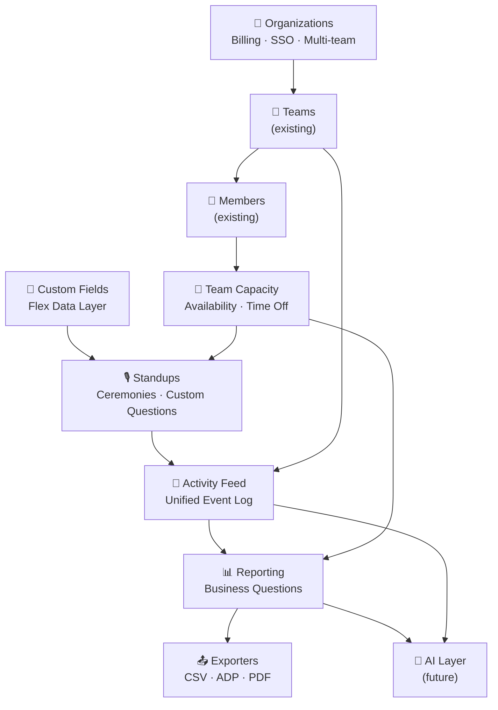

# TimeHuddle — Product Plans

> Some of these documents are **exploratory drafts**. Not all is approved for
> implementation or represents a commitment. Plans exist to think through
> architecture and feature direction before writing code.

---

## What These Plans Are For

As TimeHuddle grows from a time tracking tool into a team operations platform,
some decisions made early (data models, org hierarchy, event architecture)
become very expensive to change later. These plans exist to think those
decisions through *before* they become constraints.

---

## The Platform Vision

At full expression, these plans describe a transition across three personas:

### Team Member
Already has: clock in/out, tickets, messages, notifications, basic profile.

With these plans they gain:
- A **standup tab** pre-filled with their clock time and open tickets — they
  review and submit, not fill a blank form
- **Capacity awareness** — log time off, see available hours for the week
- A **discoverable profile** — clickable from the team member list and from chat
- **Mobile** access via PWA or native app

A member goes from "time tracking tool" to "I show up, my work is already
contextualized, and I'm visible to my team."

### Scrum Master
Currently has almost nothing purpose-built for them. With these plans they get:
- **Standups** — create a standup, configure questions once via custom fields,
  walk through each member's pre-populated tab in the meeting
- **Team capacity timeline** — who has 32 hrs available, who is on PTO, who is
  already overloaded before sprint planning starts
- **Reports** — ticket summary, member activity, standup blocker patterns across
  a sprint
- **AI (future)** — sprint capacity advisor recommends a sustainable story point
  target based on available hours and historical velocity

A scrum master goes from running standups in a Google Doc and guessing at
capacity, to a purpose-built cockpit for ceremonies and sprint planning.

### HR / Payroll / Finance
Currently has no presence in the system at all. With these plans they get:
- **ADP CSV export** — payroll hours flow out of the system directly, no manual
  timesheet collection or re-entry
- **Timesheet export** — full hours-per-member-per-period in Excel-friendly CSV
- **Org layer** — one place to manage all employees across all teams: headcount,
  billing, member directory
- **Time off records** — self-service entries with team admin visibility;
  foundation for a PTO approval workflow later
- **Google Workspace SSO** — new hires get access automatically; departing
  employees lose it when removed from the directory
- **Utilization reports** — data for performance reviews, resourcing decisions,
  billable hours tracking

HR goes from zero visibility to a payroll pipeline, member directory, time off
records, and utilization data — without touching a developer.

---

## How the Plans Fit Together

---

## The Activity Feed — The Connective Tissue

**Issue**: [#14 — Activity Feed — unified event log for user/team activity](https://github.com/mieweb/timehuddle/issues/14)

The activity feed is arguably the most important foundational piece across all
these plans. It is a single `activities` MongoDB collection that every feature
writes to via a single `emitActivity()` call. Clock in, ticket created, standup
submitted, time off logged, member joined — all become typed, normalized events
in one place.

This matters for the plans here because:

- **Reporting** aggregates activity events — the richer the feed, the richer the
  reports
- **Standups** can pre-populate member tabs by scanning their recent activity
  events rather than querying multiple collections
- **AI** has one place to read from rather than joining clock, ticket, standup,
  and capacity collections independently
- **Dashboard widgets** can be powered by activity streams without bespoke
  queries per widget
- **Org-level audit logs** (future HR/compliance need) are trivially built on
  top of an existing event log

The activity feed is a low-cost, high-leverage investment that makes every other
plan cheaper to build. [Issue #14](https://github.com/mieweb/timehuddle/issues/14)
proposes establishing it before clock, tickets, and integrations grow further —
retrofitting it later is painful.

---

## The Architectural Bets

Underneath all of these plans, a few structural decisions show up repeatedly:

| Decision | Why it matters |
|----------|---------------|
| **Add the org layer early** | Retrofitting org scoping onto a mature codebase is expensive. Even a minimal org in the DB (no UI yet) future-proofs every query. |
| **Clean, typed event data** | The activity feed, custom fields, and standup responses are only as useful as the structure of their data. Schemaless blobs make reporting and AI hard. |
| **Reports and exporters are separate** | Reports decide *what* data, exporters decide *what format*. The same timesheet report powers the UI table and the ADP CSV file. |
| **Custom fields as a shared primitive** | Standup questions, ticket metadata, and capacity tags all use the same field schema system — one implementation, not three. |

---

## Plan Index

| File | What it covers |
|------|---------------|
| [organizations.md](organizations.md) | Org hierarchy, SSO, Google Workspace, billing |
| [standups.md](standups.md) | Daily standup ceremonies, member tabs, AI pre-fill |
| [team-capacity.md](team-capacity.md) | Availability, time off, blocked time, timeline view |
| [custom-fields.md](custom-fields.md) | Flexible data model for standups, tickets, and beyond |
| [reporting.md](reporting.md) | Report definitions, UI, dashboard widgets, AI summaries |
| [exporters.md](exporters.md) | CSV, timesheet, ADP payroll exporter architecture |
| [mobile.md](mobile.md) | PWA, Capacitor, React Native path post-Meteor migration |
