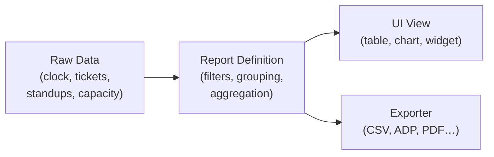

# Reporting Layer

> **STATUS: PLANNING** — This document is exploratory and not yet approved for implementation. Nothing here represents a commitment or active development work.

## The Problem

Individual data endpoints (clock events, tickets, timesheet) answer narrow
questions. A *report* answers a business question — "How many hours did my team
log last sprint?", "Which tickets are taking the longest?", "Who is consistently
over capacity?" — by aggregating and shaping data from multiple sources.

Without a reporting layer, every new question requires a new one-off endpoint.
With one, reports are defined once and can be rendered on-screen *or* exported
to any format the exporter layer supports.

---

## Relationship to Exporters

Reports and exporters are separate concerns that compose cleanly:



A report produces a normalized dataset. That dataset can be rendered in the UI
*or* passed to any exporter. The same timesheet report that renders as a table
in the dashboard should produce the same data when exported as a CSV or ADP
payroll file.

See [exporters.md](exporters.md) for the exporter architecture.

---

## Report Definition Model

Each report type is a named, registered definition:

```typescript
interface ReportDefinition {
  id: string;                       // e.g. 'timesheet', 'ticket-summary'
  name: string;                     // Human label
  description: string;
  requiredRole: 'member' | 'admin';
  params: ReportParamSchema[];      // Validated query params
  run(params: ReportParams, ctx: RequestContext): Promise<ReportResult>;
}

interface ReportResult {
  rows: Record<string, unknown>[];
  summary?: Record<string, unknown>;  // Totals, counts, etc.
  meta: {
    title: string;
    generatedAt: Date;
    generatedBy: string;
    filters: Record<string, unknown>;
  };
}
```

Reports are registered in a central registry (same pattern as the exporter
registry). The API layer looks up the report, runs it, then either serializes
it as JSON (for UI) or passes the result to an exporter (for downloads).

---

## API Shape

```
GET /v1/reports                          → list available reports for the user's role
GET /v1/reports/:reportId                → run report, return JSON (for UI)
GET /v1/reports/:reportId/export         → run report, return file download
    ?format=csv|timesheet|adp|pdf
    &teamId=...
    &startDate=YYYY-MM-DD
    &endDate=YYYY-MM-DD
    &[additional report-specific params]
```

---

## Initial Report Types

### 1. Timesheet Report
**Question**: How many hours did each team member log, and on what?

- **Params**: `teamId`, `startDate`, `endDate`, optionally `userId`
- **Rows**: one per clock session — member, date, duration, tickets
- **Summary**: total hours per member + grand total
- **Exports**: Timesheet CSV, ADP CSV, generic CSV
- **Data source**: `ClockService.getTimesheet()` (already exists)

### 2. Ticket Summary Report
**Question**: How is time distributed across tickets in a sprint or date range?

- **Params**: `teamId`, `startDate`, `endDate`, `status?`
- **Rows**: one per ticket — title, assignee, status, total time, GitHub link
- **Summary**: total tickets, total hours, open vs. closed count
- **Exports**: generic CSV
- **Data source**: tickets collection + clock event ticket associations

### 3. Member Activity Report
**Question**: When are team members most active? Are any consistently under/over
their capacity?

- **Params**: `teamId`, `startDate`, `endDate`
- **Rows**: one per member per day — available hours, logged hours,
  utilization %
- **Summary**: team average utilization, flagged outliers
- **Exports**: generic CSV
- **Data source**: clock sessions + capacity profiles (see
  [team-capacity.md](team-capacity.md))
- **Dependency**: requires team capacity feature to be meaningful

### 4. Standup Summary Report *(future — depends on standups feature)*
**Question**: What patterns emerge across standups? Who reports blockers most
often? What tickets come up repeatedly?

- **Params**: `teamId`, `sprintLabel?`, `startDate`, `endDate`
- **Rows**: one per standup entry — member, date, custom field values,
  blockers
- **Exports**: generic CSV
- **Data source**: standup + standup entry collections (see
  [standups.md](standups.md))

---

## UI Surface

Reports should be accessible from a dedicated **Reports** page in the app.
Rough layout:

- Left sidebar: list of available reports (filtered by user role)
- Main area: report-specific filter form + rendered results table
- Top-right: **Export** button with format picker (CSV, ADP, etc.)
- Charts/visualizations as a second pass — tables come first

Report results are paginated for large datasets. Export always includes the full
dataset regardless of pagination.

---

## Dashboard Widgets

Reports power dashboard widgets. A widget is a report run with fixed params
(e.g. "this week", "my team") rendered as a small summary card or chart. The
same `ReportDefinition.run()` method is called — no duplication.

Example widgets:
- "This week: 142 hrs logged across 8 members" (Timesheet Report, this week)
- "3 open tickets over 10 hrs with no update" (Ticket Summary Report)
- "Team at 87% capacity this sprint" (Member Activity Report)

---

## AI Component (Future)

- **Natural language queries**: "Show me everyone who logged less than 20 hours
  last week" → interpreted and mapped to a report + filters
- **Anomaly surfacing**: AI scans completed reports and highlights outliers
  without being asked ("Bob's hours dropped 40% this week compared to his
  average")
- **Narrative summaries**: generate a plain-English paragraph summarizing a
  timesheet or activity report for sharing with stakeholders

---

## Open Questions

- **Caching**: should report results be cached? For how long? Invalidation strategy?
- **Async generation**: large reports (6-month date range, 50-person team) may
  be slow — should they run async and notify when ready?
- **Scheduled reports**: can a team admin set up a weekly report to be emailed
  automatically?
- **Custom reports**: can admins define their own report configurations using
  the custom fields system?
- **Data retention**: how far back does report data go? Is there an archive
  policy?

---

## Possible Rollout Sequence

1. **Report registry + API skeleton** — `GET /v1/reports`, `GET /v1/reports/:id`
2. **Timesheet report** — uses existing `getTimesheet()`, renders in UI as a table
3. **Export integration** — wire report output to exporter layer for CSV download
4. **Ticket summary report** — second report type, validates the registry pattern
5. **Reports page UI** — dedicated page with filter form + results table + export button
6. **Dashboard widgets** — reuse report definitions for summary cards
7. **Member activity / capacity report** — depends on capacity feature
8. **Standup summary report** — depends on standup feature
9. **AI narrative summaries** — natural language summaries of completed reports
