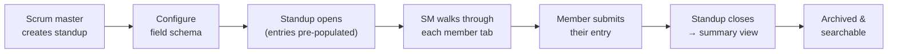

# Standup Feature Plan

> **STATUS: PLANNING** — This document is exploratory and not yet approved for implementation. Nothing here represents a commitment or active development work.

## The Problem

Daily standups are the most common ritual in agile teams, but today there is no
dedicated place in TimeHuddle to run or record one. Teams cobble standups
together in messages, shared docs, or third-party tools — none of which connect
back to the time, tickets, or activity already tracked here.

TimeHuddle already has the raw material: clock sessions, tickets, team
membership, and roles. A standup feature connects these into a structured,
repeatable ceremony that lives where the work already lives.

---

## Core Concept

A **Standup** is a team-scoped session created by the scrum master (or any team
admin). Once created, it has a set of per-member **tabs** — one per active team
member. The scrum master walks through each tab in the meeting, asking the
member to present, while the tab surfaces their data and captures their
responses.

```
Standup (team-scoped, date-stamped)
  └── StandupEntry (one per team member)
        ├── Member name + role
        ├── Custom field responses (see custom-fields.md)
        ├── Auto-pulled context (tickets, clock time, blockers)
        └── Attachments
```

---

## Standup Lifecycle



---

## What a Member Tab Shows

Every tab has a **fixed section** (always present) and a **custom section**
(defined by the scrum master via the custom fields schema — see
[custom-fields.md](custom-fields.md)).

### Fixed Section
- Member avatar, display name, role, team membership
- **Clock summary**: time logged today and this week (pulled from clock sessions)
- **Active tickets**: open tickets assigned to this member with time accumulated
- **Attachments**: files, links, screenshots the member wants to reference

### Custom Section (scrum master-defined)
The scrum master chooses which questions/fields appear on every member's tab.
Examples:

| Field | Type |
|-------|------|
| What did you do yesterday? | Long text |
| What are you doing today? | Long text |
| Any blockers? | Text + optional ticket link |
| Mood | Select (1–5 emoji scale) |
| External link (JIRA, PR, etc.) | URL |

The field schema is defined once per team and reused across all standups for
that team, but can be edited between sprints.

---

## Scrum Master Controls

- **Create standup**: picks date, optionally a sprint/cycle label
- **Configure fields**: add/remove/reorder custom questions for this team
- **Reorder member tabs**: drag to set the presentation order
- **Mark member as absent**: collapses their tab, no response required
- **Lock standup**: closes it for further edits after the meeting ends
- **View summary**: aggregated view of all responses + blockers highlighted

---

## Pre-Population (Reducing Ceremony Friction)

The biggest UX win is showing members their own context without them having to
type it. Before the meeting, the system pre-fills:

- Clock time from yesterday and today
- Tickets worked on since the last standup
- Any messages flagged as blockers (future: via AI scan)

Members review, trim, and add to this — they don't start from a blank form.

---

## Data Model (Rough)

```typescript
interface Standup {
  id: string;
  teamId: string;
  createdBy: string;       // userId of scrum master
  date: string;            // YYYY-MM-DD
  label?: string;          // e.g. "Sprint 12 - Day 3"
  fieldSchemaId: string;   // ref to team's custom field schema
  status: 'open' | 'locked' | 'archived';
  createdAt: Date;
  updatedAt: Date;
}

interface StandupEntry {
  id: string;
  standupId: string;
  userId: string;
  absent: boolean;
  fieldValues: Record<string, unknown>;  // fieldSchemaId → value
  attachments: Attachment[];
  submittedAt?: Date;
}
```

---

## AI Component (Future — Don't Build Yet)

The standup feature is designed so an AI layer can plug in naturally later.
Possibilities to keep in mind when making architectural decisions:

- **Pre-fill assistant**: scans a member's tickets, messages, and clock sessions
  and drafts their standup responses for them to review and edit
- **Blocker detection**: flags messages or ticket comments that look like
  blockers, surfaces them on the member tab automatically
- **Summary generation**: after the standup closes, produces a brief narrative
  summary of the team's day — who worked on what, what's blocked
- **Sprint advocate**: before sprint planning, agent consolidates a member's
  recent work and produces a summary to support their case for story point
  estimates
- **Retrospective synthesis**: across multiple standups in a sprint, identifies
  patterns — recurring blockers, members consistently over/under-estimating,
  tickets that dragged

**Architectural note**: keep standup data clean and structured (typed field
values, clear timestamps, explicit blocker flags) so AI agents have good signal
to work with rather than free-form text blobs.

---

## Relationship to Other Features

| Feature | Relationship |
|---------|-------------|
| **Clock sessions** | Auto-pulled into member tab for context |
| **Tickets** | Surface assigned open tickets; blockers can link to tickets |
| **Custom fields** | Standup questions are custom fields — share the same schema system |
| **Messages** | Future: scan thread for blocker keywords to pre-populate |
| **Dashboard** | Standup summary widget — "last standup was X days ago, N blockers" |
| **Notifications** | Remind members before standup starts |

---

## Open Questions

- **Who can create a standup?** Admins only, or any team member?
- **Recurring schedule**: should standups auto-create on a cadence (weekdays at
  9am), or always be created manually?
- **Member self-service**: can members fill in their tab before the meeting, or
  only during it?
- **History / search**: how far back should standup archives be searchable?
- **Multiple teams**: if a user is on multiple teams, do they get a tab in each
  team's standup?

---

## Possible Rollout Sequence

1. **Minimal standup** — create a standup, tabs per member, fixed section only
   (no custom fields yet), lock + archive
2. **Custom fields integration** — plug in the field schema system once
   [custom-fields.md](custom-fields.md) is built
3. **Pre-population** — auto-pull clock time and tickets into member tabs
4. **Summary view** — aggregated post-standup read-only page
5. **Recurring schedule** — auto-create standups on a cron
6. **AI layer** — pre-fill, blocker detection, summary generation
