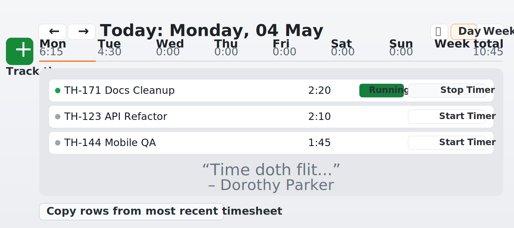

# Timers

> **STATUS: READY** — Ready for implementation.

## Background

Huddle is modelled on Harvest's time-tracking UX — a per-day timesheet where users add timer rows, start and stop them, and copy from previous days — with an additional clock in/out layer that records presence independently.

The two core concepts are distinct:

- **Clock event** — the fact that a user is "at work" for a team. It has a start and end wall-clock time. It is like punching a physical time card. **A clock event does not require any timer to be running.** Being clocked in with no ticket timer active is a normal, valid state — a user may be in a meeting, doing admin work, or otherwise not tracking against a specific ticket.
- **Timer (UI term) / `TimeEntry` (data term)** — a per-day row on a user's timesheet representing work on a specific ticket. It answers "what was I working on today and for how long?" Starting and stopping a timer in the UI creates `TimerSession` records. Each `TimeEntry` is scoped to one calendar day. Entries are always optional within a clock event.

The UI always uses the word "Timer" for familiarity. The data model uses `TimeEntry` because the record is a per-day entry on a timesheet, not a stateful object that persists across days.

Right now timer state is conflated into Ticket and ClockEvent, which is creating real problems.

---

## The Problem

The current model stores timer state in two places simultaneously:

**On `Ticket`** ([ticket.model.ts](../../../backend/src/models/ticket.model.ts)):
```typescript
accumulatedTime: number;   // seconds — owned here
startTimestamp?: number;   // epoch ms — present only while running
```

**Embedded inside `ClockEvent.tickets[]`** ([clock.model.ts](../../../backend/src/models/clock.model.ts)):
```typescript
interface ClockEventTicket {
  ticketId: string;
  startTimestamp?: number;
  accumulatedTime: number;
  sessions: ClockTicketSession[]; // the actual start/stop history
}
```

This creates several concrete problems:

- **Dual source of truth.** `accumulatedTime` lives on both `Ticket` and inside the clock event's embedded ticket entry. They can drift apart.
- **Leaky cleanup.** Clock-out has to stop running timers in two separate places: inside the clock event *and* on the ticket collection. See the comment in `clock.service.ts`:
  ```
  // Stop all running ticket timers inside the event
  // Also stop any free-running ticket timers in the tickets collection
  ```
- **Ticket is polluted.** A ticket (a work item) is carrying live runtime state. This makes tickets harder to reason about and harder to migrate to org-level visibility later.
- **No independent timer identity.** There is no `Timer` object you can list, reuse, copy, or pin. You can only infer timers from ticket state and embedded clock data.
- **Workarounds compound.** Starting a timer currently scans and stops other running timers by querying the ticket collection — work that would be trivial if there were a dedicated Timer model with a unique running-session constraint.

---

## Proposed Model

### Core intuition

| Model | What it represents |
|-------|-------------------|
| `Ticket` | A work item — title, status, assignee, metadata. No runtime state. |
| `TimeEntry` | One row on a user's timesheet for a specific ticket on a specific calendar day. Created fresh each day. |
| `TimerSession` | One immutable start/stop interval within a `TimeEntry`. The historical ledger. |
| `ClockEvent` | A user's session "at work" for a team. Provides payroll/presence context; does not own timer state. |

The UI calls `TimeEntry` a "timer" throughout. The distinction is only in code, API routes, and the database.

### `TimeEntry`

```typescript
interface TimeEntry {
  _id: ObjectId;
  userId: string;
  ticketId: string;         // the work item being tracked
  date: string;             // ISO date string: "YYYY-MM-DD" in UTC (canonical storage key)
  note?: string;            // optional per-entry note (like Harvest's "notes" field)
  sortOrder?: number;       // for UI ordering within a day
  createdAt: Date;
  updatedAt?: Date;
}
```

Natural key: `{ userId, ticketId, date }` — unique per user per ticket per day. Team association is derived via `ticketId → Ticket.teamId` and is not stored here.

Date policy for MVP:

- `TimeEntry.date` and `TimerSession.date` are stored as UTC calendar dates (`YYYY-MM-DD`) for consistency in indexing and reporting.
- UI labels and day navigation are displayed in the user's local timezone (browser/system timezone).
- A local day can map to one or two UTC `date` keys. User-facing day/week totals must be computed from local-day boundaries (timezone-aware range), with `date` used as an index-friendly prefilter.

A `TimeEntry` is a per-day row. It does not carry running state — that belongs to `TimerSession`. Each day starts with whatever entries the user creates or copies from a previous day. Copying from yesterday creates new `TimeEntry` rows for today (with zero sessions) — it does not reuse yesterday's rows.

**Midnight crossing rule**: the UI closes a running session at local midnight and opens a new one for the new local day (or leaves it stopped). Each resulting segment is stored with the UTC `date` of that segment's `startTime` as the canonical key.

### `TimerSession`

```typescript
interface TimerSession {
  _id: ObjectId;
  timeEntryId: string;      // the parent TimeEntry (day + ticket)
  userId: string;           // denormalized for query efficiency
  teamId: string;           // denormalized for reporting
  ticketId: string;         // denormalized for reporting
  date: string;             // denormalized: same as parent TimeEntry.date (YYYY-MM-DD)
  clockEventId?: string;    // the clock event this session was part of (undefined for manual entries)
  startTime: number;        // epoch ms
  endTime: number | null;   // null = currently running
  durationSeconds?: number; // cached on close (startTime/endTime diff) — do not write on open
  createdAt: Date;
}
```

`TimerSession` is the ledger. Once `endTime` is set it is effectively immutable. Manual adjustments create new sessions or update the `durationSeconds` field rather than rewriting history.

### Granularity Decision (Long-Term Safe Default)

Persist every start/stop boundary as real session data:

- Each timer start creates one open `TimerSession` row.
- Each timer stop closes that same row by setting `endTime` and `durationSeconds`.
- If a user starts/stops the same timer multiple times in one day, that creates multiple `TimerSession` rows for the same `TimeEntry`.

Reporting and UI roll these up into simple day totals, but the raw segment history remains available for audit, reconciliation, and future analytics.

### MVP Decision: Ticket Total Source Of Truth

For MVP, ticket totals are **live-derived from `TimerSession`** and not cached anywhere.

- Source of truth: `SUM(durationSeconds) WHERE ticketId = ?`.
- `Ticket.accumulatedTime` is removed to avoid dual-write consistency issues.
- Day totals for the timesheet week strip: compute by local-day boundaries (timezone-aware), using UTC `date` as an index prefilter.
- If performance becomes a problem later, add a background-updated projection while keeping `TimerSession` as canonical truth.

### `Ticket` (simplified)

```typescript
interface Ticket {
  _id: ObjectId;
  teamId: string;
  title: string;
  description?: string;
  github: string;
  status: TicketStatus;
  priority?: TicketPriority;
  createdBy: string;
  assignedTo: string | null;
  reviewedBy?: string;
  reviewedAt?: Date;
  createdAt: Date;
  updatedAt?: Date;
  // REMOVED: accumulatedTime — now derived from TimerSession
  // REMOVED: startTimestamp  — now owned by TimerSession
}
```

Total time on a ticket is derived: `SUM(durationSeconds) WHERE ticketId = ?`.

### `ClockEvent` (simplified)

```typescript
interface ClockEvent {
  _id: ObjectId;
  userId: string;
  teamId: string;
  startTime: number;
  endTime: number | null;
  accumulatedTime: number;  // total wall-clock seconds for payroll
  // REMOVED: tickets[] — sessions now reference the clock event via clockEventId
}
```

The embedded `tickets[]` array is removed. A query like "what tickets did the user work on during this clock event?" becomes `TimerSession.find({ clockEventId })`.

---

## Key Invariants

1. **At most one running session per user at a time.** Enforced by a unique partial index on `TimerSession`: `{ userId: 1 }` where `endTime = null`. Starting a new session must close any existing open one first — one place, one operation.

2. **MVP session mutation policy is pragmatic.** Running sessions are immutable except close; closed sessions may be edited in MVP for product simplicity.

3. **Ticket total time is derived.** Nothing writes `accumulatedTime` onto Ticket. The displayed total is `SUM(durationSeconds) FROM TimerSession WHERE ticketId = ?`.

4. **Clock-out is a single targeted query.** On clock-out, close all `TimerSession WHERE userId = ? AND endTime IS NULL`. No more scanning two collections.

5. **`TimeEntry` is per-day.** A `TimeEntry` is scoped to one calendar day via its `date` field. Copying timers from a previous day creates new `TimeEntry` rows for today — yesterday's rows are never reused or mutated.

6. **Session timestamps are valid.** `startTime` is always required; closed sessions must satisfy `endTime >= startTime`. Midnight-crossing sessions belong to the `date` of their `startTime`.

7. **Session segments are canonical.** Multiple start/stop cycles in a day are stored as multiple `TimerSession` rows for the same `TimeEntry`, never collapsed into one inferred span.

## Index Strategy (MVP)

Create these indexes when introducing `TimeEntry` and `TimerSession`:

1. `TimeEntry`: unique `{ userId: 1, ticketId: 1, date: 1 }` (one entry per user per ticket per day).
2. `TimeEntry`: `{ userId: 1, date: 1 }` (load all entries for a user on a given day — primary timesheet query).
3. `TimerSession`: unique partial `{ userId: 1 }` where `endTime: null` (at most one running session per user).
4. `TimerSession`: `{ timeEntryId: 1, startTime: 1 }` (all sessions for a given entry, in order).
5. `TimerSession`: `{ ticketId: 1, date: 1 }` (ticket totals by day for reporting).
6. `TimerSession`: `{ userId: 1, date: 1 }` (user timesheet day totals — week strip).
7. `TimerSession`: `{ teamId: 1, date: 1 }` (team/org reporting ranges).
8. `TimerSession`: `{ clockEventId: 1, startTime: 1 }` (shift-level drilldown).

## Concurrency Semantics (MVP)

Use optimistic, race-safe writes with compare-and-set filters:

1. **Start timer**:
  close current open session using `updateOne({ userId, endTime: null }, { ...set endTime... })`,
  then insert a new open `TimerSession` referencing the `TimeEntry` for today.
2. **Stop timer**:
  close only the matching open session using `updateOne({ _id: sessionId, endTime: null }, ...)`.
3. If start/stop detects zero modified rows where one was expected, refetch active session and retry once.

This is sufficient for MVP without requiring full multi-document transactions.

## Activity Log Relationship (Future)

An activity log can be added later for user-facing history and diagnostics (for example, "started timer", "stopped timer", "edited duration").

- Activity log is **supplemental telemetry**, not the source of truth for totals.
- `TimerSession` remains the canonical ledger for all duration math and reporting.
- If an activity event is dropped or delayed, time totals remain correct because they are computed from sessions.

---

## How Clock In/Out Relates

The clock event captures the user's working-day boundary. `TimerSession.clockEventId` records which shift a session happened in, enabling:

- **Payroll export**: "Show me every session during this clock event."
- **Timesheet view**: "Group sessions by date."
- **Sessions without a clock event**: Manual time entries (like Harvest's manual entry) can have `clockEventId = undefined`.

Clock events do **not** own timer state. They provide grouping context. A clock event with zero timer sessions is perfectly valid — it means the user was present but did not track against any ticket during that shift.

```
ClockEvent  (always present when clocked in)
  └── TimerSession (via clockEventId) — zero or more; optional
        └── TimeEntry (via timeEntryId)
              └── Ticket (via ticketId)
```

`ClockEvent.accumulatedTime` is always the authoritative wall-clock total for the shift. `SUM(TimerSession.durationSeconds WHERE date = ?)` is the portion of the day tracked against tickets — which may be less, more, or zero.

### Timer Sessions Without a Clock Event

Sessions with `clockEventId = undefined` are valid and expected (manual entries, retroactive additions). They:

- count toward ticket totals and timesheet day totals (`SUM` by `date`),
- do **not** affect `ClockEvent.accumulatedTime` — they are time logged, not presence recorded,
- should be visually distinguished in the UI (for example a "manual" badge or different row style).

### Timer Totals Exceeding Clocked Time

This is **not an error condition** — the two numbers answer different questions and are expected to diverge:

| Metric | Question answered | Who owns it |
|--------|------------------|-------------|
| `ClockEvent.accumulatedTime` | Were you present / at work? | `ClockEvent` |
| `SUM(TimerSession.durationSeconds)` | What did you log against tickets? | `TimerSession` |

Common scenarios where ticket time legitimately exceeds clocked time for a day:

- A user adds a retroactive manual entry for work done before clocking in or after clocking out.
- A user forgets to clock in but still tracks timer sessions.
- Timer sessions were added for a past day via the timesheet UI.

The application should **never block or warn on this divergence** at the data layer. Reporting surfaces can choose to highlight the gap (for example a "untracked presence time" column) but must not treat it as invalid data.

---

## What This Enables

| Feature | Why it needs this model |
|---------|------------------------|
| Copy timers from previous day | Find most recent day with `TimeEntry` rows for this user; duplicate them as new `TimeEntry` rows for today (zero sessions) |
| Harvest-style day view | Local-day queries map to UTC `date` key(s), then load matching `TimeEntry` rows and session aggregates |
| Manual time entry | Create a `TimeEntry` for the target `date` + a closed `TimerSession` with explicit `startTime`/`endTime`, no `clockEventId` needed |
| Edit time entry | Update `durationSeconds` on a closed session or split/merge sessions |
| Per-ticket reporting | `SUM(durationSeconds) WHERE ticketId = ?` — no scan of ticket documents |
| Per-user daily timesheet | `TimerSession WHERE userId = ? AND date = ?` — `date` is indexed and cheap |
| Org-level capacity reports | `TimerSession WHERE teamId IN org_teams AND date BETWEEN range` |

---

## Migration Path

> **Pre-launch note**: The app has not launched yet — only local dev data exists. No backfill of historical sessions is needed. The migration is a clean field removal.

1. Drop legacy fields from the database:
   ```js
   db.tickets.updateMany({}, { $unset: { accumulatedTime: "", startTimestamp: "" } })
   db.clockevents.updateMany({}, { $unset: { tickets: "" } })
   ```
2. Remove `accumulatedTime` and `startTimestamp` from the `Ticket` TypeScript model.
3. Remove the `tickets[]` embedded array from the `ClockEvent` TypeScript model.
4. Update all services, routes, and frontend types to use `TimeEntry`/`TimerSession`.

> **Post-launch note**: If this refactor is ever needed after real users exist, the full phased backfill approach (iterating `ClockEvent.tickets[]` and synthesising `TimerSession` rows) should be revisited and planned separately.

## Timesheet UI (MVP)

Build a Harvest-inspired timesheet surface on top of the new `TimeEntry`/`TimerSession` model.



### Layout and navigation

1. Header shows the selected week label (for example, `Today: Monday, 04 May`).
2. Left and right arrow buttons move to previous/next week.
3. Primary strip shows seven day buttons for the selected week (Mon-Sun), each showing:
  - day label,
  - accumulated tracked time for that day (`SUM(durationSeconds) WHERE userId = ? AND date = ?`),
  - active/selected visual state.
4. A calendar button opens date/week selection (MVP can open a basic date picker), displayed in the user's local timezone.
5. A `Day` vs `Week` segmented control is present:
  - `Day` view is fully functional in MVP.
  - `Week` view is a visible placeholder in MVP (no advanced rollup UI required yet).

### Day view behavior (MVP)

1. Selecting a local day loads all `TimeEntry` rows for that user/team by mapping the selected local day to UTC `date` key(s).
2. Each row shows:
  - ticket title (from `TimeEntry.ticketId`),
  - total tracked duration for that day (`SUM(durationSeconds)` across that entry's sessions),
  - running state indicator (if a session for this entry has `endTime = null`),
  - start/stop control.
  - if the linked ticket is soft-deleted or missing, render the row as an **Unassociated Timer** in MVP (time remains visible and editable).
3. A day starts **empty** unless the user creates entries or copies from a previous day. There are no phantom entries from prior days.
4. A primary `+` action creates a `TimeEntry` for the selected day:
  - prompt for ticket selection,
  - insert `TimeEntry { userId, ticketId, date }`,
  - team association is resolved from the ticket, not stored on the entry,
  - optionally start immediately (open a `TimerSession`).
5. If a user is clocked in but has no `TimeEntry` rows for today, show an empty state that still allows timer creation.
6. Include a **"Copy rows from most recent timesheet"** action:
  - find the most recent `date < today` where this user has at least one `TimeEntry`,
  - duplicate those rows as new `TimeEntry` records for today (with zero sessions),
  - if a row already exists for `{ userId, ticketId, date=today }`, skip it (no duplicate, no error),
  - do not copy sessions — today starts at 0:00 for each entry.

### Data contract for UI

1. Week strip: compute totals by local day boundaries (timezone-aware); use UTC `date` as a prefilter/index aid.
2. Day list: load `TimeEntry` rows by the UTC `date` key(s) that correspond to the selected local day, then join session aggregates and active session detection (`endTime = null`).
3. Sessions without `clockEventId` count in timesheet totals — the `date` field is the grouping key, not `clockEventId`.

### MVP UI Non-goals

1. Full interactive week-grid editor.
2. Drag-and-drop row reordering persistence.
3. Rich calendar range presets.
4. Advanced multi-user/week approval workflows.

---

## Future

### Projection Model For Dashboard-Scale Performance

Post-MVP, introduce a projection document/table for cached rollups while keeping `TimerSession` as canonical truth.

- **Decision**: Yes, add a projection layer after MVP.
- **Purpose**: Serve dashboard/reporting reads without expensive live aggregation on every request.
- **Source of truth**: `TimerSession` remains authoritative; projection data is derived and rebuildable.
- **Suggested shape**: Daily rollups keyed by `{ userId, ticketId, date }` plus higher-level weekly/monthly materializations as needed.
- **Update strategy**: Event-driven incremental updates on session close/edit, with periodic reconciliation/rebuild jobs.
- **Failure mode**: If projection lags, reads can fall back to live aggregation for correctness-critical paths.

### Post-MVP Append-Only Time Corrections

MVP favors direct edits on closed sessions. Post-MVP, consider moving to strict append-only corrections if payroll/compliance needs increase and/or audit activity logs.

- **MVP posture**: closed sessions are editable; running sessions are not editable.
- **Post-MVP option**: disallow in-place duration updates and model edits as correction/revision records.

## Resolved Decisions

- ~~**Multiple users per timer**~~ **Resolved**: Each user owns their own `TimeEntry` per ticket per day. Natural key `{ userId, ticketId, date }`. `teamId` is not stored on `TimeEntry` — it is derived from the ticket.
- ~~**Timer pinning / reuse across days**~~ **Resolved**: Per-day model — entries are created fresh each day. "Copy from previous timesheet" is the reuse mechanism. No `isPinned` field needed.
- ~~**`teamId` on `TimeEntry`**~~ **Resolved**: Dropped. A ticket already belongs to exactly one team — the association is derived via `ticketId → Ticket.teamId`. Storing it on `TimeEntry` would be redundant coupling that complicates a future Project/Task generalization. `TimerSession` retains `teamId` for team-level reporting queries.
- ~~**Persistent vs per-day timer**~~ **Resolved**: Per-day (Harvest-style). `TimeEntry` with a `date` field. UI calls them "timers."
- ~~**Ticket soft-delete visibility**~~ **Resolved (MVP)**: `TimeEntry` rows remain visible in reporting and timesheet totals. In MVP UI, if the ticket is soft-deleted, show the row as an **Unassociated Timer** rather than hiding historical time.
- ~~**Timezone handling**~~ **Resolved (MVP)**: Persist `TimeEntry.date`/`TimerSession.date` as UTC (`YYYY-MM-DD`) for canonical storage and reporting. Display dates/times in the user's local timezone in the UI.
- ~~**Session editing UI**~~ **Resolved (MVP)**: Running timers are not editable in MVP. Users must stop the timer first; closed sessions may be edited in MVP.

---

## Relationship to Other Plans

| Plan | How timers affect it |
|------|---------------------|
| [organizations.md](organizations.md) | Org-level reports query `TimerSession WHERE teamId IN org_teams AND date BETWEEN range` |
| [reporting.md](reporting.md) | `TimerSession` is the source of truth for all time aggregations; `date` field is the primary grouping key |
| [exporters.md](exporters.md) | Payroll export iterates `ClockEvent + TimerSession` joined by `clockEventId` |
| [team-capacity.md](team-capacity.md) | Capacity timeline is derived from `TimerSession` grouped by `userId`/`date` |
