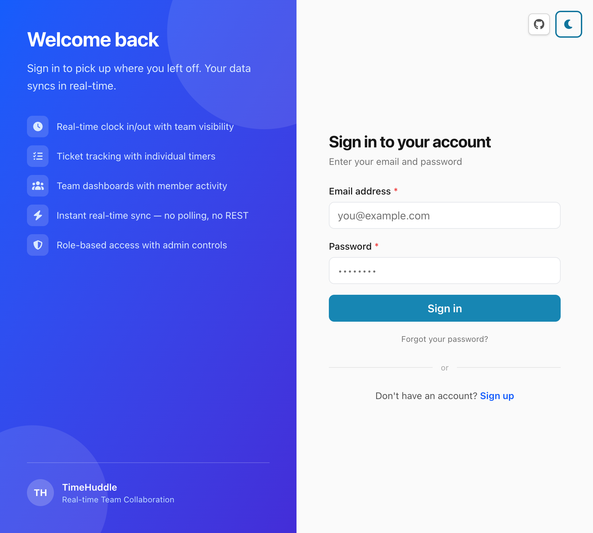
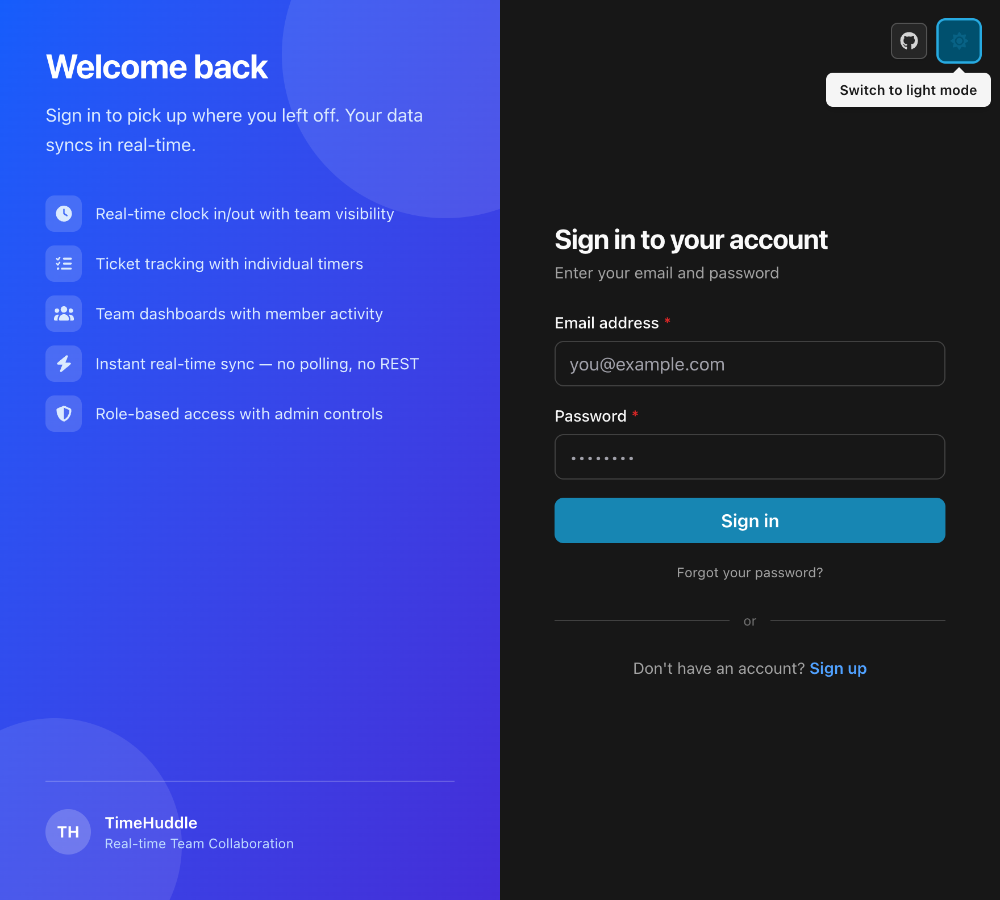
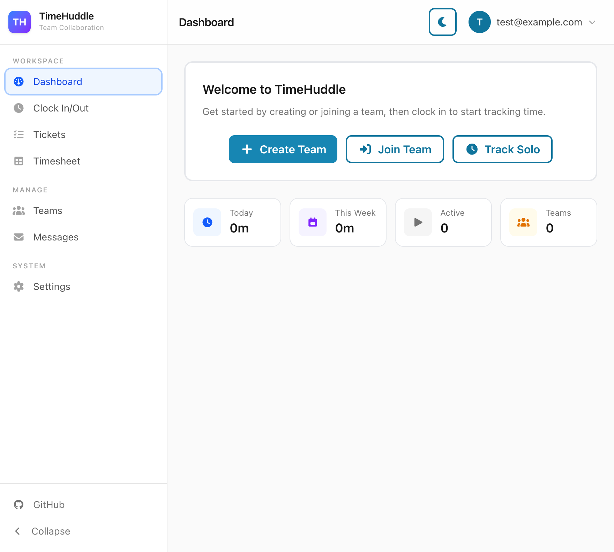
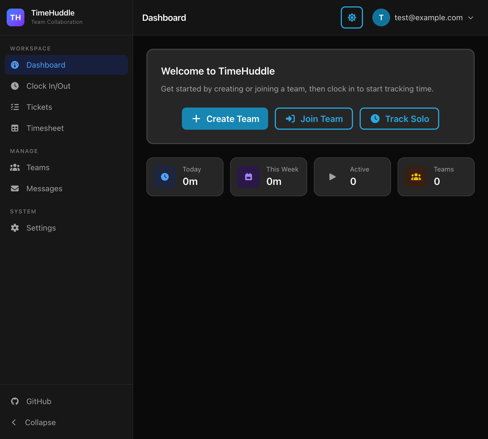
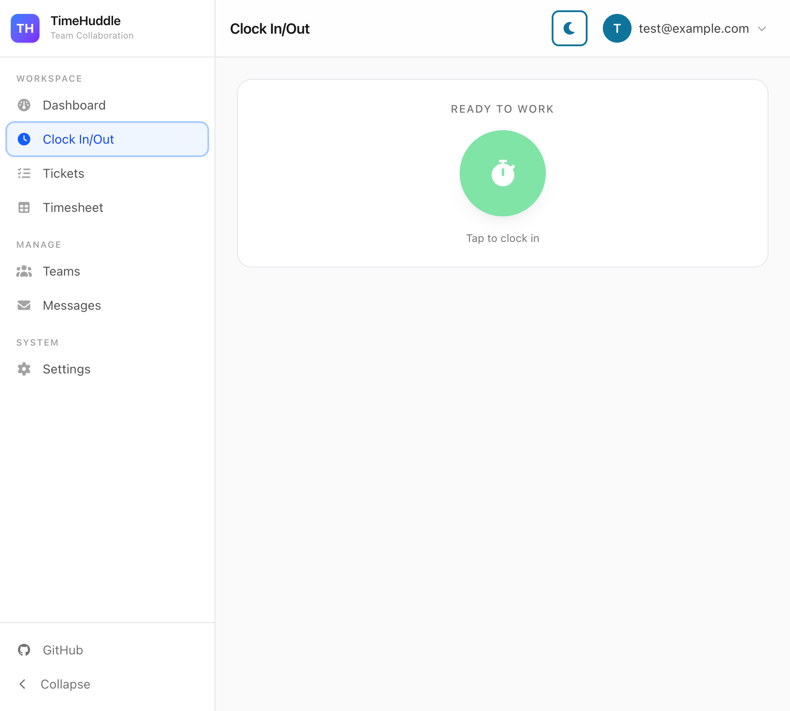
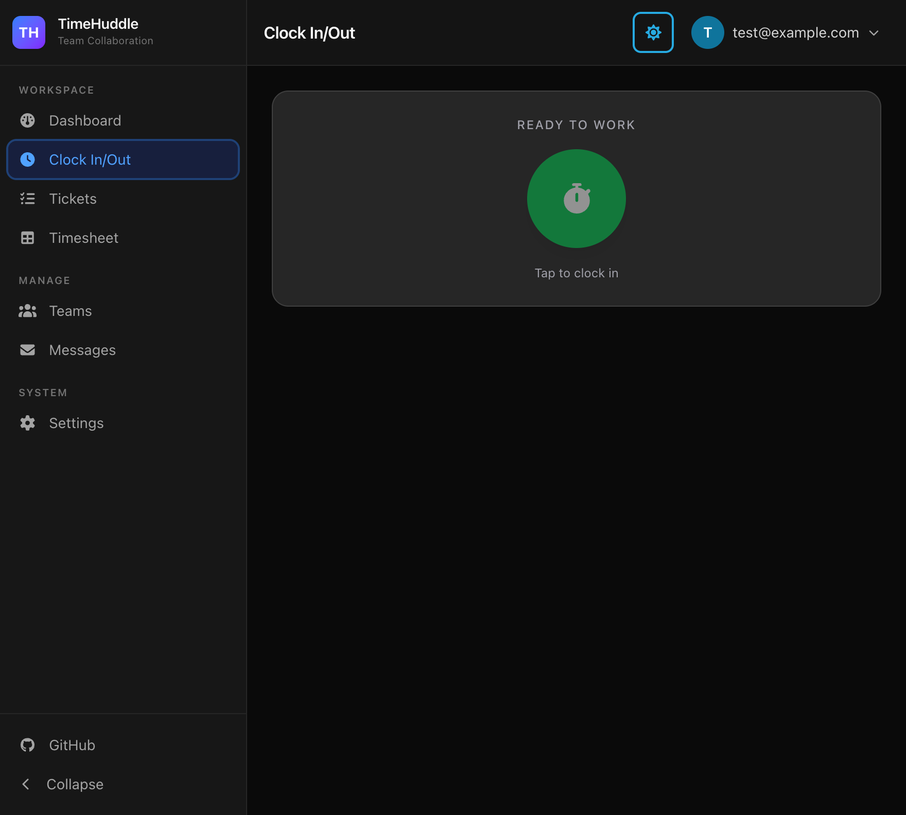
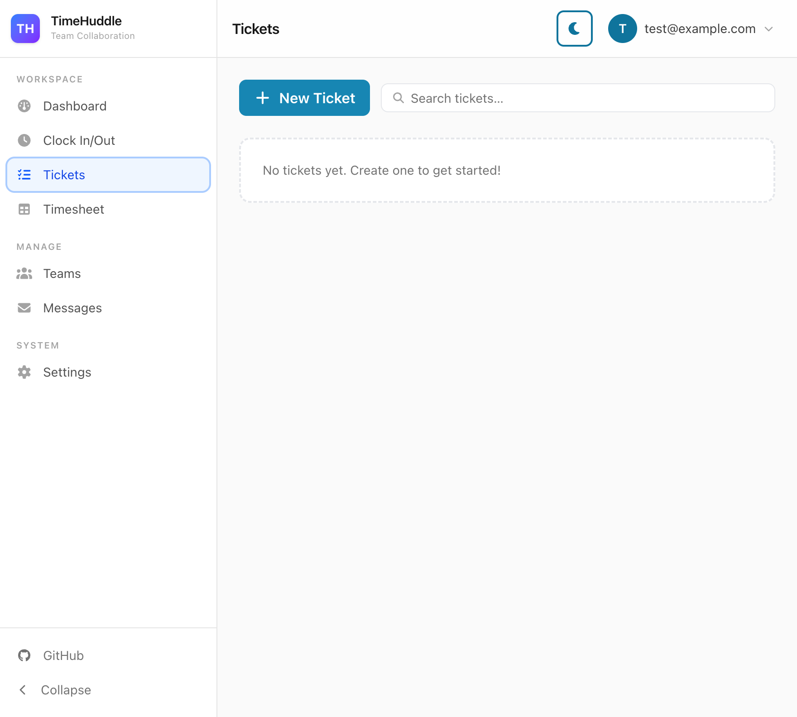
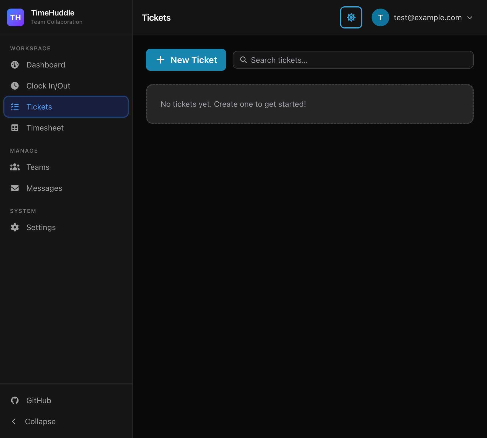
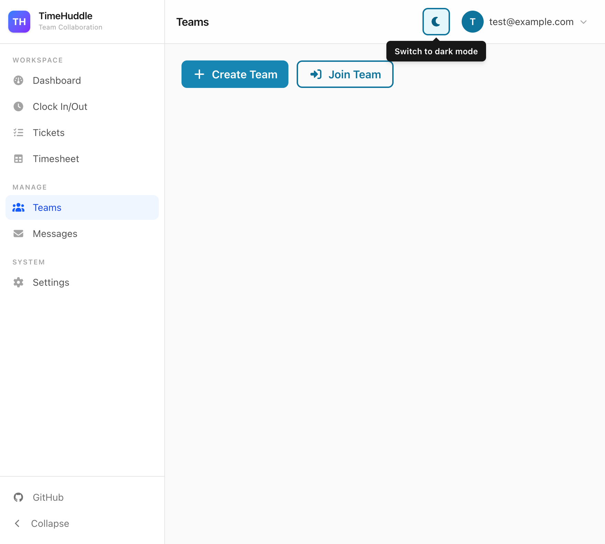

<div align="center">

# TimeHuddle — Team Time Tracking & Collaboration

Real-time team time tracking and collaboration platform built with React 19, Vite, Tailwind CSS 4, and TypeScript — powered by a Fastify + MongoDB backend.

Features **Clock In/Out**, **Ticket Tracking**, **Timesheets**, **Team Management**, and **Direct Messaging**.

| Stack        | Version | Notes                              |
| ------------ | ------- | ---------------------------------- |
| React        | 19.x    | Suspense / concurrent features     |
| Vite         | 8.x     | Fast dev server + production build |
| Tailwind CSS | 4.x     | Oxide (Lightning CSS) engine       |
| TypeScript   | 5.9.x   | Strict mode                        |
| Vitest       | 4.x     | Unit testing                       |


</div>

---

## Highlights

- **Email/password auth** — account creation, login, and password reset via the backend
- **Clock in/out** — real-time time tracking with per-ticket timers and media attachments
- **Ticket tracking** — create, assign, and track tickets with accumulated time
- **Timesheets** — view and manage time entries by date range
- **Team management** — create/join teams, invite members, role-based admin controls
- **Direct messaging** — send messages to team members with ticket context
- **Dashboard** — overview of today's time, weekly totals, active sessions, and team count
- **Shared validation** — [Zod](https://zod.dev) schemas shared across client forms and the API layer
- **Dark / light theme** — persisted via `localStorage`, flash-free on load
- **Strict tooling** — ESLint, Prettier, simple-import-sort, TypeScript strict mode

## Screenshots

<div align="center">

| Login (Light)                                                                                | Login (Dark)                                                                               | Dashboard (Light)                                                                               |
| -------------------------------------------------------------------------------------------- | ------------------------------------------------------------------------------------------ | ----------------------------------------------------------------------------------------------- |
|  |  |  |

| Dashboard (Dark)                                                                              | Clock (Light)                                                                                  | Clock (Dark)                                                                                 |
| --------------------------------------------------------------------------------------------- | ---------------------------------------------------------------------------------------------- | -------------------------------------------------------------------------------------------- |
|  |  |  |

| Tickets (Light)                                                                             | Tickets (Dark)                                                                            | Teams (Light)                                                                           |
| ------------------------------------------------------------------------------------------- | ----------------------------------------------------------------------------------------- | --------------------------------------------------------------------------------------- |
|  |  |  |

</div>

## Quick Start

### Docker

The fastest way to get everything running locally is Docker Compose — MongoDB, the backend, and the frontend all start together with live reload.

```bash
docker compose up
```

- Frontend: http://localhost:3000
- Backend API: http://localhost:4000
- MongoDB: `mongodb://localhost:27017/timehuddle`

`node_modules` are installed automatically inside the containers on first start. Subsequent starts skip the install and boot quickly.

**Seed the database** with demo data after the containers are up:

```bash
sh scripts/seed-docker.sh
```

**Environment**: create `backend/.env.local` to override any backend env vars (it's optional and gitignored). At minimum the backend needs:

```bash
# backend/.env.local
MONGODB_URI=mongodb://mongodb:27017/timehuddle
TRUSTED_ORIGINS=http://localhost:3000
```

> These are already set in `docker-compose.yml` — only needed if you override them.

---

### Manual Setup

#### 1. Start the backend

```bash
cd backend
npm install
npm run dev        # Fastify API on http://localhost:4000
```

#### 2. Start the frontend

```bash
git clone https://github.com/mieweb/timehuddle.git
cd timehuddle
npm install
npm run dev        # Vite dev server on http://localhost:3000
```

Open http://localhost:3000 — you'll see the login page. Create an account to get started.

### Environment

Copy `.env` and adjust if your backend URL differs:

```bash
# .env (already committed with defaults)
VITE_API_URL=http://localhost:4000
# VITE_VAPID_PUBLIC_KEY=your_vapid_public_key_here  # optional, for push notifications
```

## Commands

```bash
# Development
npm run dev           # Start Vite dev server on :3000
npm run lint          # Check code style
npm run typecheck     # Check TypeScript
npm run format        # Check Prettier formatting
npm test              # Run Vitest tests
npm run test:watch    # Run tests in watch mode

# Fixes
npm run lint:fix      # Auto-fix lint issues
npm run format:fix    # Auto-format code

# Production
npm run build         # Vite production build → dist/
npm run preview       # Preview the production build locally
```

## License

MIT — see `LICENSE`.
