# TimeHuddle — Team Time Tracking & Collaboration

Real-time team time tracking and collaboration platform built with React 19, Vite, Tailwind CSS 4,
and TypeScript — powered by a **Meteor 3 + MongoDB** backend, and shipped to the web, iOS, and
Android from one codebase.

Features **Clock In/Out**, **Ticket Tracking**, **Redmine Integration**, **Timesheets**,
**Team Management**, **Huddle** (team feed), and **Push Notifications**.


---

## Architecture

The frontend is a Vite-built React SPA. The backend is a **Meteor 3** server that exposes its
methods over DDP (with reactive publications) and over a REST bridge, backed by MongoDB running as
a single-node replica set so Meteor can tail the oplog.

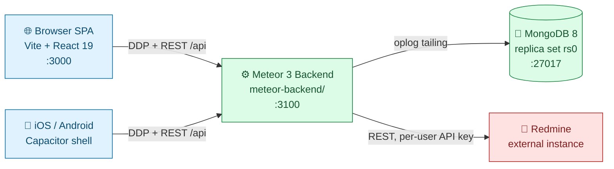
```mermaid
graph LR
    Browser["🌐 Browser SPA<br/>Vite + React 19<br/>:3000"]
    Native["📱 iOS / Android<br/>Capacitor shell"]
    Meteor["⚙️ Meteor 3 Backend<br/>meteor-backend/<br/>:3100"]
    Mongo[("🍃 MongoDB 8<br/>replica set rs0<br/>:27017")]
    Redmine["🎫 Redmine<br/>external instance"]

    Browser -->|"DDP + REST /api"| Meteor
    Native -->|"DDP + REST /api"| Meteor
    Meteor -->|"oplog tailing"| Mongo
    Meteor -->|"REST, per-user API key"| Redmine

    classDef client fill:#e0f2fe,stroke:#0369a1,color:#0c4a6e
    classDef server fill:#dcfce7,stroke:#15803d,color:#14532d
    classDef external fill:#fee2e2,stroke:#b91c1c,color:#7f1d1d

    class Browser,Native client
    class Meteor,Mongo server
    class Redmine external
```

> **Note:** an earlier Fastify backend was removed once the Meteor migration completed. Only
> `meteor-backend/` is live — `backend/` retains migration scripts only.

## Tech Stack

### Frontend

| Technology   | Version | Purpose                                 |
| ------------ | ------- | --------------------------------------- |
| React        | 19.x    | Suspense / concurrent features          |
| Vite         | 8.x     | Dev server + production build           |
| Tailwind CSS | 4.x     | Oxide (Lightning CSS) engine, no config |
| TypeScript   | 5.9.x   | Strict mode                             |
| @mieweb/ui   | 0.9.x   | Component library + brand tokens        |
| Motion       | 12.x    | Animations (Framer Motion)              |
| Zod          | 4.x     | Shared form / API validation schemas    |

### Backend (`meteor-backend/`)

| Technology     | Version | Purpose                                         |
| -------------- | ------- | ----------------------------------------------- |
| Meteor         | 3.4.x   | DDP methods, reactive publications, accounts    |
| MongoDB        | 8.x     | Document database (replica set for oplog)       |
| Agenda         | 6.x     | Scheduled jobs (shift reminders, auto-clockout) |
| Web Push       | 3.6.x   | Browser push notifications                      |
| Firebase Admin | 14.x    | Mobile push (FCM)                               |
| Nodemailer     | 9.x     | Email delivery                                  |
| CASL           | 6.x     | Permission / ability modelling                  |
| Yjs            | 13.x    | Collaborative editing primitives                |

### Mobile & Testing

| Technology | Version | Purpose                          |
| ---------- | ------- | -------------------------------- |
| Capacitor  | 8.x     | iOS + Android native shells      |
| Vitest     | 4.x     | Unit tests (`npm run test:unit`) |
| Playwright | 1.61.x  | End-to-end tests (`npm test`)    |

## Highlights

- **Clock in/out** — per-team shift tracking with breaks, and an 8-hour auto-clockout safety net
- **Ticket timers** — start/stop timers per ticket per day, with multiple sessions rolled into a net total
- **Unified ticket table** — Huddle tickets and Redmine issues in one sortable, filterable, paginated table
- **My Board** — a personal priority board; the single place a ticket timer starts
- **Redmine integration** — see assigned issues and push your logged hours back ([details](#redmine-integration))
- **Timesheets** — shift sessions on the dashboard, with ticket sessions nested under their shift
- **Huddle** — a team feed with markdown posts, mentions, comments, and attachments
- **Team management** — create/join teams via join codes, invitations, role-based admin controls
- **Push notifications** — web push plus native FCM/APNs through Capacitor
- **Mobile apps** — iOS and Android builds with over-the-air update channels
- **Dark / light theme** — persisted, flash-free on load
- **Strict tooling** — ESLint, Prettier, simple-import-sort, TypeScript strict mode

## Redmine integration (v1)

Connect your Redmine account once, and you shouldn't need to open Redmine to do your day's work.

- **Personal API key** — link your own account in Settings; every call runs as you, so Redmine applies your permissions and records you as the author
- **One ticket list** — your Redmine issues sit beside Huddle tickets, with source as a column and filter rather than a mode
- **Time tracking** — start a timer on a Redmine issue from My Board; starts, stops and breaks are recorded in TimeHuddle
- **Confirmed push** — send your hours to Redmine as "Spent time" when your day is done, after reviewing a summary; entries are created, never edited or deleted
- **Create and update issues** — new issues, plus status, priority, assignee and description, from a Redmine issue page inside TimeHuddle

Requires Redmine 5.0+ with the REST API enabled, and `REDMINE_BASE_URL` set for the deployment.

📖 **[Redmine integration — MVP 1](docs/redmine-integration-mvp1.md)** — what it does, how the flow works, what you need, and what is deliberately out of scope.

## Screenshots

<div align="center">

| Login (Light)                                                                                | Login (Dark)                                                                               | Dashboard (Light)                                                                               |
| -------------------------------------------------------------------------------------------- | ------------------------------------------------------------------------------------------ | ----------------------------------------------------------------------------------------------- |
| 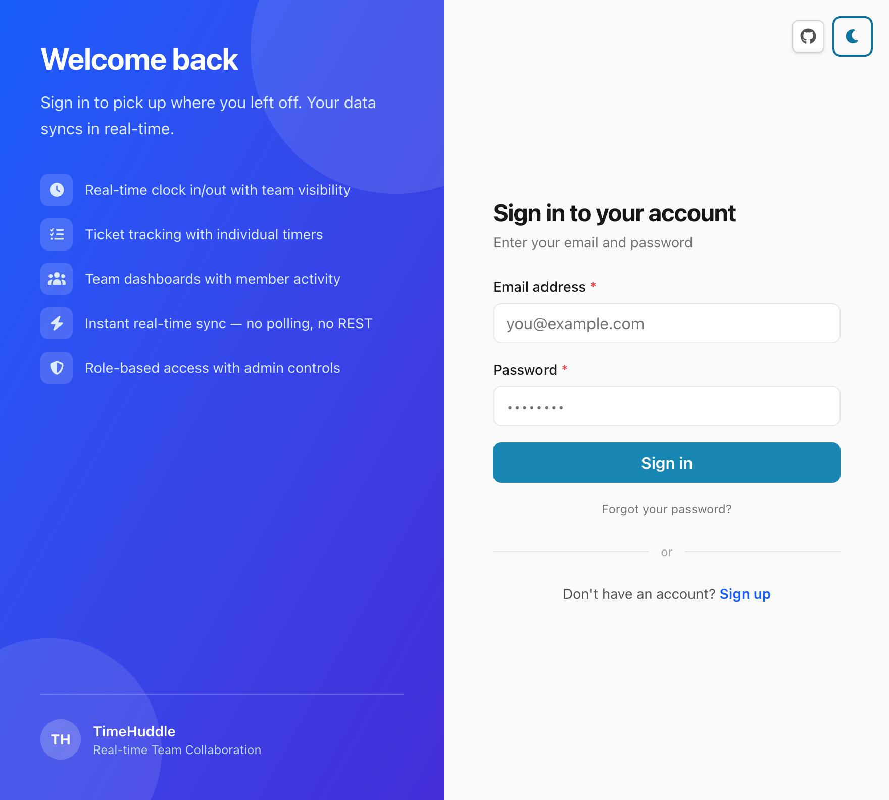 | 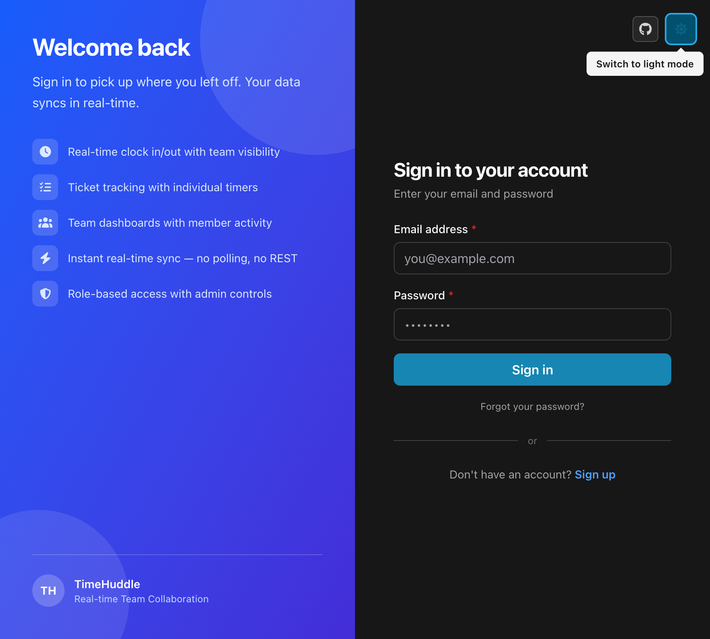 | 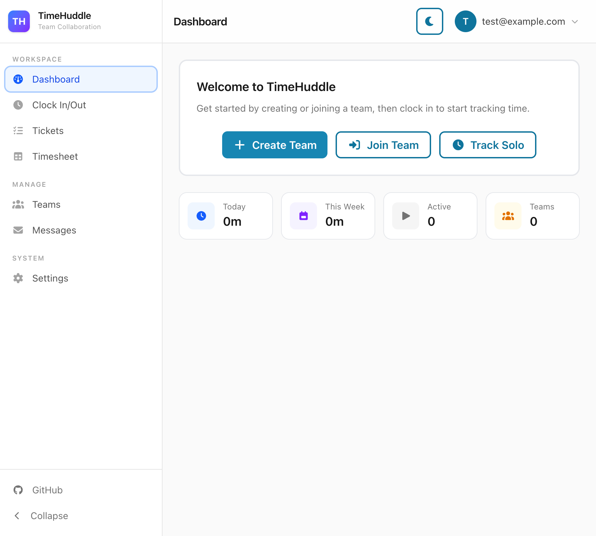 |

| Dashboard (Dark)                                                                              | Clock (Light)                                                                                  | Clock (Dark)                                                                                 |
| --------------------------------------------------------------------------------------------- | ---------------------------------------------------------------------------------------------- | -------------------------------------------------------------------------------------------- |
| 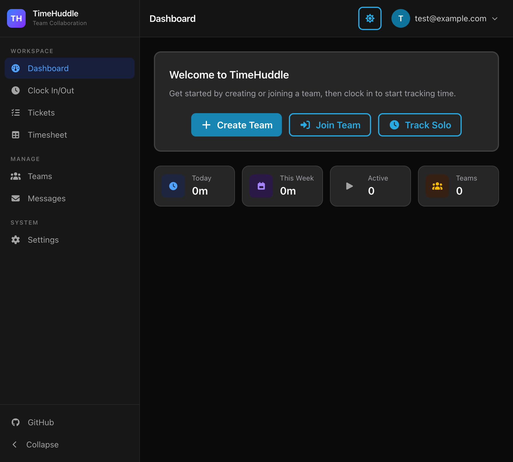 | 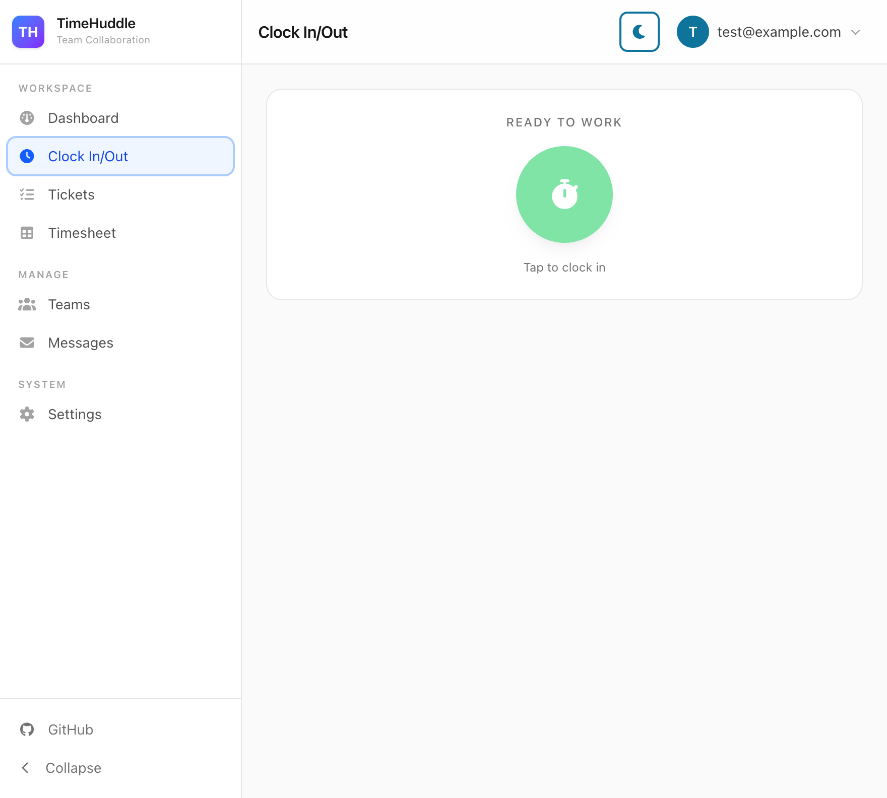 | 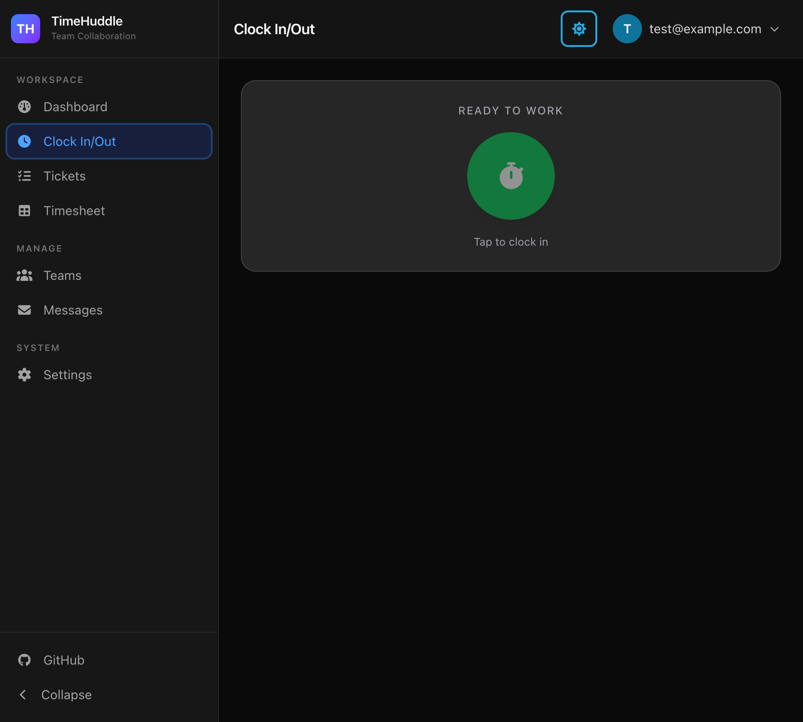 |

| Tickets (Light)                                                                             | Tickets (Dark)                                                                            | Teams (Light)                                                                           |
| ------------------------------------------------------------------------------------------- | ----------------------------------------------------------------------------------------- | --------------------------------------------------------------------------------------- |
| 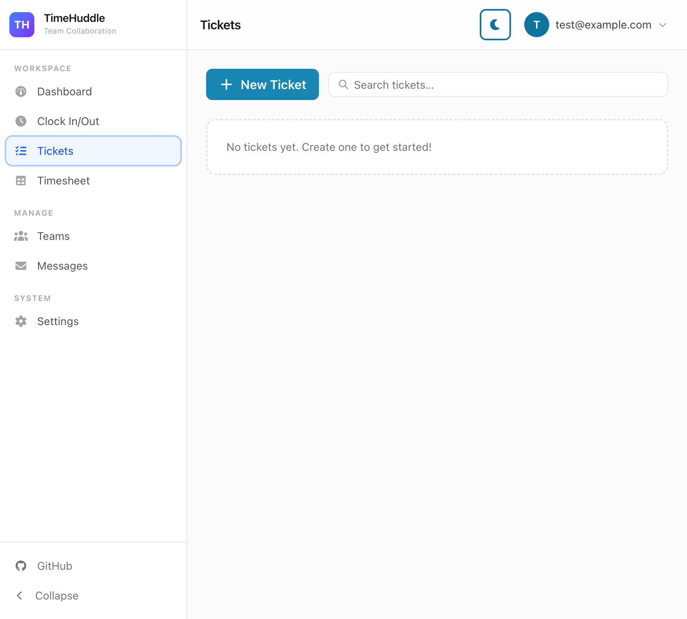 | 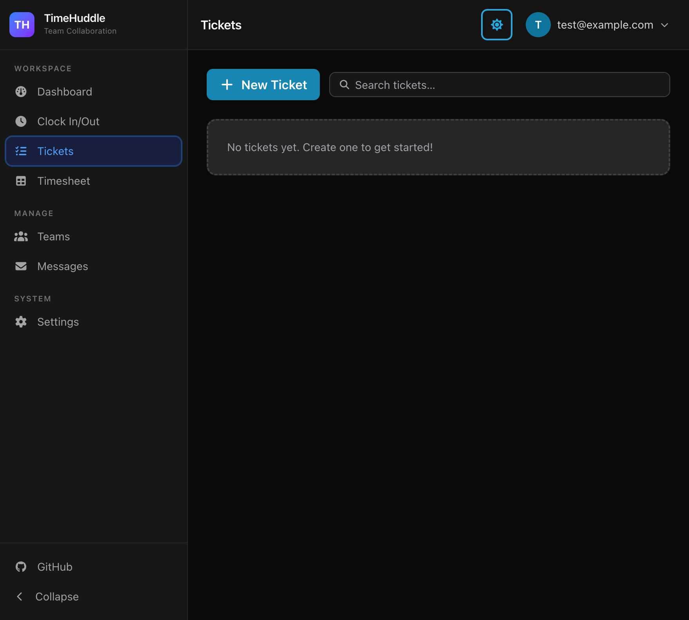 | 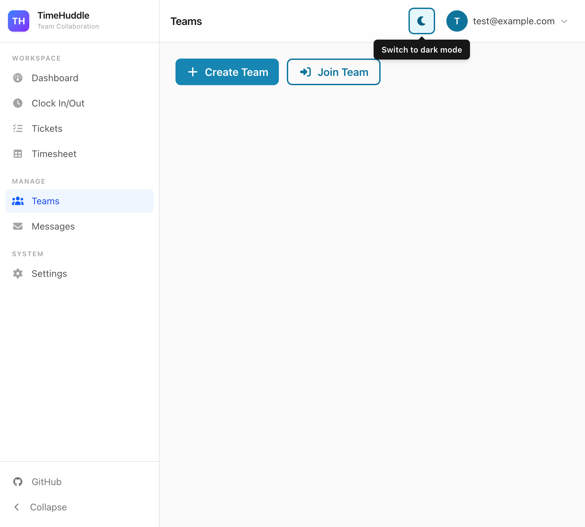 |

</div>

## Quick Start

### Prerequisites

- **Node 24** (pinned in `.nvmrc` — run `nvm use`)
- **Meteor 3** — install with `npx meteor` or from [meteor.com/install](https://www.meteor.com/install)
- **MongoDB 8 as a single-node replica set** — Meteor tails the oplog, so a standalone `mongod` is not enough

### 1. Clone and install

```bash
git clone https://github.com/mieweb/timehuddle.git
cd timehuddle
nvm use
npm install
```

### 2. Start MongoDB

The compose file provisions Mongo as a replica set (`rs0`) and initiates it on first run:

```bash
docker compose up mongodb
```

This also makes [mongo-express](http://localhost:8081) available via `docker compose up mongo-express`,
and [Mailpit](http://localhost:8025) (`docker compose up mailpit`) to catch outbound email locally.

### 3. Start the backend (Terminal 1)

```bash
cd meteor-backend
npm install
npm start          # Meteor backend on http://localhost:3100
```

### 4. Start the frontend (Terminal 2)

```bash
npm run dev        # Vite dev server on http://localhost:3000
```

Open <http://localhost:3000> — you'll see the login page. Create an account to get started.

In local web development the Vite dev server proxies `/api`, `/uploads`, `/v1`, and `/pulsevault`
to `http://localhost:3100`, so no extra frontend configuration is needed. Override the proxy target
with `API_TARGET`, and set `VITE_TIMECORE_URL` only where no proxy exists — Capacitor native builds,
or a production preview pointing at a remote backend.

### Environment

The backend reads its configuration from `meteor-backend/.env.local` (optional, gitignored):

```bash
# meteor-backend/.env.local
MONGO_URL=mongodb://localhost:27017/timehuddle?directConnection=true
MONGO_OPLOG_URL=mongodb://localhost:27017/local?directConnection=true
APP_URL=http://localhost:3000
CORS_ORIGINS=http://localhost:3000

# Email (Mailpit locally)
SMTP_HOST=localhost
SMTP_PORT=1025
SMTP_SECURE=false
EMAIL_FROM=TimeHuddle <noreply@timehuddle.local>

# Push notifications (optional)
VAPID_PUBLIC_KEY=your_vapid_public_key
VAPID_PRIVATE_KEY=your_vapid_private_key

# Redmine integration (optional — see below)
REDMINE_BASE_URL=https://redmine.example.org
REDMINE_ENCRYPTION_KEY=a_long_random_secret
# Dev/test only: let each user link their own Redmine URL in Settings. The server
# fetches whatever URL is linked, so never enable this in production.
# REDMINE_ALLOW_CUSTOM_URL=true
```

---

## Redmine Integration

TimeHuddle connects to an existing Redmine instance so that a user never has to open Redmine to
**see the issues assigned to them**, or to **enter "Spent time" by hand after working**.

### The rule that governs it

> **TimeHuddle is the system of record for _how_ time was spent. Redmine's "Spent time" is a
> derived, one-way daily projection of it — never an input.**

Issues flow **Redmine → TimeHuddle, read-only**. Only **time entries** flow **TimeHuddle → Redmine**.
Nothing else is ever written to Redmine, and nothing entered on the Redmine side flows back.

### Setup

1. **Configure the instance** (server-side, once) in `meteor-backend/.env.local`:

   | Variable                 | Purpose                                                                                           |
   | ------------------------ | ------------------------------------------------------------------------------------------------- |
   | `REDMINE_BASE_URL`       | The Redmine instance every user connects to. Without it, Redmine is simply absent — not an error. |
   | `REDMINE_ENCRYPTION_KEY` | Secret used to encrypt each user's personal API key at rest (AES-256-GCM).                        |

2. **Connect a personal account** (per user): **Settings → Redmine**, then paste your
   Redmine personal API key. TimeHuddle validates it against `GET /users/current.json`, confirms your
   Redmine login, and stores the key **encrypted** — it is never returned to the browser again.

   Every Redmine request is made with **your own key** (`X-Redmine-API-Key`), so you see exactly what
   your Redmine account can see and time entries are attributed to you. No admin or switch-user access
   is required. The only Redmine permission needed is **`log_time`**.

### Day-to-day flow

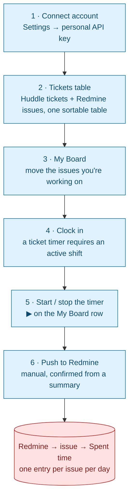
```mermaid
flowchart TD
    Connect["1 · Connect account<br/>Settings → personal API key"]
    Tickets["2 · Tickets table<br/>Huddle tickets + Redmine issues, one sortable table"]
    Board["3 · My Board<br/>move the issues you're working on"]
    ClockIn["4 · Clock in<br/>a ticket timer requires an active shift"]
    Timer["5 · Start / stop the timer<br/>▶ on the My Board row"]
    Push["6 · Push to Redmine<br/>manual, confirmed from a summary"]
    Spent[("Redmine → issue → Spent time<br/>one entry per issue per day")]

    Connect --> Tickets --> Board --> ClockIn --> Timer --> Push --> Spent

    classDef huddle fill:#e0f2fe,stroke:#0369a1,color:#0c4a6e
    classDef redmine fill:#fee2e2,stroke:#b91c1c,color:#7f1d1d
    class Connect,Tickets,Board,ClockIn,Timer,Push huddle
    class Spent redmine
```

- **One unified ticket table.** `/app/tickets` shows the current team's Huddle tickets and your
  Redmine issues together — source is a column and a filter, not a mode. Sorting, filtering, selection
  and pagination are client-side. A user with no Redmine link just sees their Huddle tickets, with no error.
  Redmine rows are read-only: clicking the title opens the issue in Redmine.
- **My Board is the only place a ticket timer starts.** Select tickets on the Tickets tab, move them to
  My Board, and use the row's ▶ / ⏸ button.
- **A ticket timer requires an active shift.** Starting one while clocked out is blocked with a prompt.
  This also means every ticket timer inherits the shift's existing 8-hour auto-clockout, so a forgotten
  timer cannot run indefinitely.
- **Breaks are handled structurally.** Taking a break closes the running session and resuming opens a new
  one, so break time never appears in a session and nothing has to be subtracted.
- **Switching tickets is silent by design** — starting a second ticket timer automatically stops the first.

### Pushing time to Redmine

The push is **manual and confirmed**: when your day is done, you approve a summary before anything is
sent. It is only available while you are idle (clocked out, no timer running), which is re-checked
server-side, and it covers **all unsynced time** — not just today — so a forgotten day is not lost.

For each issue-day TimeHuddle `POST`s one time entry (`issue_id`, `hours`, `activity_id`, `spent_on`,
`comments`), then **re-reads it** and compares the stored hours against what was sent. A mismatch,
rejection, or unreachable instance is surfaced as a failed row you can retry. A unique index on
`{userId, ticketId, date}` plus the stored entry id make a second press a no-op, so retries never
duplicate.

- **Create-only.** There is no edit and no delete, ever. Once time is logged it is permanent; changing
  it is an administrative act performed in Redmine itself.
- **`activity_id` is resolved at runtime**, never hardcoded — enumeration ids are instance-specific.
  The order is: your Settings choice → the issue's Redmine tracker → the instance's `is_default` →
  one named `Development` → the first available.
- **Hours are rounded once**, to two decimal places, on the summed seconds — never per session, which
  would let error accumulate.
- **Only ticket timers are pushed.** The shift-clock total is never sent to Redmine.

### Two clocks, two numbers

TimeHuddle deliberately keeps two independent notions of time. They are different numbers and always
will be — you can be clocked in without any ticket timer running — so they are never added together.

| Surface                          | Shows                            | Granularity               | System                    |
| -------------------------------- | -------------------------------- | ------------------------- | ------------------------- |
| Clock page session timer         | Current **shift** elapsed        | live                      | A — shift clock, per team |
| Dashboard → Me → Timesheet       | Shift sessions + breaks          | per shift                 | A — shift clock, per team |
| Work page (`/app/work`)          | **Ticket** work items + sessions | per item per day          | B — ticket timers         |
| Redmine → issue → **Spent time** | Rolled-up hours                  | one row per issue per day | B — ticket timers, pushed |

### Current limitations

- **No issue CRUD.** Creating or editing Redmine issues from TimeHuddle is out of scope, as is any
  two-way issue sync or persisting Redmine issues in TimeHuddle's database.
- **Redmine issues are not stored** — they are fetched per user, per session, and cached in memory only.
- **A manual edit in Redmine's Spent time tab is not detected** and will not flow back.
- **On small screens the ticket table scrolls horizontally** rather than switching to a card layout.

---

## Development

### Commands

```bash
# Development
npm run dev           # Vite dev server on :3000
npm run dev:mobile    # Vite bound to your LAN, for testing on a device

# Quality gates
npm run lint          # ESLint
npm run typecheck     # tsc --noEmit
npm run format        # Prettier check
npm run lint:fix      # Auto-fix lint issues
npm run format:fix    # Auto-format

# Tests
npm run test:unit     # Vitest unit tests (run once)
npm test              # Playwright end-to-end tests
npm run test:all      # Unit + e2e — the full gate
npm run test:watch    # Vitest watch mode

# Production
npm run build         # Vite production build → dist/
npm run preview       # Preview the production build locally
```

Run every CI check locally — the same script CI uses — with:

```bash
./scripts/checks.sh           # all jobs
./scripts/checks.sh --fix     # auto-fix lint + format first
```

### Mobile builds

```bash
npm run dev:ios           # run the iOS app against your local backend
npm run dev:android       # run the Android app against your local backend
npm run testflight:ios    # build + sync for TestFlight
npm run ota:testflight    # publish an over-the-air update to the testflight channel
```

### Seeds

Seed the database with demo teams and users:

```bash
sh scripts/seed-docker.sh
```

Use these join codes to add users to teams via the UI:

| Team       | Join Code  |
| ---------- | ---------- |
| Developers | `ZDLYFY9T` |
| Accounting | `P2SRHYYK` |
| Product    | `FAKASXQ9` |
| Design     | `MHGT2L3Z` |
| Support    | `180YR2C3` |
| Operations | `R0VCXWDP` |

Demo accounts all use the password `Password1!`, with emails following `firstname@example.com`
(e.g. `alice@example.com`).

### Project structure

```
index.html              # Vite entry — mounts <div id="root">
src/
  main.tsx              # ReactDOM.createRoot entry point
  styles.css            # Tailwind 4 entry + brand token bridge (required)
  features/             # Feature-sliced modules (clock, teams, tickets, huddle, …)
  lib/                  # Shared utilities (api, TeamContext, useSession, ddp, …)
  ui/                   # Shell components (AppLayout, Sidebar, AppHeader, …)
meteor-backend/
  server/               # Meteor methods, collections, publications
  tests/                # Backend unit + integration tests
packages/               # Shared code used by both sides (@timehuddle/*)
release-notes/          # One markdown file per shipped version — see its README
tests/e2e/              # Playwright specs + page objects
docs/                   # Design docs and migration plans
```

Path aliases: `@ui/*` → `src/ui/*`, `@lib/*` → `src/lib/*`.

### Release notes

A user-visible change ships with a note in [`release-notes/`](release-notes/README.md) — one markdown
file per version, bundled into the build and rendered at `/app/release-notes`. Read that README for
the format and bundle-size rules before adding a note.
