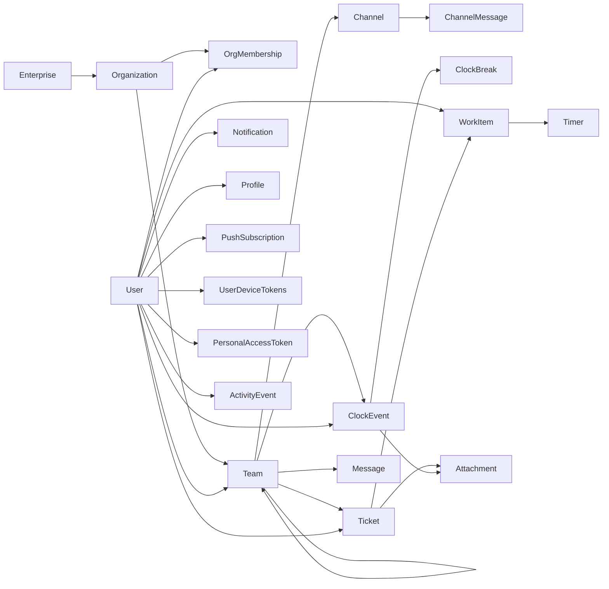

# TimeHuddle Database Reference

This document is the single-source developer guide to the backend database shape as implemented in code today.

## Scope and Source of Truth

- Runtime: MongoDB
- Access patterns: native MongoDB driver for most collections, Mongoose for selected models
- Primary schema sources:
  - `backend/src/models/*.ts`
  - `backend/src/lib/ensure-indexes.ts`
  - `backend/migrations/*.cjs`
  - Better Auth adapter setup in `backend/src/lib/auth.ts`

MongoDB is schema-flexible, so the effective schema is application-enforced (TypeScript interfaces, Mongoose schemas, service logic, and indexes).

## Data Model Map



## Collection Catalog

| Collection               | Owned By          | Schema Definition                                                               | Why This Collection Exists                                                                        | Notes                                                                        |
| ------------------------ | ----------------- | ------------------------------------------------------------------------------- | ------------------------------------------------------------------------------------------------- | ---------------------------------------------------------------------------- |
| `user`                   | Better Auth + app | `User` interface in `backend/src/models/user.model.ts`                          | Identity root for all user-scoped data and authentication linking.                                | Singular collection name is intentional.                                     |
| `teams`                  | App               | `Team` interface in `backend/src/models/team.model.ts`                          | Defines collaboration boundaries (membership/admins) used for authz checks.                       | Team membership and admin authorization root.                                |
| `organizations`          | App               | `Organization` interface in `backend/src/models/organization.model.ts`          | Groups teams under higher-level ownership/admin governance.                                       | Teams reference via `orgId` (string ObjectId).                               |
| `enterprises`            | App               | `Enterprise` interface in `backend/src/models/enterprise.model.ts`              | Top-level tenant container for one or more organizations.                                         | Enterprise owners/admins manage child organizations.                         |
| `org_members`            | App               | `OrgMembership` interface in `backend/src/models/org-membership.model.ts`       | Source of truth for organization membership and role assignment.                                  | Replaces role derivation from legacy `owners[]`/`admins[]` arrays.           |
| `tickets`                | App (Mongoose)    | `ticketSchema` in `backend/src/models/ticket.model.ts`                          | Stores work units that time entries and assignments are anchored to.                              | Only major collection currently backed by explicit Mongoose schema.          |
| `clockevents`            | App               | `ClockEvent` interface in `backend/src/models/clock.model.ts`                   | Captures attendance-style clock in/out state.                                                     | Clock-in/out sessions; breaks live in the separate `clockbreaks` collection. |
| `clockbreaks`            | App               | `ClockBreak` interface in `backend/src/models/clock.model.ts`                   | Stores FLSA-classified break intervals as first-class documents referencing a parent clock event. | Separate collection; each document owns a `clockEventId` foreign key.        |
| `messages`               | App               | `Message` interface in `backend/src/models/message.model.ts`                    | Persists admin-member direct thread communication history.                                        | Admin-member threaded DM messages.                                           |
| `notifications`          | App               | `Notification` interface in `backend/src/models/notification.model.ts`          | Delivers in-app inbox notifications and read state per user.                                      | User notification inbox.                                                     |
| `attachments`            | App               | `Attachment` interface in `backend/src/models/attachment.model.ts`              | Associates media/links with ticket or clock context for evidence and context.                     | Attached to tickets or clock entries.                                        |
| `profiles`               | App               | `Profile` interface in `backend/src/models/profile.model.ts`                    | Stores user-facing profile and presence metadata beyond auth identity.                            | Presence/profile metadata.                                                   |
| `pushsubscriptions`      | App               | `PushSubscription` interface in `backend/src/models/push-subscription.model.ts` | Tracks endpoints/tokens needed to send push notifications to devices.                             | Web push + native token subscription docs.                                   |
| `devicetokens`           | App               | `UserDeviceTokens` interface in `backend/src/models/device-token.model.ts`      | Keeps a normalized per-user registry of mobile push tokens.                                       | One document per user, token array.                                          |
| `workitems`              | App               | `WorkItem` interface in `backend/src/models/work-item.model.ts`                 | Represents day-scoped user work rows that timers roll up under.                                   | User x ticket x date work entries.                                           |
| `timers`                 | App               | `Timer` interface in `backend/src/models/timer.model.ts`                        | Canonical ledger of actual work segments used for totals and reporting.                           | Canonical work-segment ledger.                                               |
| `activities`             | App               | `ActivityEvent` union in `backend/src/models/activity.model.ts`                 | Provides a single auditable stream of cross-feature user/team events.                             | Unified activity stream events.                                              |
| `channels`               | App               | `Channel` interface in `backend/src/models/channel.model.ts`                    | Defines team chat spaces and channel-level access control.                                        | Team-scoped chat channels.                                                   |
| `channelmessages`        | App               | `ChannelMessage` interface in `backend/src/models/channel-message.model.ts`     | Stores message history for each channel conversation.                                             | Messages per channel.                                                        |
| `personal_access_tokens` | App               | `PersonalAccessToken` in `backend/src/models/personal-access-token.model.ts`    | Enables API access via revocable, hashed user-issued tokens.                                      | Hashed PAT records.                                                          |
| `account`                | Better Auth       | Accessed directly in `team.service`                                             | Persists credential-provider auth data (for example password hashes).                             | Contains credential provider password hash data.                             |

## Field-Level Schema Summary

### `user`

Core fields used by app code:

- `_id: ObjectId`
- `name: string`
- `email: string`
- `emailVerified: boolean`
- `image?: string | null`
- `username?: string | null` (unique in Better Auth config)
- `bio?: string`
- `website?: string`
- `reportsToUserId?: string | null`
- `createdAt: Date`
- `updatedAt: Date`

### `organizations`

- `_id: ObjectId`
- `enterpriseId?: string` (ObjectId string of enterprise)
- `name: string`
- `key: string`
- `slug?: string`
- `owners?: string[]`
- `admins?: string[]`
- `allowAutoJoin?: boolean` (default `true`)
- `createdAt: Date`
- `updatedAt?: Date`

### `enterprises`

- `_id: ObjectId`
- `name: string`
- `slug: string`
- `owners?: string[]`
- `admins?: string[]`
- `createdAt: Date`
- `updatedAt?: Date`

### `org_members`

- `_id: ObjectId`
- `orgId: string` (ObjectId string of organization)
- `userId: string` (ObjectId string of user)
- `role: "owner" | "admin" | "member"`
- `auto: boolean` (`true` when membership came from auto-join behavior)
- `createdAt: Date`
- `updatedAt?: Date`

### `teams`

- `_id: ObjectId`
- `orgId: string` (ObjectId string of organization)
- `parentTeamId?: string | null` (ObjectId string of parent team; `null` for top-level)
- `name: string`
- `description?: string`
- `members: string[]` (user ids)
- `admins: string[]` (user ids)
- `code: string`
- `isPersonal?: boolean`
- `createdAt: Date`
- `updatedAt?: Date`

### `tickets` (Mongoose)

- `_id: ObjectId`
- `teamId: string`
- `title: string`
- `description?: string`
- `github: string` (default `""`)
- `status: "open" | "in-progress" | "blocked" | "reviewed" | "closed" | "deleted"`
- `priority?: "low" | "medium" | "high" | "critical"`
- `createdBy: string`
- `assignedTo?: string | null`
- `reviewedBy?: string`
- `reviewedAt?: Date`
- `updatedBy?: string`
- `createdAt: Date`
- `updatedAt?: Date` (auto-set by Mongoose pre-save hook)
- `sharedWithTimeharbor?: boolean`
- `externalTrackedMs?: number`

### `workitems`

- `_id: ObjectId`
- `userId: string`
- `ticketId: string`
- `date: string` (UTC `YYYY-MM-DD`)
- `note?: string`
- `sortOrder?: number`
- `createdAt: Date`
- `updatedAt?: Date`

### `timers` (Canonical Time Ledger)

- `_id: ObjectId`
- `workItemId: string`
- `userId: string`
- `date: string` (denormalized from work item)
- `startTime: number` (epoch ms)
- `endTime: number | null` (`null` means running)
- `durationSeconds?: number` (written on close)
- `createdAt: Date`

### `clockevents`

- `_id: ObjectId`
- `userId: string`
- `teamId: string`
- `startTime: number` (epoch ms — immutable shift start, never mutated after clock-in)
- `accumulatedTime: number` (seconds — net paid time: full shift span minus deducted meal breaks; written at clock-out)
- `autoClockoutAgreed?: boolean | null` (`true` = user consented to auto-clockout at 8h via the shift-end modal)
- `endTime: number | null` (`null` = session still active)

> Break intervals are **no longer embedded** in `clockevents`. They are stored as separate documents in the `clockbreaks` collection (see below).

### `clockbreaks`

One document per break interval. Each document is owned by a single `clockevents` document.

- `_id: ObjectId`
- `clockEventId: string` (hex ObjectId of the parent `clockevents` document)
- `startTime: number` (epoch ms)
- `endTime: number | null` (`null` = break still open)
- `type?: "rest" | "meal"` — set on break close; `rest` = compensable (< 20 min), `meal` = non-compensable (≥ 20 min), deducted from `accumulatedTime`
- `classificationSource?: "auto" | "manual"` — `auto` when set by the 20-minute threshold rule
- `notes?: string`
- `updatedBy?: string`
- `updatedAt?: number`

#### Break Classification Rule

Break duration is measured from `startTime` to `endTime` (or `now` for open breaks):

- **< 20 minutes** → `type: "rest"` — compensable; counted as paid work time, not deducted from `accumulatedTime`
- **≥ 20 minutes** → `type: "meal"` — non-compensable; deducted from `accumulatedTime`

`accumulatedTime` formula (written at clock-out):

```
accumulatedTime = (endTime − startTime) − sum(meal break durations)
```

The `workSeconds` field returned by the API is computed live from the same formula (useful for active sessions where `accumulatedTime` is 0 until clock-out).

### `activities`

Common fields:

- `_id: ObjectId`
- `userId: string`
- `teamId?: string`
- `type: "clock.in" | "clock.out" | "ticket.created" | "ticket.updated" | "pat.created" | "pat.revoked"`
- `actor: { id: string; name: string; avatar?: string }`
- `payload: object` (depends on `type`)
- `occurredAt: Date`
- `source: "timehuddle" | "activitywatch" | "external"`

### `messages`

- `_id: ObjectId`
- `threadId: string` (composite `teamId:adminId:memberId`)
- `teamId: string`
- `adminId: string`
- `memberId: string`
- `fromUserId: string`
- `toUserId: string`
- `text: string`
- `senderName: string`
- `ticketId?: string`
- `createdAt: Date`

### `channels`

- `_id: ObjectId`
- `teamId: string`
- `name: string`
- `description?: string`
- `isDefault: boolean`
- `members?: string[]` (absent/empty means team-wide)
- `createdBy: string`
- `createdAt: Date`

### `channelmessages`

- `_id: ObjectId`
- `channelId: string`
- `teamId: string`
- `fromUserId: string`
- `senderName: string`
- `text: string`
- `createdAt: Date`

### `notifications`

- `_id: ObjectId`
- `userId: string`
- `title: string`
- `body: string`
- `data?: Record<string, unknown>`
- `read: boolean`
- `createdAt: Date`

### `attachments`

- `_id: ObjectId`
- `url: string`
- `type: "video" | "image" | "link"`
- `title?: string`
- `thumbnail?: string`
- `attachedTo: { kind: "clock" | "ticket"; id: string }`
- `addedBy: string`
- `addedAt: Date`

### `profiles`

- `_id: ObjectId`
- `userId: string`
- `app: "timeharbor"`
- `displayName: string`
- `avatarUrl?: string`
- `status: "online" | "offline"`
- `lastSeenAt?: Date`
- `githubUrl?: string`
- `linkedinUrl?: string`
- `redmineUrl?: string`
- `fcmToken?: string`
- `fcmPlatform?: "ios" | "android"`
- `fcmUpdatedAt?: Date`
- `createdAt: Date`
- `updatedAt: Date`

### `pushsubscriptions`

- `_id: ObjectId`
- `userId: string`
- `type: "webpush" | "native"`
- `endpoint?: string`
- `keys?: { p256dh: string; auth: string }`
- `expirationTime?: number | null`
- `token?: string`
- `platform?: "ios" | "android"`
- `createdAt: Date`
- `updatedAt: Date`

### `devicetokens`

- `_id: ObjectId`
- `userId: string`
- `tokens: { token: string; platform: "ios" | "android"; updatedAt: Date }[]`

### `personal_access_tokens`

- `_id: ObjectId`
- `userId: string`
- `tokenHash: string` (SHA-256 of raw token)
- `name: string`
- `lastUsedAt?: Date`
- `createdAt: Date`

### `account` (Better Auth)

Observed app dependency:

- Filtered by `{ userId, providerId: "credential" }`
- Updated field: `password` (bcrypt hash)

Other Better Auth-managed collections may exist depending on plugin/version; `account` is confirmed in app code, and `user` is explicitly used via collection accessor.

## Enforced Indexes

Indexes created by `backend/src/lib/ensure-indexes.ts`:

- `profiles`: unique `{ userId: 1, app: 1 }`
- `workitems`: `{ userId: 1, ticketId: 1, date: 1 }`
- `workitems`: `{ userId: 1, date: 1 }`
- `timers`: unique partial `{ userId: 1 }` where `endTime: null` (`one_running_per_user`)
- `timers`: `{ workItemId: 1, startTime: 1 }`
- `timers`: `{ userId: 1, date: 1 }`
- `clockevents`: `{ userId: 1, teamId: 1, endTime: 1 }`
- `clockbreaks`: `{ clockEventId: 1, endTime: 1 }` (open-break lookup)
- `clockbreaks`: `{ clockEventId: 1, startTime: 1 }` (ordered retrieval)
- `personal_access_tokens`: unique `{ tokenHash: 1 }`
- `personal_access_tokens`: `{ userId: 1 }`

Additional index from migration:

- `activities`: `{ userId: 1, occurredAt: -1 }`

Mongoose-managed indexes on `tickets` schema:

- `teamId`
- `status`
- `createdBy`
- `assignedTo`

## Migrations History (Current Files)

- `20250615_140000_normalize-clock-event-times.cjs`
  - Renamed legacy `startTimestamp` to `startTime` in `clockevents`
  - Normalized `endTime` from Date to epoch-ms number
- `20250615_140100_activity-log-index.cjs`
  - Added index `{ userId: 1, occurredAt: -1 }` to `activities`
- `20250615_140200_remove-legacy-timer-fields.cjs`
  - Removed legacy timer fields from `tickets` and `clockevents`
- `20260514_120000_add-organizations-and-team-org-id.cjs`
  - Added default organization if missing and backfilled `teams.orgId`
- `20260518_090000_add-clock-break-and-cap-fields.cjs`
  - Added pause/break/notification/cap fields to `clockevents`
  - Backfilled `originalStartTime`
- `20260520_090000_backfill-break-type.cjs`
  - Backfilled `type` and `classificationSource: "auto"` on existing closed break entries using the 20-minute threshold rule
- `20260520_090001_remove-clock-deprecated-fields.cjs`
  - Removed deprecated fields from all `clockevents` documents: `originalStartTime`, `pausedAt`, `totalPausedSeconds`, `pauseStartedSessionId`, `autoClockedOutAt`
- `20260521_000000_extract-breaks-to-collection.cjs`
  - Extracted embedded `breaks[]` arrays from `clockevents` into the new `clockbreaks` collection
  - Each break becomes a separate document with a `clockEventId` foreign key
  - `$unset breaks` run against all `clockevents` documents

## Startup Guarantees

On backend startup (`backend/src/server.ts`), the service runs:

1. `connectDB()`
2. `ensureMongooseConnected()`
3. `ensureIndexes()`

This means the declared operational indexes are expected to exist after boot.

## Practical Notes for Developers

- IDs across documents are often stored as strings even when they represent an ObjectId in another collection (for example `teamId`, `ticketId`, `workItemId`).
- Time tracking uses two layers:
  - `clockevents`: attendance/clock state
  - `timers`: canonical per-work-item work ledger
- Business constraints are split across:
  - Type definitions and Mongoose schema
  - Service-layer guards
  - MongoDB indexes
  - Migration scripts

When modifying the database model, update this file in the same PR.
