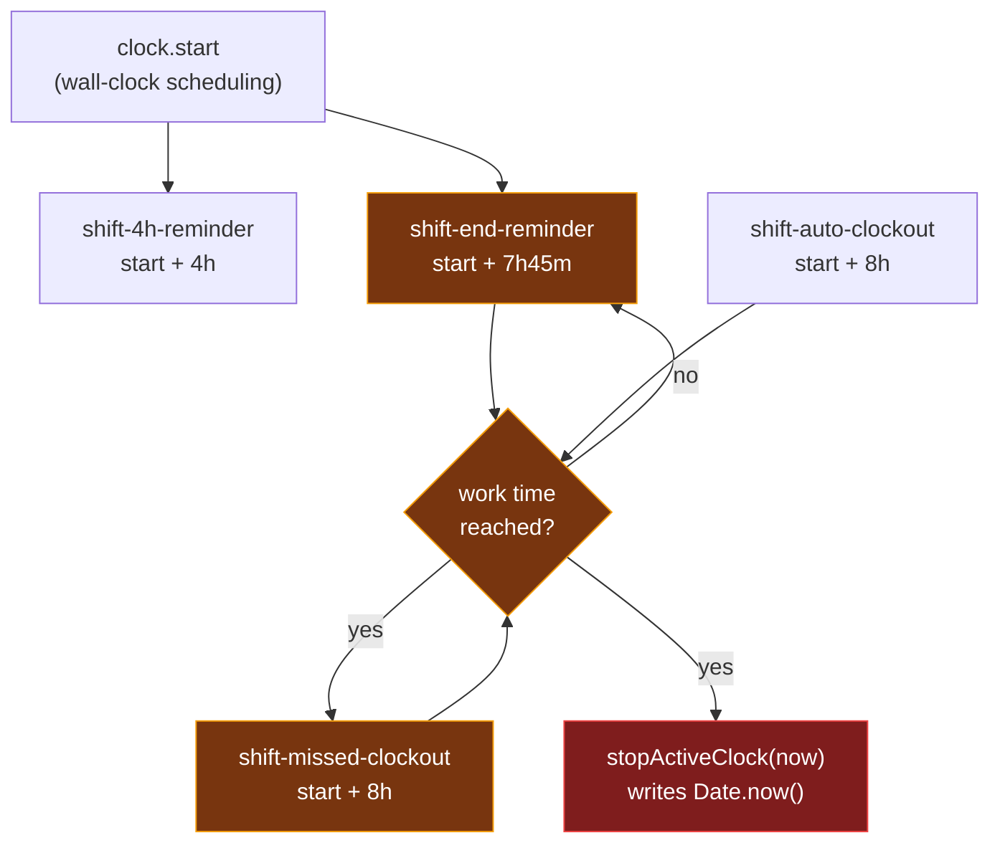
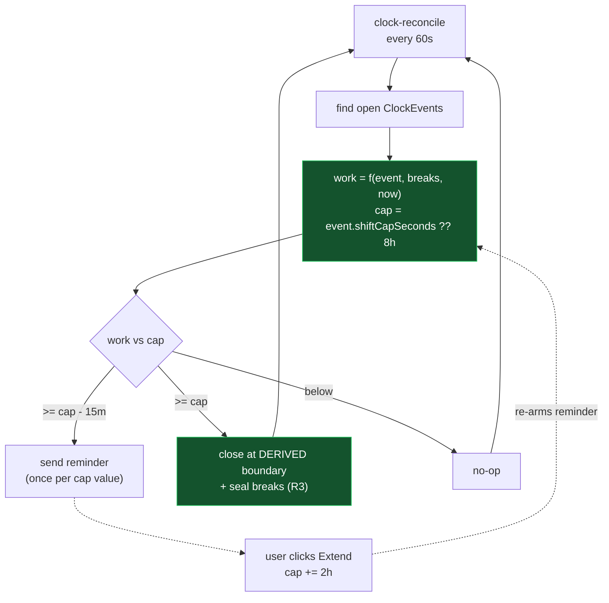
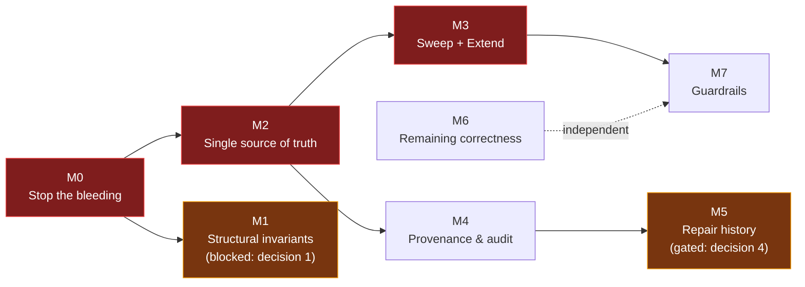

# Clock Accuracy Plan

Permanently fixing time-tracking correctness in `clockevents`.

**Status:** proposed — not started
**Owner:** unassigned
**Trigger:** production incident, 2026-08-03

---

## Overview

A user ignored the 7h45m shift-end reminder and was auto-clocked-out after **9h 54m** instead
of 8h. Investigating that incident surfaced a broader set of correctness problems in the clock
subsystem, several of which silently corrupt recorded hours with no error and no audit trail.

This document records the incident analysis, the full list of defects found, and a milestone
plan to eliminate the root causes rather than patch the symptoms.

---

## Requirements

Confirmed behaviour. Everything in this plan exists to deliver these four rules.

### R1 — 8 hours is a hard cap

A session ends at **exactly 8 hours of work time** (elapsed minus deducted breaks). This applies
to both paths out of the shift-end reminder:

- **User ignores the reminder** → auto clock-out at 8h
- **User clicks "Clock out at 8h"** → auto clock-out at 8h

Both must produce the _same_ recorded `endTime`. There is no third outcome.

### R2 — Extend is the only way past the cap

Work time beyond the cap is **not counted** unless the user explicitly extends. If they did not
extend, they are clocked out at the cap and the overrun is not recorded anywhere.

- One "Extend" grants **+2 hours** of work time (cap 8h → 10h)
- The reminder then fires again 15 minutes of work time before the new cap
- Ignoring the second reminder clocks them out at 10h
- Extending is repeatable; each click adds another 2 hours

> Consequence to be explicit about: in the 2026-08-03 incident the user genuinely worked until
> 9:46 PM. Under R2 their timesheet reads 8h and the extra 1h 54m is gone. That is the intended
> policy — unextended overtime is not recorded. If a session was legitimately longer, an admin
> corrects it afterwards via `clock.updateTimes`, which leaves an audit entry (M4).

### R3 — Breaks never outlive the clock-out

If a user is on a break and clocks out without resuming, the break **ends at exactly the
clock-out time**. More generally, after any close:

- an open break is closed at the clock-out instant
- a break straddling that instant is truncated to it
- a break starting at or after it is removed — it never happened inside the session

This must hold for manual clock-out, auto clock-out at the cap, admin edits, and the dangling
cleanup path. Today only manual clock-out does it (see D2).

### R4 — Clock in / clock out times are accurate

The recorded `startTime` and `endTime` must be derivable from first principles and must not
depend on when a job happened to run. This is the property the incident violated.

---

## The incident, reconstructed

Every job is **scheduled on wall-clock time**, but every job **gates on work time**
(elapsed minus meal breaks). The user's two breaks were 52m and 40m — both >= 20m, so both
classified `meal` and both deducted ([clock-core.js:24-34](meteor-backend/server/clock-core.js#L24-L34)).
That 1h 32m gap drives the entire failure:

| Time       | Job                     | Work time  | Result                                                                                                                                           |
| ---------- | ----------------------- | ---------- | ------------------------------------------------------------------------------------------------------------------------------------------------ |
| 10:20 AM   | clock in                | 0          | reminder scheduled at `start + 7h45m` = **6:05 PM** (wall clock)                                                                                 |
| 6:05 PM    | `shift-end-reminder`    | 6h 13m     | too early → self-reschedules +1h32m → **7:37 PM**                                                                                                |
| 7:37 PM    | `shift-end-reminder`    | **7h 45m** | notification sent, `notifiedAt7h45m` written; schedules missed-clockout at `start + 8h` = 6:20 PM — **already past** → falls back to `now + 30s` |
| 7:37:30 PM | `shift-missed-clockout` | 7h 45m 30s | too early → self-reschedules +14m30s → **7:52 PM** _(correct clock-out time)_                                                                    |
| ~9:46 PM   | `shift-missed-clockout` | 9h 54m     | clocks out at **`Date.now()`** → 9h 54m recorded                                                                                                 |

The recorded 7:37 PM reminder matches this reconstruction to the minute, confirming the model.

The user did nothing wrong: `shiftReminderResponse` is `null`, so they neither agreed nor tapped
"Continue Working" — exactly the case `shift-missed-clockout` exists to handle.

### Two conclusions from the first investigation pass were wrong

1. **"The Agenda processor stalled — no jobs since 7/27."** Incorrect. Those 7 stale rows are a
   separate missing-`job.remove()` leak. The 8/3 reminder demonstrably ran on time.
2. **"In-handler reschedule is fragile with `@agendajs/mongo-backend`."** Contradicted by the
   evidence: the 6:05 PM → 7:37 PM reschedule used that exact mechanism and landed to the minute.
   The pattern is not broken — it is merely fragile by design (many hops) and does not excuse
   writing `Date.now()` as the boundary.

**Why the 7:52 PM firing slipped to 9:46 PM cannot be determined**, because successful jobs call
`job.remove()` and delete their own evidence. That gap is itself a defect (see M4).

---

## Root causes

Every defect below traces to one of three causes. The milestones are organized around eliminating
these, not around patching symptoms.

| Root cause                                             | Symptom                                        |
| ------------------------------------------------------ | ---------------------------------------------- |
| Recorded time is a side effect of _when code ran_      | The 9h 54m incident                            |
| Invariants enforced by convention, not by the database | Cross-team overlaps; a 1ms-apart double insert |
| Duration math duplicated across 5 write paths          | `accumulatedTime` drift in both directions     |

**Definition of done:** a clock event's `startTime`/`endTime` are reproducible from first
principles, and no code path can write a time that depends on scheduler punctuality.

---

## Current architecture (what is wrong with it)



Each self-reschedule hop is a chance to lose the job, and **there is no recovery path** — if one
link in the chain is lost, nothing notices. The final write stamps whenever the code happened to run.

## Target architecture



State lives in `clockevents`, not in scheduler rows. A missed run self-heals: the next sweep sees
the same state and acts. A sweep running 3 hours late writes **the same row** as one running on time.

### The cap is state, not a schedule

The single design decision that makes R1 and R2 fall out for free: model the cap as a field on the
clock event rather than as a scheduled job.

| Field                     | Meaning                                                              |
| ------------------------- | -------------------------------------------------------------------- |
| `shiftCapSeconds`         | Work-time cap for this session. Defaults to 8h. Each Extend adds 2h. |
| `shiftReminderCapSeconds` | Which cap value the reminder was already sent for.                   |
| `closedBy`                | `'user'` / `'auto-cap'` / `'admin'` / `'dangling-sweep'` (M4).       |

The sweep then needs only two comparisons:

- `work >= shiftCapSeconds` → close at the derived boundary
- `work >= shiftCapSeconds - 15m` **and** `shiftReminderCapSeconds !== shiftCapSeconds` → remind

Extending is a single `$inc` on `shiftCapSeconds`. Because `shiftReminderCapSeconds` still holds
the _old_ cap, the next reminder re-arms automatically — no job to cancel, no job to reschedule,
and repeat extensions work without any extra code. This also deletes D15 and D16 outright, since
agree/disagree stop being jobs to manage.

### Deriving the boundary correctly

The clock-out instant must be **walked from the break history**, not computed by subtracting the
overshoot from `now`. Subtracting is wrong whenever a break falls between the boundary and the
moment the sweep noticed:

> Work reaches 8h at 7:52 PM. The user then takes a 1h meal break (8–9 PM) and keeps working.
> The sweep runs at 9:46 PM and sees 8h 54m of work. Subtracting the 54m overshoot gives
> **8:52 PM — wrong by an hour**. The true boundary is 7:52 PM.

The correct derivation starts at `startTime + cap` and pushes the candidate later by each deducted
break span that begins before it, in order. That is exact regardless of how late the sweep runs,
which is precisely R4.

---

## Decisions

### Settled

2. **Is 8h a hard cap?** — **Yes, hard.** Extend is the only way past it, +2h per click, with a
   fresh reminder before each new cap. See R1 and R2.
3. **Is time past the cap recorded?** — **No.** If the user did not extend, they are clocked out
   at the cap and the overrun is not counted. Correcting a legitimately longer session is an
   after-the-fact admin action, not an automatic one.

### Still open

1. **Can one user be clocked into two teams simultaneously?**
   The audit found 14 overlapping pairs, mostly cross-team, some over 6 hours.
   _Recommend: no_ — one open session per user, globally. If yes, the M1 unique index changes
   shape and the timesheet needs an explicit overlap policy.
   **Blocks M1.**
2. **Do historical over-reported hours need correcting, or only future ones?**
   A payroll question, not a technical one. Determines whether M5 is required or optional.
   **Blocks M5 only** — M0–M4 proceed either way.

---

## Milestones

### M0 — Stop the bleeding

_Delivers: R1 (partially), R3, R4 (partially)._

Ship first, as a standalone PR. After this, no new corruption occurs. Items 1, 4 and 5 patch the
existing job chain and are deliberately throwaway — M3 deletes them. They are still worth shipping
because M1–M3 will take time and every day until then produces bad rows.

| #   | Change                                                                                             | Location                                                                                                                                                               |
| --- | -------------------------------------------------------------------------------------------------- | ---------------------------------------------------------------------------------------------------------------------------------------------------------------------- |
| 1   | Auto-clockout writes the _derived_ boundary, not `Date.now()`                                      | [agenda.js:127](meteor-backend/server/agenda.js#L127), [:149](meteor-backend/server/agenda.js#L149)                                                                    |
| 2   | One `closeClockEvent(event, closedAt, closedBy)` that every close path uses, sealing breaks per R3 | [clock-core.js:204-228](meteor-backend/server/clock-core.js#L204-L228)                                                                                                 |
| 3   | Dangling-session close routes through it, instead of setting `endTime` alone                       | [clock.js:133-137](meteor-backend/server/clock.js#L133-L137)                                                                                                           |
| 4   | Timesheet fallback deducts breaks instead of billing raw span                                      | [clock.js:532-534](meteor-backend/server/clock.js#L532-L534)                                                                                                           |
| 5   | `defaultLockLifetime` raised above `processEvery` (stops double-execution)                         | [agenda.js:60-61](meteor-backend/server/agenda.js#L60-L61)                                                                                                             |
| 6   | `job.remove()` on every early-return branch (stops orphan leak)                                    | [agenda.js:81-83](meteor-backend/server/agenda.js#L81-L83), [114-115](meteor-backend/server/agenda.js#L114-L115), [135-137](meteor-backend/server/agenda.js#L135-L137) |

**Acceptance criteria**

- [ ] **R1/R4**: a test runs the auto clock-out at T+8h, T+10h and T+14h and asserts **all three
      write identical `endTime` and `accumulatedTime`** — the direct regression guard for this incident
- [ ] **R1/R4**: the same holds when a meal break falls _between_ the boundary and the sweep
      (the 7:52 PM / 8–9 PM / 9:46 PM case above) — this is what rules out subtracting the overshoot
- [ ] **R3**: clocking out while on a break yields a break whose `endTime` equals the session's
- [ ] **R3**: closing at a boundary in the past truncates a straddling break and removes any break
      starting after it
- [ ] **R1**: ignoring the reminder and clicking "Clock out at 8h" produce the same `endTime`
- [ ] A session closed by the dangling path has a non-zero, break-deducted `accumulatedTime`
- [ ] No `agendajobs` document survives a handler early-return

> Item 4 is needed even though item 3 fixes the cause — without it, existing zeroed rows keep
> over-reporting until M5 backfills them.

---

### M1 — Make invariants structural

_Delivers: R4._

Application code cannot reliably enforce "one open session" — it is a check-then-act race.
Move enforcement to MongoDB.

- Partial unique index on `clockevents`: `{ userId: 1 }` where `endTime: null`
- Partial unique index on `clockbreaks`: `{ clockEventId: 1 }` where `endTime: null`
- Rewrite `clock.start` as a single atomic operation; treat duplicate-key as "already clocked in"
  rather than creating a second session
- `clock.start` closes open sessions across **all** teams, not just the current one

**Prerequisite:** audit check 4 must return empty, or index creation fails. Resolve violations first.

**Acceptance criteria**

- [ ] A concurrency test firing 10 simultaneous `clock.start` calls asserts exactly one open event
      (the scenario that produced the 12:38:45.450 / .451 pair)
- [ ] Both partial indexes exist in production and in the test DB
- [ ] Clocking into team B while team A is open closes team A

---

### M2 — One source of truth for duration math

_Delivers: R4._

Five write paths currently compute `accumulatedTime` three different ways, and one does not write
it at all. That is the drift.

- Extract a **pure module** (`clock-math.js`) — no DB, no Meteor, no `Date.now()` (time always
  injected): `deductedBreakSeconds`, `workSeconds`, `autoClockoutBoundary`
- Funnel every close through **one** `closeClockEvent()` used by `clock.stop`, `stopActiveClock`,
  `updateTimes`, `createManual`, and the dangling-close path
- **Stop reading `accumulatedTime` for display.** Per the CLAUDE.md "Core Model Data Discipline"
  rule it is a persisted derived value. Keep writing it as a close-time audit record, but render
  everything from the recomputed value

**Acceptance criteria**

- [ ] Property-based tests: for any (start, end, break set), stored and recomputed agree
- [ ] The M5 audit reports zero drift against the test DB
- [ ] Exactly one function in the codebase writes `endTime`

---

### M3 — Reconciliation sweep and the Extend flow

_Delivers: R2, and R1/R4 properly._

Retire all four per-event jobs in favour of one recurring `clock-reconcile` (60s) over open events,
with the cap held as state on the event (see "The cap is state, not a schedule" above).

**Backend**

- Pure decision function `reconcile(event, breaks, now) → actions[]` — unit-testable with no scheduler
- Add `shiftCapSeconds` and `shiftReminderCapSeconds` to clock events
- New method `clock.extendShift({ clockEventId })` — `$inc` the cap by 2h; the reminder re-arms by
  itself because `shiftReminderCapSeconds` still holds the previous value
- `clock.agreeAutoClockout` keeps the flag for audit but no longer schedules anything — the cap
  already says 8h, so agreeing and ignoring converge on the same outcome, which is R1
- Delete `shift-4h-reminder`, `shift-end-reminder`, `shift-auto-clockout`, `shift-missed-clockout`
  and all their `schedule` / `cancel` call sites
- Delete `clock.respondShiftReminder` — dead (no caller) and broken in both branches (D15, D16)
- Migration: drain `agendajobs`. Safe — the sweep recomputes from event state, so nothing is lost
- Confirm single-runner (pm2 instance count, or rely on the Agenda lock now correctly sized by M0 #5)

**Frontend**

- `clockApi.extendShift` in [api.ts](src/lib/api.ts)
- Rework the reminder modal ([ShiftReminderContext.tsx](src/features/notifications/ShiftReminderContext.tsx)):
  - **"Continue Working" currently makes no server call at all** — it marks the notification read
    and closes the modal ([lines 176-181](src/features/notifications/ShiftReminderContext.tsx#L176-L181)),
    so the server never learns and clocks the user out anyway. **R2 is entirely unimplemented today.**
    This is D19 and is the single most user-visible defect in the set
  - Relabel to **"Extend 2 Hours"** and call the server
  - Update the body copy, which currently promises that Continue Working "will keep you clocked in"
    — today that is simply false

**Acceptance criteria**

- [ ] **R2**: clicking Extend raises the cap to 10h, and the user is _not_ clocked out at 8h
- [ ] **R2**: after extending, the reminder fires again at 9h 45m of work time
- [ ] **R2**: ignoring the second reminder clocks out at exactly 10h
- [ ] **R2**: extending twice yields a 12h cap — repeat extensions need no extra code
- [ ] **R2**: with no Extend click, work past the cap is not recorded under any circumstances
- [ ] **R4**: a test skips the sweep for 3 simulated hours, then runs it, and asserts output
      **byte-identical** to a sweep that ran every minute — the property the old design never had
- [ ] `agendajobs` contains exactly one recurring document
- [ ] Reminders are not duplicated when the sweep runs twice in the same minute

---

### M4 — Provenance and audit trail

The 2026-08-03 investigation took an evening because a `ClockEvent` row cannot say who ended it.

- `closedBy: 'user' | 'auto-8h' | 'admin' | 'dangling-sweep'` on every event
- Append-only `clockEventAudit`: actor, timestamp, before, after, reason — for every mutation of
  `startTime`, `endTime` or breaks, including `updateTimes` and `deleteEvent`, which currently
  rewrite hours with no trace
- Sweep decisions logged, not deleted
- Surface auto clock-out in the UI so it is not a silent mutation

**Acceptance criteria**

- [ ] Every clock event written after this milestone has a `closedBy` value
- [ ] An admin editing another user's hours produces an audit row naming them
- [ ] "Why did this session end?" is answerable from the database alone

---

### M5 — Repair historical data

Gated on decision 4.

- Run the audit script against production `timecore`
- Backfill using M2's pure function — deterministic and exactly reproducible. Dry-run mode first;
  writes M4 audit entries for every correction
- **Overlapping sessions are not auto-fixable** — which team the time belongs to is a human
  judgment. Produce an admin report instead

**Acceptance criteria**

- [ ] Post-backfill audit reports zero drift and zero zeroed sessions
- [ ] Every corrected row has a corresponding audit entry
- [ ] Overlap report delivered to admins for adjudication

---

### M6 — Remaining correctness

Independent of the critical path; can run in parallel or be deferred.

- **Timezone**: bucket days in the user's local timezone, not UTC
  ([clock.js:542](meteor-backend/server/clock.js#L542), [648-651](meteor-backend/server/clock.js#L648-L651)).
  Evening sessions currently land on the wrong calendar day, and team status drops them from "today"
- **`updateTimes` gaps** ([clock.js:360-427](meteor-backend/server/clock.js#L360-L427)): overlap
  validation, future-time validation, atomic break replacement, recompute on reopen
- **Break threshold cliff** ([clock-core.js:32](meteor-backend/server/clock-core.js#L32)): the live
  work counter jumps _backwards_ 20 minutes when an open break crosses the meal threshold. Needs a
  policy decision, not just a code change
- **Untyped break defaults to deducted** ([clock-core.js:30](meteor-backend/server/clock-core.js#L30)) —
  should fail toward not taking time from people
- **`avgSeconds` denominator** ([clock.js:536](meteor-backend/server/clock.js#L536)): divides a total
  that includes in-progress sessions by the count of completed ones
- Wire the reminder notification actions (safe only after M3)

---

### M7 — Guardrails

Turn the audit script into a scheduled invariant check that alerts on:

- any `accumulatedTime` drift > 60s
- any overlapping sessions
- any open session > 16h
- any closed session with an open break
- the reconcile sweep not having run in > 5 minutes

**This closes the loop.** M0–M6 fix the known bugs; M7 is how the next one is found in minutes
rather than when a user notices their timesheet is wrong.

---

## Sequencing



**M0 → M2 → M3** is the requirements critical path and must be in order: M2 extracts the pure
functions M3's sweep is built from. M1 is _not_ a prerequisite for M3 — it is sequenced separately
so the open decision 1 cannot hold up R2. M4 can land any time after M2. M5 requires M2 and
decision 4. M6 is independent throughout.

**Minimum to satisfy the requirements: M0 + M3.** M0 makes recorded times correct regardless of
scheduler behaviour (R1, R3, R4); M3 is the only milestone that delivers R2 at all, since Extend
does not currently exist end to end. M1 and M2 are what stop the problem returning; M4–M7 are what
stop the _next_ one going unnoticed for a day.

---

## Appendix: full defect list

Ranked by how much damage each does silently.

| ID  | Defect                                                                                                                                               | Location                                                                                                 | Milestone |
| --- | ---------------------------------------------------------------------------------------------------------------------------------------------------- | -------------------------------------------------------------------------------------------------------- | --------- |
| D1  | Auto-clockout writes `Date.now()` instead of the derived 8h boundary                                                                                 | [agenda.js:127](meteor-backend/server/agenda.js#L127), [:149](meteor-backend/server/agenda.js#L149)      | M0        |
| D2  | `clock.start` closes dangling sessions leaving `accumulatedTime` at 0                                                                                | [clock.js:133-137](meteor-backend/server/clock.js#L133-L137)                                             | M0        |
| D3  | Timesheet fallback bills the full span including breaks when `accumulatedTime` is 0                                                                  | [clock.js:532-534](meteor-backend/server/clock.js#L532-L534)                                             | M0        |
| D4  | `defaultLockLifetime` (10s) < `processEvery` (30s) → double execution                                                                                | [agenda.js:60-61](meteor-backend/server/agenda.js#L60-L61)                                               | M0        |
| D5  | Early returns never call `job.remove()` → orphaned job documents                                                                                     | [agenda.js:81-83](meteor-backend/server/agenda.js#L81-L83)                                               | M0        |
| D6  | A user can be clocked into two teams at once (close is scoped by `teamId`)                                                                           | [clock.js:133](meteor-backend/server/clock.js#L133)                                                      | M1        |
| D7  | `clock.start` is not atomic — a double-tap creates two open sessions                                                                                 | [clock.js:132-146](meteor-backend/server/clock.js#L132-L146)                                             | M1        |
| D8  | `accumulatedTime` written by 5 paths using 3 formulas                                                                                                | multiple                                                                                                 | M2        |
| D9  | `updateTimes` reopening a session leaves stale `accumulatedTime`                                                                                     | [clock.js:396-404](meteor-backend/server/clock.js#L396-L404)                                             | M6        |
| D10 | `updateTimes` has no overlap or future-time validation                                                                                               | [clock.js:360-427](meteor-backend/server/clock.js#L360-L427)                                             | M6        |
| D11 | `updateTimes` deletes then re-inserts breaks non-atomically                                                                                          | [clock.js:389-392](meteor-backend/server/clock.js#L389-L392)                                             | M6        |
| D12 | Live work counter jumps backwards 20m when an open break crosses the meal threshold                                                                  | [clock-core.js:32](meteor-backend/server/clock-core.js#L32)                                              | M6        |
| D13 | Untyped closed break is deducted in full (fail-unsafe default)                                                                                       | [clock-core.js:30](meteor-backend/server/clock-core.js#L30)                                              | M6        |
| D14 | Day boundaries computed in UTC, not the user's timezone                                                                                              | [clock.js:542](meteor-backend/server/clock.js#L542), [648-651](meteor-backend/server/clock.js#L648-L651) | M6        |
| D15 | `respondShiftReminder` 'agree' never schedules auto-clockout (latent)                                                                                | [clock.js:602-608](meteor-backend/server/clock.js#L602-L608)                                             | M3        |
| D16 | `respondShiftReminder` 'disagree' permanently disables auto-clockout (latent)                                                                        | [clock.js:612-623](meteor-backend/server/clock.js#L612-L623)                                             | M3        |
| D17 | `avgSeconds` divides a total including open sessions by the completed count                                                                          | [clock.js:536](meteor-backend/server/clock.js#L536)                                                      | M6        |
| D18 | No provenance — cannot tell whether a human or a job closed a session                                                                                | schema                                                                                                   | M4        |
| D19 | **"Continue Working" makes no server call** — the modal closes, the server never learns, and the user is clocked out anyway. R2 does not exist today | [ShiftReminderContext.tsx:176-181](src/features/notifications/ShiftReminderContext.tsx#L176-L181)        | M3        |
| D20 | Reminder modal copy promises Continue Working "will keep you clocked in" — false, given D19                                                          | [ShiftReminderContext.tsx:227-230](src/features/notifications/ShiftReminderContext.tsx#L227-L230)        | M3        |

D15 and D16 are latent only because nothing in the frontend calls `clock.respondShiftReminder` —
only `agreeAutoClockout` is wired ([api.ts:1488](src/lib/api.ts#L1488)). Wiring up the notification
buttons before fixing them would make things worse.

D19 is the reason R2 needs building rather than fixing: there is currently no path, front or back,
by which a user can legitimately work past the cap. The button exists and does nothing.

### Requirement coverage

| Requirement                                       | Delivered by                                                         |
| ------------------------------------------------- | -------------------------------------------------------------------- |
| R1 — 8h hard cap, both paths identical            | M0 (derived boundary), M3 (properly)                                 |
| R2 — Extend is the only way past, +2h, repeatable | M3 (cap state + `clock.extendShift` + frontend)                      |
| R3 — breaks never outlive the clock-out           | M0 (`closeClockEvent` seals breaks)                                  |
| R4 — accurate clock in / clock out                | M0, M1 (no duplicate sessions), M2 (one formula), M3 (late-run safe) |

---

## Appendix: audit script

A read-only audit script exists that checks all five data-integrity classes above
(zeroed sessions, orphaned open breaks, `accumulatedTime` drift, concurrent open sessions,
overlapping sessions). It performs no writes and is safe against production:

```bash
mongosh timecore --quiet --file audit-clockevents.js
```

M7 productionizes it as a scheduled invariant check. It has not yet been committed to the repo.

### Findings from a trial run against the local `staging_prod` copy (600 events)

- **4 zeroed sessions**, 1 substantive: `6.03h` billed vs `4.41h` actual — over-reported by `1.63h`,
  with 4 breaks recorded and none deducted
- **12 of 599 closed sessions drift**, in _both_ directions: `+2.72h`, `+2.57h`, `+2.42h` over;
  `-4.50h`, `-4.41h`, `-2.17h` under. Net `-2.39h`. The May 18–22 rows have suspiciously round
  timestamps and are probably seed data; the June rows appear genuine
- **14 overlapping pairs**, nearly all cross-team: 403, 347, 248, 210 and 207 minutes of overlap —
  D6 confirmed in real data
- **D7 caught in the wild**: two events for the same user and team starting at
  `2026-06-25T12:38:45.450Z` and `...451Z`, 1 millisecond apart

These are staging numbers. Production `timecore` has more users and more history; expect the
overlap count in particular to scale with how many people work across multiple teams.
