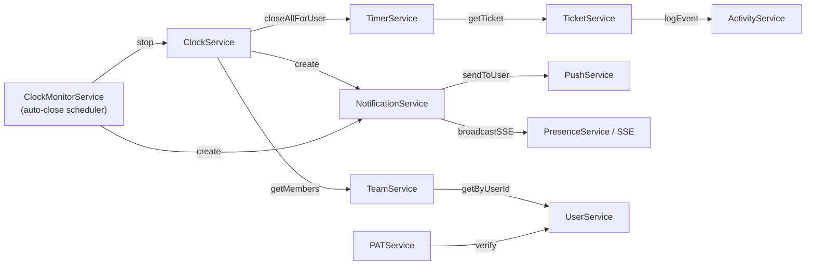
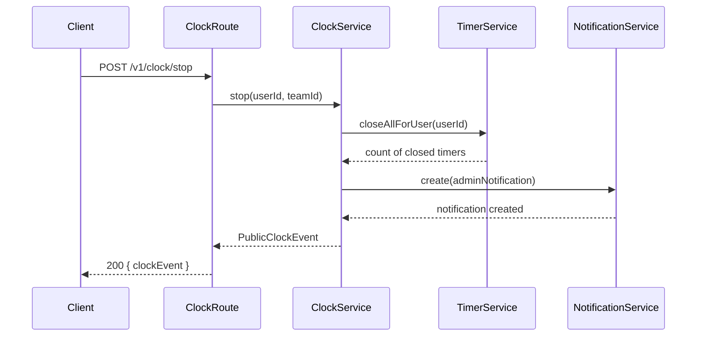
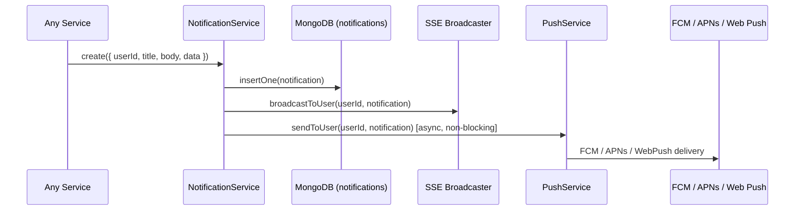
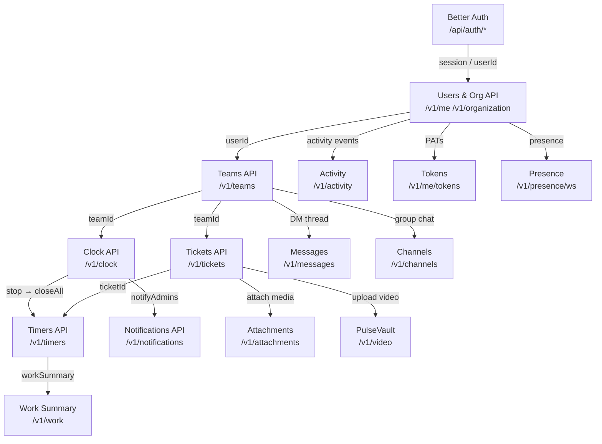

# TimeHuddle — Backend API Reference

This document describes every backend API group, how each endpoint works, and how the API modules relate to one another. For the raw MongoDB schema and index definitions, see [backend/DATABASE.md](backend/DATABASE.md).

## Base URL

All `/v1/*` routes are served from the backend on port **4000** by default.

```
Development:  http://localhost:4000
Production:   https://timehubbackend.os.mieweb.org
```

Interactive OpenAPI docs are available at `GET /docs`.

---

## Architecture Overview

Every feature follows a strict **Route → Controller → Service** pipeline. Routes declare schemas and call a controller; controllers read from `req`, delegate to service methods, and call `reply.send()`; services contain all business logic and database access.

```mermaid
flowchart TD
    Client["Frontend / Mobile Client"]
    Auth["Auth Layer\n/api/auth/*\n(Better Auth)"]
    V1["Fastify /v1/* Routes"]
    WS["WebSocket / SSE\nRoutes"]

    Client --> Auth
    Client --> V1
    Client --> WS

    subgraph Routes [Route Layer — /v1/*]
        RUsers["/users\n/me\n/admin/organization"]
        ROrg["/org"]
        RTeams["/teams"]
        RTickets["/tickets"]
        RClock["/clock"]
        RTimers["/timers"]
        RWork["/work"]
        RNotif["/notifications"]
        RMsg["/messages"]
        RChannels["/channels"]
        RAttach["/attachments"]
        RMedia["/media"]
        RPulse["/video (PulseVault)"]
        RActivity["/activity"]
        RTokens["/me/tokens"]
        RPresence["/presence"]
        RHealth["/health"]
    end

    V1 --> Routes
    WS --> Routes

    subgraph Services [Service Layer]
        SUser[UserService]
        SOrgSvc[OrgService]
        STeam[TeamService]
        STicket[TicketService]
        SClock[ClockService]
        STimer[TimerService]
        SNotif[NotificationService]
        SPush[PushService]
        SMsg[MessageService]
        SChan[ChannelService]
        SAttach[AttachmentService]
        SMedia[MediaService]
        SActivity[ActivityService]
        SPat[PATService]
        SPresence[PresenceService]
        SClockMon[ClockMonitorService]
    end

    Routes --> Services

    subgraph DB [MongoDB Collections]
        CUser[(user)]
        COrgs[(organizations)]
        CTeams[(teams)]
        CTickets[(tickets)]
        CClockE[(clockevents)]
        CClockB[(clockbreaks)]
        CWorkI[(workitems)]
        CTimers[(timers)]
        CNotif[(notifications)]
        CMsg[(messages)]
        CChan[(channels)]
        CChanMsg[(channelmessages)]
        CAttach[(attachments)]
        CMedia[(mediaitems)]
        CActivity[(activities)]
        CPush[(pushsubscriptions)]
        CDevTok[(devicetokens)]
        CPAT[(personal_access_tokens)]
        CProfile[(profiles)]
    end

    Services --> DB
```



---

## How Services Link to Each Other

The diagram below shows which services call into other services — the key cross-cutting dependencies.



---

## Authentication

All `/api/auth/*` routes are handled by **Better Auth** and are proxied through Fastify.

| Method | Path | Description |
|--------|------|-------------|
| `POST` | `/api/auth/sign-up/email` | Register with email, password, and name |
| `POST` | `/api/auth/sign-in/email` | Sign in; returns session cookie + bearer token |
| `POST` | `/api/auth/sign-out` | Sign out — clears session cookie |
| `GET`  | `/api/auth/get-session` | Return current session and user |
| `POST` | `/api/auth/request-password-reset` | Send reset-link email |
| `POST` | `/api/auth/reset-password` | Consume token and set new password |
| `POST` | `/api/auth/sign-in/social` | Initiate Google / GitHub OAuth flow |
| `GET`  | `/api/auth/callback/:provider` | OAuth redirect handler (google, github) |
| `GET`  | `/api/auth/ok` | Auth service health check |

**Authentication is carried** as an HTTP-only session cookie (`better-auth.session_token`) or as a `Bearer` token in the `Authorization` header (used by Capacitor native).

---

## User & Organization APIs

### Users

| Method | Path | Description |
|--------|------|-------------|
| `GET`  | `/v1/me` | Current user from session (with org membership) |
| `GET`  | `/v1/me/profile` | Full profile record |
| `GET`  | `/v1/me/username-available` | Check username availability (`?username=`) |
| `POST` | `/v1/me/username` | Claim a canonical username |
| `PUT`  | `/v1/me/profile` | Update name, bio, website, reportsToUserId, image |
| `POST` | `/v1/me/avatar` | Upload avatar (multipart/form-data) |
| `DELETE` | `/v1/me/avatar` | Remove avatar |
| `POST` | `/v1/me/background` | Upload profile background (multipart/form-data) |
| `DELETE` | `/v1/me/background` | Remove background image |
| `GET`  | `/v1/users/:id` | Public profile by user ID |
| `GET`  | `/v1/users/by/username/:username` | Public profile by username |
| `GET`  | `/v1/users` | Batch public profiles (`?ids=id1,id2,...`) |

### Organization

| Method | Path | Auth required | Description |
|--------|------|---------------|-------------|
| `GET`  | `/v1/organization` | Any user | Get org metadata |
| `GET`  | `/v1/organization/ownership-status` | Any user | Check if an owner has claimed the install |
| `POST` | `/v1/organization/install` | Public (one-time) | Bootstrap: claim ownership when no owner exists |
| `GET`  | `/v1/organization/users` | Any user | All users with org role (for org chart) |
| `GET`  | `/v1/admin/organization` | Owner/Admin | Admin org metadata |
| `PUT`  | `/v1/admin/organization` | Owner/Admin | Rename organization |
| `GET`  | `/v1/admin/organization/users` | Owner/Admin | All users with roles |
| `PUT`  | `/v1/admin/organization/users/:userId/role` | Owner/Admin | Set role for a user |
| `PUT`  | `/v1/org/users/:userId` | Owner/Admin | Set `reportsToUserId` (reporting hierarchy) |

---

## Teams API

| Method | Path | Auth | Description |
|--------|------|------|-------------|
| `GET`  | `/v1/teams` | Member | List all teams for current user |
| `POST` | `/v1/teams` | Any | Create a new team |
| `POST` | `/v1/teams/ensure-personal` | Any | Ensure personal workspace exists (idempotent) |
| `POST` | `/v1/teams/join` | Any | Join team by invite code |
| `PUT`  | `/v1/teams/:id/name` | Admin | Rename team |
| `DELETE` | `/v1/teams/:id` | Admin | Delete team |
| `GET`  | `/v1/teams/:id/members` | Member | List members |
| `POST` | `/v1/teams/:id/invite` | Admin | Invite user by email |
| `DELETE` | `/v1/teams/:id/members/:userId` | Admin | Remove a member |
| `PUT`  | `/v1/teams/:id/members/:userId/role` | Admin | Promote/demote admin role |
| `PUT`  | `/v1/teams/:id/members/:userId/password` | Admin | Force-set member password |

**WebSocket — Teams**

| Protocol | Path | Description |
|----------|------|-------------|
| `WS` | `/v1/teams/ws` | Live team state stream (admins only) |

---

## Tickets API

Tickets are the core work unit. They belong to a team and are the target for timers and assignments.

| Method | Path | Auth | Description |
|--------|------|------|-------------|
| `GET`  | `/v1/tickets` | Member | List tickets for a team (`?teamId=`) |
| `GET`  | `/v1/tickets/:id` | Member | Get single ticket |
| `GET`  | `/v1/tickets/:id/activity` | Member | Activity events for a ticket |
| `GET`  | `/v1/tickets/shared-with-timeharbor` | Member | Tickets flagged for TimeHarbor sync |
| `POST` | `/v1/tickets` | Member | Create a ticket |
| `PUT`  | `/v1/tickets/:id` | Member | Update title, description, or GitHub link |
| `DELETE` | `/v1/tickets/:id` | Member | Soft-delete (status → `"deleted"`) |
| `PATCH` | `/v1/tickets/:id/status-priority` | Member | Update status and/or priority |
| `PUT`  | `/v1/tickets/:id/assign` | Member | Assign / unassign ticket to a member |
| `PATCH` | `/v1/tickets/:id/timeharbor-share` | Member | Flag/unflag for TimeHarbor import |
| `PATCH` | `/v1/tickets/bulk-timeharbor-share` | Member | Flag/unflag multiple tickets |
| `POST` | `/v1/tickets/batch-status` | Member | Batch update status for multiple tickets |
| `PATCH` | `/v1/tickets/:id/external-update` | Internal | Accept update from TimeHarbor (ms, status, description) |

**WebSocket — Tickets**

| Protocol | Path | Description |
|----------|------|-------------|
| `WS` | `/v1/tickets/ws` | Real-time ticket change stream for a team |

**Ticket Status Flow**

```mermaid
stateDiagram-v2
    [*] --> open : Created
    open --> in-progress : Work started
    in-progress --> blocked : Blocked
    blocked --> in-progress : Unblocked
    in-progress --> reviewed : Review submitted
    reviewed --> in-progress : Revisions requested
    reviewed --> closed : Approved
    closed --> open : Reopened
    open --> deleted : Deleted
    in-progress --> deleted : Deleted
```

---

## Clock API

The Clock tracks **attendance-level** work sessions for a user within a team. Independent of ticket-level timers.

| Method | Path | Auth | Description |
|--------|------|------|-------------|
| `POST` | `/v1/clock/start` | Member | Clock in to a team |
| `POST` | `/v1/clock/stop` | Member | Clock out — also closes all running timers |
| `POST` | `/v1/clock/manual` | Member | Backfill a past clock session |
| `GET`  | `/v1/clock/active` | Member | Get currently active clock event (any team) |
| `GET`  | `/v1/clock/events` | Member | List all user's clock events |
| `GET`  | `/v1/clock/timesheet` | Member | Session list + summary for a date range |
| `PUT`  | `/v1/clock/:id/times` | Owner/Admin | Edit start/end times |
| `DELETE` | `/v1/clock/:id` | Owner/Admin | Delete a clock event |
| `POST` | `/v1/clock/:id/break/start` | Member | Start a break (pauses timer if one is running) |
| `POST` | `/v1/clock/:id/break/:breakId/end` | Member | End a break (resumes timer) |
| `GET`  | `/v1/clock/:id/breaks` | Member | List all breaks for a clock event |

**WebSocket — Clock**

| Protocol | Path | Description |
|----------|------|-------------|
| `WS` | `/v1/clock/ws` | Live team clock state stream (admins) |

**Clock → Timer Cross-Dependency**

When a user clocks out (`POST /v1/clock/stop`), the service calls `timerService.closeAllForUser()` to stop any running ticket timers. This is the primary coupling between the clock and timer subsystems.



**Break Classification**

| Duration | Type | Paid? |
|----------|------|-------|
| < 20 minutes | `rest` | Yes — counted as paid work time |
| ≥ 20 minutes | `meal` | No — deducted from `accumulatedTime` |

---

## Timers API

Timers track **ticket-level** work segments. One running timer per user globally (enforced by a unique partial index in MongoDB).

| Method | Path | Auth | Description |
|--------|------|------|-------------|
| `GET`  | `/v1/timers/day` | Member | WorkItems + timer sessions for a date (`?date=YYYY-MM-DD`) |
| `GET`  | `/v1/timers/week` | Member | Daily second totals for a 7-day week |
| `POST` | `/v1/timers/entries` | Member | Create a WorkItem (optionally start timer immediately) |
| `POST` | `/v1/timers/entries/:id/start` | Member | Start timer for a WorkItem |
| `POST` | `/v1/timers/entries/:id/stop` | Member | Stop running timer |
| `PUT`  | `/v1/timers/entries/:id` | Member | Update note, durationSeconds, or ticketId |
| `DELETE` | `/v1/timers/entries/:id` | Member | Delete WorkItem + all its timer sessions |

**WorkItem → Timer relationship**

```
Ticket (1) ──< WorkItem (M) ──< Timer (M)
             userId × date       work segments
```

---

## Work Summary API

| Method | Path | Auth | Description |
|--------|------|------|-------------|
| `GET`  | `/v1/work/summary/user/:userId` | Member | Plain-English summary of a user's last 48 h of timer work |

---

## Notifications API

| Method | Path | Auth | Description |
|--------|------|------|-------------|
| `GET`  | `/v1/notifications/inbox` | Member | Fetch up to 200 notifications (newest first) |
| `PATCH` | `/v1/notifications/:id/read` | Member | Mark a notification as read |

**WebSocket — Notifications**

| Protocol | Path | Description |
|----------|------|-------------|
| `WS` | `/v1/notifications/ws` | SSE-style stream of new notifications in real time |

**Notification Delivery Flow**



---

## Messages API (Admin–Member DM)

Direct threads between an admin and a team member. Thread identity: `teamId:adminId:memberId`.

| Method | Path | Auth | Description |
|--------|------|------|-------------|
| `GET`  | `/v1/messages` | Member | Cursor-paginated messages (`?teamId=&adminId=&memberId=`) |
| `POST` | `/v1/messages` | Member | Send a message in a thread |

**WebSocket — Messages**

| Protocol | Path | Description |
|----------|------|-------------|
| `WS` | `/v1/messages/ws` | Real-time DM stream (`?threadId=teamId:adminId:memberId&token=`) |

---

## Channels API (Team Group Chat)

| Method | Path | Auth | Description |
|--------|------|------|-------------|
| `GET`  | `/v1/channels` | Member | List channels for a team (`?teamId=`) |
| `POST` | `/v1/channels` | Member | Create a channel |
| `GET`  | `/v1/channels/:id/messages` | Member | Cursor-paginated channel messages |
| `POST` | `/v1/channels/:id/messages` | Member | Send a message to a channel |

**WebSocket — Channels**

| Protocol | Path | Description |
|----------|------|-------------|
| `WS` | `/v1/channels/ws` | Real-time channel stream (`?channelId=&teamId=&token=`) |

---

## Attachments API

Attachments can be linked to either a `clock` event or a `ticket`.

| Method | Path | Auth | Description |
|--------|------|------|-------------|
| `POST` | `/v1/attachments` | Member | Create attachment (video/image/link) for a clock or ticket entity |
| `GET`  | `/v1/attachments` | Member | List attachments (`?kind=clock\|ticket&id=`) |
| `DELETE` | `/v1/attachments/:id` | Owner | Delete attachment |

---

## Media Library API

| Method | Path | Auth | Description |
|--------|------|------|-------------|
| `POST` | `/v1/media` | Member | Upload image to media library (multipart) |
| `GET`  | `/v1/media` | Member | List own media items |
| `GET`  | `/v1/media/user/:userId` | Teammate | List media for a user |
| `PATCH` | `/v1/media/:id` | Owner | Update title, caption, altText |
| `POST` | `/v1/media/:id/thumbnail` | Owner | Upload JPEG thumbnail (multipart) |
| `DELETE` | `/v1/media/:id` | Owner | Delete media item (files cleaned up) |

---

## PulseVault (Video Upload) API

PulseVault handles TUS-protocol video uploads. Videos are linked to either a ticket or the media library.

| Method | Path | Auth | Description |
|--------|------|------|-------------|
| `POST` | `/v1/video/reserve` | Member | Reserve a `videoid`; returns `videoid`, `uploadToken`, `uploadLink` |
| `POST` | `/v1/video` | Token | TUS — Create upload session |
| `PATCH` | `/v1/video/:videoid` | Token | TUS — Upload chunk |
| `HEAD` | `/v1/video/:videoid` | Token | TUS — Query upload offset |
| `GET`  | `/v1/video/:videoid` | Token | Stream completed video |

**Legacy Compat Routes** (for old Pulse Cam devices — no `/v1` prefix, unauthenticated):

| Method | Path | Description |
|--------|------|-------------|
| `POST` | `/reserve` | Reserve random videoid |
| `POST/PATCH/HEAD/GET` | `/:videoid` | TUS upload / playback |

---

## Activity API

| Method | Path | Auth | Description |
|--------|------|------|-------------|
| `GET`  | `/v1/activity/log` | Member | Cursor-paginated activity log for current user |
| `GET`  | `/v1/users/:userId/activity` | Teammate | Activity log for a specific user |

Activity event types: `clock.in`, `clock.out`, `ticket.created`, `ticket.updated`, `pat.created`, `pat.revoked`.

---

## Personal Access Tokens API

| Method | Path | Auth | Description |
|--------|------|------|-------------|
| `GET`  | `/v1/me/tokens` | Member | List PATs (no raw value) |
| `POST` | `/v1/me/tokens` | Member | Create PAT — raw value shown once |
| `DELETE` | `/v1/me/tokens/:id` | Owner | Revoke a PAT |

PATs are stored as SHA-256 hashes. The raw token is returned only at creation time.

---

## Presence API

| Protocol | Path | Description |
|----------|------|-------------|
| `WS` | `/v1/presence/ws` | Heartbeat channel — sends online snapshot on connect, then streams presence diffs. Client pings every 30 s. (`?watch=id1,id2,...&token=`) |

---

## Health API

| Method | Path | Auth | Description |
|--------|------|------|-------------|
| `GET`  | `/v1/health` | None | Returns `{ status, timestamp, version }` |
| `GET`  | `/` | None | Root info — `{ service: "timehuddle-backend", status: "ok" }` |

---

## Cross-Module Data Flow



---

## Startup & Background Jobs

At boot (`backend/src/server.ts`), the backend runs:

1. `connectDB()` — native MongoDB driver connection
2. `ensureMongooseConnected()` — Mongoose connection (for `tickets`)
3. `ensureIndexes()` — creates operational indexes if missing
4. `startClockMonitor()` — starts background 30-second interval

**ClockMonitorService** runs every 30 seconds in production. It:
- Finds all active clock events (where `endTime` is null)
- Sends a 4-hour break-reminder notification if elapsed time ≥ 4 h and `notifiedAt4h` is not set
- Auto-closes any session that has exceeded the configured maximum shift duration

---

## Real-Time Channels Summary

| Channel | Protocol | Route | Who subscribes |
|---------|----------|-------|----------------|
| Notifications | WebSocket | `/v1/notifications/ws` | Any authenticated user |
| Team clock state | WebSocket | `/v1/clock/ws` | Team admins |
| Ticket changes | WebSocket | `/v1/tickets/ws` | Team members |
| Team events | WebSocket | `/v1/teams/ws` | Team members |
| DM thread | WebSocket | `/v1/messages/ws` | Thread participants |
| Channel chat | WebSocket | `/v1/channels/ws` | Channel members |
| Presence | WebSocket | `/v1/presence/ws` | Any user watching a set of user IDs |

All WebSocket routes validate the `Origin` header against a trusted allowlist on upgrade. Capacitor native (`capacitor://localhost`) and `http://localhost:3000` are always trusted.
