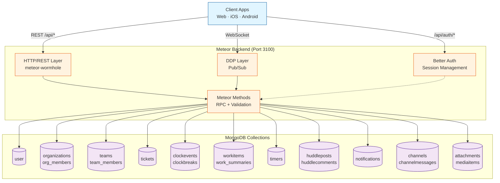
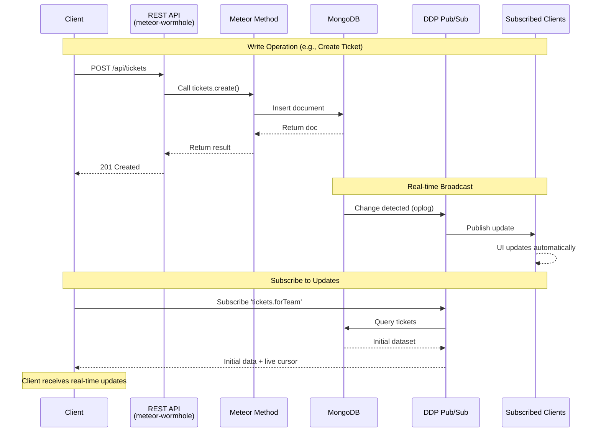
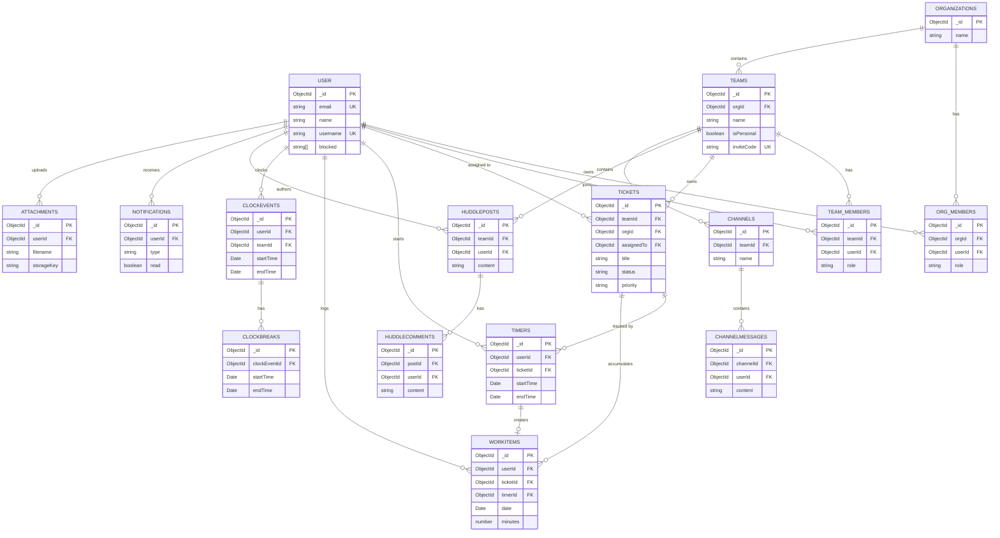
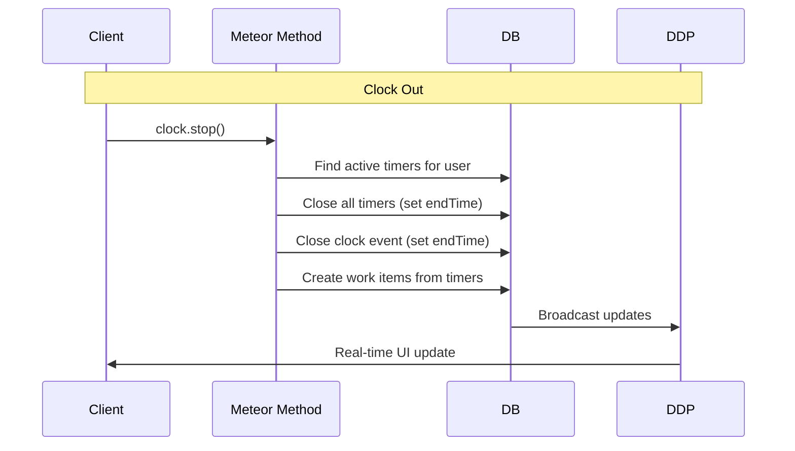
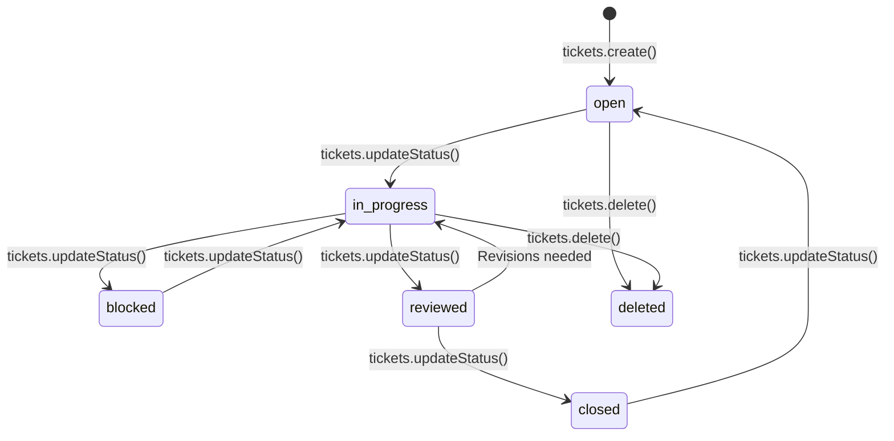

# TimeHuddle — Database & API Architecture

This document describes the TimeHuddle backend architecture, MongoDB collections, and API structure. The backend is built with **Meteor 3** using **meteor-wormhole** for REST/OpenAPI/MCP and **DDP** for real-time pub/sub.

## Base URLs

```
Development:  http://localhost:3100
Production:   https://huddle.os.mieweb.org
```

Interactive OpenAPI docs: `GET /docs`

---

## Architecture Overview

TimeHuddle uses **Meteor 3** with dual API layers:

1. **REST API** via meteor-wormhole (OpenAPI + MCP server support)
2. **DDP Pub/Sub** for real-time subscriptions
3. **Better Auth** for authentication



---

## Data Flow: REST & Real-time



---

## MongoDB Collections

### Core Collections

#### user
User accounts managed by Better Auth.

```typescript
{
  _id: ObjectId,
  email: string,
  emailVerified: boolean,
  name: string,
  username?: string,
  image?: string,
  createdAt: Date,
  updatedAt: Date,
  blocked?: string[]  // Array of org IDs user is blocked from
}
```

**Indexes:**
- `email` (unique)
- `username` (unique, sparse)

---

#### organizations
Top-level organizational units.

```typescript
{
  _id: ObjectId,
  name: string,
  createdAt: Date,
  updatedAt: Date
}
```

---

#### org_members
Organization membership with roles.

```typescript
{
  _id: ObjectId,
  orgId: ObjectId,
  userId: ObjectId | string,
  role: 'owner' | 'admin' | 'member',
  joinedAt: Date
}
```

**Indexes:**
- `{ orgId: 1, userId: 1 }` (unique)
- `{ userId: 1 }`

---

#### teams
Teams within an organization.

```typescript
{
  _id: ObjectId,
  name: string,
  orgId: ObjectId,
  isPersonal: boolean,  // Personal workspace teams
  inviteCode: string,   // 6-character join code
  createdAt: Date,
  updatedAt: Date,
  archivedAt?: Date
}
```

**Indexes:**
- `inviteCode` (unique)
- `orgId`

---

#### team_members
Team membership with roles.

```typescript
{
  _id: ObjectId,
  teamId: ObjectId,
  userId: ObjectId | string,
  role: 'admin' | 'member',
  joinedAt: Date
}
```

**Indexes:**
- `{ teamId: 1, userId: 1 }` (unique)
- `{ userId: 1 }`

---

#### team_join_requests
Pending join requests for teams.

```typescript
{
  _id: ObjectId,
  teamId: ObjectId,
  userId: ObjectId | string,
  status: 'pending' | 'approved' | 'declined',
  createdAt: Date,
  resolvedAt?: Date,
  resolvedBy?: ObjectId | string
}
```

**Indexes:**
- `{ teamId: 1, userId: 1, status: 1 }`

---

### Work Tracking Collections

#### tickets
Work items tracked within teams.

```typescript
{
  _id: ObjectId,
  title: string,
  description?: string,
  teamId: ObjectId,
  orgId: ObjectId,
  status: 'open' | 'in-progress' | 'blocked' | 'reviewed' | 'closed' | 'deleted',
  priority: 'low' | 'medium' | 'high' | 'urgent',
  assignedTo?: ObjectId | string,
  createdBy: ObjectId | string,
  createdAt: Date,
  updatedAt: Date,
  githubIssueUrl?: string,
  estimatedMinutes?: number,
  sharedWithTimeHarbor?: boolean
}
```

**Indexes:**
- `{ teamId: 1, status: 1 }`
- `{ assignedTo: 1 }`
- `{ orgId: 1 }`

---

#### clockevents
User attendance sessions (clock in/out).

```typescript
{
  _id: ObjectId,
  userId: ObjectId | string,
  teamId: ObjectId,
  orgId: ObjectId,
  startTime: Date,
  endTime?: Date,
  manualEntry?: boolean,
  createdAt: Date,
  updatedAt: Date
}
```

**Indexes:**
- `{ userId: 1, startTime: -1 }`
- `{ teamId: 1, startTime: -1 }`
- `{ userId: 1, endTime: 1 }` (find active sessions)

---

#### clockbreaks
Breaks during clock sessions.

```typescript
{
  _id: ObjectId,
  clockEventId: ObjectId,
  userId: ObjectId | string,
  startTime: Date,
  endTime?: Date,
  createdAt: Date
}
```

**Indexes:**
- `{ clockEventId: 1 }`

---

#### timers
Ticket-level time tracking.

```typescript
{
  _id: ObjectId,
  userId: ObjectId | string,
  ticketId: ObjectId,
  teamId: ObjectId,
  startTime: Date,
  endTime?: Date,
  totalMinutes?: number,
  createdAt: Date,
  updatedAt: Date
}
```

**Indexes:**
- `{ userId: 1, endTime: 1 }` (find active timers)
- `{ ticketId: 1 }`
- `{ teamId: 1 }`

---

#### workitems
Time entries (can be manual or from closed timers).

```typescript
{
  _id: ObjectId,
  userId: ObjectId | string,
  ticketId: ObjectId,
  teamId: ObjectId,
  orgId: ObjectId,
  date: Date,  // Date at midnight UTC
  minutes: number,
  description?: string,
  timerId?: ObjectId,  // Reference to timer if auto-created
  createdAt: Date,
  updatedAt: Date
}
```

**Indexes:**
- `{ userId: 1, date: -1 }`
- `{ ticketId: 1 }`
- `{ teamId: 1, date: -1 }`

---

#### work_summaries
Daily aggregated work summaries per user.

```typescript
{
  _id: ObjectId,
  userId: ObjectId | string,
  teamId: ObjectId,
  date: Date,  // Date at midnight UTC
  totalMinutes: number,
  createdAt: Date,
  updatedAt: Date
}
```

**Indexes:**
- `{ userId: 1, teamId: 1, date: 1 }` (unique)

---

### Communication Collections

#### huddleposts
Team news feed posts.

```typescript
{
  _id: ObjectId,
  teamId: ObjectId,
  userId: ObjectId | string,
  content: string,
  attachmentId?: ObjectId,
  ticketId?: ObjectId,
  likedBy: (ObjectId | string)[],
  viewedBy: (ObjectId | string)[],
  createdAt: Date,
  updatedAt: Date
}
```

**Indexes:**
- `{ teamId: 1, createdAt: -1 }`

---

#### huddlecomments
Comments on huddle posts.

```typescript
{
  _id: ObjectId,
  postId: ObjectId,
  userId: ObjectId | string,
  content: string,
  createdAt: Date,
  updatedAt: Date
}
```

**Indexes:**
- `{ postId: 1, createdAt: 1 }`

---

#### channels
Team communication channels.

```typescript
{
  _id: ObjectId,
  teamId: ObjectId,
  name: string,
  description?: string,
  createdBy: ObjectId | string,
  createdAt: Date,
  updatedAt: Date
}
```

**Indexes:**
- `{ teamId: 1 }`

---

#### channelmessages
Messages within channels.

```typescript
{
  _id: ObjectId,
  channelId: ObjectId,
  userId: ObjectId | string,
  content: string,
  attachmentId?: ObjectId,
  createdAt: Date,
  updatedAt: Date,
  editedAt?: Date
}
```

**Indexes:**
- `{ channelId: 1, createdAt: -1 }`

---

#### notifications
User notifications.

```typescript
{
  _id: ObjectId,
  userId: ObjectId | string,
  type: 'clock_reminder' | 'shift_reminder' | 'ticket_assigned' | 'comment_mention' | ...,
  title: string,
  body?: string,
  data?: object,  // Type-specific metadata
  read: boolean,
  createdAt: Date,
  readAt?: Date
}
```

**Indexes:**
- `{ userId: 1, read: 1, createdAt: -1 }`

---

### Media Collections

#### attachments
File attachments (videos, images, documents).

```typescript
{
  _id: ObjectId,
  userId: ObjectId | string,
  filename: string,
  mimeType: string,
  size: number,
  storageKey: string,  // S3/local storage path
  thumbnailKey?: string,
  metadata?: {
    width?: number,
    height?: number,
    duration?: number  // For videos
  },
  createdAt: Date
}
```

**Indexes:**
- `{ userId: 1, createdAt: -1 }`

---

#### mediaitems
Shareable media library items.

```typescript
{
  _id: ObjectId,
  teamId: ObjectId,
  userId: ObjectId | string,
  title: string,
  description?: string,
  attachmentId: ObjectId,
  tags: string[],
  createdAt: Date,
  updatedAt: Date
}
```

**Indexes:**
- `{ teamId: 1, createdAt: -1 }`

---

## Entity Relationships



---

## Key Workflows

### Clock In/Out with Timer Auto-close



### Ticket Status Flow



---

## Authentication

Authentication is handled by **Better Auth** at `/api/auth/*`:

| Method | Path | Description |
|--------|------|-------------|
| `POST` | `/api/auth/sign-up/email` | Register with email + password |
| `POST` | `/api/auth/sign-in/email` | Sign in with email + password |
| `POST` | `/api/auth/sign-out` | Sign out (clear session) |
| `GET` | `/api/auth/get-session` | Get current session |
| `POST` | `/api/auth/sign-in/social` | OAuth (GitHub, Google) |

Sessions are stored as HTTP-only cookies (`better-auth.session_token`) or bearer tokens for mobile apps.

---

## Real-time Subscriptions (DDP)

Meteor DDP subscriptions provide real-time data:

| Subscription | Description |
|--------------|-------------|
| `tickets.forTeam` | Live ticket updates for a team |
| `huddle.posts` | Live huddle post feed |
| `channels.messages` | Live channel messages |
| `clock.events` | Live clock events for team admins |
| `notifications.forUser` | Live user notifications |

All subscriptions automatically push updates when underlying MongoDB documents change (via oplog tailing).

---

## API Routes

### REST API (meteor-wormhole)

All REST routes are under `/api/*`:

- **Organizations**: `/api/organizations`, `/api/org/members`
- **Teams**: `/api/teams`, `/api/teams/join`
- **Tickets**: `/api/tickets`, `/api/tickets/:id`
- **Clock**: `/api/clock/start`, `/api/clock/stop`
- **Timers**: `/api/timers/start`, `/api/timers/stop`
- **Work**: `/api/work/items`, `/api/work/summary`
- **Huddle**: `/api/huddle/posts`, `/api/huddle/comments`
- **Channels**: `/api/channels`, `/api/channels/messages`
- **Notifications**: `/api/notifications`
- **Attachments**: `/api/attachments/upload`

Full OpenAPI spec available at `GET /docs`.

---

## Development Setup

```bash
cd meteor-backend
npm install
npm run dev  # Starts on port 3100
```

MongoDB connection string is read from `.env`:

```
MONGO_URL=mongodb://localhost:27017/timehuddle
```

---

## Migration Notes

The system migrated from **Fastify + Better Auth** to **Meteor 3 + Better Auth** in July 2026. Key changes:

1. ✅ Single `user` collection (Better Auth) — no dual user collections
2. ✅ REST API via meteor-wormhole (auto-generates OpenAPI + MCP)
3. ✅ DDP pub/sub replaces hand-rolled WebSocket fan-out
4. ✅ Meteor Methods replace Fastify route handlers
5. ✅ Better Auth continues to handle authentication

The `meteor-backend/` directory is the active backend. The old `backend/` directory contains only legacy migrations.

---

## References

- **Meteor Docs**: https://docs.meteor.com
- **meteor-wormhole**: https://github.com/mieweb/meteor-wormhole
- **Better Auth**: https://www.better-auth.com
- **Production URL**: https://huddle.os.mieweb.org
