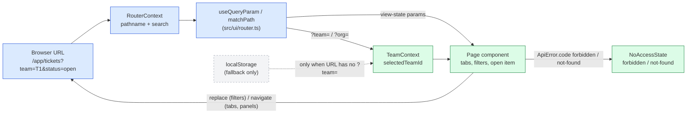

# Deep-Linking Plan — Issue #618

Implementation plan for [#618 Make Teams, Tickets, and Every App View Deep-Linkable](https://github.com/mieweb/timehuddle/issues/618).

**How to use this file:** work top to bottom. Each milestone is **one PR**, and each PR must work on its own. Tick a box (`- [x]`) in the same PR that does the work, so the checklist on `main` always shows real progress. Don't start a milestone until the one before it has merged.

---

## Before You Start: Things the Issue Doesn't Tell You

Read these first. Each one will save you an hour.

| Fact                                                                                                                                                                                                                                                                   | Why it matters                                                                                                                                                                                                                     |
| ---------------------------------------------------------------------------------------------------------------------------------------------------------------------------------------------------------------------------------------------------------------------- | ---------------------------------------------------------------------------------------------------------------------------------------------------------------------------------------------------------------------------------- |
| The backend is **`meteor-backend/`**, not the Fastify `backend/` folder described in `CLAUDE.md`.                                                                                                                                                                      | All backend changes in this plan go in `meteor-backend/server/*.js`.                                                                                                                                                               |
| The frontend calls most backend methods through `wormholeCall()` in [`src/lib/api.ts`](../src/lib/api.ts). On failure it throws `ApiError` with `.status` **and** `.code`. `.code` is the `Meteor.Error` code, e.g. `'forbidden'` or `'not-found'`.                    | `tickets.get` **already** throws `'not-found'` and `'forbidden'` separately ([`meteor-backend/server/tickets.js`](../meteor-backend/server/tickets.js)). The frontend just throws that away. Most of Milestone 2 is frontend work. |
| A **new** Meteor method returns 404 over REST until it is registered (exposed) in `meteor-backend/server/main.js`.                                                                                                                                                     | If you add a method and the frontend gets a 404, that is the cause.                                                                                                                                                                |
| `npm test` runs **Playwright**, not Vitest. Unit tests run with `npm run test:unit`. Vitest doesn't run in any CI workflow.                                                                                                                                            | Run `npm run test:unit` yourself. CI won't catch a broken unit test.                                                                                                                                                               |
| The app has **no i18n library**.                                                                                                                                                                                                                                       | Don't add one; that's out of scope. Put new user-facing copy in one exported constants object per feature (see Milestone 2) so it can be swapped for translations later.                                                           |
| Routing is hand-rolled: [`src/ui/router.ts`](../src/ui/router.ts) (context: `pathname`, `search`, `navigate`, `replace`) and [`src/ui/AppLayout.tsx`](../src/ui/AppLayout.tsx) (route table, `RETIRED_ROUTES`, the `/app/profile/:id` and `/app/tickets/:id` parsing). | Don't add React Router; that's out of scope. Build on `RouterContext`.                                                                                                                                                             |
| `navigate()` adds a history entry. `replace()` rewrites the current one.                                                                                                                                                                                               | Rule for this whole issue: **typing or filtering → `replace`**; **opening something or switching a tab → `navigate`**.                                                                                                             |

### Setup (do once)

- [x] `nvm use && npm install`
- [x] Backend running (`pm2 status` shows the Meteor backend online) and `npm run dev` serves `http://localhost:3000`
- [x] Baseline is green before you change anything: `npm run lint && npm run typecheck && npm run format && npm run test:unit`
- [x] Read [`release-notes/README.md`](../release-notes/README.md); you'll need it in Milestone 5

---

## How It Fits Together (Target)

---

## Milestone 1 — URL Conventions, Shared Helpers, `?team=` Sync

**Goal:** the plumbing every later milestone uses. No page should look different yet, except that the team now appears in the URL.

### 1a. Document the scheme

- [x] Create `src/ui/ROUTING.md` with the three rules: **path = resource**, **`?team=` / `?org=` / `?enterprise=` = scope**, **other query params = view state**
- [x] Include the `replace` vs `navigate` rule (table above) with one example of each
- [x] Include the list of **legacy aliases** that must keep working: `?teamId=` → `?team=`, `?postId=` → `?post=`, `?memberId=` → `?member=`, `?requestId=` → `?request=`, `?tab=timesheet`, and everything in `RETIRED_ROUTES`
- [x] Add a Mermaid diagram (you can copy the one above) with named nodes, not `A`/`B`/`C`
- [x] Link `ROUTING.md` from the "Routing" bullet in `CLAUDE.md`

### 1b. Query-param helpers

- [x] In `src/ui/router.ts`, add `useQueryParams()`. It returns the parsed `URLSearchParams` from `search`, plus `setParams(patch, { history: 'replace' | 'push' })`. Setting a value to `null` or `''` removes the key. Other keys are kept.
- [x] Add `useQueryParam(name)`, which returns `[value, setValue]` on top of `useQueryParams`
- [x] `setParams` builds the URL from the **current** `pathname` and calls `replace` or `navigate` from `RouterContext`. Never call `window.history` directly.
- [x] Unit tests in `src/ui/router.test.ts`: read, set, remove, keep the other keys, `replace` vs `push`

### 1c. Path-param matcher

- [x] Add `matchPath(pattern, pathname)` to `src/ui/router.ts`, e.g. `matchPath('/app/tickets/:ticketId', '/app/tickets/abc')` → `{ ticketId: 'abc' }`, or `null`
- [x] Unit tests: match, no match, trailing slash, extra segments → `null`
- [x] Swap the `startsWith` / `slice` code in `AppLayout.tsx` (the `profileSegment` and `ticketDetailId` blocks, and `match()`) for `matchPath`. **Behaviour must not change.** `tests/e2e/teams/profile-routing.spec.ts` must still pass.

### 1d. `TeamContext` ↔ URL sync

File: [`src/lib/TeamContext.tsx`](../src/lib/TeamContext.tsx) (the restore effect around the `deepLinkTeamId` line, and `setSelectedTeamId` / `setSelectedOrgId` / `setSelectedEnterpriseId`)

- [x] On restore, read `?team=` first, then the legacy `?teamId=`, then `localStorage`. Do the same for `?org=` and `?enterprise=`. _Done differently: `TeamContext` derives the team from the URL on every render (`selectedTeamId = ?team= ?? stored`) instead of restoring once. `?enterprise=` is left out: no page links to an enterprise view yet._
- [x] If the URL used `?teamId=`, rewrite it to `?team=` with `replace` (no history entry)
- [x] When the selection changes (switcher, or a team picked automatically), write `?team=` (and `?org=` where it applies) with `replace`, keeping the other params. Keep the `localStorage` write; it's still the fallback. _Done: `RouterProvider` now sits above `TeamProvider`, so `TeamContext` reads and writes the URL itself._
- [x] When the URL's `?team=` changes (Back/Forward, or a link click), update `selectedTeamId`. Watch `search` from `useRouter()`.
- [x] **Don't** fall back to another team when `?team=X` isn't in the user's teams. Leave a flag such as `teamAccess: 'ok' | 'forbidden'` on the context for Milestone 2. Until then, log a `console.warn`. _Done: `teamAccess: 'ok' | 'pending' | 'forbidden'`; no `console.warn` needed._
- [x] Sidebar / internal links keep `?team=`: give the sidebar a `withScope(path)` helper (in `router.ts`) that adds the current `team`, rather than editing every link by hand _Done differently: no `withScope` helper. `TeamContext` stamps the selected team onto any team-scoped URL that lacks one, so links need no changes. A team opened from a link becomes the remembered team too._
- [x] Unit tests (`src/lib/TeamContext.test.tsx`): URL beats storage; `teamId` alias gets normalised; switching writes the URL; a `popstate` changes the selection; an unknown team doesn't pick another team

### 1e. Ship it

- [x] `npm run lint && npm run typecheck && npm run format && npm run test:unit` pass
- [x] Manual check: switch team → URL shows `?team=`; reload → same team; open the URL in a private window with the same user → same team
- [x] Old notification link `/app/dashboard?tab=timesheet&teamId=X&memberId=Y` still lands on the right team and member _Covered by `tests/e2e/navigation/deep-links.spec.ts` (reload, alias, sidebar, unknown team) and the existing `tests/e2e/notifications/deep-links.spec.ts` + `teams.spec.ts`._
- [ ] PR title: `refs #618: URL conventions, router helpers and ?team= sync`

---

## Milestone 2 — No-Access and Not-Found States

**Goal:** one shared component, and ticket detail tells "forbidden" apart from "not found".

### 2a. Error classification helper

- [x] Add `classifyLoadError(err): 'forbidden' | 'not-found' | 'error'` in `src/lib/` (next to `ApiError`). Base it on `ApiError.code` (`'forbidden'`, `'not-authorized'` → forbidden; `'not-found'` → not-found). Also check `DdpServerError` from [`src/lib/ddp.ts`](../src/lib/ddp.ts) if any deep-linked resource is loaded over DDP. _Done in `src/lib/loadError.ts`. It trusts only the Meteor.Error code: wormhole answers every Meteor.Error with HTTP 500, and its bare 404 means "method not registered". No deep-linked resource loads over DDP, so `DdpServerError` isn't handled._
- [x] Unit tests for each branch, including a plain `Error` → `'error'`

### 2b. `<NoAccessState>` component

- [x] Create `src/ui/NoAccessState.tsx`, built from `@mieweb/ui` components (check [`.github/instructions/mieweb-ui.instructions.md`](../.github/instructions/mieweb-ui.instructions.md) for the right empty-state/Card/Button). **No raw `<button>`/`
` styling** where the library has a component.
- [x] Props: `kind: 'forbidden' | 'not-found'`, `resource: 'team' | 'ticket' | 'profile' | 'org' | 'conversation'`, optional `name`, optional `onRequestJoin` _Done differently: `resource` is `'team' | 'ticket'` for now; later milestones add the rest as they use it. No `name` or `onRequestJoin` (see below)._
- [x] Actions: **Go to dashboard** (always); **Request to join** only when `onRequestJoin` is passed (join requests exist in `meteor-backend/server/team-join-requests.js`) _Request to join is left out: joining needs the team's private code, and a link only carries the id._
- [x] Wrap the message in `role="status"` / `aria-live="polite"`; the heading should be a real heading element
- [x] Put all copy in one exported object (e.g. `NO_ACCESS_COPY`) in the same file, with nothing hard-coded inline in JSX
- [x] Semantic class names on structural elements (e.g. `no-access-state`, `no-access-actions`)

### 2c. Ticket detail

File: [`src/features/tickets/TicketDetailPage.tsx`](../src/features/tickets/TicketDetailPage.tsx) (the `.catch(() => setError('Ticket not found or you do not have access.'))` line)

- [x] Keep the error kind from `classifyLoadError`, not a string
- [x] `forbidden` → `<NoAccessState kind="forbidden" resource="ticket" />`; `not-found` → `kind="not-found"`; anything else → the existing generic error with a retry
- [x] Backend check: confirm `tickets.get` returns `'not-found'` for a **malformed** id too. Today `new Mongo.ObjectID('garbage')` may throw a different error first. If it does, validate the id and throw `'not-found'`. _Fixed: `tickets.js` declared `tickets.get` twice in one object, so the second (unvalidated) one won. It now validates the id, and the dead first copy is removed. Note the live one checks team membership, not the CASL `read` rule the dead one used; unchanged here._

### 2d. Team access (uses the flag from 1d)

- [x] When `TeamContext` reports `teamAccess === 'forbidden'`, team-scoped pages render `<NoAccessState kind="forbidden" resource="team" />` instead of their content _Done once, in `AppLayout`: any team-scoped path is replaced by the no-access state, so no page needs its own check._
- [x] Decide with the reviewer whether a team name can be shown safely. If the backend has no safe "team name only" lookup, **don't show a name**. Note the decision in the PR description. _Decision: no name. There is no endpoint that returns a team's name to a non-member, and adding one would leak which teams exist._

### 2e. Ship it

- [x] E2E (`tests/e2e/tickets/`): open a ticket from a team you're not in → forbidden state; open a random valid-format id → not-found state; the two show **different** text
- [x] E2E (`tests/e2e/teams/`): `/app/dashboard?team=<other team>` → forbidden state, **never** another team's data
- [x] Lint, typecheck, format, unit tests pass
- [ ] PR title: `refs #618: shared no-access and not-found states`

---

## Milestone 3 — Teams and Tickets

### 3a. `/app/teams/:teamId`

- [x] Register the pattern in `AppLayout.tsx` using `matchPath`; render `TeamsPage` with that team selected _`TeamContext` reads the path team like `?team=`, so the same no-access gate and "remember the linked team" rules apply. `isActivePath` keeps the Teams nav item highlighted on `/app/teams/:id`._
- [x] `/app/teams` (no id) → `replace` to `/app/teams/<selectedTeamId>`
- [x] In [`src/features/teams/TeamsPage.tsx`](../src/features/teams/TeamsPage.tsx), **delete** the effect that reads `?teamId=` and then `replaceState`s every param away. Path and `TeamContext` now cover it. Keep the `?tab=timesheet` → dashboard forward, but move it into `RETIRED_ROUTES`-style handling or `resolveUrl` so it lives in one place. _The `?tab=timesheet` forward now lives in `resolveUrl` in `router.tsx`._
- [x] Picking a team on the Teams page uses `navigate('/app/teams/<id>')`
- [x] Not a member → `<NoAccessState resource="team" />` (with **Request to join** if a join flow exists for that team) _Request to join left out (see 2b)._

### 3b. Tickets list filters in the URL — **reverted, needs redoing**

File: [`src/features/tickets/useTicketTableView.ts`](../src/features/tickets/useTicketTableView.ts)

This was built and then given up when `main` landed the unified ticket table.
That rewrite moved every filter into a `TicketFilters` object owned by
`useTicketTableView`, which is now instantiated twice (Tickets and My Board)
with deliberately independent state, turned Open/Closed into a `Switch`, took
`?teams=all` away entirely, and claimed `tab` for the Tickets/My Board tabs.
None of the params below map onto it as written, so the merge took `main`'s
version whole and the work is a follow-up against the new shape.

- [ ] Move search, assignee, status and priority out of `useState` and into the URL: `?q=`, `?assignee=`, `?status=`, `?priority=`. Team comes from `?team=` (Milestone 1). Only the Tickets tab can own the URL — My Board shares the hook and must keep its own state.
- [ ] Search box: `replace`, debounced (`useSearchParam` already does this)
- [ ] Dropdown filters: `replace` too (filters shouldn't fill Back history)
- [ ] Invalid values (e.g. `?status=banana`) are ignored, not crashed on

### 3c. One way to open a ticket

- [x] Decide: the in-list `detailsTicket` modal either becomes `?ticket=<id>` (pushed with `navigate`, so Back closes it) **or** clicking a ticket just navigates to `/app/tickets/:ticketId`. **Recommendation:** navigate to the detail route and delete the modal. One way to open a ticket, less code. Get the reviewer's OK in the PR before deleting it. _Decision: the modal was dead code (nothing ever opened it; rows already navigate to the detail route). Deleted._
- [x] Whichever you choose, remove the other path, so there's one way to open a ticket

### 3d. Copy link

- [x] Add a small `copyLink(path)` helper (absolute URL from `window.location.origin` + path, `navigator.clipboard.writeText`, toast on success/failure). Use it everywhere; don't repeat it. _Done as `useCopyLink()` in `src/lib/`. Feedback is a `@mieweb/ui` toast; `AppLayout` mounts `ToastProvider` + the app's own `AppToasts` container._
- [x] **Copy link** action in the ticket list row menu and on the detail page, with an `aria-label`
- [x] Native app check: the copied link must be the **web** URL, not `capacitor://localhost`. Confirm what `window.location.origin` is inside the iOS app and use the configured public origin if they differ. _Done: `absoluteAppUrl()` uses `window.location.origin` on the web and, on native, `VITE_PUBLIC_APP_URL` falling back to the backend host (which also serves the web app). The team join/QR link goes through the same helper._

### 3e. Ship it

- [ ] E2E: filter tickets → reload → same filters; copy the URL into a new context (same user) → same view; Back after opening a ticket returns to the filtered list _Dropped with 3b above._
- [x] E2E: `/app/teams/<id>` opens that team; `/app/teams` redirects
- [x] Lint, typecheck, format, unit tests pass
- [ ] PR title: `refs #618: deep-linkable teams and tickets`

---

## Milestone 4 — Dashboard and Huddle

### 4a. Dashboard

File: [`src/features/dashboard/DashboardPage.tsx`](../src/features/dashboard/DashboardPage.tsx) (the `app:dashboardTab` `localStorage` state and the deep-link effect that ends with `replace('/app/dashboard')`)

- [x] `?tab=me|team` from the URL (switching tab → `navigate`). If there's no `?tab=`, fall back to `localStorage` `app:dashboardTab`, as today.
- [x] `?view=overview|timesheet` from the URL (`navigate`)
- [x] `?member=` (alias `?memberId=`) and `?request=` (alias `?requestId=`) read from the URL and **kept there**, not stripped _`AdminTimesheetPanel` now takes the member as a controlled prop (`memberId` / `onMemberChange`) instead of seeding internal state, so the old per-tap "request id" bookkeeping is gone. Choosing a member replaces; switching tab or view pushes._
- [x] Legacy `?tab=timesheet` → normalise with `replace` to `?tab=team&view=timesheet`
- [x] Remove the cross-org `teamId` switching here. `TeamContext` owns team selection now (Milestone 1). If cross-org switching isn't covered there yet, move it into `TeamContext`; don't keep two copies. _Done: `TeamContext` derives the org from the URL team, so Dashboard and Huddle need no cross-org code._
- [x] Delete the `replace('/app/dashboard')` that strips params
- [x] Keep the "don't reopen an approval already dealt with" behaviour (`clearFocusRequest`): clearing it should now remove `?request=` with `replace`

### 4b. Huddle

File: [`src/pages/Huddle.tsx`](../src/pages/Huddle.tsx)

- [x] `?conversation=<id>` drives `activeConversationId` (opening a conversation → `navigate`, so Back closes it) _Conversation ids start with their grouping (`session:…`), so a linked conversation brings its Thread by with it without overwriting the reader's saved choice._
- [x] `?post=<id>` (alias `?postId=`) scrolls to and highlights the post; the param stays in the URL _Done differently: once found, a post link becomes `?conversation=<id>` (replace). Keeping both would snap back to the post's conversation whenever the reader opened another._
- [x] Search/filter params, if Huddle has them, use `replace` _`?q=`, through the new shared `useSearchParam` hook (Tickets and Org Members use it too)._
- [x] Conversation the user can't see → `<NoAccessState resource="conversation" />` _An unknown or foreign conversation id falls back to the first conversation, as SuperChatInbox already did. Conversations belong to a team, so the team no-access gate covers the "can't see" case._
- [x] Update the producer: `goToPost` in `DashboardPage.tsx` and the push-notification handler in `AppLayout.tsx` should build `?post=` (the old `?postId=` still works via the alias) _Frontend producer (`goToPost`) updated. Backend notification URLs still send `?postId=`/`?teamId=`, which keep working as aliases._

### 4c. Ship it

- [x] E2E: Dashboard team tab + timesheet view → reload → same; Back from timesheet → overview
- [x] E2E: open a Huddle conversation → reload → same conversation; `?postId=` from an old notification still scrolls to the post
- [x] Existing specs in `tests/e2e/dashboard/` and `tests/e2e/huddle/` still pass
- [x] Lint, typecheck, format, unit tests pass
- [ ] PR title: `refs #618: deep-linkable dashboard and huddle`

---

## Milestone 5 — Remaining Pages, Auth Return-URL, Release Note

### 5a. Remaining pages

Each row uses `useQueryParam`, follows the `replace`/`navigate` rule, and ignores invalid values.

- [x] **Work** ([`src/features/timers/WorkPage.tsx`](../src/features/timers/WorkPage.tsx)): `selectedDate` ↔ `?date=YYYY-MM-DD` (`navigate` when changing the day)
- [x] **Profile** ([`src/features/profile/ProfilePage.tsx`](../src/features/profile/ProfilePage.tsx)): `?tab=` is already read. Make tab changes **write** it (`navigate`).
- [x] **Org Members** ([`src/features/org/OrganizationMembersPage.tsx`](../src/features/org/OrganizationMembersPage.tsx)): `memberSearch` ↔ `?q=` (`replace`, debounced)
- [x] **Org Usage** ([`src/features/usage/OrgUsagePage.tsx`](../src/features/usage/OrgUsagePage.tsx)): `periodDays` ↔ `?period=`, org ↔ `?org=` (from `TeamContext`) _Done as `?period=` and `?usageOrg=`, not `?org=`: `?org=` is the app-wide org scope, and this picker has an "All organizations" choice._
- [x] **Activity Log**: any active filters → query params _Nothing to do: it has no filters._
- [x] **Notifications, Settings, Release Notes, Clock**: look for tabs or sections. Add a param **only** where one exists, and list what you checked in the PR description even if nothing changed. _Checked: none of the four has tabs, filters or sections._
- [x] Org / profile not found or forbidden → `<NoAccessState>` _Profile: its 403/404 checks never fired (wormhole sends every Meteor.Error as HTTP 500), so a missing profile showed an empty page; it now uses `classifyLoadError` + `NoAccessState`. Org pages already gate on the user's org roles._

### 5b. Return to the original URL after sign-in

File: [`src/main.tsx`](../src/main.tsx). The `if (!user)` block does `window.history.replaceState(null, '', '/')` before showing `<LoginForm />`, which loses the link.

- [x] Before rewriting to `/`, save `pathname + search` in `sessionStorage` (e.g. `auth:returnTo`), only if it starts with `/app/`. The `/^\/app(\/|$)/` check used for native deep links in the same file is the right guard; reuse it, don't copy it. _Done in `src/lib/returnTo.ts`._
- [x] After sign-in succeeds (password **and** OAuth paths), `replace` to the saved URL once, then delete the key _Restored on the first signed-in render in `main.tsx`, before `RouterProvider` reads the URL, so password, OAuth and dev sign-in all go through it._
- [x] Don't keep `/app/*` when the user signed **out** on purpose (logout from `/app/teams` should still land on `/` and must not return there next time). Clear the key on explicit logout.
- [x] Check this doesn't break the native `pendingDeepLinkPath` flow in `AppLayout.tsx`. If both do the same job, use one mechanism. _They don't overlap: `pendingDeepLinkPath` carries `timehuddle://open/...` links on native, `returnTo` carries web URLs. Both kept._
- [x] E2E: signed-out user opens `/app/tickets/<id>?team=X` → signs in → lands on that ticket

### 5c. Release note

- [x] Follow [`release-notes/README.md`](../release-notes/README.md): find the version that will ship (check `package.json` and `.github/workflows/ota-publish.yml`), then add to that version's note or create it _Added to `1.0.4.md`: `package.json` is still 1.0.4 and the README says to add to an existing note. Users who already opened 1.0.4's notes won't see it flagged New unless the version is bumped._
- [x] Write it for users: "Links now open exactly what you were looking at…", not implementation details
- [x] Open `/app/release-notes` and confirm the note shows up (a version mismatch silently drops it)

### 5d. Ship it

- [x] `npm run test:all`, `npm run lint && npm run typecheck`, `npm run format` all pass _2026-10-02: 262 unit tests; 207 e2e passed, 7 flaky (all but one the known sign-in bounce; the other was a real return-to bug, fixed in `d91ab8b5`), 4 skipped._
- [x] Smoke test at `http://localhost:3000` (checklist below) _Done through Playwright (the MCP browser was busy in another session); see `tests/e2e/navigation/deep-links.spec.ts`._
- [ ] PR title: `fix #618: deep-link remaining pages and return to link after sign-in` (this PR closes the issue)

---

## Final Smoke Test (Before Closing #618)

Do every row on the web **and** once in the iOS/Android app.

- [x] Reload on every page keeps team, tab, filters, date and open item
- [x] Copy URL → paste in a new browser profile signed in as the same user → identical view
- [x] `?team=X` beats the remembered team; switching teams updates the URL
- [x] Back/Forward step through tabs and opened items; typing in a search box adds **no** history entries
- [x] Old links still work: `?teamId=`, `?tab=timesheet`, `?postId=`, `/app/timesheet`, `/app/messages`, `/app/media`
- [x] Link to a team/ticket/org/conversation you can't access → "You don't have access", never someone else's data
- [x] Forbidden and not-found look different
- [x] Signed-out deep link → sign in → back on the link
- [x] No `window.history.replaceState` / `new URLSearchParams(window.location.search)` left in page components. Search with `grep -rnE "history\.replaceState|URLSearchParams\(window" src/features src/pages`; anything left should be in `router.ts`, `main.tsx` auth/OAuth handling, or `LoginForm.tsx`. _Only `InboxPage` remains: the public `/inbox` page, rendered outside the app shell with no router._
- [ ] Every acceptance-criteria box on issue #618 is ticked

## Status and Follow-Ups (2026-10-02)

All five milestones are implemented on `feat/618-deep-linking`, one commit or more per milestone, instead of one PR each. Not done yet:

- [ ] **Native app pass.** Every row of the smoke test above on iOS/Android. Not run.
- [ ] **Copy Link on native** uses `window.location.origin`, which inside the app isn't the public web URL. Same limitation as the existing team join link. Needs a configured public origin.
- [ ] **Release note version.** Added to `1.0.4.md` because `package.json` is still 1.0.4. Bump to 1.0.5 if it should show as New to people who already read 1.0.4.
- [ ] **Pending-team requests.** While the team list loads, a page linked to a team the user isn't in can fire one request (e.g. `clock.teamStatus`) before the no-access state replaces it. The server refuses it; it's only log noise.
- [ ] **Backend notification URLs** still emit `?teamId=`, `?postId=`, `?memberId=`, `?requestId=`. They keep working as aliases; switching them to the new names is optional.
- [ ] **`tickets.get` permission check** uses team membership; a dead duplicate that used the CASL `read` rule was removed. Confirm membership is the intended rule.
- [ ] Tick the acceptance criteria on issue #618 once reviewed.

## Out of Scope

Same as the issue. Don't start any of these in these PRs: ticket keys (`TH-123`) and slugs, org/team slugs in paths, replacing the router, link previews/Open Graph, public share links, native universal-link changes, adding an i18n library.
