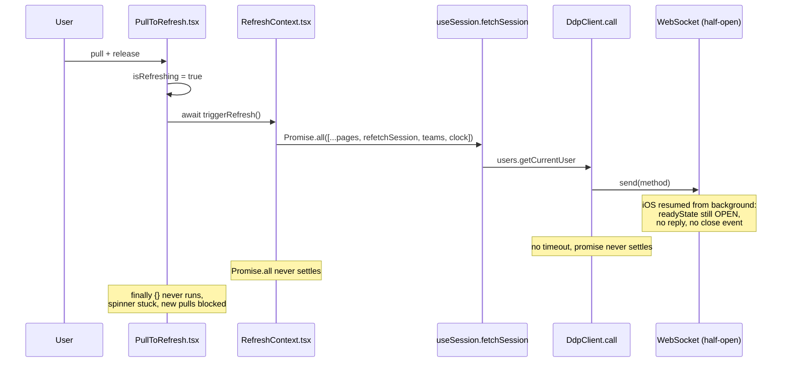
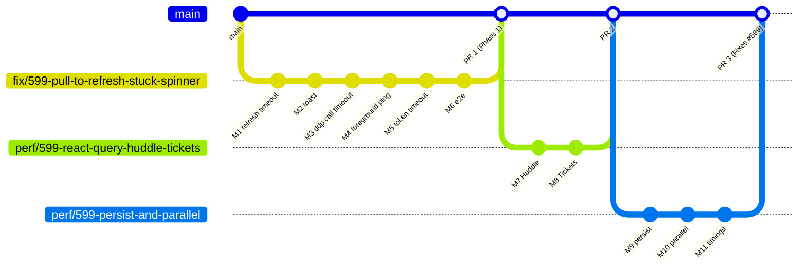

# Plan: Pull-to-Refresh Spinner Never Stops on Mobile, and Refresh/Reload Are Slow

- **Issue:** [mieweb/timehuddle#599](https://github.com/mieweb/timehuddle/issues/599)
- **Branch (Phase 1):** `fix/599-pull-to-refresh-stuck-spinner` (cut from `main`)
- **Phase 2:** separate branches/PRs, one per milestone (see [PR strategy](#pr-strategy))

Read the issue end to end before starting. This doc tells you **where** the code is
and **in what order** to work; the issue is the source of truth for **what** done looks like.

---

## How the bug happens (read this first)

Every fix in Phase 1 breaks one link in that chain. If any one link is fixed the
spinner can't stick, but we fix all of them so a single regression can't bring it back.

## Key files

| File                                                                                      | What it does today                                                                                                                                                          |
| ----------------------------------------------------------------------------------------- | --------------------------------------------------------------------------------------------------------------------------------------------------------------------------- |
| [src/ui/PullToRefresh.tsx](../src/ui/PullToRefresh.tsx)                                   | Gesture + spinner. `onTouchEnd` awaits `triggerRefresh()`; `isRefreshingRef` blocks new pulls until it settles.                                                             |
| [src/lib/RefreshContext.tsx](../src/lib/RefreshContext.tsx)                               | `triggerRefresh()` runs `Promise.all` over page handlers **and** global handlers. No timeout.                                                                               |
| [src/ui/AppLayout.tsx](../src/ui/AppLayout.tsx)                                           | Mounts `<RefreshProvider globalRefreshHandlers={[refetchSession, refetchTeams, refetchClock]}>` (~line 402).                                                                |
| [src/lib/ddp.ts](../src/lib/ddp.ts)                                                       | `DdpClient`. `call()` (~line 515) has no timeout. `handleMessage` answers server `ping` but never sends its own. `handleDisconnect()` rejects pending methods + reconnects. |
| [src/lib/useSession.tsx](../src/lib/useSession.tsx)                                       | `fetchSession` → `ddp.getCurrentUser()` → `orgApi.listOrganizations()` (sequential).                                                                                        |
| [src/lib/api.ts](../src/lib/api.ts)                                                       | `getAccessToken()` (~line 212) fetches `/api/auth/token` with no timeout. `request()` has an 8s `AbortController`.                                                          |
| [src/main.tsx](../src/main.tsx)                                                           | Already imports `App as CapApp` from `@capacitor/app` — reference for Capacitor listeners.                                                                                  |
| [tests/e2e/realtime/huddle-refresh.spec.ts](../tests/e2e/realtime/huddle-refresh.spec.ts) | Existing pull-to-refresh e2e, including a `pullToRefresh()` touch helper you can reuse.                                                                                     |

> Note: the real backend is the Meteor server in `meteor-backend/` (DDP + REST on :3100),
> not the old Fastify service. Start the stack with `pm2 start ecosystem.config.cjs`.

## Ground rules

- Run `nvm use` before any `npm`/`npx` command.
- Small commits, one milestone at a time. Each commit must pass `npm run lint && npm run typecheck`.
- **DRY:** you will need a "race this promise against a timer" helper in at least three
  places (`RefreshContext`, `DdpClient.call`, `getCurrentUser`). Write it **once**
  (e.g. `withTimeout(promise, ms, message)` in `src/lib/`) and reuse it. Always
  `clearTimeout` when the promise settles first.
- UI uses `@mieweb/ui` components only (see [AGENTS.md](../AGENTS.md)). No hand-rolled toasts/spinners.
- Put timeouts in named constants (`REFRESH_TIMEOUT_MS`, `DDP_METHOD_TIMEOUT_MS`,
  `DDP_PING_TIMEOUT_MS`) — no magic numbers.
- Ask before changing anything listed in the issue's **Out of Scope**.

---

# Phase 1: The Spinner Can't Get Stuck

## Milestone 0: Set Up and Reproduce

Goal: see the bug with your own eyes and prove which handler hangs.

- [ ] `git checkout fix/599-pull-to-refresh-stuck-spinner && git pull`
- [ ] `nvm use && npm install`
- [ ] Start the stack (`pm2 start ecosystem.config.cjs`) and confirm `http://localhost:3000` loads
- [ ] Build and run the iOS app on a real device (see `scripts/dev-ios.sh`)
- [ ] Add **temporary** logs in `triggerRefresh`: log each handler's name/index on start and on settle,
      plus `getDdpClient().status` and the socket's `readyState`
- [ ] Repro: background the app for 1+ minute → return → pull to refresh on Huddle, Tickets, Dashboard
- [ ] Record which handler(s) never log "settled" (expected: `refetchSession`)
- [ ] Record **baseline timings** on the iOS app (needed for Milestone 11):
  - [ ] Cold reload → first content visible (Huddle, Tickets)
  - [ ] Pull → spinner stops (Huddle, Tickets)
- [ ] Post findings + baseline numbers as a comment on #599
- [ ] Remove the temporary logs (don't commit them)

## Milestone 1: Make `triggerRefresh` Impossible to Strand

Files: [src/lib/RefreshContext.tsx](../src/lib/RefreshContext.tsx), [src/ui/PullToRefresh.tsx](../src/ui/PullToRefresh.tsx), new `src/lib/withTimeout.ts`

- [x] Add the shared `withTimeout` helper (+ its own small unit test)
- [x] Global handlers (`refetchSession`, `refetchTeams`, `refetchClock`) run in the background:
      start them, don't `await` them, and swallow/log their errors so they can't cause unhandled rejections
- [x] Page handlers use `Promise.allSettled` instead of `Promise.all`
- [x] Wrap a handler call so a **synchronous throw** is also caught (e.g. `Promise.resolve().then(handler)`)
- [x] Cap the page-handler wait with `withTimeout(..., REFRESH_TIMEOUT_MS)` (~10s)
- [x] Change `triggerRefresh` to return an outcome the spinner can act on, e.g.
      `'ok' | 'failed' | 'timeout'` (any rejected handler → `'failed'`)
- [x] Confirm `PullToRefresh` still clears `isRefreshingRef` / `isRefreshing` in `finally`
- [x] Unit tests in `src/lib/RefreshContext.test.tsx` (use `vi.useFakeTimers()`):
  - [x] A page handler that **never resolves** → `triggerRefresh` resolves with `'timeout'` after `REFRESH_TIMEOUT_MS`
  - [x] A page handler that rejects → resolves with `'failed'`, other handlers still ran
  - [x] A global handler that never resolves does **not** delay `triggerRefresh`
  - [x] Happy path → `'ok'`

## Milestone 2: Tell the User When Refresh Fails

Files: [src/ui/PullToRefresh.tsx](../src/ui/PullToRefresh.tsx), app root (`src/main.tsx` or `AppLayout.tsx`)

The app has no toast system mounted yet. `@mieweb/ui` exports `ToastProvider` / `useToast`.

- [x] Check the `Toast` API in `node_modules/@mieweb/ui/dist/index.d.ts` and the
      [Storybook](https://ui.mieweb.org) Toast docs
- [x] Mount `ToastProvider` once near the app root (not per page)
- [x] In `PullToRefresh`, on `'timeout'` or `'failed'` show a short toast,
      e.g. "Couldn't refresh. Pull down to try again."
- [ ] Verify the toast is announced (Toast uses `aria-live`; check with VoiceOver or the a11y tree) — **manual device check, left for QA**
- [x] Verify the user can pull again immediately after the toast (spinner always clears in `finally` regardless of outcome)
- [x] Keep the message string in one constant (no i18n library exists yet — don't add one in this issue)

## Milestone 3: Give DDP Method Calls a Timeout

File: [src/lib/ddp.ts](../src/lib/ddp.ts)

- [x] In `call()`, start a timer after `send()`. On timeout:
  - [x] Delete the entry from `pendingMethods`
  - [x] Reject with a clear error (e.g. `DDP method "<name>" timed out`)
  - [x] Treat the socket as dead (next bullet)
- [x] Clear the timer when the `result` message arrives (store the timer alongside
      `resolve`/`reject` in `pendingMethods`, and clear it in `handleMessage` and `handleDisconnect`)
- [x] "Socket is dead" path: on a half-open socket `ws.close()` may **not** fire `onclose`
      promptly, so don't rely on it. Detach the handlers, close, mark `status = 'failed'`,
      and call the existing `handleDisconnect()` directly. Make sure this can't run twice
      for the same socket (e.g. two calls time out together)
- [x] Remove the now-redundant inline `Promise.race` in `getCurrentUser()` and use `withTimeout`
- [x] Before picking `DDP_METHOD_TIMEOUT_MS`, grep for slow methods (reports, uploads, exports).
      If any legitimately exceed the default, note them in the PR — don't silently break them
      (checked: every direct `ddp.call()` site is huddle actions, auth, invites or logout —
      none are bulk/report/export; chose 8000ms to match the REST request timeout)
- [x] Unit tests in `src/lib/ddp.test.ts` with a fake `WebSocket` (`vi.stubGlobal`):
  - [x] `call()` rejects after `DDP_METHOD_TIMEOUT_MS` when no `result` arrives
  - [x] The pending entry is removed
  - [x] A timeout triggers `handleDisconnect` (pending calls rejected, reconnect scheduled)
  - [x] A reply that arrives in time resolves normally and its timer is cleared

## Milestone 4: Re-check the Socket When the App Returns to the Foreground

Files: [src/lib/ddp.ts](../src/lib/ddp.ts), one hook/effect mounted once (e.g. in `AppLayout` or `main.tsx`)

- [x] Add `DdpClient.checkConnection()`:
  - [x] If not connected, do nothing (normal connect path handles it)
  - [x] Send `{ msg: 'ping', id }`; resolve when a `pong` with that `id` arrives
  - [x] Add a `case 'pong'` to `handleMessage`
  - [x] No `pong` within `DDP_PING_TIMEOUT_MS` (~2s) → reuse the "socket is dead" path from Milestone 3
- [x] Call it on:
  - [x] `document` `visibilitychange` when `document.visibilityState === 'visible'` (registered once in the
        `DdpClient` constructor — the client itself is a module-level singleton, so this can't double-register)
  - [x] Capacitor `CapApp.addListener('appStateChange', ({ isActive }) => ...)` when `isActive` (native only)
        — registered once at module scope in `src/main.tsx`, alongside the existing `appUrlOpen` listener
- [x] Register listeners **once** and remove them on cleanup (singleton/module-scope registration — nothing to
      unmount for the lifetime of the app)
- [x] Don't fire two checks at once (both events often fire on iOS resume) — share one in-flight promise
- [x] Unit tests:
  - [x] Ping with no `pong` → reconnect triggered
  - [x] Ping with `pong` → nothing happens
  - [x] Two quick foreground events → one ping

## Milestone 5: Bound the Token Fetch

File: [src/lib/api.ts](../src/lib/api.ts)

- [x] Give the `/api/auth/token` fetch in `getAccessToken()` an `AbortController` timeout
      matching `request()` (8s). Extract the 8000 into a shared constant used by both
- [x] On timeout, return `null` (current catch behavior) and make sure `jwtFetch` is reset
- [x] Unit test: a `fetch` that never resolves → `getAccessToken()` resolves `null` after the timeout

## Milestone 6: End-to-End Coverage and Device Verification

- [x] e2e (extend [huddle-refresh.spec.ts](../tests/e2e/realtime/huddle-refresh.spec.ts)):
  - [x] Reload `/app/huddle` → posts (or empty state) visible within a bound, **without** switching tabs
  - [x] Pull to refresh → spinner gone within `REFRESH_TIMEOUT_MS` + margin (+ a hung-refresh case:
        spinner clears, error toast shows, and the user can pull again immediately)
- [x] Run a single spec with `npm run test -- tests/e2e/realtime/huddle-refresh.spec.ts`
      (the config lives in `tests/`, see repo memory if Playwright can't reach :3002) — all 4 tests pass
      (found and fixed a real bug along the way: `ToastProvider` only supplies context, it renders no
      UI of its own — `main.tsx` was missing the `ToastContainer` that actually displays toasts)
- [ ] On the iOS device, repeat Milestone 0's repro on several pages. Spinner always stops
      — **not done: requires a physical/simulated iOS device, unavailable in this environment**
- [ ] Switch tabs mid-refresh → no spinner left behind — **manual check, not done (see above)**
- [ ] Mobile Safari/Chrome (not Capacitor): same checks — **manual check, not done (see above)**
- [x] Desktop: reload Huddle shows the feed without a tab switch (automated via the e2e test above)
- [ ] Write up the confirmed root cause as a comment on #599 — **draft below, not yet posted; needs
      a human decision on when to post it (see note at the end of this milestone)**

### Phase 1 Done Checklist (from the issue)

- [ ] Root cause confirmed on a device and written up in #599 — code-level root cause confirmed
      (see the sequence diagram at the top of this doc); device confirmation still needed
- [x] Pull-to-refresh on any page ends within a bounded time (iOS app + mobile browser, incl. after
      backgrounding) — code-complete and unit/e2e-tested; device verification still open
- [x] Switching tabs never leaves a "Refreshing..." spinner behind (the spinner now clears on its own
      within `REFRESH_TIMEOUT_MS` regardless of tab switching — no longer depends on it)
- [x] Failed/timed-out refresh shows a message and the user can pull again
- [x] `DdpClient.call()` can't hang forever
- [x] Foregrounding with a dead socket reconnects within a few seconds, no user action
- [x] Refreshing `/app/huddle` shows the feed (or empty state) without switching tabs, desktop + Capacitor
      (desktop verified via e2e; Capacitor/device verification still open)
- [x] Unit tests: refresh timeout, DDP call timeout, foreground reconnect. e2e: reload → posts visible
- [x] `npm run test:all`, `npm run lint`, `npm run typecheck`, `npm run format` all pass
- [ ] Release note added per [release-notes/README.md](../release-notes/README.md) — add when this is
      ready to ship, matching whatever `package.json` version it ships under
- [ ] PR opened, linked to #599 (`Refs #599`, not `Fixes`, since Phase 2 remains)

> **Still open before this can ship:** the device/manual checks above (iOS, mobile Safari/Chrome,
> tab-switch-mid-refresh) and posting the root-cause write-up to #599. Those need a real device and
> a human decision on timing — do them before opening the PR.

---

# Phase 2: Refresh and Reload Are Fast

Start only after the Phase 1 PR is merged. Branch each milestone from fresh `main`.

## Milestone 7: Add React Query and Move Huddle Over

- [ ] Get approval before adding the dependency, then install `@tanstack/react-query`
- [ ] Create one `QueryClient` and mount `QueryClientProvider` at the app root
- [ ] Pick sensible defaults (`staleTime`, `gcTime`, `retry`) and document why in one-line comments
- [ ] Define query keys in one place (e.g. `src/lib/queryKeys.ts`) — include `userId`/`teamId` so users/teams never share cache
- [ ] Convert [src/pages/Huddle.tsx](../src/pages/Huddle.tsx) data loading to `useQuery`
  - [ ] Full-page spinner only when there's **no** cached data (`isPending`), not on background refetch
  - [ ] DDP live updates still apply (update the query cache via `queryClient.setQueryData` or invalidate)
- [ ] `useRefresh` on Huddle calls the query's `refetch`; existing content stays on screen
- [ ] Huddle e2e specs still pass

## Milestone 8: Move Tickets Over

- [ ] Same steps as Milestone 7 for [src/features/tickets/TicketsPage.tsx](../src/features/tickets/TicketsPage.tsx)
- [ ] Keep the "always mounted, refresh only when visible" behavior (`useRefresh(refetch, pathname === '/app/tickets')`)
- [ ] Ticket e2e specs still pass

## Milestone 9: Persist the Cache

- [ ] Add the React Query persister (`@tanstack/react-query-persist-client` + a storage persister)
- [ ] Persist only Huddle and Tickets queries (`dehydrateOptions.shouldDehydrateQuery`)
- [ ] Set a `buster` (app version) and `maxAge` so stale/old-shape caches are dropped
- [ ] **Clear the persisted cache on sign-out and on user switch** (hook into `useSession` logout)
- [ ] Test: sign in as user A → sign out → sign in as user B → B never sees A's data, even briefly
- [ ] Cold start / reload shows cached content immediately, then updates

## Milestone 10: Parallel Start-Up Loading

File: [src/lib/useSession.tsx](../src/lib/useSession.tsx) and the teams/clock loaders

- [ ] Draw the current start-up chain (DDP connect → login → user → orgs → teams → page data)
- [ ] Once the user id is known, start organizations, teams and clock status **together** (`Promise.all`/`allSettled`)
- [ ] Don't change what each request returns — only when it starts
- [ ] Verify no request now fires before auth is ready (watch the Network tab)

## Milestone 11: Measure Before and After

- [ ] Repeat Milestone 0's timings on the same device and network
- [ ] Post a before/after table on #599:

| Metric (iOS app)                 | Before | After |
| -------------------------------- | ------ | ----- |
| Reload → first content (Huddle)  |        |       |
| Reload → first content (Tickets) |        |       |
| Pull → spinner stops (Huddle)    |        |       |
| Pull → spinner stops (Tickets)   |        |       |

### Phase 2 Done Checklist (from the issue)

- [ ] Huddle and Tickets show cached content immediately on revisit and reload, then update in the background
- [ ] Pull-to-refresh keeps existing content on screen while it refetches
- [ ] Before/after iOS timings posted in #599
- [ ] `npm run test:all`, `npm run lint`, `npm run typecheck`, `npm run format` all pass
- [ ] Release note added
- [ ] PR body says `Fixes #599` on the last Phase 2 PR

---

## PR Strategy

## Out of Scope (don't do these here)

Copied from the issue — ask first if you think one is needed:

- Redesigning pull-to-refresh (gesture, visuals, native refresh control)
- Moving pages other than Huddle and Tickets to the data cache
- Offline editing or queued writes
- Code-splitting the editor / trimming WASM grammars (#564)
- Kerebron WASM asset caching
- Re-enabling Yjs collaboration

## When You're Stuck

- Playwright can't reach `:3002` or tests fail with `ERR_CONNECTION_REFUSED`: always run specs via
  `npm run test -- <spec>`; kill orphaned `vite` processes before re-running
- Meteor won't start on Apple Silicon: `pm2 kill && arch -x86_64 zsh -lc 'pm2 start ecosystem.config.cjs'`
- Unsure whether a change is in scope: comment on #599 before writing code
