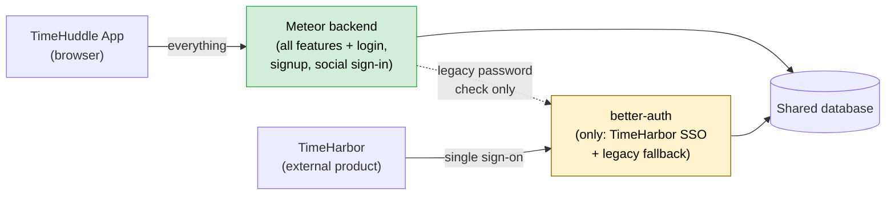

# TimeHuddle Backend Migration — Status Audit

**Date:** 2026-06-25
**Subject:** Progress moving the backend from Fastify to Meteor 3, and whether we can reach a 100% Meteor stack (i.e. retire better-auth).

---

## Executive summary

- The backend migration is **substantially complete**. Every major product domain — time tracking, tickets, teams, messaging, channels, organizations, profiles, and file uploads — now runs on Meteor and is what the app actually calls.
- **Authentication has largely moved to Meteor too** — login, signup, password reset, and Google/GitHub/Apple sign-in all run on Meteor today. (An earlier draft of this audit overstated better-auth's role; this version corrects it.)
- **A 100% Meteor stack is achievable.** There is **one** real blocker: an external product (**TimeHarbor**) currently uses TimeHuddle as its single sign-on login system, and that capability is provided by better-auth. That is the key decision point below — everything else is migration cleanup.

---

## The authentication question

**Is authentication "pure Meteor"?** — **Mostly yes, already.** The following all run on Meteor today, not better-auth:

- Email + password **login** (new accounts use Meteor's own password system)
- **Signup** and **password reset**
- **Social sign-in** — Google, GitHub, Apple
- API access tokens

better-auth is still involved in only a few places:

1. **TimeHarbor single sign-on (the real blocker).** TimeHarbor is a separate product that lets users log in _with their TimeHuddle account_. That "log in with TimeHuddle" capability is an industry-standard protocol (OIDC) that better-auth provides and Meteor's login system does not provide out of the box.
2. **A temporary fallback for older accounts.** Accounts created before the migration (and seed/test accounts) still have their password checked by better-auth on first login, after which they're moved onto Meteor automatically. This is migration scaffolding and goes away as accounts migrate.
3. **Authentik login** (an optional enterprise sign-in option) still routes through better-auth, but can be moved to Meteor the same way Google/GitHub already were.

**Is better-auth still needed?** — **Only because of #1, TimeHarbor SSO.** If not for that external dependency, better-auth could be fully retired after a small amount of cleanup. So the question isn't technical feasibility — it's a product decision about TimeHarbor (see below).

> **Bottom line for leadership:** We are close to a 100% Meteor stack. The single thing standing in the way is that another product (TimeHarbor) logs in through TimeHuddle. We need a decision on that before we can fully remove better-auth.

---

## The key decision: TimeHarbor single sign-on

This determines whether we can delete better-auth entirely.

| Option                                                        | What it means                                                                                                                        | Effort                    |
| ------------------------------------------------------------- | ------------------------------------------------------------------------------------------------------------------------------------ | ------------------------- |
| **A. TimeHarbor SSO must keep working**                       | We build the "log in with TimeHuddle" capability (OIDC provider) on the Meteor side, or keep a small dedicated login service for it. | Real work — needs scoping |
| **B. TimeHarbor moves its login elsewhere / doesn't need us** | better-auth can be fully retired after migrating the password fallback and Authentik.                                                | Cleanup only              |

**Status:** Open — needs a product owner to confirm whether TimeHarbor will continue to rely on TimeHuddle for login.

---

## Migration progress at a glance

| Area                                                           | Status                                           |
| -------------------------------------------------------------- | ------------------------------------------------ |
| Real-time infrastructure (replaces 7 custom WebSocket systems) | ✅ Done                                          |
| Time tracking — clock in/out, timers, shifts                   | ✅ Done                                          |
| Tickets                                                        | ✅ Done                                          |
| Notifications                                                  | ✅ Done                                          |
| Teams & team membership                                        | ✅ Done                                          |
| Messaging & channels                                           | ✅ Done                                          |
| Presence ("who's online")                                      | ✅ Done                                          |
| Activity log                                                   | ✅ Done                                          |
| Organizations, enterprises, profiles                           | ✅ Done                                          |
| Access tokens (API keys)                                       | ✅ Done                                          |
| File & image uploads                                           | ✅ Done                                          |
| Login / signup / password reset / social sign-in               | ✅ Done on Meteor                                |
| **Authentik sign-in**                                          | 🔁 Still via better-auth — portable to Meteor    |
| **Legacy/seed password fallback**                              | 🔁 Auto-migrates; remove once accounts move over |
| **TimeHarbor single sign-on (OIDC)**                           | ⚠️ Decision needed (see above)                   |
| **Remaining: retire old Fastify code paths**                   | 🔲 In progress                                   |
| **Remaining: news feed, resumable uploads, document uploads**  | 🔲 Not yet moved                                 |

---

## What's running where today

- **Green** = on Meteor.
- **Yellow** = better-auth, now reduced to TimeHarbor SSO + a temporary legacy fallback. Its future depends on the TimeHarbor decision above.

---

## What's left to reach 100% Meteor

1. **Decide TimeHarbor SSO** (Option A or B above) — the gating item.
2. **Move Authentik sign-in to Meteor** — same approach already used for Google/GitHub/Apple.
3. **Drain the legacy password fallback** — accounts migrate automatically on login; reseed test data through Meteor so nothing depends on better-auth for passwords.
4. **Retire the old Fastify code paths** that the app no longer calls (housekeeping, no user impact).
5. **Three product features still on the old stack:** news feed ("huddle"), resumable large-file uploads, and document/PDF uploads — port or schedule.

## Risk level

**Low-to-medium.** Both backends share one database and features moved incrementally, so there's no risky cutover moment. The only item with real unknowns is TimeHarbor SSO (Option A), and that's a scoping/product decision, not a technical wall.
