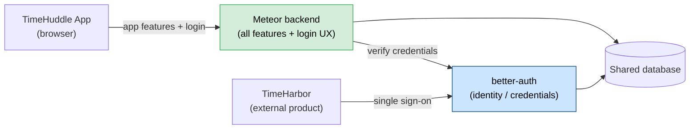

# TimeHuddle Backend Migration — Status Audit

**Date:** 2026-06-25
**Subject:** Progress moving the backend from Fastify to Meteor 3, and the current state of authentication.

---

## Executive summary

- The backend migration is **substantially complete**. Every major product domain — time tracking, tickets, teams, messaging, channels, organizations, profiles, and file uploads — now runs on Meteor and is what the app actually calls.
- We are running **two backends side by side on a shared database** by design. This is a deliberate, low-risk strategy: each feature was moved one at a time, with no "big bang" cutover. Nothing breaks while the move is in progress.
- The **remaining work is cleanup and a few stragglers**, not core functionality: deleting the old Fastify code paths that are no longer called, plus three smaller features (a news feed, resumable large-file uploads, and document uploads) that still live on the old stack.

---

## The authentication question

**Is authentication "pure Meteor"?** — **No, and intentionally so.**

Meteor now handles the **login experience** (sign in, sign up, forgot/reset password, staying logged in). But the **identity system itself — better-auth — is still in charge of credentials and remains a permanent part of the architecture.** Specifically:

- **Passwords** are still owned and verified by better-auth. When a user signs in, Meteor checks the credentials against better-auth behind the scenes.
- **Social sign-in** (Google, Apple, Authentik) runs entirely through better-auth.
- **better-auth is also our Identity Provider for other products.** TimeHarbor uses TimeHuddle as its login system — better-auth issues the secure tokens that both TimeHuddle's own Meteor backend and external products rely on.

**Is better-auth still needed?** — **Yes — permanently, by design.**

This was a settled architectural decision, not an oversight. better-auth is the single source of truth for *who a user is*; Meteor is responsible for *what a logged-in user can do*. This is a standard, secure separation (an "identity provider" plus a "resource server").

The long-term plan is to **slim better-auth down into a small, standalone identity service** rather than remove it. It stops being a full second backend and becomes a focused login service.

> **Bottom line for leadership:** Authentication is not, and will not be, "pure Meteor." better-auth stays as the dedicated identity/login service. This keeps single sign-on working for other products and follows security best practice. Meteor owns everything else.

---

## Migration progress at a glance

| Area | Status |
| --- | --- |
| Real-time infrastructure (replaces 7 custom WebSocket systems) | ✅ Done |
| Time tracking — clock in/out, timers, shifts | ✅ Done |
| Tickets | ✅ Done |
| Notifications | ✅ Done |
| Teams & team membership | ✅ Done |
| Messaging & channels | ✅ Done |
| Presence ("who's online") | ✅ Done |
| Activity log | ✅ Done |
| Organizations, enterprises, profiles | ✅ Done |
| Access tokens (API keys) | ✅ Done |
| File & image uploads | ✅ Done |
| Login / signup / password reset | ✅ Done (verifies against better-auth) |
| **Remaining: retire old Fastify code paths** | 🔲 In progress |
| **Remaining: news feed ("huddle")** | 🔲 Not yet moved |
| **Remaining: resumable large-file uploads** | 🔲 Not yet moved |
| **Remaining: document (PDF) uploads** | 🔲 Not yet moved |

---

## What's running where today

- **Green** = migrated to Meteor.
- **Blue** = better-auth, kept permanently as the dedicated identity service.

---

## What's left

1. **Retire the old code paths.** Many old Fastify routes still exist but are no longer called by the app. They stay until the last few read-only features that depend on them are moved, then get deleted. This is housekeeping — no user-facing impact.
2. **Three features still on the old stack:** the news feed ("huddle"), resumable large-file uploads, and document/PDF uploads. These need to be ported or formally scheduled.
3. **Final decommission.** Once the above is done, the old Fastify backend is reduced to just the slim identity service, and the migration is complete.

## Risk level

**Low.** Because both systems share one database and features were moved incrementally, there is no high-risk cutover moment. The biggest open decisions are *scheduling* the three remaining features, not technical unknowns.
