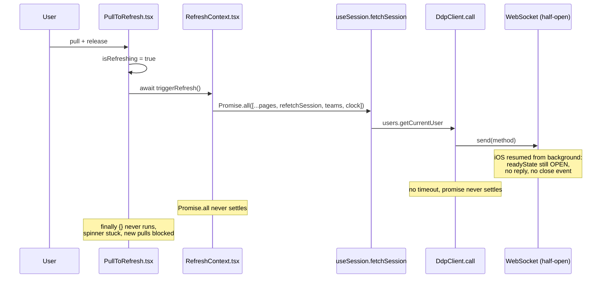

# Why the pull-to-refresh spinner used to stick

Reference for the next person who meets a hung refresh. The fix shipped in
[#619](https://github.com/mieweb/timehuddle/pull/619) for
[#599](https://github.com/mieweb/timehuddle/issues/599); the working plan and the
done checklist live in the issue, not here.

## The chain

On iOS, after the app has been backgrounded for a while, the DDP WebSocket goes
**half-open**: `readyState` stays `OPEN`, `send()` succeeds, but no reply and no
`close` event ever arrive. Every link below was unbounded, so one dead socket
stranded the whole refresh.

Each link is now bounded independently, so a regression in any one of them can't
bring the stuck spinner back on its own.

| Link                            | Bound                                                                        |
| ------------------------------- | ---------------------------------------------------------------------------- |
| `RefreshContext.triggerRefresh` | `Promise.allSettled` behind `REFRESH_TIMEOUT_MS` (10s); globals run detached |
| `DdpClient.call`                | `DDP_METHOD_TIMEOUT_MS` (8s), then `killSocket()` — never waits on `onclose` |
| `DdpClient.checkConnection`     | foreground ping, `DDP_PING_TIMEOUT_MS` (5s) for the pong, then reconnect     |
| `getAccessToken` (REST)         | shares `request()`'s 8s `AbortController`                                    |
| `PullToRefresh`                 | clears the spinner in `finally`, whatever the outcome                        |

## Two traps worth knowing about

**A transport failure is not a sign-out.** `getCurrentUser()` returns `null` only
when the server answers with no user — every error propagates, because
`SessionProvider` reads `null` as signed out. For the same reason
`tryResumeLogin` discards `meteor_resume_token` only on a `DdpServerError`: a
timeout there would otherwise be a real logout that survives a reload.

**A failed refresh must keep the screen.** There is no client data cache — the
data already rendered _is_ the fallback. A handler applies new data only once it
arrives, and lets the failure reach `triggerRefresh` so pull-to-refresh can show
"Couldn't refresh. Pull down to try again." A handler that swallows its own error
reports success and the toast never appears.

## Where the code is

| File                                                                                              | Role                                                                            |
| ------------------------------------------------------------------------------------------------- | ------------------------------------------------------------------------------- |
| [src/ui/PullToRefresh.tsx](../src/ui/PullToRefresh.tsx)                                           | Gesture, spinner, failure toast                                                 |
| [src/lib/RefreshContext.tsx](../src/lib/RefreshContext.tsx)                                       | `useRefresh` registry; `triggerRefresh` returns `'ok' \| 'failed' \| 'timeout'` |
| [src/lib/withTimeout.ts](../src/lib/withTimeout.ts)                                               | The one "race this promise against a timer" helper                              |
| [src/lib/ddp.ts](../src/lib/ddp.ts)                                                               | `call()` timeout, `killSocket()`, `checkConnection()`, `DdpServerError`         |
| [src/lib/useSession.tsx](../src/lib/useSession.tsx)                                               | Keeps the signed-in user when `getCurrentUser()` throws                         |
| [src/lib/api.ts](../src/lib/api.ts)                                                               | `getAccessToken()` / `request()` share one timeout constant                     |
| [src/main.tsx](../src/main.tsx)                                                                   | Capacitor `appStateChange` → `checkConnection()`                                |
| [tests/e2e/realtime/refresh-keeps-data.spec.ts](../tests/e2e/realtime/refresh-keeps-data.spec.ts) | A failed refresh keeps each page's content                                      |

> The backend is the Meteor server in `meteor-backend/` (DDP + REST on :3100),
> not the old Fastify service. Start the stack with `pm2 start ecosystem.config.cjs`.
