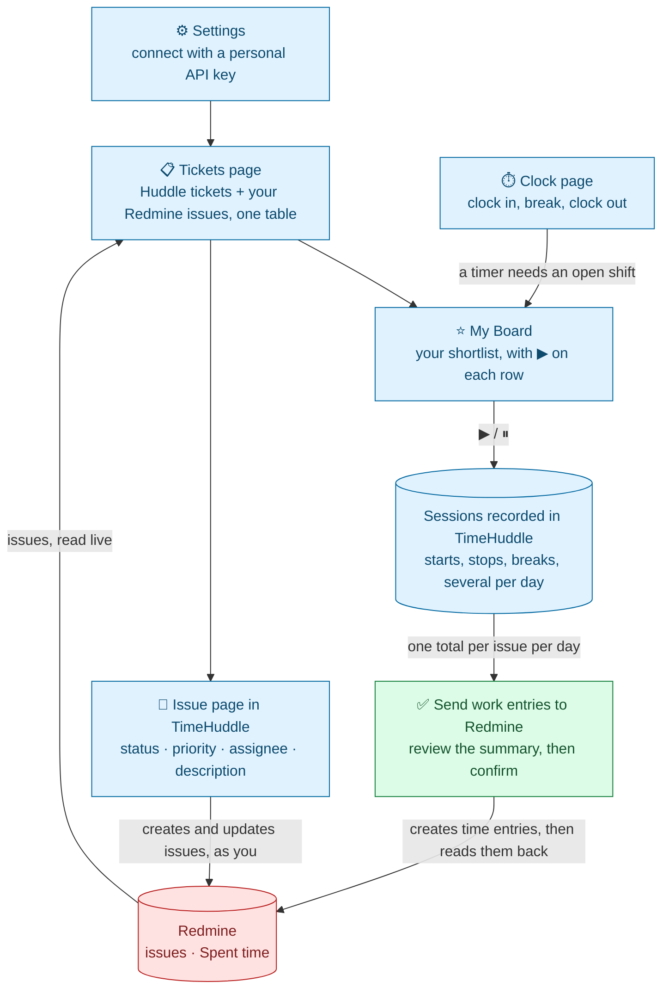

# TimeHuddle ↔ Redmine — MVP 1

## The goal

**You shouldn't have to open Redmine to do your day's work.** Connect your Redmine account once, and your Redmine issues appear in TimeHuddle alongside your Huddle tickets — to work on, to time, to create and to update. The hours you track are sent to Redmine as "Spent time" when you say so.

---

## What you can do

### 1. Connect your Redmine account

Settings → Redmine: paste your **personal Redmine API key**. TimeHuddle confirms who you are in Redmine and remembers the link. The key is encrypted and never sent back to the browser.

Everything below happens **as you**: TimeHuddle uses your own key, so Redmine applies your permissions and records you as the author of anything you change. There is no shared admin account.

### 2. See Redmine issues beside Huddle tickets

`/app/tickets` shows one table of your team's Huddle tickets and your Redmine issues. Source is a column and a filter, not a mode you switch into. Search, sorting, per-column filters and the Open/Closed switch all work across both.

### 3. Put work on My Board

Select the tickets and issues you plan to work on and move them to **My Board**, your personal shortlist. Each row there has a ▶ button.

### 4. Track time against a Redmine issue

Clock in, then press ▶ on a board row. Starts, stops, breaks and multiple sittings are all recorded in TimeHuddle. Breaks are excluded automatically, because a break closes the running session and resuming opens a new one.

Your sessions show up on the Work page, nested under the right shift in the Dashboard timesheet, and in the Activity section of the ticket's page.

**A ticket timer needs an open shift.** Clocking out (or the 8-hour auto clock-out) stops any running ticket timer, so nothing runs overnight by accident.

### 5. Send your time to Redmine

On the Clock page, once you're clocked out with no timer running, press **Send work entries to Redmine**. You get a summary first: one row per issue per day, the hours, and which Redmine activity each will be logged under (overridable per row). Nothing is sent until you confirm.

After each entry is created, TimeHuddle reads it back from Redmine to confirm the hours were stored as sent.

- Entries are **created, never edited or deleted** — logged time is permanent, and correcting it is an administrative act in Redmine.
- **Unsent time from earlier days is included**, so forgetting to send on Monday doesn't lose Monday.
- Pressing the button twice doesn't double-log; already-sent time is not offered again.
- Time logged in Redmine by hand is never touched, read, or double-counted.

### 6. Create and update Redmine issues

- **New Ticket** asks whether you want a TimeHuddle ticket or a Redmine issue. The Redmine form covers project, tracker, subject, description, assignee (defaults to you) and priority.
- Each Redmine issue has its **own page inside TimeHuddle**, with a link to the issue in Redmine. From it you can change **status, priority, assignee and description**.
- The status list only offers the changes your Redmine role and the project's workflow allow.
- If someone changed the issue in Redmine after you opened the page, your save is refused and you're offered a reload, so you can't quietly overwrite their edit. Only the fields you actually changed are sent.
- **Issues can't be deleted from TimeHuddle** — ask a Redmine project admin.

---

## How it flows

**The rule behind the picture:** TimeHuddle is the record of _how_ time was spent. Redmine's "Spent time" is a one-way daily summary of it, never an input. Detail — individual sessions, breaks, notes — stays in TimeHuddle; Redmine receives one number per issue per day.

---

## Two clocks, two numbers

TimeHuddle tracks time in two separate ways, and they are not meant to match:

|                   | What it measures                               | Where you see it                              | Sent to Redmine? |
| ----------------- | ---------------------------------------------- | --------------------------------------------- | ---------------- |
| **Shift clock**   | Your working day for a team, minus meal breaks | Clock page, Dashboard timesheet               | **No**           |
| **Ticket timers** | Time on one ticket or issue, per day           | Work page, ticket pages, Redmine's Spent time | **Yes**          |

You can be clocked in without any ticket timer running, so the shift total is usually larger. Only ticket timers reach Redmine.

---

## What you need

- A Redmine account with a **personal API key** (Redmine → My account → API access key).
- Permission to **log time** on the projects you track against. Without it, sending time fails with a clear message.
- To create or edit issues, the matching Redmine permissions (**Add issues** / **Edit issues**). Assigning an issue to someone else requires that their role can be assigned issues.
- Redmine 5.0 or newer, with the REST API enabled.
- Administrators: the Redmine instance is set per deployment via `REDMINE_BASE_URL`. Pointing at a different instance is a configuration change, not a code change.

---

## Not in this version

- **Tags and custom fields.** If a project requires a custom field, Redmine rejects the new issue and shows its own message.
- **Deleting issues, or editing and deleting logged time** from TimeHuddle.
- **Anything flowing back from Redmine into TimeHuddle's own data.** Redmine issues are read live each time; they are not stored in TimeHuddle's database, and there is no background sync.
- **Team-wide views of Redmine work.** A Redmine issue is private to the key that fetched it, so it stays out of team-level screens such as "who's working on what". Each person's Activity shows their own logged time.
- **Personal-workspace users** logging Redmine time, since a ticket timer requires a team shift.
- Redmine comments, attachments and issue relations.

---

## Status

Milestones 1–5 (connect, see issues, time them, send the time) are complete and in the integration branch. Milestone 6 (create and edit issues, issue pages) is built and under review.

Hours are kept to the minute, which is the finest figure Redmine stores. Entries from the very first test push (20–21 September) read up to a minute high; that was traced to how Redmine quantizes submitted hours and fixed on 22 September, so entries pushed since then match exactly.

## More detail

- [`huddle_redmine_clock.md`](../huddle_redmine_clock.md) — the milestone-by-milestone plan and the decisions behind it
- [`redmine-m3-ticket-timer-flow.md`](./redmine-m3-ticket-timer-flow.md) — how a ticket timer works
- [`redmine-m4-m5-time-sync-plan.md`](./redmine-m4-m5-time-sync-plan.md) — the hours calculation and the push to Redmine
- [`redmine-m6-issue-crud-plan.md`](./redmine-m6-issue-crud-plan.md) — creating and editing issues
