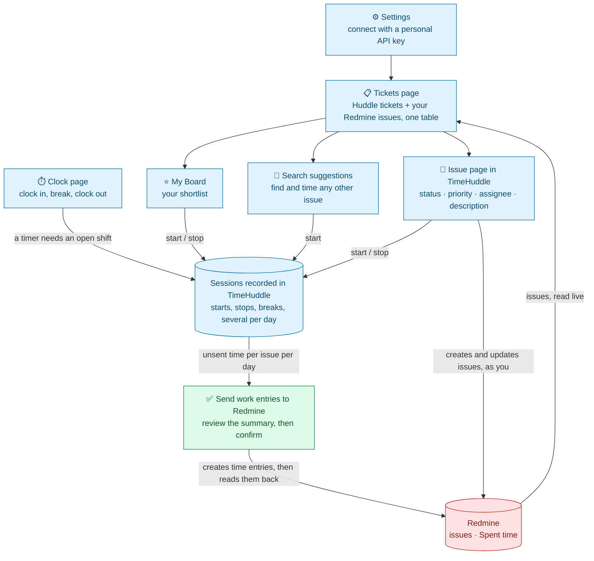

# TimeHuddle ↔ Redmine

## The goal

**You shouldn't have to open Redmine to do your day's work.** Connect your Redmine account once, and your Redmine issues appear in TimeHuddle alongside your Huddle tickets — to find, to work on, to time, to create and to update. The hours you track are sent to Redmine as "Spent time" when you say so.

This page is the overview: what the integration does and what it needs. The reasoning behind its rules is in [`redmine-design.md`](./redmine-design.md).

---

## What you can do

### 1. Connect your Redmine account

Settings → Redmine: paste your **personal Redmine API key**. TimeHuddle confirms who you are in Redmine and remembers the link. The key is encrypted and never sent back to the browser.

Everything below happens **as you**: TimeHuddle uses your own key, so Redmine applies your permissions and records you as the author of anything you change. There is no shared admin account.

### 2. See your Redmine issues beside Huddle tickets

`/app/tickets` shows one table of your team's Huddle tickets and **your** Redmine issues: the ones assigned to you, plus any other issue you have started a timer on. Source is a column and a filter, not a mode you switch into. Search, sorting, per-column filters and the Open/Closed switch all work across both.

### 3. Find any other issue from the search bar

Click into the Tickets search bar and suggestions open under it: your assigned issues plus the ones you logged time on, worked on recently or watch, each marked with why it is there. Typing filters the table as before and narrows the suggestions; after a pause, **More from Redmine** adds matching issues that are not in your table yet.

The search bar understands words from a title, **#1234**, a pasted Redmine link, and **@name** for what someone is working on.

From a suggestion you can open the issue, start a timer on it (**Shift+Enter**), or hide it. Hiding only removes the suggestion, for 15 days; **Settings → Redmine → Hidden suggestions** brings one back sooner.

### 4. Put work on My Board

Select the tickets and issues you plan to work on and move them to **My Board**, your personal shortlist. Anything on the board stays in your table, even after the issue is closed or reassigned.

### 5. Track time against a Redmine issue

Start a timer from a board row, a search suggestion, the Work page or the issue's own page. Starts, stops, breaks and multiple sittings are all recorded in TimeHuddle. Breaks are excluded automatically, because a break closes the running session and resuming opens a new one.

**A ticket timer needs an open shift.** If you are clocked out, TimeHuddle asks once, clocks you in (by way of the Clock page when your team requires a plan first) and then starts the timer you asked for. Clocking out, or the 8-hour auto clock-out, stops any running ticket timer, so nothing runs overnight by accident.

Your sessions show up on the Work page, nested under the right shift in the Dashboard timesheet, and in the Activity section of the issue's page.

### 6. Send your time to Redmine

On the Clock page, once you're clocked out with no timer running, press **Send work entries to Redmine**. You get a summary first: one row per issue per day, the hours, and which Redmine activity each will be logged under (overridable per row). Nothing is sent until you confirm.

After each entry is created, TimeHuddle reads it back from Redmine to confirm the hours were stored as sent.

- Entries are **created, never edited or deleted** — logged time is permanent, and correcting it is an administrative act in Redmine.
- **Unsent time from earlier days is included**, so forgetting to send on Monday doesn't lose Monday.
- Time you track on a day after sending it is offered again on its own, and goes to Redmine as a further entry.
- If Redmine refuses an entry, the dialog says why in Redmine's own words. **Never send** drops a row you don't want in Redmine; the time stays in TimeHuddle.
- Time logged in Redmine by hand is never changed or double-counted.

### 7. Create and update Redmine issues

- **New Ticket** asks whether you want a TimeHuddle ticket or a Redmine issue. The Redmine form covers project, tracker, subject, description, assignee (defaults to you) and priority.
- Each Redmine issue has its **own page inside TimeHuddle**, with a link to the issue in Redmine. From it you can change **status, priority, assignee and description**, and start or stop its timer.
- The status list only offers the changes your Redmine role and the project's workflow allow.
- If someone changed the issue in Redmine after you opened the page, your save is refused and you're offered a reload, so you can't quietly overwrite their edit. Only the fields you actually changed are sent.
- **Activity** shows the time people logged on the issue in Redmine, the issue's Redmine history, and your own TimeHuddle timers.
- **Attachments** (a link, or a video recorded with Pulse) are stored in TimeHuddle only. They are not added to the issue in Redmine.
- **Delete** removes a Redmine issue from your table and My Board. It never deletes anything in Redmine.

---

## How it flows

**The rule behind the picture:** TimeHuddle is the record of _how_ time was spent. Redmine's "Spent time" is a one-way summary of it, never an input. Detail — individual sessions, breaks, notes — stays in TimeHuddle; Redmine receives totals per issue per day.

---

## Two clocks, two numbers

TimeHuddle tracks time in two separate ways, and they are not meant to match:

|                   | What it measures                               | Where you see it                              | Sent to Redmine? |
| ----------------- | ---------------------------------------------- | --------------------------------------------- | ---------------- |
| **Shift clock**   | Your working day for a team, minus meal breaks | Clock page, Dashboard timesheet               | **No**           |
| **Ticket timers** | Time on one ticket or issue, per day           | Work page, ticket pages, Redmine's Spent time | **Yes**          |

You can be clocked in without any ticket timer running, so the shift total is usually larger. Only ticket timers reach Redmine.

---

## What you need

**As a user**

- A Redmine account with a **personal API key** (Redmine → My account → API access key).
- Permission to **log time** on the projects you track against. Without it, sending time fails with a clear message.
- To create or edit issues, the matching Redmine permissions (**Add issues** / **Edit issues**). Assigning an issue to someone else requires that their role can be assigned issues.

**As an administrator**

Redmine 5.0 or newer, with the REST API enabled, and these settings on the backend:

| Variable                          | Purpose                                                                                                         |
| --------------------------------- | --------------------------------------------------------------------------------------------------------------- |
| `REDMINE_BASE_URL`                | The Redmine instance every user connects to. Left empty, Redmine is simply unavailable — not an error.          |
| `REDMINE_ENCRYPTION_KEY`          | Secret used to encrypt each user's personal API key at rest.                                                    |
| `REDMINE_ENCRYPTION_KEY_PREVIOUS` | Set only while rotating `REDMINE_ENCRYPTION_KEY`, so existing keys can still be read and are re-encrypted.      |
| `REDMINE_ALLOWED_HOSTS`           | Extra hosts the server may send Redmine requests to in production. `REDMINE_BASE_URL`'s host is always allowed. |
| `REDMINE_ALLOW_CUSTOM_URL`        | Dev/test only: lets each user link a Redmine URL of their own. **Never enable in production.**                  |

---

## Not in this version

- **Tags and custom fields.** If a project requires a custom field, Redmine rejects the new issue and shows its own message.
- **Deleting issues in Redmine, or editing and deleting logged time** from TimeHuddle.
- **Anything flowing back from Redmine into TimeHuddle's own data.** Redmine issues are read live each time; their content is not stored in TimeHuddle's database, and there is no background sync.
- **Team-wide views of Redmine work.** A Redmine issue is only ever read through one person's key, so it stays out of team-level screens. An admin reading someone's timesheet sees an issue's title only if their own Redmine account can see it.
- **Personal-workspace users** logging Redmine time, since a ticket timer requires a team shift.
- Redmine comments, Redmine-side attachments and issue relations.
- **More than one Redmine instance.** Issue numbers are not tied to an instance, so a deployment is expected to keep one fixed `REDMINE_BASE_URL`.
