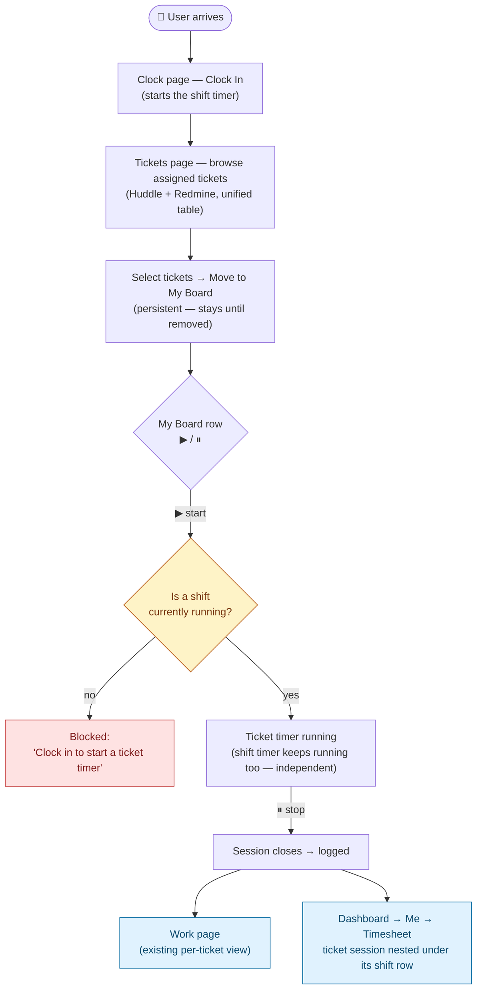

# Milestone 3 & 3.1 — Ticket Timer Flow (sub-plan)

Parent plan: [`huddle_redmine_clock.md`](../huddle_redmine_clock.md). This document exists
because M3 had three competing entry-point designs across the parent plan's revisions
(Clock page dropdown, ⋮ menu, My Board). This is the final flow — **My Board is the only
place a Redmine (or Huddle) ticket timer starts.** Everything here is scoped to _starting and
recording_ time in TimeHuddle. **Pushing the recorded time back to Redmine is out of scope for
this document and stays with Milestone 5**, unstarted, unchanged.

Covers two milestones: **M3** (start/stop a ticket timer from My Board, source-aware
`WorkItem`) and **M3.1** (nest those sessions into the Dashboard Timesheet) — split so M3's
core mechanics can ship without waiting on M3.1's heavier backend-join-plus-UI work.

> **Status: M3 and M3.1 are built.** Both checklists below are complete; every box records the
> file the work landed in. See [What shipped](#what-shipped) for the file-by-file summary,
> [How it was verified](#how-it-was-verified) for what was actually run, and
> [Known gaps](#known-gaps-carried-forward) for what this milestone deliberately did not close.

## The flow

**In words:** clock in → browse Tickets → move priorities to My Board (persistent, not
cleared daily) → start/stop ticket timers from My Board's ▶/⏸ → the shift timer and any
ticket timer run **concurrently and independently** → stopping a ticket timer logs it to the
Work page and to the Timesheet, nested under the shift session it happened during.

## Decisions locked by this document

- **D1 — Single start point.** My Board's ▶/⏸ is the only place a ticket timer _starts_. The
  Tickets-table ⋮ menu's "Start timer" item is **removed**, not just deprioritized — keeping
  two start points for the same action was the original M2.1/M2.2 design and is now
  superseded. The Work page's own ▶/⏸ (`startSession`/`stopSession` on an existing entry) and
  its "Add Entry" (retroactive manual entry) are **kept** — they fix or backfill an entry,
  they don't compete with My Board as a _starting_ action.
- **D2 — No Clock-page ticket picker.** Dropped entirely. The Clock page's only job stays
  Clock In/Out + Break/Resume; it never lists tickets.
- **D3 — A ticket timer requires an active shift.** `timers.createEntry` (and any
  Redmine-aware path added for it) must reject starting a ticket timer when the caller has no
  running `ClockEvent` (`ClockEvents.findOneAsync({ userId, endTime: null })` — source-agnostic,
  works the same for a Huddle team or a personal workspace). This is a **reversal** of this
  plan's earlier position ("ticket timer stays independent of the shift clock") — see
  "Why enforcement, and what it removes" below.
- **D4 — My Board is persistent, not a daily plan.** Confirmed as already built
  (`{userId, sourceId, ticketId, addedAt}`, no date). No schema change. Tickets stay on the
  board until the user removes them; nothing clears it automatically.
- **D5 — Concurrent, independent timers, no user-facing warning needed for switching.**
  Starting a second ticket timer while one is already running **auto-stops the first and
  starts the new one** — this is existing `closeRunningSession` behavior, already true for
  Huddle tickets today, and it needs no confirmation dialog. It is a _different_ thing from
  D3's shift gate: switching between two ticket timers is silent and immediate; starting a
  ticket timer with **no shift running** is a hard block with a message, because that's a
  state the user needs to fix (go clock in), not a state they're intentionally choosing.
- **D6 — Redmine sync stays out of scope for M3.** M3 only has to let a user start/stop a
  timer against a Redmine issue and have it recorded correctly in TimeHuddle. Nothing here
  changes M5 (push to Redmine's Spent time), which remains unstarted and untouched.

## Why enforcement, and what it removes

The parent plan originally argued _against_ requiring an active shift, reasoning that Redmine
users might not be on a Huddle team. That's still true for personal-workspace users, and it's
an accepted v1 gap (personal-workspace users can't log Redmine time in v1 — same category of
gap as the already-accepted `getTeamRunning`/`getUserWorkSummary` exclusions). Given that
trade-off, the shift-gate buys three things:

1. **It matches how ticket timers already worked before Redmine entered the picture** — this
   was the original design, not a new restriction being invented for Redmine's sake.
2. **It closes the runaway-timer risk for free.** The parent plan's "R3" flagged that a ticket
   timer with no shift attached has nothing to auto-stop it, risking a multi-day session that
   would eventually push a garbage total to Redmine (in M5). Once a ticket timer _requires_ an
   active shift, it inherits the shift's existing 8h auto-clockout
   (`shift-auto-clockout`/`shift-missed-clockout` in `agenda.js`) for free —
   **verified in code:** `closeAllForUser(userId, now)` closes every running `Timers` row
   filtered only by `userId`, with no `source` or `ticketId` filter, so it already closes a
   Redmine-sourced session the moment one exists. No new close-out mechanism needs to be built.
3. **It gives clock-out a reliable moment to stand on**, which matters for M5's future sync
   design even though M5 itself isn't being built now.

## Backend checklist (M3) — done

- [x] **Shift gate (D3).** `requireActiveShift(userId)` in `meteor-backend/server/timers.js`
      runs on both start paths (`timers.createEntry` with `startNow`, and
      `timers.startSession`) and throws a `no-active-shift` error reading
      "Clock in to start a ticket timer". It returns the shift's id, which is also what M3.1
      stamps on the session — one lookup serves both. Creating a `WorkItem` is deliberately
      _not_ gated; only opening a session is.
- [x] **Source-aware `WorkItem`/`timers.createEntry`.** All three blockers resolved in the new
      `meteor-backend/server/ticket-refs.js`, which is the single place that knows what a
      `{source, ticketId}` pair means:
  1. `resolveTicketRef(userId, source, ticketId)` branches on source — Huddle goes to
     `Tickets.findOneAsync`, Redmine to `getIssue` (new in `redmine-client.js`,
     `GET /issues/{id}.json`) using the caller's own key. A numeric id never reaches the
     ObjectId path.
  2. The team-membership check runs only for Huddle. For Redmine the key _is_ the
     authorization check — an issue the caller's key cannot see comes back 404 and reads as
     `not-found`.
  3. Lookup is now `{userId, ticketId, date, ...sourceSelector(source)}`, and new rows are
     written with an explicit `source`. `sourceSelector('huddle')` matches
     `{source: {$in: ['huddle', null]}}`, so every pre-M3 row keeps resolving with **no
     migration** — a missing `source` _is_ Huddle. No unique index was added: the plan's
     "uniqueness key" is the read-before-write lookup, and an index would newly break
     `timers.copyPrevious`, which can legitimately insert sibling rows.
- [x] **Title resolution.** `resolveTicketRef` returns `{title, url}` for one ref (throwing if
      it is unusable), and `resolveTicketRefs(userId, refs)` batches many into a
      `Map<'${source}:${id}', {title, url}>`. Redmine subjects come from one
      `listIssuesByIds` call (`issue_id=…&status_id=*`, so closed issues still resolve), not
      one request per row. `toPublicEntry` now emits `source`, `displayTitle` **and**
      `displayUrl`; nothing is persisted on the row (Core Model Data Discipline).
      Batch resolution is best-effort by design — an unreachable Redmine degrades a row to
      "#42 plus a working link" instead of failing the whole day view.
- [x] **Surfaces that must stay Huddle-only**, each with a one-line reason in code:
      `timers.getTeamRunning` and `timers.getUserWorkSummary` (both are shown to _teammates_,
      and a Redmine issue is private to its owner's key), `notifyTimesheetAdmins` (no Redmine
      team to notify), and retargeting in `timers.updateEntry` (the Work page's picker lists
      Huddle tickets; moving time onto another Redmine issue is an M5 sync concern).
      `timers.copyPrevious` carries `source` forward and includes it in its dedupe signature.
- [x] Timesheet grouping backend work — see M3.1 below.

**Also extracted while here (DRY, not new behaviour):** `redmine-account.js`
(`findRedmineApiKey` — one decrypt-at-read path, now shared by `redmine.issues.list` and
`ticket-refs.js`) and `optionalRedmineBaseUrl()` in `redmine-client.js`, which replaced two
private copies of the same try/catch.

## Frontend checklist (M3) — done

- [x] **My Board row ▶/⏸ wired.** `TicketTableRow` renders a live `TimerToggleButton` in the
      timer column, labelled `Start timer for {title}` / `Stop timer for {title}`.
      `TicketsPage.startTimerForTicket` passes `source: ticket.sourceId` through to
      `timers.createEntry`.
- [x] **Second start point removed (D1).** The ⋮ menu's "Start timer" item is gone, and
      `capabilities.trackTime` was deleted from `SourceCapabilities` entirely rather than left
      as a dead flag — with My Board as the one start point, every source is timeable and the
      capability had nothing left to gate. No "move to My Board" affordance was added to the
      menu; the tab is right there, and a second control that only points at the first one is
      the thing D1 is trying to avoid.
- [x] **Shift-gate messaging (D3).** Two layers, because `isClockedIn` can be stale (another
      tab clocked out, the 8h auto-clockout fired): the page still opens its existing
      "Clock In Required" modal when it _knows_ the user is clocked out, and
      `timerErrorMessage()` maps a rejected start onto a `role="status"` line above the board —
      `no-active-shift` → "Clock in to start a ticket timer.", `not-connected` → "Connect your
      Redmine account in Settings to time this issue.", `unreachable`/`invalid-key` → "Could
      not reach Redmine to start this timer."
- [x] **No new UI for D5.** Switching is still silent. Covered by a new
      `my-board.spec.ts` test that starts a second ticket's timer and asserts the first
      reverted to ▶ **and** that no `role="dialog"` appeared.
- [x] **Not-connected empty state on My Board.** A board row is identity-only, so it outlives
      the ticket it points at. `unresolvedBoardNotice` diffs board keys against the loaded
      tickets and, when the missing ones are Redmine and `redmine.status` says unconnected,
      says so specifically ("Connect your Redmine account in Settings to see N Redmine
      issues on your board"); otherwise it falls back to "N tickets … are no longer
      available." It renders both as a muted line above the table and as the empty state's
      description.

**Also source-aware, because they read the same `WorkItem`:** `useRunningTicket` now returns
`{key, source, id, title, url, sessionId}` (keyed by `${source}:${id}`, since Redmine `#42`
and a Huddle ticket are different rows); `ClockPage`'s running-ticket badge opens Redmine in a
new tab instead of routing to a dead `/app/tickets/42`; `WorkPage` labels Redmine rows, links
them out, and swaps the Huddle ticket picker for a read-only field when editing a
Redmine-sourced entry (retargeting is Huddle-only server-side, so offering the picker would
only produce a rejection).

## Explicit non-goals (still deferred)

- Pushing time to Redmine (`POST`/`PUT /time_entries.json`) — **Milestone 5**, unstarted.
- The `activity_id` resolution, `redmineTimeEntryId` idempotency key, and net-seconds
  computation — **Milestone 4**, unstarted, unaffected by this document.
- Any UI on the Clock page for picking a Redmine ticket — removed by D2, not deferred.
- **Timesheet nesting — split out to Milestone 3.1**, below. M3 is done once a timer can be
  started/stopped from My Board and shows up on the Work page; it does not require the
  Dashboard Timesheet to reflect it yet.

## Done when (M3)

A connected user can clock in, move a mix of Huddle and Redmine tickets to My Board, start and
stop timers on them from the board (including switching between them without a warning), and
see each session appear on the Work page — with **no ticket timer startable while clocked
out.**

---

# Milestone 3.1 — Nest ticket timers into the Dashboard Timesheet

Split out from M3 because it's a distinct, heavier piece of work (a backend join plus new
`TimesheetRow` UI) that shouldn't block My Board's core start/stop mechanics from shipping.
Depends on M3 — specifically on D3 (shift-gated ticket timers), which is what makes the
containment guarantee below hold.

**Verified in code — this does not exist today.** `ClockEvent` has no ticket field at all,
`clock.js`/`clock-core.js` never query `WorkItems`/`Timers`, and `TimesheetRow.tsx` has no
ticket-rendering path. The Dashboard's Me → Timesheet currently shows shift sessions only.

**Design, made possible by M3's D3:** because a ticket timer can only exist while a shift is
running, and `clock.stop`/auto-clockout always call `closeAllForUser` before closing the
shift, every ticket-timer `Timers` session is guaranteed to start and end within its
containing shift's `[startTime, endTime]` window — including the case of two separate shifts
in one calendar day.

- [x] **`clockEventId` stored on each `Timers` session at creation**, on the session and not
      the `WorkItem`, as specified. Both `timers.createEntry` and `timers.startSession` get it
      from the same `requireActiveShift` call that enforces D3 — the gate and the stamp are
      one lookup. `restartTimerForWorkItem` (break resume) takes it as a parameter from
      `clock.resume`, so a session split by a break stays attached to its shift.
- [x] **Backend join.** `ticketSessionsForClockEvents(userId, clockEventIds)` in
      `timer-core.js` fetches sessions by `clockEventId`, joins their `WorkItem`, and resolves
      titles through M3's `resolveTicketRefs`. `clock.timesheet` attaches the result to each
      shift as `ticketSessions` — always an array, empty when there were none.
- [x] **Frontend.** `TimesheetRow` renders a chevron disclosure on the shift's first segment
      (`aria-expanded` + `aria-controls`, labelled "Show N ticket timers for this shift"),
      and expands into one indented row per session: title as a link (in-app for Huddle,
      `target="_blank"` for Redmine), start, stop, duration, source badge. A shift with no
      ticket sessions renders no chevron and no sub-rows — byte-identical to before.
- [x] Work page unaffected as predicted; it still lists by ticket and stays the per-ticket
      view. (It did change for M3 — source labels and external links — but not for M3.1.)

**Done when (M3.1):** met. Verified end-to-end: two ticket sessions started inside one shift
come back nested under that shift from `clock.timesheet` with title, url and source, and a
second shift with no ticket timers comes back with `ticketSessions: []` and renders unchanged.

---

## What shipped

| Area                                                                                                    | Files                                                                                        |
| ------------------------------------------------------------------------------------------------------- | -------------------------------------------------------------------------------------------- |
| New — source-aware ticket refs                                                                          | `meteor-backend/server/ticket-refs.js`                                                       |
| New — shared Redmine credential access                                                                  | `meteor-backend/server/redmine-account.js`                                                   |
| Redmine client (`getIssue`, `listIssuesByIds`, `optionalRedmineBaseUrl`)                                | `meteor-backend/server/redmine-client.js`, `redmine.js`                                      |
| Shift gate, source-aware entries, `clockEventId`                                                        | `meteor-backend/server/timers.js`                                                            |
| Break-resume stamp + timesheet join                                                                     | `meteor-backend/server/timer-core.js`, `clock.js`                                            |
| API shapes (`TicketSourceId`, `WorkItem.source/displayUrl`, `Timer.clockEventId`, `ShiftTicketSession`) | `src/lib/api.ts`                                                                             |
| My Board ▶/⏸, D1 removal, gate messaging, board notices                                                 | `src/features/tickets/TicketsPage.tsx`, `TicketTable.tsx`, `TicketTableRow.tsx`, `sources/*` |
| Source-aware running ticket                                                                             | `src/lib/useRunningTicket.ts`, `src/features/clock/ClockPage.tsx`                            |
| Work page source handling                                                                               | `src/features/timers/WorkPage.tsx`                                                           |
| Timesheet nesting (M3.1)                                                                                | `src/features/clock/TimesheetRow.tsx`                                                        |

## How it was verified

- **`npm run typecheck`, `npm run lint`, `npm run format`** — all clean.
- **`npm run test:unit`** — 188 passed, including new `TimesheetRow` cases for the collapsed
  default, the expanded sub-list, and Huddle-vs-Redmine link targets.
- **Backend smoke test against the running stack** — 18/18 checks: the D3 block while clocked
  out, `WorkItem` creation _not_ being gated, start succeeding with a shift, the session
  carrying the right `clockEventId`, D5's silent auto-stop leaving exactly one timer running,
  a Redmine id taking the Redmine path, an unknown source rejected, `getDay` returning
  resolved display fields, clock-out closing every ticket timer, M3.1 nesting two sessions
  under their shift, and a bare shift coming back with an empty array.
- **Playwright** — the three affected specs (`my-board`, `unified-table`,
  `timer-deduplication`) run green against an isolated Meteor backend on `:3101`. One
  unrelated test (`bulk deletes selected tickets`) flakes under sequence and passes in
  isolation; the suite's default `retries: 2` covers it.
- **Not run:** the full `npm run test:all` sweep.

Two pre-existing e2e problems surfaced and were fixed while updating these specs, because
`TicketsPage` stays mounted (hidden) on every route and both its tab panels are force-mounted:
`rowByTitle`/`rowsFromSource`/`getTicketCount` now scope to the visible tab panel, and the Work
page's day table got an `aria-label` so a spec can target it instead of a bare `tbody tr`.

## Known gaps carried forward

- **The Redmine happy path is unexercised end to end.** No test account has a linked Redmine
  instance, so the smoke test proves the _routing_ (a numeric id goes down the Redmine branch
  and stops at the connection check) but not a real start/stop against a live issue. Worth a
  manual pass with a linked account before calling M3 closed.
- **Personal-workspace users still cannot log Redmine time** — the accepted v1 consequence of
  D3, unchanged.
- **M4 and M5 are untouched**, exactly as this document scoped them.
