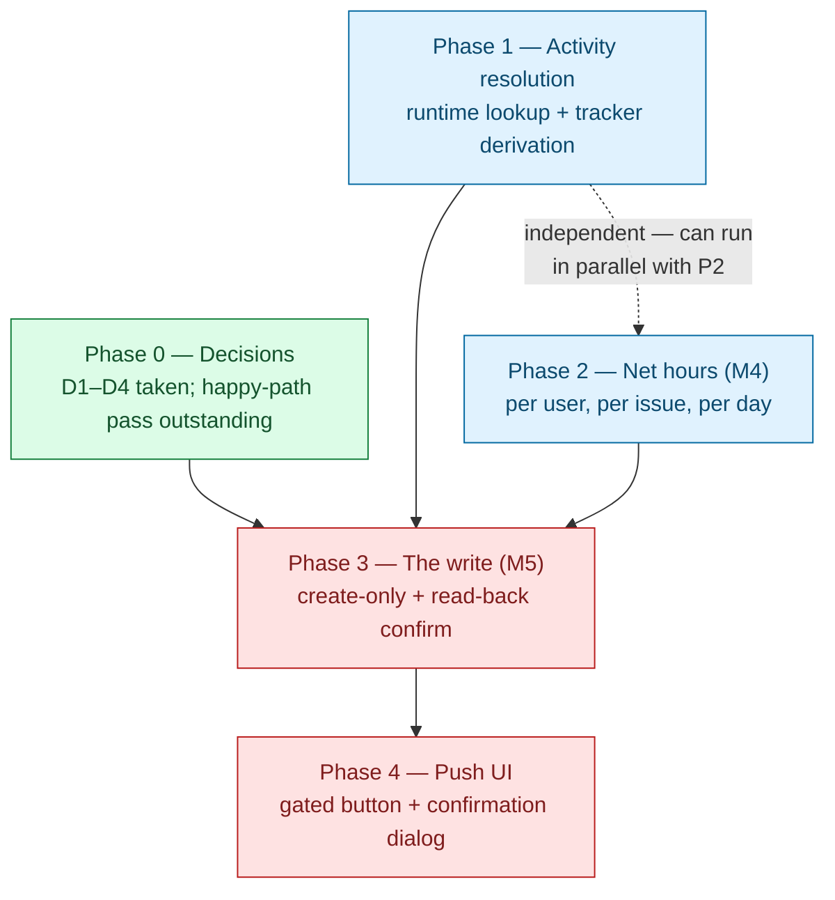
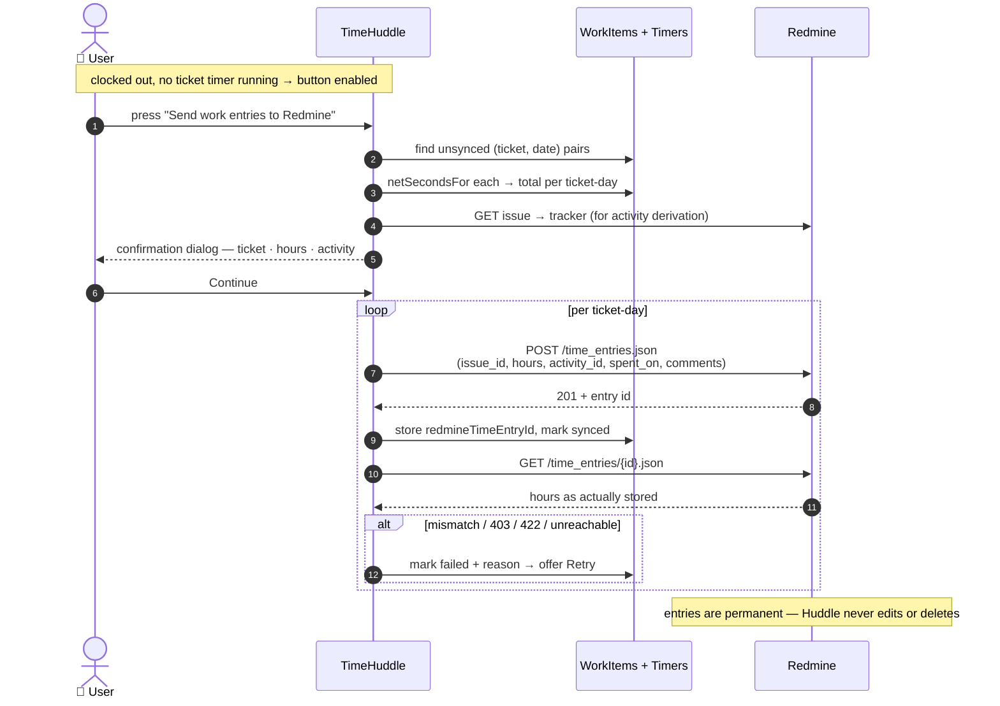

# Milestones 4 & 5 — Net hours and the push to Redmine (sub-plan)

Parent plan: [`huddle_redmine_clock.md`](../huddle_redmine_clock.md).
Predecessor: [`redmine-m3-ticket-timer-flow.md`](./redmine-m3-ticket-timer-flow.md) (M3/M3.1, shipped).

M3 made it possible to _record_ time against a Redmine issue inside TimeHuddle. This document
covers the remaining half of the original goal — **turning those recorded sessions into exactly
one Redmine "Spent time" entry per issue per day**, pushed **manually, on the user's explicit
confirmation**, and **never modified afterwards.**

> **Status: Phase 0 decided; Phases 1–4 built and verified end-to-end (2026-09-21).**
> Redmine issues appear in Huddle, a timer runs against them, and on clock-out the confirmed
> totals reach Redmine — four entries created against `redmine0` (ids 77–80), each with the right
> issue, date, activity and `Logged by TimeHuddle` comment. `log_time` is confirmed working by
> the fact the pushes succeeded.
>
> **⚠️ One open defect: the hours rounding disagrees with Redmine's** — see "Open defect" below.
> M5 is not done until it is fixed.

## The four decisions that shape this plan

Taken 2026-09-20. They replace several positions the earlier draft of this document argued for,
and the superseded reasoning is preserved inline wherever it was reversed.

| #      | Decision                                                                                                                                                                                             | Consequence                                                                                                                                          |
| ------ | ---------------------------------------------------------------------------------------------------------------------------------------------------------------------------------------------------- | ---------------------------------------------------------------------------------------------------------------------------------------------------- |
| **D1** | **Create-only. No edit, no delete, ever.** Once a time entry is logged it is permanent; changing it is an administrative act in Redmine, not something Huddle offers.                                | Phase 3 loses its entire `PUT` path, `403` handling and `404`-recreate branch. `edit_own_time_entries` is **not wanted** and is no longer a blocker. |
| **D2** | **The push is manual and confirmed.** Huddle holds all time locally; the user presses a button when their day is done and approves a summary before anything is sent.                                | Solves "when is the day final?" — the user answers it. Replaces the automatic on-session-close trigger (R1).                                         |
| **D3** | **`redmine0.os.mieweb.org` is the write target.** It is the user's own instance on the MIE web container, safe to write to. The company's real instance comes later, as a `REDMINE_BASE_URL` change. | Phase 0's "find a write-safe target" is resolved. No scratch project or shared-infrastructure negotiation needed.                                    |
| **D4** | **The activity is derived from the issue's Redmine tracker**, falling back to the user's default.                                                                                                    | Keeps the choice inside Redmine's own data. See Phase 1 for the wrinkle this hits on the current instance.                                           |

**Scope guardrail, confirmed:** this integration makes **no structural change to Redmine**. The
only write it ever performs is `POST /time_entries.json`. Trackers, statuses, workflows, custom
fields, roles, projects and issue data are all read-only or untouched.

## TL;DR — deliverables checklist

Every box below is expanded, with its reasoning, in the phase section of the same name.

**Phase 0 — Decisions (resolved)** — recorded in
[`redmine-m4-m5-phase0-answers.md`](./redmine-m4-m5-phase0-answers.md)

- [x] ~~Confirm `edit_own_time_entries`~~ → **not wanted** (D1); `log_time` is the only Redmine permission required
- [x] ~~Designate a write-safe target~~ → **redmine0 is the user's own instance** (D3)
- [x] Manual happy-path pass: clock in → start a real Redmine ticket → switch → break → stop → clock out

**Phase 1 — Activity resolution (M4)**

- [x] `redmine-client.listTimeEntryActivities(apiKey)`
- [x] Resolve the activity id at runtime — never hardcode
- [x] Cache the activity list per user/process with a TTL
- [x] Persist per-user default activity on `redmine_links`, with fallback (`is_default` → `Development` → first)
- [x] Settings UI: `Select` from `@mieweb/ui`, labelled (English literals — no i18n layer exists)
- [x] Handle the zero-activities case in Settings, not at first sync
- [x] **Tracker → activity derivation (D4)**, resolved by _name_ against the live enumeration
- [x] Surface the resolved activity **and the reason it was chosen** before anything is sent
      — landed in Phase 4's confirmation dialog, where it is also overridable per row

**Phase 2 — Net hours per issue per day (M4)**

- [x] New `netSecondsFor(userId, source, ticketId, date)` in `timer-core.js` (do not extend `getTicketTotal`)
- [ ] Separately, add a `userId` scope / membership check to `timers.getTicketTotal` — **its own PR**
- [x] Sum closed sessions only (`endTime: { $ne: null }`)
- [x] Unit tests: merged sessions, break-split pair, two shifts in one day, running session, empty day
- [x] ~~Add `redmineTimeEntryId` to `WorkItem`~~ → a `redmine_time_syncs` collection instead; the
      WorkItem grain claim was false (see Phase 2 → Idempotency key)
- [x] Store sync state: last synced hours, last attempt time, failure reason
- [x] **The `{userId, ticketId, date}` unique index survives D2 unchanged** — a manual push grouped
      per ticket per day is exactly that grain

**Phase 3 — The write (M5)**

- [x] `redmine-client.createTimeEntry` — **the only write method.** No update, no delete
- [x] `redmine.timeEntries.preview` — the grouped totals the confirmation dialog renders
- [x] `redmine.timeEntries.push` — create, read back, record per-entry state
- [x] Gate the push on **idle**: clocked out and no ticket timer running — re-checked server-side,
      not just in the button's `disabled`
- [x] Include **all unsynced** Redmine time, not just today
- [x] ~~Send full-precision decimal hours~~ → **round once, to 2dp** (see Phase 3 → Rounding)
- [x] Re-read after every write and compare
- [x] Per-entry failure state; retry re-POSTs only where no entry id is stored
- [x] Never push shift totals; per-ticket System B totals only
- [x] **Hours are never taken from the client** — `push` recomputes them from the timer sessions

**Phase 4 — The push UI (M5)**

- [x] "Send work entries to Redmine" button, enabled only when idle
- [x] Confirmation `Modal` + `Table`: ticket → hours → activity, with the activity overridable
- [x] Per-entry result, with `aria-live="polite"` — a failed row stays eligible, so re-opening the
      dialog is the retry; no separate Retry control was needed
- [x] State the permanence rule in the dialog and in the Redmine `comments`
- [x] Never co-mingle Shift and Ticket-timer totals — label them distinctly
- [x] User-facing strings: English literals; i18n deferred until an i18n layer exists
- [x] Blocked rows are **shown with the reason**, not hidden — a silently shorter list than the
      user's day is worse than an explained omission

**Verification gates (before hand-off)**

- [ ] `npm run test:all` — `test:unit` + Playwright (does **not** run backend tests)
- [ ] `cd meteor-backend && npm run test:integration` — the backend suite
- [ ] `npm run lint && npm run typecheck`
- [ ] `npm run format`
- [ ] Unit tests for the hours math
- [ ] Browser smoke at `http://localhost:3000`
- [ ] Manual e2e against redmine0: connect → timer → break → stop → clock out → push → one entry per ticket

**Also outstanding from M2.1 (unrelated to sync, still open)**

- [ ] `tests/e2e/realtime/ticket-timers.spec.ts` self-skips — make it clock in and open My Board
- [ ] Remove the unreachable ticket-details modal in `TicketsPage.tsx`

---

## The one-line rule this all serves

> **TimeHuddle is the system of record for _how_ time was spent. Redmine's "Spent time" is a
> derived, one-way daily projection of it — never an input.**

Everything below is downstream of that. Detail (sessions, breaks, notes) stays in TimeHuddle;
Redmine receives one rolled-up number per issue per day, on the user's confirmation, and nothing
else.

**A consequence of D1 worth stating plainly:** because Huddle only ever _creates_ entries, any
time already logged in Redmine by hand is invisible to this integration. If issue #1 carries 3h
logged before the integration existed, Huddle never reads it, never reconciles it and never
overwrites it — it simply adds its own rows alongside. Double-counting is structurally
impossible.

---

## Flow of action



**Why this order.** Phases 1 and 2 are pure TimeHuddle work with no external dependency and no
blast radius. Phase 3 is the first step that writes anything to Redmine, and although D1 makes
each write far less dangerous than the original upsert design — nothing is ever overwritten —
an entry still cannot be taken back once created, so it stays last.

> **Superseded:** the earlier draft made Phase 0 an external blocker gating Phase 3, on the
> grounds that a `403` on `PUT` would collapse the design. D1 removes `PUT` entirely, so that
> gate no longer exists.

---

## Phase 0 — Decisions (resolved)

> Recorded in [`redmine-m4-m5-phase0-answers.md`](./redmine-m4-m5-phase0-answers.md).

- [x] **`edit_own_time_entries` is not wanted (D1).** The earlier draft treated obtaining this
      permission as a hard prerequisite, because the strategy was "POST once, then PUT as the
      day's total grows". That strategy is gone. Users should not be able to alter logged time
      from Huddle any more than they can from Redmine. **`log_time` remains required** — it is
      what permits creating an entry at all, and without it every push fails.
- [x] **redmine0 is the write target (D3).** It belongs to the user, runs on the MIE web
      container, and is safe to write to. The earlier concern — that `REDMINE_BASE_URL` pointed
      at a shared instance where the first `POST` would land in other people's data — does not
      apply to it. Moving to the company instance later is a configuration change, not a code
      change, and should happen only once the whole flow is proven here.
- [ ] **Manual happy-path pass — still outstanding, now unblocked.** A Redmine account _is_
      linked (`priya.patel`, since 2026-09-11) and five `source: 'redmine'` work items exist for
      2026-09-19 — but **all five carry zero timer sessions**, so the real start/stop cycle has
      never run. Phase 2's math is built on sessions the UI has never actually produced.
      Steps: clock in → My Board → start a real Redmine issue's timer → switch tickets → break →
      resume → stop → clock out. Then confirm in Mongo: one work item per ticket-day, closed
      sessions with break time absent, and `netSecondsFor` totals matching a hand calculation.

---

## Phase 1 — Activity resolution (M4)

Redmine will not accept a time entry without an activity, and **the target instance has no
default one.**

**Verified against redmine0 (2026-09-20):**

| Trackers                                | Activities                      |
| --------------------------------------- | ------------------------------- |
| `Bug` (1), `Feature` (2), `Support` (3) | `Design` (8), `Development` (9) |

Neither activity is `is_default: true`, so omitting `activity_id` fails with
`422 Activity cannot be blank` on _every_ POST. This is a hard requirement, not a nicety.

### ⚠️ The wrinkle in D4, recorded honestly

Deriving the activity from the tracker is architecturally right — it needs no user input, and
`tracker` is **already mapped** into the issue DTO at zero cost
(`redmine-issues.js` → `toIssue`). But on this instance the two vocabularies answer different
questions. A **tracker** says _what kind of issue this is_; an **activity** says _what kind of
work you did on it_. You can do design work on a `Bug`. All three of redmine0's trackers are
engineering categories, so a tracker→activity map collapses to **"always Development"** and
`Design` would never be selected.

D4 is still worth implementing, for three reasons: the mapping lives in config, so it becomes
meaningful the moment a `Design`-like tracker is added; it requires nothing of the user; and it
degrades to a sensible default rather than a wrong one. But it must not be the _only_ input —
hence the override in Phase 4's dialog.

- [x] `redmine-client.listTimeEntryActivities(apiKey)` →
      `GET /enumerations/time_entry_activities.json`. Enumerable with an ordinary personal key.
- [x] **Resolve the id at runtime. Never hardcode `9`.** Enumeration ids are instance-specific and
      an admin can renumber them; a hardcoded id silently logs under the wrong activity.
- [x] Cache the list per user with a TTL — it changes approximately never.
- [x] Persist a per-user **default activity** on the existing `redmine_links` row.
- [x] Settings UI: a `Select` from `@mieweb/ui`, labelled and `aria-label`led.
- [x] Handle the zero-activities case in Settings, not at first sync.
- [x] **Tracker derivation added to the fallback chain.** `pickDefaultActivity` already returned a
      named `reason`; `tracker` joins it, backed by a `TRACKER_ACTIVITY` map keyed and resolved
      **by name** on both sides — never by id. Final order:
      **user's chosen default → tracker map → `is_default` → named `Development` → first.**

  > **⚠️ Ordering reversed during implementation.** This bullet first specified
  > _tracker → chosen default_, putting the inference above the user's explicit setting. That is
  > wrong on this instance: `TRACKER_ACTIVITY` is degenerate (every tracker → `Development`), so
  > tracker-first would swallow the Settings choice entirely — a designer who picked `Design`
  > would still log `Development` on every issue, and the Phase 1 `Select` would be dead weight.
  > A deliberate choice beats an inference; the tracker is the smart default for a user who has
  > not made one. The per-row override in Phase 4's dialog remains the final say either way.

- [ ] **Surface the resolved activity and its reason** wherever the user can still change it.
      Under D1 a wrong activity is permanent, so it must never be chosen silently.

---

## Phase 2 — Net hours per issue per day (M4)

The arithmetic TimeHuddle must get right _before_ anything is sent anywhere. **D2 makes this
phase more load-bearing, not less** — the per-(user, ticket, day) total is exactly what the
confirmation dialog displays and what the push sends.

### The correctness rule, restated because it is easy to get backwards

**Nothing is subtracted in System B.** Breaks are excluded **structurally**: `clock.pause`
closes the running session and `clock.resume` opens a new one, so break time never appears in
any session in the first place. The subtract-deducted-breaks model
(`accumulatedTime = span − deducted`) belongs to **System A (the shift clock) only**. Applying
it to System B would **double-count the break as a deduction** against time that never included
it. The net total is a plain sum of closed session durations. Nothing more.

### ⚠️ Blocker found while auditing — `timers.getTicketTotal` cannot be reused as-is

The parent plan's M4 bullet says "reuse `timers.getTicketTotal`". **It is not fit for this
purpose**, on three counts (`meteor-backend/server/timers.js:296`):

```js
async 'timers.getTicketTotal'({ ticketId, source } = {}) {
  await requireIdentity(this);
  const entryIds = (await WorkItems.find(
    { ticketId, ...sourceSelector(normalizeSource(source)) },   // ← no userId, no date
    …
```

1. **No `userId` filter** — it sums every user's WorkItems for that ticket. For a push keyed on
   the caller's personal API key, that would send _other people's hours_ under the caller's name.
2. **No `date` filter** — it sums all time ever, across every day.
3. It is also a **pre-existing authorization gap** independent of this milestone: any
   authenticated caller can read the total for any ticket id, including one on a team they do
   not belong to. Worth fixing on its own merits.

- [x] **Do not extend `getTicketTotal` in place.** `netSecondsFor(userId, source, ticketId, date)`
      in `timer-core.js` answers the different question the push actually asks.
- [ ] **Separately**, tighten `timers.getTicketTotal` with a `userId` scope or membership check.
      Small, independently mergeable, and it closes count 3 above. **Its own PR.**
- [x] Sum **closed sessions only** (`endTime: { $ne: null }`) — a running session has no final
      duration and must not be projected to Redmine mid-flight.
- [x] Unit-test the math explicitly: multiple sessions merged; a break-split pair summing to the
      un-broken equivalent; two separate shifts in one calendar day; a day with a still-running
      session; the empty day.

### Idempotency key

> **⚠️ Corrected — this section originally said to hang `redmineTimeEntryId` off the `WorkItem`
> row, "which is already exactly one per user + source + ticket + date". **That is false.**
> `timers.copyPrevious` dedupes on a signature including `note` and `sortOrder`
> (`timers.js:508`), so sibling rows for the same tuple legitimately exist, and M3 deliberately
> added no unique index for exactly that reason. Two siblings would each carry their own entry
> id and produce two Redmine entries for one issue-day — the single invariant M5 is judged on.
> Demonstrated by `meteor-backend/tests/redmine-time-sync.test.ts`.

- [x] **`redmine_time_syncs`**, keyed `{userId, ticketId, date}` with a real unique index — the
      grain `WorkItems` cannot guarantee. `source` is stored for legibility but left out of the
      key: Huddle ticket ids are 24-hex ObjectIds and Redmine ids are short decimals.
- [x] Hold `redmineTimeEntryId` there, with last synced hours, last attempt time, and the failure
      reason. Phase 3 is its first writer.
- [x] **D2 changes nothing here.** A manual push grouped per ticket per day _is_ this grain. Had
      the design instead written one entry per timer session, this index would have had to be
      re-keyed to the session id — it does not.
- [x] **Core Model Data Discipline check:** `redmineTimeEntryId` is canonical business data — the
      remote system's identity for this record, and losing it produces duplicates. It is **not** a
      display-only fallback, so persisting it is correct. Resolved titles and urls stay out.

---

## Phase 3 — The write (M5)

The first and only code that writes to Redmine. **Create-only (D1), manual (D2).**



- [ ] **`redmine-client.createTimeEntry`** — `POST /time_entries.json` with `issue_id`, `hours`,
      `activity_id`, `spent_on`, `comments`, using the **caller's own personal key** so
      authorship is correct. **This is the only write method in the file.** `updateTimeEntry` and
      any delete helper are deliberately _not_ written — under D1 they would be dead code that
      invites misuse.
- [ ] **`redmine.timeEntries.preview`** — returns the grouped, unsynced totals plus the activity
      each would use and the reason it was picked. Pure read; safe to call whenever the dialog opens.
- [ ] **`redmine.timeEntries.push`** — takes the confirmed list (with any activity overrides),
      creates each entry, reads it back, and records per-entry state.
- [ ] **Gate on idle.** The push is only offered when the user is clocked out and no ticket timer
      is running. A running session has no final duration; pushing mid-flight would log a partial
      total that D1 makes permanent.
- [ ] **Include all unsynced time, not just today.** If a user forgets to push on Monday,
      Tuesday's dialog must still offer Monday's hours rather than silently losing them. Redmine
      entries carry `spent_on`, so each date is its own entry; group by ticket and show the date
      whenever more than one is in play.
- [x] **Rounding: two decimal places, applied exactly once** on the already-summed seconds for a
      whole ticket-day (`toHours` in `redmine-time-entries.js`).

  > **⚠️ Reversed during implementation.** This bullet first said "send full-precision decimal
  > hours, do not pre-round". That breaks the read-back check directly above it: sending
  > `0.505555…` and comparing against whatever Redmine echoes back invites a spurious mismatch on
  > every entry. Two places is Redmine's own display granularity, so the number in the
  > confirmation dialog, the number stored, and the number compared are all the same one.
  >
  > What the original bullet was _right_ about is preserved: rounding happens **once, on the
  > summed seconds**, never per session. Three 20-minute sessions round to `1.00h`, not
  > `0.33 × 3 = 0.99h` — there is a unit test pinning exactly that.
  >
  > The cost is up to 18 seconds lost per ticket-day, and a consequence worth naming: a ticket-day
  > under 18 seconds rounds to `0.00h`, which Redmine rejects outright. Those rows are **withheld
  > with a `too-short` reason** rather than sent and failed.

- [ ] **Re-read after every write and compare.** Redmine can return success while storing
      something else; the parent plan's cross-cutting DoD requires confirmation-by-read.
- [ ] **Per-entry failure state.** A push of three entries where the second fails leaves the other
      two synced. Retry re-POSTs **only** rows with no stored entry id — that, plus the unique
      index, is what makes pressing the button twice harmless.
- [ ] **Name the failure modes.** `403` → the role lacks `log_time`. `422` → the activity was
      rejected (see Phase 1). Network/timeout → retryable. Each should say which it is rather
      than surfacing as a generic failure.
- [ ] **Never push the shift total.** Only per-ticket System B totals. A `ClockEvent` has no issue
      to attach to and its total is a different number by design.

> **Superseded by D1/D2:** the earlier draft specified `updateTimeEntry`, an upsert-by-stored-id
> strategy, a trigger on every session close (R1), `403`-on-`PUT` handling for the missing
> `edit_own_time_entries` permission, and `404`-on-`PUT` recreation. None of these survive
> create-only, manual push.

---

## Phase 4 — The push UI (M5)

- [ ] **"Send work entries to Redmine" button**, `Button` from `@mieweb/ui`, **enabled only when
      idle** (clocked out, no ticket timer running) and when there is unsynced Redmine time.
      Disabled otherwise, with a tooltip saying why. Lives on the Clock page, where clocking out
      already happens — that is where "I'm done for the day" is the natural next action.
- [ ] **Confirmation dialog** — `Modal` + `Table` from `@mieweb/ui`. One row per ticket-day:
      issue id and subject, the accumulated hours, and the activity that will be used. The date
      column appears only when more than one date is in the push. Worked example, matching the
      motivating case: ticket #1 worked twice (20 min + 30 min) shows as a single **0:50** row;
      a ticket worked 3h straight shows as **3:00**.
- [ ] **The activity is overridable per row** before Continue, defaulting to the tracker-derived
      value. This is the safety valve for D4's wrinkle and for D1's permanence.
- [ ] **State the permanence rule where the user sees it.** The dialog must say that entries
      cannot be edited or deleted from Huddle once sent, and the Redmine-side `comments` should
      carry a short "logged by TimeHuddle" marker so someone reading it in Redmine knows its origin.
- [ ] **Per-entry result** after the push — synced / failed with reason — and a **Retry** for the
      failures, with `aria-live="polite"` so the state change is announced.
- [ ] **Never sum or co-mingle Shift and Ticket-timer totals (R5).** They are different numbers and
      always will be — a user can be clocked in with no ticket timer running. Label them
      distinctly; Redmine's own word is **Spent time**.
- [ ] New user-facing strings: plain English literals. **Deferred, not skipped** — `CLAUDE.md` asks
      for i18n, but no i18n infrastructure exists (see "Verification gates").

> **Superseded by D1:** the earlier draft required stating that "an edit made in Redmine's Spent
> time tab will be silently overwritten by the next sync". Nothing is ever overwritten now. The
> message to the user is the opposite one: what you send is permanent.

---

## Definition of done

**M4:** starting/stopping, taking breaks, and running multiple sessions produces one correct
net-hours total per user per issue per day, entirely within TimeHuddle, with an activity resolved
at runtime from the issue's tracker and a `redmineTimeEntryId` field ready to hold the remote
identity.

**M5:** a full day of clock and timer activity, followed by one press of the push button and one
confirmation, produces **exactly one** Redmine time entry per issue per day, with correct hours,
confirmed by read-back. Pressing the button again creates **nothing further**, and no entry is
ever edited or deleted.

## Verification gates

Per `CLAUDE.md`, all of these before hand-off:

> **Two corrections to this section.**
>
> 1. **`npm run test:all` does not cover the backend.** It is `test:unit` (root vitest, `src/**`
>    only) + Playwright. Backend tests live in `meteor-backend/` under `npm run test:integration`
>    — a misnomer for a _mixed_ runner: the pure tests there (`redmine-crypto`, `redmine-status`,
>    `redmine-issues`, `mail-url`, `redmine-net-hours`, `redmine-activities`) need no live
>    instance, while the rest need the test Meteor on `:3101`. Both commands must be run.
> 2. **There is no i18n infrastructure in this repo** — no i18next/react-intl/lingui in any
>    `package.json`, no locale files, no `t()` helper. Every string today is a hardcoded English
>    literal. The i18n bullets in Phases 1 and 4 are therefore **deferred until that layer
>    exists**, and standing one up is its own piece of work, not part of this plan.

| Gate                                            | Notes                                                      |
| ----------------------------------------------- | ---------------------------------------------------------- |
| `npm run test:all`                              | `test:unit` + Playwright; does **not** run backend tests   |
| `cd meteor-backend && npm run test:integration` | the backend suite; `:3101` needed for the non-pure specs   |
| `npm run lint && npm run typecheck`             | both must pass                                             |
| `npm run format`                                | must be clean                                              |
| Unit tests for the hours math                   | the break/multi-session/two-shift cases above              |
| Browser smoke at `http://localhost:3000`        | the stack runs via `docker compose`                        |
| Manual e2e against redmine0                     | connect → timer → break → stop → clock out → push → verify |

Also outstanding from M2.1, unrelated to sync but still open:
`tests/e2e/realtime/ticket-timers.spec.ts` currently self-skips (it never clocks in and never
opens My Board, so it finds no timer buttons and early-returns), and the unreachable
ticket-details modal in `TicketsPage.tsx` is still dead code.

## ⚠️ Open defect — hours rounding disagrees with Redmine's

Found on the first live push (2026-09-21). **The read-back check caught it, which is exactly what
that check exists for** — without it this would have shipped unnoticed.

| We sent | Redmine stored | Match |
| ------- | -------------- | ----- |
| `0.11`  | `0.12`         | ✗     |
| `0.40`  | `0.40`         | ✓     |
| `1.26`  | `1.27`         | ✗     |
| `0.61`  | `0.62`         | ✗     |

**Redmine rounds up to the next hundredth; `toHours` rounds to nearest.** `0.40` agreed because it
needed no rounding either way. Every affected entry is therefore up to one minute high in Redmine,
and three of the four rows in `redmine_time_syncs` carry `failureReason: 'hours-mismatch'` despite
the entries existing and being nearly correct.

Note what did **not** go wrong: the entry ids were stored before the read-back, so no row lost its
identity and no duplicate can be created on a retry. The failure is cosmetic in Redmine and
accurate in Huddle's own records.

To fix:

- [ ] Match Redmine's rounding in `redmine-time-entries.js` (`toHours`), and extend the unit tests
      with the four values above as fixtures.
- [ ] Confirm the direction empirically rather than assuming — three data points imply "round up",
      but Redmine may be converting to whole minutes internally, which is a different rule that
      happens to agree on this sample.
- [ ] Decide what to do with the three already-flagged rows: clear the flag, or leave them as a
      recorded artifact of the first push. They cannot be corrected in Redmine (D1).

## What shipped (Phases 3–4)

| Area                                                   | Files                                               |
| ------------------------------------------------------ | --------------------------------------------------- |
| First and only write + read-back confirm               | `meteor-backend/server/redmine-client.js`           |
| New — pure rounding, row shaping, blocked reasons      | `meteor-backend/server/redmine-time-entries.js`     |
| `redmine.timeEntries.preview` / `.push`, idle gate     | `meteor-backend/server/redmine.js`                  |
| New — `redmineTicketDaysFor` (all ticket-days at once) | `meteor-backend/server/timer-core.js`               |
| Sync-state read/record helpers                         | `meteor-backend/server/redmine-time-sync.js`        |
| Wormhole registration                                  | `meteor-backend/server/main.js`                     |
| API types + wrappers                                   | `src/lib/api.ts`                                    |
| New — the push panel, button and confirmation dialog   | `src/features/clock/RedminePushPanel.tsx`           |
| Mounted on the Clock page                              | `src/features/clock/ClockPage.tsx`                  |
| Tests                                                  | `meteor-backend/tests/redmine-time-entries.test.ts` |

**How it was verified.** Root and backend `typecheck`/`lint` clean; `npm run format` clean;
`npm run test:unit` 192 passed; the 6 pure backend suites 54 passed; production `npm run build`
succeeded; both new endpoints confirmed registered in `/api/openapi.json` with no Meteor boot
errors. `redmineTicketDaysFor`'s grouping was replicated against the live database and matched by
hand — and in doing so caught that one of the six Redmine work items belongs to a **second linked
user** (`riley.okafor`), which the `userId` filter correctly excludes. That is precisely the bug
`timers.getTicketTotal` would have caused.

**Known gaps carried forward.**

- **The rounding defect above** — the one thing blocking "M5 done".
- **`preview` and `push` have no automated test.** Both are Meteor methods, which this repo's
  backend suite only reaches over HTTP against the test instance on `:3101`; the pure shaping they
  delegate to is fully covered. The same gap `netSecondsFor` carried.
- **Playwright was skipped at the user's request**, so the button and dialog have compile-time and
  manual verification only — no e2e spec covers them.
- **`timers.getTicketTotal` still lacks a `userId` scope** (Phase 2, its own PR). Now demonstrably
  live rather than theoretical: a second Redmine account (`riley.okafor`) is linked on this
  instance, and that method would sum both users' hours together.
- **The multi-session path has never run for real.** Every work item produced so far carries
  exactly one session, so "one ticket accumulating two stretches across a break" — the case the
  summing math exists for — is covered by unit tests only.

## What shipped (Phases 1–2)

| Area                                                    | Files                                                                    |
| ------------------------------------------------------- | ------------------------------------------------------------------------ |
| Activity enumeration fetch                              | `meteor-backend/server/redmine-client.js`                                |
| New — pure shaping, fallback chain, TTL cache           | `meteor-backend/server/redmine-activities.js`                            |
| `redmine.activities.list` / `.setDefault`, error dedupe | `meteor-backend/server/redmine.js`, `redmine-status.js`, `main.js`       |
| New — pure net-hours math                               | `meteor-backend/server/redmine-net-hours.js`                             |
| `netSecondsFor` across sibling WorkItems                | `meteor-backend/server/timer-core.js`                                    |
| New — sync-state collection + unique index              | `meteor-backend/server/redmine-time-sync.js`, `collections.js`           |
| API types + wrappers                                    | `src/lib/api.ts`                                                         |
| Settings activity `Select`, empty state                 | `src/ui/SettingsPage.tsx`                                                |
| Tests                                                   | `meteor-backend/tests/redmine-{net-hours,activities,time-sync,status}.*` |

**How it was verified.** Root and backend `typecheck`/`lint` clean; `npm run format` clean;
`npm run test:unit` 188 passed; `npm run test:integration` 194 passed across 18 files, no
regressions. The `redmine_time_syncs` unique index was confirmed present in Mongo, and both new
wormhole endpoints confirmed registered in `/api/openapi.json`.

**Known gaps carried into Phase 3.**

- **`netSecondsFor`'s Mongo query has no direct test.** No Meteor method reaches it yet — Phase 3
  is its first caller, and this repo's backend integration tests only reach methods over HTTP. The
  pure summing it delegates to is fully covered. Phase 3 should close this when it adds the caller.
- **The Settings activity `Select` is unverified in a browser.** _Corrected 2026-09-20:_ the
  earlier note blamed "no test account has a linked Redmine". An account **is** linked
  (`priya.patel`), but it has **no `defaultActivityId` set**, which is itself evidence the control
  has never been exercised. The gap is real; its stated cause was wrong.
- **The Playwright sweep was not run** for these changes. No e2e spec covers the Settings page.

## Explicitly still out of scope

- **Milestone 6** — persisting Redmine issues, two-way issue sync, any issue CRUD. Its
  blockers (chiefly: personal keys vs. an admin key with `X-Redmine-Switch-User`) are
  organizational and unresolved. Do not start before M5 ships.
- **Reverse sync of any kind.** Nothing entered on the Redmine side ever flows back.
- **Editing or deleting logged time from Huddle (D1).** Permanently out of scope for this version,
  by decision rather than by deferral.
- **Team-scoped surfaces** — `getTeamRunning`, `getUserWorkSummary`, `notifyTimesheetAdmins`
  stay Huddle-only; a Redmine issue is private to its owner's key.
- **Personal-workspace users logging Redmine time** — still blocked by M3's shift gate (D3 of the
  M3 plan), an accepted v1 gap.
