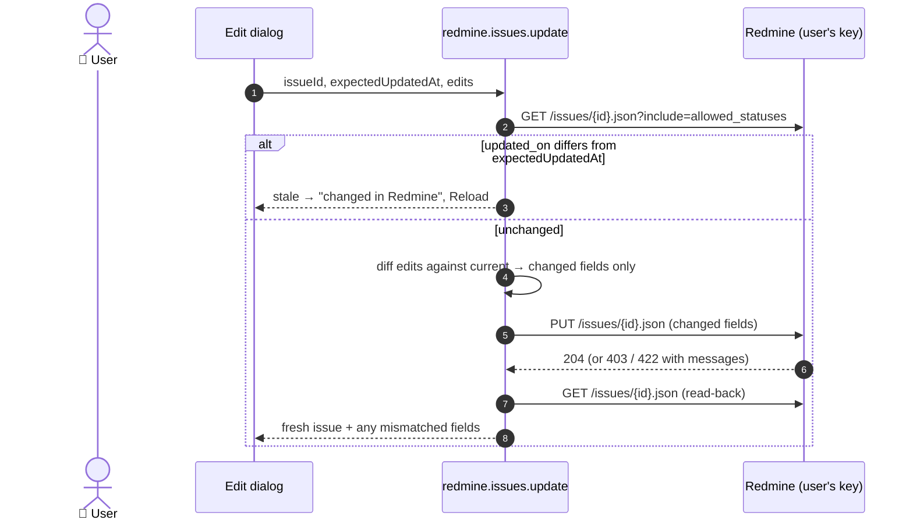

# Milestone 6: Create and edit Redmine issues from TimeHuddle (sub-plan)

Parent plan: [`huddle_redmine_clock.md`](../huddle_redmine_clock.md) (Milestone 6).
Predecessor: [`redmine-m4-m5-time-sync-plan.md`](./redmine-m4-m5-time-sync-plan.md) (M4/M5, shipped).

> **Status: built on `feat/redmine-m6-issue-crud` (2026-09-21), not yet merged; more work to
> follow on the same branch.** Automated gates are green. **Manually confirmed on redmine0:** an
> issue created from Huddle is saved in Redmine, and it can then be worked on in Huddle (added to
> My Board, timed). The edit-side steps of the manual e2e are still to run.

## TL;DR: deliverables checklist

**Phase A: Backend reads**

- [x] `redmineRequest` keeps Redmine's 422 `errors[]` on the thrown error (`err.errors`)
- [x] Client reads: `listProjects`, `listProjectTrackers`, `listProjectMemberships`, `listIssuePriorities`, `getIssueDetail` (`include=allowed_statuses`)
- [x] Per-user TTL cache (`redmine-cache.js`, extracted from activities); disconnect busts every Redmine cache
- [x] Pure `toIssueDetail` / `toFormOptions` / `toNamedList`; `toIssue` unchanged
- [x] Methods `redmine.projects.list`, `redmine.projects.formOptions`, `redmine.issues.get`, plus Wormhole registration

**Phase B: Backend writes**

- [x] Client writes: `createIssue` (POST), `updateIssue` (PUT, 204)
- [x] Pure `redmine-issue-writes.js`: validation, changed-fields-only payload, read-back comparison, named failures
- [x] `redmine.issues.create`: POST, re-read, return the fresh DTO (or `confirmed: false`)
- [x] `redmine.issues.update`: stale check on `expectedUpdatedAt`, PUT only the changes, re-read
- [x] Named errors: `no-permission`, `rejected` (Redmine's messages in the reason), `gone`, `stale`, `not-connected`, `invalid-key`, `unreachable`
- [x] "Only write" comments reworded; D1 still holds for time entries

**Phase C: Frontend editing**

- [x] `redmineApi.projects.*` and `redmineApi.issues.{get,create,update}`, plus types
- [x] Redmine cache invalidated before the refetch that follows a Redmine write
- [x] `redmineSource` capabilities: `edit`, `assign`, `changeStatus` true; `delete` false
- [x] The creator-only edit rule applies to Huddle rows only
- [x] `RedmineIssueEditModal`: status (allowed transitions only), priority, assignee, description; stale → Reload
- [x] Row ⋮ "Edit Ticket" and "Change Status" on a Redmine row both open it
- [x] `sources/index.ts` re-exports the registry instead of keeping a copy

**Phase D: Frontend creation**

- [x] With Redmine linked, "New Ticket" asks: **TimeHuddle ticket** or **Redmine issue**. Unlinked users see today's button
- [x] `RedmineIssueCreateModal`: project, tracker, subject, description, assignee (defaults to me), priority
- [x] After create: success notice with "Open in Redmine", list refetched

**Phase E: Close-out**

- [x] Backend: `npm run test:integration`, typecheck, lint (no new warnings), format
- [x] Frontend: `npm run test:unit`, typecheck, lint, format
- [x] Playwright: `unified-table` + `my-board` (unlinked path), 19/19
- [x] `ui-audit` on the new dialogs: 94–100% adoption, no raw controls or hardcoded colors
- [ ] Manual e2e against redmine0 **[you]**: create ✅ (saved in Redmine, then workable in Huddle); edit, close and stale steps still to run

**Out of scope:** tags, custom fields, persisting issues, admin key / `X-Redmine-Switch-User`, deleting issues, bulk "Close Issues", a Redmine detail page inside Huddle, journals/notes.

## Decisions (2026-09-21)

| #      | Decision                                                                              | Consequence                                                                                                                                                                                                                                                        |
| ------ | ------------------------------------------------------------------------------------- | ------------------------------------------------------------------------------------------------------------------------------------------------------------------------------------------------------------------------------------------------------------------ |
| **E1** | **Personal API keys.** Every write runs under the acting user's key.                  | Redmine enforces role and workflow and records the author. No admin key; blocker 1 of the old M6 section is dissolved rather than answered.                                                                                                                        |
| **E2** | **Live reads.** Nothing about an issue is stored in Mongo.                            | No ACL leakage, no sync job, no conflict reconciliation. Only rarely-changing lists (projects, trackers, members, priorities) sit in a short per-user in-process cache.                                                                                            |
| **E3** | **No custom fields, no tags.**                                                        | A project that requires a custom field returns 422; Redmine's own message is shown. Stock Redmine has no tags.                                                                                                                                                     |
| **E4** | **Changed-fields-only edits plus a stale check.**                                     | Redmine's REST API has no optimistic locking. Sending only what changed means an unrelated concurrent edit is never overwritten; comparing `updated_on` refuses a save over a newer version. The remaining window (between the check and the PUT) is milliseconds. |
| **E5** | **The dialogs call `redmineApi` directly**, not through `TicketSource.create/update`. | Same shape as Huddle's modals calling `ticketApi`. The seam waits for a third source (KISS).                                                                                                                                                                       |

**What this reverses.** M2/M2.1 made Redmine rows read-only, and M5 called
`createTimeEntry` "the only write". Issue create and update are a new category
of write. D1 (time entries are create-only and permanent) is unchanged.

## How a save works

## What shipped

| Area                              | Files                                                                                                                                                                |
| --------------------------------- | -------------------------------------------------------------------------------------------------------------------------------------------------------------------- |
| Client reads/writes, 422 messages | `meteor-backend/server/redmine-client.js`                                                                                                                            |
| Pure shapers                      | `meteor-backend/server/redmine-issues.js`                                                                                                                            |
| Pure write rules                  | `meteor-backend/server/redmine-issue-writes.js` (new)                                                                                                                |
| Methods                           | `meteor-backend/server/redmine-issue-methods.js` (new), `main.js`                                                                                                    |
| Per-user cache                    | `meteor-backend/server/redmine-cache.js` (new), `redmine-activities.js`, `redmine.js`                                                                                |
| API types + wrappers              | `src/lib/api.ts`                                                                                                                                                     |
| Dialogs + helpers                 | `src/features/tickets/redmine/` (new)                                                                                                                                |
| Wiring                            | `TicketsPage.tsx`, `TicketTableRow.tsx`, `sources/redmineSource.ts`, `sources/index.ts`                                                                              |
| Tests                             | `meteor-backend/tests/redmine-{issues,issue-writes,cache}.test.ts`, `redmine.test.ts`; `src/features/tickets/redmine/redmineForm.test.ts`, `sources/sources.test.ts` |

## Manual e2e against redmine0 **[you]**

Prerequisites: your redmine0 role has **Add issues** and **Edit issues**; "Issues can be assigned to this role" is on for the roles you assign to; a second linked user (e.g. `riley.okafor`) exists.

1. New Ticket → Redmine issue → create one for yourself. In Redmine: author and assignee are you.
2. Create one assigned to the other user.
3. Edit priority and description. Redmine's history shows only those two fields changed, by you.
4. Close an issue from the edit dialog. The row moves to the Closed view.
5. Open the edit dialog, change the same issue in Redmine, then save in Huddle: the stale warning appears, and Reload shows Redmine's version.
6. A status your workflow doesn't allow is never offered.

## Known gaps

- **No automated coverage of the live write path.** Like M1–M5, the methods are only reachable over HTTP against the test Meteor, which has no Redmine. The rules they delegate to are unit-tested; auth, validation and the not-connected gate are integration-tested.
- **No e2e spec for the dialogs.** Test accounts have no linked Redmine, so the New Ticket menu and both dialogs never render in Playwright.
- **Group assignees are not offered.** Only user memberships become assignees; an issue already assigned to a group keeps showing that group.
- **The per-user cache is per process.** Two Meteor instances would each hold their own copy for up to five minutes. Harmless for dropdown data.
