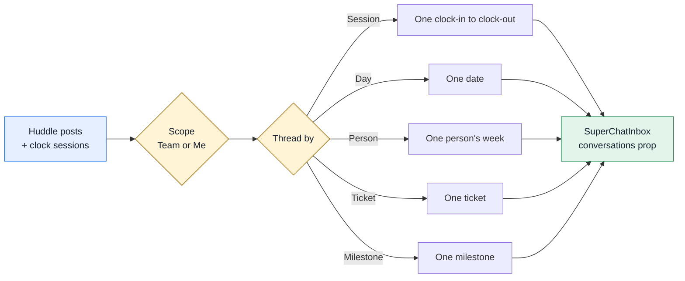

# SuperChatInbox Gaps for TimeHuddle Huddle

**Status:** Ready to pick up · **Written:** 2026-09-29 · **Component version checked:** `@mieweb/ui` 0.9.0
(re-checked against 0.10.0 on 2026-09-29 — the `SuperChat`/`SuperChatInbox`/`SuperChatConversation`/
`SuperChatMessage` public type surface is byte-for-byte unchanged between 0.9.0 and 0.10.0, so every gap
below still applies)

## Overview

TimeHuddle is replacing its Huddle feed (the hand-built card feed plus the SuperChat panel) with
`SuperChatInbox` from `@mieweb/ui`. We built two prototypes of the new Huddle:

- **HTML mockup (the target design):** https://claude.ai/artifact/Qr1F9EJPcse9G3wDVnH5tw
- **The same flow on the real `SuperChatInbox` 0.9.0:** https://claude.ai/artifact/5TYzdgArrh5nBUV5ZVXVu7

The HTML mockup is the design we want. This document lists everything that mockup does which
`SuperChatInbox` can't do yet, so the gaps can be closed in `@mieweb/ui`.

> Both links are private until the owner shares them. Ask for access if they don't open.

## How Huddle Uses the Inbox

Posts and clock-ins are stored once. The user picks a **Thread by** option, and the app groups
posts into conversations with that key. A **Scope** switch picks whose posts are included: one
team, or just the current user across all their teams (the personal feed).



Because of this, threads mean very different things: a single session, several days, or a
ticket with many authors. The inbox needs to show **dates**, **status** and **summary
details** that a normal chat doesn't need.

The Team and Group by controls are TimeHuddle's own `Dropdown`s. The app portals them,
with search, into the inbox's conversation-list header, because `SuperChatInbox` has no
slot there (gap 1.8). The controls themselves are **not** part of
this request.

## Where to Look in @mieweb/ui

| Area                                                       | Source file                                           |
| ---------------------------------------------------------- | ----------------------------------------------------- |
| Conversation list                                          | `src/components/SuperChat/SuperChatConversations.tsx` |
| Inbox wrapper                                              | `src/components/SuperChat/SuperChatInbox.tsx`         |
| Thread header, message box wiring                          | `src/components/SuperChat/SuperChat.tsx`              |
| Message rows, `formatTime`, system messages, `sidebarItem` | `src/components/SuperChat/parts.tsx`                  |
| Message box                                                | `src/components/Messaging/MessageComposer`            |

## Gap List

Legend: ❌ missing · ⚠️ partial or workaround · ✅ already supported

Priority: **P1** blocks the Huddle rollout · **P2** needed for parity with the mockup ·
**P3** nice to have

### 1. Conversation List (Sidebar)

| #    | What the mockup does                                                                                                                                     | 0.9.0 today                                                                                                                            | Priority |
| ---- | -------------------------------------------------------------------------------------------------------------------------------------------------------- | -------------------------------------------------------------------------------------------------------------------------------------- | -------- |
| 1.1  | An avatar on every row: the person's colored initials, or an icon for day (date number), ticket (🎫) and milestone (◆)                                   | ❌ Rows have no avatar                                                                                                                 | P1       |
| 1.2  | A clean second line with the author ("Priya: Reviewed…")                                                                                                 | ⚠️ Shows the last message's raw text: markdown symbols show up as-is, a system line (clock-out) can become the preview, no author name | P1       |
| 1.3  | Status pills on rows: **LIVE** (red dot), hours ("8h 18m"), ticket IDs (`#398`), Pulse video count ("▶ 2"), reply count ("💬 3"), **No wrap-up** warning | ❌ Only a numeric unread badge                                                                                                         | P1       |
| 1.4  | Time span on the right of each row (`08:58–now`, monospaced)                                                                                             | ❌ No timestamp on rows                                                                                                                | P1       |
| 1.5  | Section headers that stay visible while scrolling ("Today · Tue, Sep 29", "Mon, Sep 28", milestone names, "ADMIN ONLY")                                  | ❌ One flat list                                                                                                                       | P1       |
| 1.6  | Custom sort order (by day, then by start time)                                                                                                           | ❌ Always sorted by `lastActivity`, and this can't be changed                                                                          | P1       |
| 1.7  | Sidebar title changes with the grouping ("Work sessions", "Days", "People", "Tickets", "Milestones")                                                     | ❌ Always "Conversations"                                                                                                              | P2       |
| 1.8  | Extra content in the sidebar header, such as the date range "Sep 23 – Sep 29"                                                                            | ❌ No slot                                                                                                                             | P2       |
| 1.9  | Per-section totals for admins ("3 sessions · 12h 45m")                                                                                                   | ❌                                                                                                                                     | P2       |
| 1.10 | Small overlapping avatars of the people in a thread (day, ticket and milestone threads)                                                                  | ❌                                                                                                                                     | P2       |
| 1.11 | Empty state ("No sessions match this filter")                                                                                                            | ❌ The list just shows nothing; the panel always says "No conversation selected"                                                       | P2       |
| 1.12 | Labeled "+ New DM" button                                                                                                                                | ⚠️ Only an unlabeled "+" icon                                                                                                          | P3       |
| 1.13 | Filter chips (Everyone / Only mine / each person / Missing wrap-up)                                                                                      | ❌ Could live in the host app if the header slot (1.8) exists                                                                          | P3       |
| 1.14 | Search box                                                                                                                                               | ❌                                                                                                                                     | P3       |
| 1.15 | Adjustable sidebar width (mockup uses 300px)                                                                                                             | ⚠️ Fixed at `w-64` (256px), with no prop                                                                                               | P3       |
| 1.16 | Unread badge                                                                                                                                             | ✅                                                                                                                                     | —        |

### 2. Thread Header

| #   | What the mockup does                                                                                                                          | 0.9.0 today                                                                                           | Priority |
| --- | --------------------------------------------------------------------------------------------------------------------------------------------- | ----------------------------------------------------------------------------------------------------- | -------- |
| 2.1 | Stats line under the title: **Time** 08:58–17:20 · **Worked** 8h 18m · **Posts** 4 · **Days** · **People** · **Tickets** #398 · **Milestone** | ❌ No subtitle or stats slot                                                                          | P1       |
| 2.2 | Status pills next to the title: LIVE, No wrap-up, ADMIN VIEW, Private, team name                                                              | ❌                                                                                                    | P1       |
| 2.3 | One avatar for what the thread is about (a person, or the day/ticket/milestone icon)                                                          | ⚠️ Shows up to 6 participant avatars, and system participants (the time clock) appear as a "C" avatar | P2       |
| 2.4 | Full title with no cut-off ("Aisha Khan's session · Tue, Sep 29")                                                                             | ⚠️ One plain-text title that gets truncated                                                           | P2       |
| 2.5 | Close button                                                                                                                                  | ✅ Through `onConversationClosed`                                                                     | —        |

### 3. Messages

| #    | What the mockup does                                                                                        | 0.9.0 today                                                                                                                      | Priority |
| ---- | ----------------------------------------------------------------------------------------------------------- | -------------------------------------------------------------------------------------------------------------------------------- | -------- |
| 3.1  | Date separators when a thread spans several days ("Mon, Sep 28")                                            | ❌ None                                                                                                                          | P1       |
| 3.2  | A way to tell which day each message is from                                                                | ❌ Time only ("9:15 AM"). In Person, Ticket and Milestone threads the day is lost                                                | P1       |
| 3.3  | System message variants: clock-in (green, ⏱), clock-out (grey, ⏹, with duration), still clocked in (red, ●) | ⚠️ Every `system` message is the same small grey centered text, with no variant, icon or color                                   | P1       |
| 3.4  | Replies indented under the post they answer, with a lighter bubble                                          | ❌ Flat thread. `MessageComposer` already supports `replyTo`, but SuperChat doesn't pass it through, and there's no Reply action | P1       |
| 3.5  | Post type label next to the time: **PLAN / UPDATE / WRAP-UP**                                               | ❌ No slot; we currently put it in the message text                                                                              | P2       |
| 3.6  | Ticket chip inside the message (bordered, 🎫 #398 Onboarding checklist, clickable)                          | ⚠️ Only as inline code in markdown. `ref` items exist but are separate thread items and can't be attached to a message           | P2       |
| 3.7  | Pulse video card inside the message (thumbnail, ▶, duration)                                                | ⚠️ Host GenUI widget `pulse_video`: poster + ▶, plays inline. No duration; the sidebar preview shows its JSON (1.2)              | P2       |
| 3.8  | Team name on each message when the scope is "Me · all teams"                                                | ❌ No per-message badge slot                                                                                                     | P2       |
| 3.9  | Time format set by the host (24-hour, monospaced, `09:15`)                                                  | ❌ `formatTime` is fixed to the locale's `hour: 'numeric'`                                                                       | P3       |
| 3.10 | Own messages marked as "You"                                                                                | ✅ Right-aligned with the user bubble style                                                                                      | —        |
| 3.11 | Per-person color                                                                                            | ✅ `participant.color`                                                                                                           | —        |
| 3.12 | Copy and edit on messages                                                                                   | ✅                                                                                                                               | —        |
| 3.13 | Delete a message, and per-message edit/delete rights for moderators (team admins, org owners)               | ❌ No delete action or callback, and edit is offered on own messages only. Huddle has no way to delete a published post today    | P1       |

### 4. Message Box (Composer)

| #   | What the mockup does                                                                                                  | 0.9.0 today                                                                  | Priority |
| --- | --------------------------------------------------------------------------------------------------------------------- | ---------------------------------------------------------------------------- | -------- |
| 4.1 | Placeholder that fits the thread ("Reply to Priya's session…", "Post an update to your session…", "Post about #398…") | ❌ Always "Type a message… use @ to address an agent"                        | P1       |
| 4.2 | 🎥 Pulse video button and 🎫 Ticket picker button in the toolbar                                                      | ❌ No slot for custom buttons (`showCameraButton` is forced off)             | P1       |
| 4.3 | Reply to a specific post                                                                                              | ❌ `replyTo` isn't passed through (see 3.4)                                  | P1       |
| 4.4 | Ticket already filled in when posting in a ticket thread                                                              | ❌ No way to pass context to the message box or back through `onMessageSent` | P2       |
| 4.5 | 📎 Attach                                                                                                             | ✅                                                                           | —        |
| 4.6 | Send                                                                                                                  | ✅                                                                           | —        |

### 5. Already Better Than the Mockup (Keep)

- On phones it switches between the list and the chat, with a back button.
- Copy (rich, Markdown or plain) and edit on messages.
- @mentions.
- Long threads can be virtualized.
- Paste and pick attachments work for real.

## Proposed API Additions

These are suggestions. The owner of `@mieweb/ui` should pick the final shape. Prefer optional
fields and render props so existing users of the component aren't affected.

### Conversation (`SuperChatConversation`)

```ts
interface SuperChatConversation {
  // existing fields…
  subtitle?: string; // 1.2 – preview line; overrides the last-message text
  avatar?: Participant | React.ReactNode; // 1.1, 2.3 – one avatar for the row and header
  meta?: string; // 1.4 – right-aligned row text, e.g. "08:58–now"
  badges?: SuperChatBadge[]; // 1.3, 2.2 – LIVE, hours, ticket IDs, warnings
  section?: string; // 1.5 – section header this row sits under
  stats?: { label: string; value: string }[]; // 2.1 – header stats line
}

interface SuperChatBadge {
  label: string;
  variant?: 'live' | 'warning' | 'info' | 'neutral';
  icon?: React.ReactNode;
}
```

### Inbox and List Props

```ts
interface SuperChatInboxProps {
  // existing props…
  sortConversations?: (a: SuperChatConversation, b: SuperChatConversation) => number; // 1.6
  sectionOrder?: string[]; // 1.5
  renderSectionHeader?: (section: string, items: SuperChatConversation[]) => React.ReactNode; // 1.5, 1.9
  sidebarTitle?: React.ReactNode; // 1.7
  sidebarHeaderExtra?: React.ReactNode; // 1.8, 1.13, 1.14
  sidebarClassName?: string; // 1.15
  emptyState?: React.ReactNode; // 1.11
  renderConversationItem?: (c: SuperChatConversation, active: boolean) => React.ReactNode; // escape hatch for all of section 1
  formatTime?: (time: Date) => string; // 3.9
  showDateSeparators?: boolean; // 3.1, 3.2
  composerPlaceholder?: string | ((c: SuperChatConversation) => string); // 4.1
  composerActions?: React.ReactNode | ((c: SuperChatConversation) => React.ReactNode); // 4.2
  onReply?: (message: SuperChatMessage) => void; // 3.4, 4.3
}
```

### Message (`SuperChatMessage`)

```ts
interface SuperChatMessage {
  // existing fields…
  replyToId?: string; // 3.4 – indent under this message
  label?: string; // 3.5 – "Plan", "Wrap-up"
  chips?: SuperChatBadge[]; // 3.6, 3.8 – ticket, team
  attachments?: SuperChatAttachment[]; // 3.7 – video card with thumbnail and duration
  systemVariant?: 'success' | 'neutral' | 'live' | 'warning'; // 3.3
  systemIcon?: React.ReactNode; // 3.3
}
```

## Acceptance Criteria

- [ ] Every **P1** item is supported in a published `@mieweb/ui` release.
- [ ] The Storybook `SuperChat/Inbox` playground has a story that recreates the Huddle
      "Thread by Session" view from the HTML mockup, using only public props.
- [ ] Rows show an avatar, a clean preview line, a right-aligned time span and badges, with no
      raw markdown in the preview.
- [ ] Threads that span several days show date separators.
- [ ] Clock-in, clock-out and live system messages look different from each other.
- [ ] Replies can be indented under their parent message, and the message box can target a reply.
- [ ] The host can set the message box placeholder and add its own toolbar buttons.
- [ ] All new props are optional, and existing SuperChat stories render unchanged.
- [ ] New UI has ARIA labels, a visible focus state, and works in dark mode and right-to-left
      layouts.

## Out of Scope (for Now)

- The Scope and Thread by controls. The TimeHuddle app builds them with `Tabs`.
- Grouping logic (turning posts into conversations). TimeHuddle owns it.
- A milestone field on tickets. That's a TimeHuddle backend change, tracked separately.
- Direct messages between users. They need a TimeHuddle backend first.
- Likes on posts. They were dropped in the new design.
