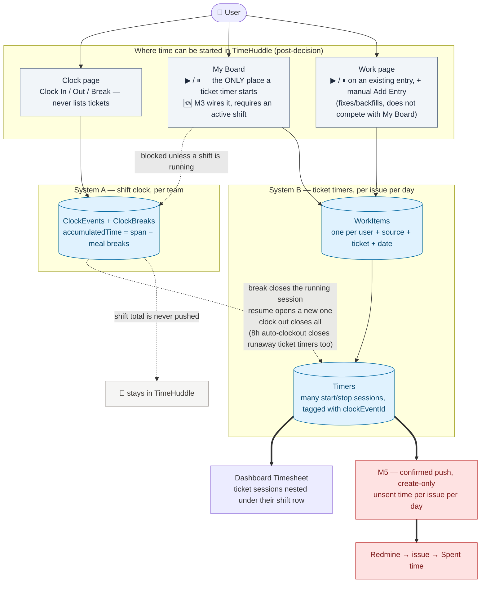
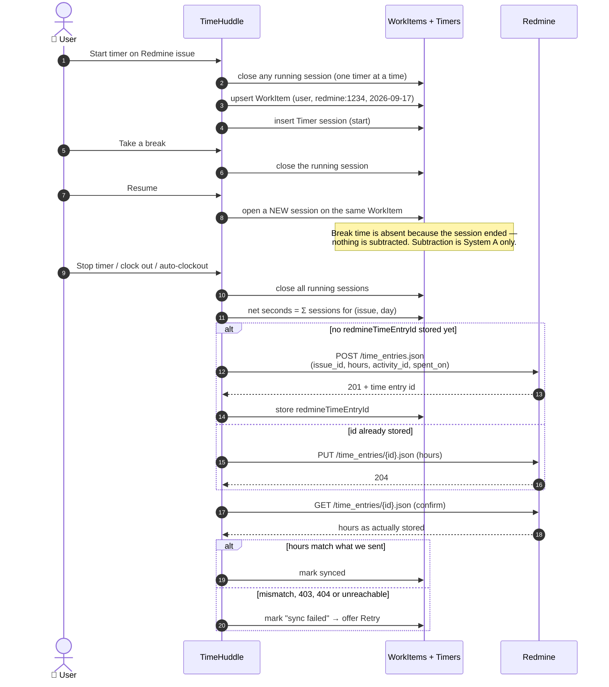

# TimeHuddle ↔ Redmine — Clock & Time-Sync (Simplified v1)

Scoped-down plan derived from `plan_timehuddle_redmine`. This is the **first deliverable only**.

## Goal

A user should never have to open Redmine to:

1. see which tickets are assigned to them, or
2. manually enter "Spent time" after working.

They connect their Redmine account once, pick their assigned ticket on the clock page,
work (with start/stop, breaks, multiple sessions tracked in TimeHuddle), and the total
hours are pushed to Redmine automatically.

## Scope

**In scope**

- Connect a personal Redmine account in TimeHuddle via **personal API key**.
- Surface Redmine issues on the tickets page (**read-only issues, one-way Redmine → TimeHuddle**).
  Delivered in two steps: M2 ships a separate "Redmine Tickets" view behind a heading dropdown;
  **M2.1 replaces that switcher with a single unified table covering every source.**
- A **scope toggle "Assigned to me" / "All"** (drives the fetch) plus working search, sort, and filters.
- Start a **ticket timer against a Redmine issue** from the clock page dropdown or a "Start working" button on the Redmine view — reusing the existing source-aware ticket-timer mechanism (not the team shift clock).
- All timing logic (start/end, breaks, multiple sessions) lives in TimeHuddle.
- Push the **summed hours** for a work session back to Redmine as a time entry.

**Explicitly out of scope (defer)**

- Creating/editing Redmine issues from TimeHuddle (no write-back of tickets) — see **M6**.
- Two-way ticket sync of any kind, and persisting Redmine issues in TimeHuddle's database — see **M6**.
- Estimated hours, watchers, categories, versions, parent/subtasks, custom fields.
- Role-aware / workflow-filtered dropdowns (Reporter tier, status transitions).
- Admin bulk onboarding, invites, auto-match by email, create-user-in-Redmine.
- Reconciliation / drift-detection background job.
- Git changesets display.

**Direction:** issues flow **Redmine → TimeHuddle** (read-only). Only **time entries**
flow **TimeHuddle → Redmine** (write). Nothing else is written to Redmine in v1.

---

## Milestone 1 — Connect a Redmine account (personal API key)

Let a TimeHuddle user link their own Redmine identity using their personal API key.

- [x] New collection `redmine_links` (`meteor-backend/server/collections.js`):
      `{ userId, redmineUserId, redmineLogin, firstname, lastname, mail, apiKey (encrypted), linkedAt }`.
      _`baseUrl` is intentionally **not** persisted — the configured instance is the single
      source of truth, derived at read time (`toStatus`). A unique `userId` index enforces
      one link per user._
- [x] Store the Redmine base URL as config/env (`REDMINE_BASE_URL`), not hardcoded.
- [x] Encrypt the personal API key at rest; never return it to the client after saving.
      _AES-256-GCM via `redmine-crypto.js` (`REDMINE_ENCRYPTION_KEY`); `toStatus` strips the key._
- [x] `meteor-backend/server/redmine-client.js` — thin `fetch` wrapper:
      builds requests against `baseUrl`, injects the caller's API key
      (`X-Redmine-API-Key` header), 8s timeout, `.status` on errors.
      _M1 implements `getCurrentUser` only; `listIssues` / `createTimeEntry` /
      `updateTimeEntry` are deferred to M2 / M5 to avoid dead code._
- [x] Meteor method `redmine.connect(apiKey)`: - call `GET /users/current.json` with that key to validate, - on success, upsert a `redmine_links` row for the current user, - on failure, return a clear "invalid key / unreachable" error.
- [x] Meteor method `redmine.disconnect()` — remove the link row.
      _Also added `redmine.status()` for the client-safe connection status._
- [x] Frontend: **Settings → "Add Redmine account"** — paste API key, show
      connected state (Redmine login + a "Disconnect" action).
- [x] Show connection status somewhere on the tickets/clock page (connected vs. not).
      _Deferred into M2 (the retired Redmine Tickets view's not-connected card), and now
      carried by M3's `unresolvedBoardNotice` on My Board — which names the unconnected case
      specifically ("Connect your Redmine account in Settings to see N Redmine issues") —
      plus `timerErrorMessage()`'s `not-connected` branch on a rejected start._

**Done when:** a user pastes their personal API key, sees their Redmine login confirmed,
and the link persists across sessions.

---

## Milestone 2 — Add a "Redmine Tickets" view to the tickets page (read-only issues)

Add a second **view** to the tickets page alongside the existing TimeHuddle tickets,
switched via a heading dropdown. "Read-only" here means **read-only for the Redmine
issue data** — no create/edit/delete of issues. (Starting a local timer against a
Redmine issue is a TimeHuddle write, not a Redmine write, and is covered in M3/M4.)

**Architecture (decided):** a **separate, thin Redmine data layer** — its own
`RedmineIssue` type + `redmine.issues.*` method surface — rendered by its own
`RedmineTicketsView` component that reuses `@mieweb/ui` primitives. We do **not**
adapt Redmine issues into the internal `Ticket` shape, and we do **not** build a
generic pluggable "ticket source" abstraction (YAGNI/KISS). Future Redmine issue CRUD,
if ever needed, extends `redmine.issues.*` — never the core `Ticket` collection.

- [x] `redmine-client.listIssues(apiKey, { scope, limit, offset })`: - assigned to me → `GET /issues.json?assigned_to_id=me`, - all (visible to the key) → `GET /issues.json` (paginate via `limit`/`offset`).
- [x] Meteor method `redmine.issues.list({ scope: 'mine' | 'all' })` using the
      caller's stored API key (each user sees what their own key can see). Returns a
      **minimal, pre-shaped DTO** (shaping done server-side) plus the configured `baseUrl`.
      _Also registered with `Wormhole.expose()` in `main.js` for REST access._
- [x] Map only the **bare-minimum** fields we show (read-only):
      `id`, `subject`, `project {id,name}`, `status {id,name}`, `assignedTo {id,name} | null`.
      _No due date, tracker, or priority in v1. Shaping via `redmine-issues.js`._
- [x] Frontend `redmineApi.issues.list(scope)` + `RedmineIssue` type.
- [x] **View switcher**: replace the `/app/tickets` h1 with a heading dropdown —
      **"Tickets v1"** (current view, unchanged) / **"Redmine Tickets"** (this view).
      Suppress the static registry title for the tickets route so the feature owns
      the heading + `view` state; `TicketsPage` stays always-mounted.
- [x] Keep the UI visually the same. **"New Ticket" is disabled with a "Read only"
      popover** in the Redmine view. **Search works** client-side (id + subject + project).
- [x] **Scope toggle "Assigned to me" / "All"** drives the _server fetch_ (`assigned_to_id=me`
      vs. all). This is **not** redundant with the header assignee filter: the toggle bounds
      _what is fetched_; the assignee filter refines _what is loaded_. Header assignee-filter
      options are derived from the **assignees present in the fetched issues** (no Redmine
      users API needed — sidesteps whether the key can list team members).
- [x] Each row links out to the Redmine issue URL (`{baseUrl}/issues/{id}`, new tab).
- [x] Loading / empty / **"not connected"** states on the Redmine Tickets view
      (not-connected → card linking to Settings). This satisfies M1's deferred
      "connection status on the tickets page" item.
- [x] **Caching (decided):** fetch-on-view + a manual **"Refresh"** button + a small
      in-memory (session) cache keyed by scope so toggling views doesn't refetch every
      time; refetch only on scope change or Refresh. **No server-side cache** in v1.

**Done when:** a connected user can switch to "Redmine Tickets" and see their assigned
Redmine issues (toggle to "All"), search them, and click through to Redmine — without
opening Redmine, and without altering the existing "Tickets v1" view.

---

## Milestone 2.1 — Replace the view switcher with one unified ticket table

M2's heading dropdown forces the user to _choose a system_ before they can see their work.
Retire it: **source becomes a column and a filter, not a mode.** One table shows Huddle
tickets and Redmine issues together, and the layout must absorb a third source (GitHub,
Jira, …) as **one new file + one registry entry** — no changes to the table, the filter bar,
or the page.

**Decision reversal (recorded deliberately):** M2 decided _"we do not build a generic
pluggable 'ticket source' abstraction (YAGNI/KISS)"_. With a second source now live and a
third anticipated, that call is reversed — the abstraction has earned its keep. What M2
decided still holds, though, and is **not** reversed: Redmine issues are **never adapted
into the core `Ticket` collection**. Normalization happens at the **read/adapter layer
only**; nothing about a source is persisted (Core Model Data Discipline).

### Decisions

- **Scope:** the list shows the **current team's Huddle tickets + the signed-in user's
  Redmine issues**. The two sources genuinely have different scoping models (team-scoped vs.
  personal-key-scoped) and this is the honest union of what each can supply.
- **Row identity:** `` `${sourceId}:${id}` `` — composite, client-side only, never stored.
- **Status (revised during implementation):** the page already had GitHub-style
  **Open / Closed tabs**, and that _is_ the canonical bucket — no separate taxonomy was
  invented. Each adapter supplies a single cross-source fact, `status.isClosed`, which
  drives those tabs; the row `Badge` always renders the **native** label, and the Status
  filter lists native values **grouped by source**. Redmine supplies `is_closed` on the
  issue status, so its statuses need no name-matching guesswork.
  _(The original plan proposed a four-bucket `open`/`in-progress`/`blocked`/`done` model.
  Dropped: the existing tabs already covered it, and the extra vocabulary earned nothing.)_
- **Redmine rows stay read-only — with one exception:** no action that would _write to
  Redmine_ renders. `capabilities.trackTime` is reserved for M3's per-row timer entry point
  (starting a timer is a TimeHuddle write, not a Redmine write) and ships as **false** in
  M2.1, so the row cannot offer a timer the backend cannot start. Clicking the title opens
  `{baseUrl}/issues/{id}` in a new tab — the internal `/app/tickets/:id` detail route only
  understands Huddle ids.
- **Layout: a `Table`.** The unified view is a sortable, paginated `@mieweb/ui` `Table`.
  Both previous layouts are gone: the standalone Redmine view's table _and_ the Huddle
  GitHub-style `<ul>` row list.

  _Two earlier positions were superseded and are recorded so the reasoning is not relitigated:_

  1. _The first plan said `Table` at `md+` with a `Card` list below `md`._
  2. _That was then reversed to "keep the `<ul>` row list", on the grounds that ticket rows
     are not tabular and that a table would need a second mobile renderer._

  _Both are now overridden by an explicit product decision: a table with columns, per-column
  sorting, row selection and pagination, scrolling horizontally on small screens rather than
  wrapping. The mobile `Card` renderer is **not** built — narrow screens get the horizontal
  scroll that `Table`'s `responsive` wrapper already provides, which is the accepted
  trade-off for a single row implementation._

- **Why `Table` and not DataVis NITRO.** The `Table` docs steer grid use cases to NITRO
  (`@mieweb/datavis`) and call hand-rolling sort/filter/selection on a plain table "out of
  policy". NITRO was evaluated and rejected for **this** milestone:

  - it pins `@mieweb/ui: =0.6.1-dev.148` against the app's `0.7.3`, so it cannot dedupe —
    the bundle would carry **two copies of the UI library** and two sets of React contexts;
  - it is currently a **devDependency** and would need promoting to a runtime dependency;
  - it windows via **show-more/limit**, which conflicts with the pager controls this
    milestone requires;
  - it needs a wcdatavis `ViewInstance`, a heavier integration than the data here warrants.

  What we build instead stays **inside** the documented envelope, which is narrower than the
  headline suggests: `TableHead`'s `sortable`/`sortDirection`/`onSort` is a **real supported
  feature** that emits `aria-sort`; selection is explicitly _"the host's responsibility"_;
  and the docs list `Pagination` under _"composes with"_.

  **Policy deviation, taken knowingly (M2.2).** Filtering was first kept in a chip bar
  precisely so we stayed inside that envelope. It has since moved into **per-column header
  menus**, which the docs name as the one thing that is out of policy. Accepted because the
  alternative — NITRO — would ship a second copy of `@mieweb/ui`. **Revisit when
  `@mieweb/datavis` tracks the app's `@mieweb/ui` version.**

- **Columns:** select · Title · Issue # · Source · Status · Priority · Assignees · Project ·
  Updated · actions (⋮). Everything except select, Assignees and actions is sortable
  (Assignees is multi-valued, so it filters but does not sort). Source, Status, Priority,
  Assignees and Project each carry a filter menu in the header.
- **No filter chip bar.** `TicketFilterBar` is deleted. Search stays in the top bar next to
  a **`Switch`** for open/closed (replacing the tabs) and a "Clear filters" button that
  appears only when a filter is active. The open/closed counts the tabs used to show are
  kept as muted text beside the switch.
- **Header composition constraint.** `TableHead`'s `sortable` prop wraps its children in a
  `<button>`, so a filter trigger passed as children would nest a button inside a button.
  `TicketColumnHeader` therefore renders the sort control and the filter trigger as
  **siblings** and supplies `aria-sort` itself — `TableHead` spreads `...props` after its
  own `aria-sort`, so ours wins.
- **Redmine scope:** defaults to **all** issues the key can see. "Assigned to me" is now the
  Assignee column filter rather than a separate fetch scope, so the M2 scope toggle is gone.
  _Note: this is a **server** fetch, not a client filter — a large Redmine instance means a
  larger payload on load._
- **Selection:** a leading checkbox column with a **tri-state** select-all header
  (`Checkbox indeterminate`). Select-all applies to the **current page only**, matching what
  the user can see. No bulk action is wired yet — the column exists for a future feature.
- **Pagination, not scrolling:** the table fills the available height and pages; the row
  area never scrolls vertically. `useAutoPageSize` measures the row area with a
  `ResizeObserver` and reports how many rows fit, so a tall display shows more rows and a
  short one fewer. Page **clamps** rather than resets when the area shrinks, and resets to 1
  when the search, filters or Open/Closed tab change.
- **Timer moved off the row.** The per-row timer toggle is gone; **Start/Stop timer** now
  lives in the row's ⋮ menu, gated on `capabilities.trackTime`. (Its eventual home is
  elsewhere — see M3.)
- **Page width:** `<AppPage fill width="full">`. The page originally rendered in `AppPage`'s
  default `max-w-4xl` reading column, which squeezed the table into roughly half the
  available width. `AppPage` gained a `full` (`max-w-none`) option alongside `content` and
  `wide` so a wide table can use every pixel.
- **Components:** `@mieweb/ui` only — `Table`, `TableHead` (sorting), `Checkbox`
  (selection), `Switch` (open/closed), `Badge`, `Pagination`, `Button`, `Dropdown*`, `Text`.
  The row's hand-rolled `<span>` badges became `Badge`; low and unrecognized priorities use
  the `outline` variant because `secondary` is low enough contrast to read as plain text.
  The existing shared `src/ui/EmptyState.tsx` is kept.
- **Still client-side:** filtering, sorting and paging all happen in the browser. The
  backend exposes no sort/filter/paginate params today and M2.1 does not add any.
- **Redmine scope preserved:** M2's "Assigned to me / All" toggle survives as a **Redmine**
  filter chip, shown only when Redmine actually contributed rows.

### Prerequisite — dependency drift (blocking, found during implementation)

- [x] `node_modules` held `@mieweb/ui@0.6.1` while `package.json`/`package-lock.json`
      pinned `0.7.3`, so every API check was being made against a version CI does not
      install. Fixed with `npm ci`; the `Badge` and `Table` APIs turned out identical
      across the two, and the full gate was re-run against `0.7.3`.
      _Re-check this before trusting any `@mieweb/ui` API reading._

### Backend prerequisite (blocking)

- [x] `redmine-issues.js` `toIssue()` additionally maps `created_on` → `createdAt`,
      `updated_on` → `updatedAt`, `priority`, `tracker`, and preserves `status.is_closed`
      as `status.isClosed`. **Without timestamps a merged list cannot be sorted
      chronologically at all**, and without `is_closed` Redmine rows cannot enter the
      Open/Closed tabs. M2 dropped these deliberately; the file's header comment now
      records why that changed. A missing `is_closed` (older Redmine) is treated as open
      rather than guessed from the status name.
- [x] `meteor-backend/tests/redmine-issues.test.ts` fixtures and assertions extended.
- [x] `RedmineIssue` widened in `src/lib/api.ts`, with a `RedmineIssueStatus` carrying
      `isClosed`.

### Source adapter layer — `src/features/tickets/sources/`

The normalized shape every source is mapped into. `defineSource()` erases each adapter's
raw type so sources with different payloads can share one registry. There is no
`statusBuckets.ts` — the four-bucket model was dropped in favour of the single `isClosed`
fact (see Decisions).

```ts
interface UnifiedTicket {
  key: string; // `${sourceId}:${id}`
  sourceId: TicketSourceId;
  id: string;
  ref: string; // shown in the Issue # column
  title: string;
  container: { id: string; name: string } | null; // Huddle team | Redmine project
  status: { native: string; isClosed: boolean }; // native shown, isClosed filtered
  priority: { native: string; rank: number } | null;
  assignees: { id: string; name: string }[]; // namespaced per source
  createdBy: { id: string; name: string } | null;
  createdAt: string | null;
  updatedAt: string | null;
  externalUrl: string | null; // row links out instead of in
  externalRef: { url: string; label: string } | null;
  sharedWithTimeharbor: boolean; // Huddle-only; false elsewhere
  capabilities: SourceCapabilities;
}
```

- [x] `types.ts` — `UnifiedTicket`, `TicketSource`, `AnyTicketSource`, `TicketSourceId`,
      `SourceCapabilities`, `defineSource()`.
- [x] `huddleSource.ts` / `redmineSource.ts` — adapters over `ticketApi` and
      `redmineApi.issues.list`. `redmineSource` inherits the retired view's per-(user,
      scope) cache key.
- [x] **Interface kept extension-ready for M6.** `TicketSource` declares mutation
      (`create` / `update` / `delete`) as **optional** members guarded by `capabilities`,
      so M6 is an _additive_ implementation swap rather than a redesign. Deliberately not
      implemented here — only the seam. Concretely, M6's frontend reduces to rewriting
      `redmineSource.fetch()` to read from the DB and flipping its `capabilities` flags;
      everything above the adapter stays untouched.
- [x] `registry.ts` — the `TICKET_SOURCES` registry (the folder's anchor). Kept separate
      from `index.ts` so the hook can import it without a cycle.
- [x] `README.md` — "how to add a source" (Folder Philosophy).
- [x] `useUnifiedTickets.ts` — **source-partitioned** state
      (`Record<TicketSourceId, { items, loading, error }>`). Partitioning is not cosmetic:
      Huddle arrives via DDP push and Redmine via one-shot fetch, so a shared array would
      let a DDP update clobber the Redmine rows. Sources load via `Promise.allSettled` —
      one failing source shows a per-source error and keeps its last good rows, never an
      empty list. A source whose `isAvailable()` is false (Redmine not connected) is
      omitted silently, not errored.
- [x] Colocated unit tests: normalization, `isClosed` mapping, id namespacing, merge,
      partial failure, unavailable-source omission.

### UI

- [x] `TicketColumnHeader.tsx` — sort control + filter menu as siblings inside the `th`,
      with `aria-sort` supplied explicitly.
- [x] `TicketTable.tsx` — `Table` with per-column sort + filter headers, tri-state
      select-all, per-source error banner, `EmptyState` when empty.
- [x] `TicketTableRow.tsx` — `TableRow`/`TableCell`; actions gated on `capabilities` so
      Redmine rows never render dead controls. `Badge` for source, status and priority.
- [x] `ticketFilters.ts` — owns `TicketFilters`, the sentinels, and the pure option-derivation
      helpers (`statusOptions`, `priorityOptions`, `assigneeOptions`, `containerOptions`).
- [x] `useAutoPageSize.ts` — `ResizeObserver` on the row area, reports how many rows fit.
- [x] `FilterDropdown.tsx` — extracted from `TicketsPage`; now also accepts a custom
      `trigger` so headers can use an icon.
- [x] **`TicketFilterBar.tsx` deleted** — filters moved into the headers, open/closed became
      a `Switch`, "Clear filters" moved beside it.
- [x] `TicketsPage.tsx` — deleted `TicketsView`, `VIEW_LABELS`, the `<h1>` `Dropdown`
      switcher, the `view === 'redmine'` branch and the local filter `useState`s; added
      selection, paging and `width="full"`. **1981 → ~1100 lines.**
- [x] Fixed `useRefresh(refetch, pathname === '/app/tickets' && view === 'v1')` — the
      `view` guard is gone and refresh re-runs every source.
- [x] Moved `RedmineTicketsView.tsx` to `.attic/` with a header note explaining what
      superseded it and which behaviour `redmineSource` inherited.
- [x] Deleted the avatar-suppression workaround — it only existed because the old `<ul>`
      rows sat under the portaled filter menu.
- [x] A11y: `aria-sort` on every sortable header (supplied by `TableHead`),
      `aria-live="polite"` on the result count, `aria-label` on every filter control and
      on both row and select-all checkboxes.

### Tests

- [x] `tests/e2e/pages/TicketsPage.ts` — switcher locators dropped; table-row,
      source, column-sort, select-all and pagination locators added.
- [x] `tests/e2e/tickets/unified-table.spec.ts` — no switcher, expected columns,
      per-row source tagging, source isolation, header sorting + `aria-sort`, tri-state
      select-all, no vertical scroll, timer-in-menu, no error when Redmine is unlinked.
- [x] `tests/e2e/tickets/tickets.spec.ts` — filter-chip assertions updated.
- [x] **Run during M3:** `unified-table`, `my-board` and `timer-deduplication` run green
      against an isolated Meteor backend on `:3101`. Unit tests (188) and a production
      build both pass. The full `npm run test:all` sweep is still not run.
- [x] `tests/e2e/timers/timer-deduplication.spec.ts` repointed — it clocks in and drives
      the My Board ▶ button (the ⋮ menu's "Start timer" was removed outright by M3's D1,
      so the original "repoint at the ⋮ menu" instruction is void).
- [ ] `tests/e2e/realtime/ticket-timers.spec.ts` is **still not repointed** and is now a
      silent no-op: it loads `/app/tickets`, never clocks in, never opens the My Board tab,
      finds zero `Start timer` buttons (the Tickets tab has no timer column) and takes its
      own "no tickets" early-return on every run. It asserts nothing about DDP timer sync.

### Suggested PR split

1. Backend DTO fields + tests (independently mergeable, no UI impact).
2. Adapter layer + unit tests (inert until PR 3, zero user-visible change).
3. Unified table UI, switcher removal, e2e repair.

### Verification status

| Gate                         | Result                                 |
| ---------------------------- | -------------------------------------- |
| `npm ci` (drift fix → 0.7.3) | ✅                                     |
| `npm run typecheck`          | ✅                                     |
| `npm run lint`               | ✅                                     |
| `npm run format`             | ✅                                     |
| `npm run test:unit`          | ✅ 186 passing                         |
| `npm run build`              | ✅                                     |
| Playwright (`npm run test`)  | ⬜ not yet run — needs the local stack |
| Browser smoke test           | ⬜ deferred                            |

**Done when:** `/app/tickets` shows Huddle tickets and Redmine issues in one sortable,
filterable, paginated table with no view switcher anywhere; a user with no Redmine link
sees their Huddle tickets and no error; and adding a hypothetical third source requires
only a new adapter file and a registry entry.

### Follow-ups left open

- ~~**Repoint the timer e2e specs**~~ — `timer-deduplication.spec.ts` done in M3.
  **`ticket-timers.spec.ts` remains open** and now self-skips (see Tests above).
- ~~**Confirm `ROW_HEIGHT`**~~ — **resolved.** `useAutoPageSize.ts` measures a real
  `tbody tr[data-ticket-id]` via `getBoundingClientRect()`; 57px survives only as
  `FALLBACK_ROW_HEIGHT` for the first paint before a row exists. Nothing to pin.
- **The ticket-details modal in `TicketsPage.tsx` is unreachable dead code** — nothing sets
  `detailsTicket`, and row menus navigate to `/app/tickets/:id` instead. Left in place to
  keep this diff scoped; delete it (or restore a path to it) separately.
- **Mobile is horizontal scroll, not a card layout.** Accepted trade-off; revisit if it
  proves unusable on a phone.
- **Revisit DataVis NITRO** once `@mieweb/datavis` tracks the app's `@mieweb/ui` version —
  it would replace the hand-rolled selection and give column menus for free.

---

## Milestone 2.2 — "My Board" personal priority view

A personal priority board layered on top of the unified table: select tickets on the
Tickets tab and move them to a second "My Board" tab, which renders the identical table UI
plus one extra column — a play button between the checkbox and Title columns — reserved for
starting a ticket timer directly from the row. **UI-only in this milestone**: the play button
is a static, always-disabled placeholder. Wiring it to actually start/stop a timer (even for
Huddle tickets, where the underlying mechanism already works via the ⋮ menu) is deliberately
left to **Milestone 3**, whose "Ticket table" entry point bullet below now covers both the
main table's ⋮ menu and this column.

### Decisions

- **Identity-only persistence (Core Model Data Discipline).** The new `my_board` collection
  stores `{ userId, sourceId, ticketId, addedAt }` — no title/status snapshot. Display fields
  are resolved by filtering the already-fetched unified ticket list against board membership
  at render time. A board entry whose ticket later disappears from that list (archived,
  deleted, out of the Redmine fetch window) simply doesn't render a row — no error.
- **Tabs, not a dropdown.** `@mieweb/ui`'s `Tabs`/`TabsList`/`TabsTrigger` replace the page's
  static `<h1>` (kept `sr-only` for a11y/test continuity). Same `/app/tickets` URL throughout
  — `activeView` is local component state, matching M2.1's decision to retire the
  heading-dropdown pattern rather than reintroducing it for a second view.
- **`useTicketTableView` extraction.** The page's inline search/filter/sort/paginate/select
  pipeline is now a hook, instantiated once per tab (`allTickets`, and the board subset)
  so switching tabs never resets or leaks the other tab's state. This is the reuse M2.1's
  single-table refactor didn't need yet — a second table view is what earns the hook.
- **Bulk-action bar.** Shown once `selectedKeys.size > 0`: "N selected" · Deselect all ·
  **Delete** (functional — loops the existing single-delete method over the eligible
  selection; no new bulk Meteor method) · **Archive** and **Close Issues** (**static,
  always-disabled placeholders** — no backend or model support exists yet; reserved for a
  later milestone) · a contextual primary button, **Move to My Board** on the Tickets tab or
  **Remove from My Board** on the My Board tab.
- **`TimerToggleButton` reuse.** The play-button column renders the existing (previously
  unused) `src/ui/TimerToggleButton.tsx` as-is, always `disabled`, `isRunning={false}`, with a
  tooltip explaining the feature lands in a later milestone. No new button component.

### Backend

- [x] `MyBoard` collection (`meteor-backend/server/collections.js`) + a compound unique index
      on `{ userId, sourceId, ticketId }` (`meteor-backend/server/my-board.js`), enforcing
      "one board row per (user, ticket)" and making `addMany` an idempotent upsert.
- [x] Meteor methods `myBoard.list` / `myBoard.addMany` / `myBoard.removeMany`, modeled
      directly on `redmine.js`'s conventions (`requireIdentity`, plain `Meteor.methods`).
- [x] `Wormhole.expose` registration for all three in `meteor-backend/server/main.js`.

### Frontend

- [x] `myBoardApi` (`src/lib/api.ts`) — `list` / `addMany` / `removeMany`, same shape as
      `notificationApi`.
- [x] `useTicketTableView.ts` — extracted pipeline, instantiated as `ticketsView` and
      `boardView` in `TicketsPage.tsx`.
- [x] `TicketTable`/`TicketTableRow` gained an opt-in `showTimerColumn` prop. The main
      Tickets table passes nothing, so its markup and columns are unaffected.
- [x] `TicketBulkActionBar.tsx` — the bulk-action bar component, reused for both tabs.
- [x] `TicketsPage.tsx` — tabs, board membership state (`boardKeys`, optimistic
      add/remove, no refetch needed since entries are inert identity rows), generalized
      delete confirmation (`deleteIds: string[]` covers both single-row and bulk delete).

### Tests

- [x] `tests/e2e/tickets/my-board.spec.ts` — move/remove to board, the board's play button
      renders visible but disabled, the bulk-action bar's Delete/Archive/Close Issues/board
      buttons, and bulk delete via the (generalized) confirmation modal.
- [x] `tests/e2e/pages/TicketsPage.ts` — tab, bulk-action-bar, and timer-button locators.
- [x] Confirmed unchanged: `unified-table.spec.ts`'s `'starts a timer from the row menu, not
a row button'` test — the main Tickets table still never renders the timer column.
- [ ] **Not yet run against the local stack** (`compose.yaml`) — unit tests (186) and
      `typecheck`/`lint`/`format` all pass; Playwright needs the local stack to confirm.

**Done when:** a user can select tickets on the Tickets tab, move them to My Board, see the
identical table with an inert play-button column, move them back, and none of Delete
(functional) / Archive / Close Issues (static) reach beyond this milestone's stated scope.

---

## Time recording — one flow, two systems, one projection

**Read this before M3.** Time is the one place in this integration where a user can see two
different numbers in two different products and reasonably conclude the app is broken. This
section fixes the vocabulary and the flow so M3–M5 implement one story rather than three.

**The M3 entry-point question is now closed — see
[`docs/redmine-m3-ticket-timer-flow.md`](./docs/redmine-m3-ticket-timer-flow.md) for the full
sub-plan.** Summary: **My Board's ▶/⏸ is the only place a ticket timer starts.** The Clock
page never lists tickets, and the Tickets-table ⋮ menu's "Start timer" item is retired.
Starting a ticket timer **requires an active shift** — a reversal of this section's original
R2/R3, recorded below.

### The rule, in one line

> **TimeHuddle is the system of record for _how_ time was spent. Redmine's "Spent time" is a
> derived, one-way daily projection of it — never an input.**

Corollaries that follow from that and are binding on M3–M5:

- Detail (sessions, starts/stops, breaks, notes) lives **only** in TimeHuddle. Redmine gets
  rolled-up numbers per issue per day (one per push, D5) and nothing else.
- Nothing entered on the Redmine side ever flows back. There is no reverse sync in v1, and
  **an edit made in Redmine's Spent time tab will be silently overwritten** by the next sync
  (see decision **R4**).
- The **shift clock total is never pushed to Redmine.** Only per-ticket timers are.

### Where a user can start time today, and what each one writes



**Verified against the code, not assumed:**

- **The Clock page never gains a ticket picker** (dropped — see the M3 sub-plan). It only
  ever owns Clock In/Out and Break/Resume, plus the read-only running-ticket badge
  (`useRunningTicket(isClockedIn)`).
- **My Board is now the single start point** (this reverses M2.1's "start from the ⋮ menu"
  design — that entry point is retired, not just deprioritized). Work page keeps its own
  ▶/⏸, but only for an entry that already exists — it fixes/backfills, it doesn't compete
  with My Board as a _starting_ action.
- **System A already drives System B, one way.** `clock.pause` → `closeRunningForUser`;
  `clock.resume` → `restartTimerForWorkItem`; `clock.stop` and every auto-clockout job →
  `closeAllForUser`. System B never writes back to System A. **Confirmed:**
  `closeAllForUser` filters only by `userId` (no `source`/`ticketId` filter), so once a ticket
  timer requires an active shift (D3 below), it inherits the shift's existing 8h
  auto-clockout for free — no new close-out mechanism needs to be built.
- **Switching tickets is silent by design.** `timers.startSession` and `timers.createEntry`
  both call `closeRunningSession` first, so starting a second ticket timer auto-stops the
  first. This is existing, already-shipped behavior — no warning dialog is being added for
  it. It's a different case from **starting a ticket timer with no shift running**, which is
  now a hard block with a message (D3), because that's a state the user needs to fix.

### Where a user sees time, and why the numbers differ

| Surface                          | Shows                            | Granularity                             | Source           |
| -------------------------------- | -------------------------------- | --------------------------------------- | ---------------- |
| Clock page session timer         | Current **shift** elapsed        | live                                    | System A         |
| Dashboard → Me → Timesheet       | Shift sessions + breaks          | per shift                               | System A         |
| Work page (`/app/work`)          | **Ticket** work items + sessions | per item per day                        | System B         |
| Redmine → issue → **Spent time** | Rolled-up hours                  | **one row per push, per issue per day** | System B, via M5 |

**The shift total and the sum of ticket timers are different numbers and always will be** — a
user can be clocked in without any ticket timer running. This is not a bug, but it _is_ the
most likely support question, so the two must never be added together or shown under one
unlabelled heading (see **R5**).

### How one day's work reaches Redmine



### Verified facts about the target Redmine instance

Probed against `REDMINE_BASE_URL` (`redmine0.os.mieweb.org`, unauthenticated reads only):

- ✅ **REST web service is enabled** — real JSON is served.
- ✅ **`activity_id` is enumerable without admin** via
  `GET /enumerations/time_entry_activities.json`.
- ⚠️ **`activity_id` is mandatory.** The instance offers exactly two activities — `Design`
  (id 8) and `Development` (id 9) — and **neither is `is_default: true`**. Omitting
  `activity_id` therefore fails with `422 Activity cannot be blank` on _every_ POST. M4's
  "pick a sensible default" is a hard requirement, not a nicety. **Resolve the id at runtime;
  do not hardcode `9`** — enumeration ids are instance-specific and an admin can renumber them.
- ⚠️ **`edit_own_time_entries` is a separate Redmine permission from `log_time`**, and is not
  implied by it. M5's upsert-by-`PUT` strategy assumes it. If the users' roles lack it, every
  update returns `403` and the "exactly one entry per issue per day" guarantee collapses.
  **Check the role config before building the upsert**, and treat `403` on `PUT` as a
  first-class failure state rather than an unexpected error.
- ⬜ **Redmine version is not exposed** in the footer (admin-only), so `allowed_statuses`
  availability is still unconfirmed. Irrelevant to M3–M5; only matters if issue editing is
  ever scheduled.

### Decisions — resolved

- **R2 — REVERSED. A ticket timer now _requires_ an active shift.** The original reasoning
  (Redmine WorkItems have no `teamId`; gating on the shift would lock out non-team-member
  Redmine users) still holds as a real trade-off, but it's now an **accepted v1 gap** rather
  than a reason to decouple the two systems — same category as the already-accepted
  `getTeamRunning`/`getUserWorkSummary` exclusions. Enforcement matches how ticket timers
  worked before Redmine entered the picture, and it's a **prerequisite**, not a competing
  concern — see D3 in the M3 sub-plan.
- **R3 — RESOLVED, no new mechanism needed.** R3 worried about a ticket timer with nothing to
  stop it, because R2 (as originally written) let timers run outside a shift. Now that R2 is
  reversed, every ticket timer lives inside a shift and **inherits the shift's existing 8h
  auto-clockout for free** — confirmed in code: `closeAllForUser` filters only by `userId`,
  with no `source`/`ticketId` filter. No max-session cap needs to be built.
- **R1, R4, R5, R6 — unchanged, and still scoped to Milestone 5**, which remains unstarted.
  None of them are required for M3 to be done; they matter once the sync engine is actually
  built. Restated briefly so they aren't lost:
  - **R1** — trigger the Redmine sync on session close (not clock-out alone), since a session
    close is the one event every ticket timer always has.
  - **R4** — on conflict with a manual Redmine-side edit, TimeHuddle's next sync overwrites
    it; say so in both the Redmine comment and Huddle's UI.
  - **R5** — never sum or co-mingle **Shift** (System A) and **Ticket timer** (System B)
    totals; Redmine's own label is **Spent time**.
  - **R6** — a per-issue-per-day sync badge (_Not synced_ / _Synced_ / _Failed → Retry_) in
    Huddle once M5 exists.

**Full M3 flow, decisions and checklists now live in
[`docs/redmine-m3-ticket-timer-flow.md`](./docs/redmine-m3-ticket-timer-flow.md).**

---

## Milestone 3 — Start a ticket timer against a Redmine issue

> **Status: ✅ shipped** (commit `6c6d6dd`). Every box below is checked and records where the
> work landed. One gap carried forward: **the Redmine happy path is unexercised end to end** —
> no test account has a linked Redmine instance, so the smoke test proves the _routing_ (a
> numeric id takes the Redmine branch and stops at the connection check) but not a real
> start/stop against a live issue. Worth a manual pass before M4.

Let a user track time against a Redmine issue using the **existing ticket-timer
mechanism** (WorkItems + Timers), the same one already used for internal tickets.

**Full flow, decisions and checklists:
[`docs/redmine-m3-ticket-timer-flow.md`](./docs/redmine-m3-ticket-timer-flow.md).** Summary
of what changed from earlier drafts of this milestone:

- **Single start point: My Board's ▶/⏸.** The Clock page never lists tickets (the earlier
  "Redmine tickets dropdown" is dropped), and the Tickets-table ⋮ menu's "Start timer" item
  is retired rather than flag-flipped.
- **A ticket timer now requires an active shift** (reverses this plan's earlier "stays
  independent of the shift clock" position) — closes the stale-timer risk for free via the
  shift's existing 8h auto-clockout, no new mechanism needed.
- **Timesheet nesting split out to Milestone 3.1**, below — it's a distinct, heavier piece of
  work (a backend join plus new `TimesheetRow` UI) that shouldn't block My Board's core
  start/stop mechanics. Verified in code as **entirely new work** either way —
  `ClockEvent` carries no ticket data today.

**Key change — source-aware `WorkItem` (decided):** the timer layer already stores
one `WorkItem` per (userId, ticket, date) with multiple start/stop `Timers` sessions.
Make it **source-aware** rather than building a parallel timer:
`source: 'internal'` → `ticketId` (existing), `source: 'redmine'` → `redmineIssueId`.
All session / net-hours math is reused unchanged. Redmine WorkItems are **personal
to the user's key** (no team-membership permission check).

- [x] **Shift gate.** `requireActiveShift(userId)` in `meteor-backend/server/timers.js`
      guards both start paths (`timers.createEntry` with `startNow`, `timers.startSession`)
      and throws `no-active-shift` / "Clock in to start a ticket timer". Creating a
      `WorkItem` is deliberately not gated — only opening a session is.
- [x] **My Board play button**: `TicketTableRow` renders a live `TimerToggleButton`;
      `TicketsPage.startTimerForTicket` passes `source: ticket.sourceId` through to
      `timers.createEntry`. Gate failures surface via `timerErrorMessage()` in a
      `role="status"` line, plus the existing "Clock In Required" modal.
- [x] **Retired the ⋮ menu's "Start timer" item** — and went further than planned:
      `capabilities.trackTime` was **deleted from `SourceCapabilities` entirely** rather
      than left as a dead `false` flag, since with one start point every source is timeable
      and the capability had nothing left to gate.
- [x] Extend `timers.createEntry` (and title/link resolution) to accept a Redmine source
      and create/reuse a `source: 'redmine'` WorkItem. **Three concrete blockers, required
      regardless of which UI calls this** (`meteor-backend/server/timers.js`): 1. it hard-requires a valid Huddle `Tickets` ObjectID (`isValidId(ticketId)` +
      `Tickets.findOneAsync`) and **throws `not-found` for a numeric Redmine id**; 2. it runs a **team-membership check** off `ticket.teamId`, which a Redmine issue has
      no equivalent of — Redmine WorkItems are personal to the key and must skip it; 3. the WorkItem uniqueness key is `{ userId, ticketId, date }` and must become
      source-aware, or a Redmine issue `#42` and Huddle ticket id `42` would collide.
      `toPublicEntry(entry, ticket.title)` also needs a Redmine title resolver.
      _All three resolved in the new `meteor-backend/server/ticket-refs.js`:
      `resolveTicketRef` branches on source (Redmine → `getIssue` with the caller's key, so
      a numeric id never reaches the ObjectId path); the team check runs for Huddle only (for
      Redmine the key **is** the authorization); lookup became
      `{userId, ticketId, date, ...sourceSelector(source)}`, where `sourceSelector('huddle')`
      matches `{source: {$in: ['huddle', null]}}` so **pre-M3 rows need no migration**.
      `toPublicEntry` now emits `source`, `displayTitle` and `displayUrl`, none persisted._
- [x] **Timer-switching needs no new UI** — confirmed with a Redmine source in the mix, and
      pinned by a `my-board.spec.ts` test asserting the first row reverts to ▶ **and** that no
      `role="dialog"` appears.
- [x] Handle "not connected" and "no assigned tickets" cases gracefully.
      _`unresolvedBoardNotice` diffs board keys against loaded tickets and, when the missing
      ones are Redmine and `redmine.status` says unconnected, says so specifically; otherwise
      "N tickets … are no longer available."_

**Done when:** a connected user can clock in, move tickets to My Board, and start/stop a timer
on one from the board (blocked while clocked out), with the session showing up on the Work
page. **Does not require** the Dashboard Timesheet to reflect it yet — that's M3.1.

---

## Milestone 3.1 — Nest ticket timers into the Dashboard Timesheet

> **Status: ✅ shipped** (same commit as M3).

Split out from M3 because it's a distinct, heavier piece of work (a backend join plus new
`TimesheetRow` UI) that shouldn't block My Board's core start/stop mechanics from shipping.
Depends on M3's shift-gate decision (D3 in the sub-plan): because a ticket timer can only
exist while a shift is running, and `clock.stop`/auto-clockout always call `closeAllForUser`
before closing the shift, every ticket-timer session is guaranteed to fall within its
containing shift's window.

**Full checklist: [`docs/redmine-m3-ticket-timer-flow.md`](./docs/redmine-m3-ticket-timer-flow.md)
(Milestone 3.1 section).** Summary:

- [x] `clockEventId` stored on each `Timers` session at creation — from the same
      `requireActiveShift` call that enforces the gate, so the gate and the stamp are one
      lookup. `restartTimerForWorkItem` takes it as a parameter from `clock.resume`, so a
      session split by a break stays attached to its shift.
- [x] Backend join: `ticketSessionsForClockEvents(userId, clockEventIds)` in `timer-core.js`;
      `clock.timesheet` attaches `ticketSessions` to each shift — always an array, `[]` when
      there were none.
- [x] Frontend: `TimesheetRow` renders a chevron disclosure (`aria-expanded`/`aria-controls`)
      on the shift's last timeline segment, expanding into one indented row per session
      (title link — in-app for Huddle, `target="_blank"` for Redmine — start, stop, duration,
      source badge). A shift with no ticket sessions renders byte-identically to before.

**Done when:** every ticket-timer session started under M3 appears nested under the correct
shift row in Dashboard → Me → Timesheet.

---

## Milestone 4 — Time tracking stays in TimeHuddle

> **Status: ✅ shipped (2026-09-20).** Sequenced plan and full detail:
> [`docs/redmine-m4-m5-time-sync-plan.md`](./docs/redmine-m4-m5-time-sync-plan.md) (Phases 1–2).

All timing detail lives on the TimeHuddle side; Redmine only ever gets a total.

> **Which "time" syncs to Redmine (decided, do not conflate):** TimeHuddle has two
> independent notions of time — **System A**, the per-**team** shift clock
> (`ClockEvents`, `accumulatedTime` = shift span − meal breaks), and **System B**, the
> per-**ticket** timers (`WorkItems` + `Timers`, summed net seconds per ticket per day).
> **Redmine sync uses System B's per-issue-per-day total — never the shift total.**
> The shift clock stays a separate, team-level concept.

- [x] Confirm the existing System B model captures what we need:
      start time, end time, and multiple sessions per (source-aware) work item per day.
- [x] Compute **net worked seconds** per day — `netSecondsFor(userId, source, ticketId, date)`
      in `timer-core.js`.
      **⚠️ Correction: `timers.getTicketTotal` could NOT be reused**, as this bullet originally
      said. It filters on neither `userId` nor `date`, so it sums every user's time for a ticket
      across all history — it would have pushed **other people's hours under the caller's name**.
      That is not hypothetical: a second linked account (`riley.okafor`) exists on this instance
      and its time was correctly excluded only because the new function scopes by user.
      `getTicketTotal`'s own missing `userId` scope is a pre-existing authorization gap and is
      **still open** as its own change.
- [x] ~~Add `redmineTimeEntryId` to the (Redmine) work record~~ → a **`redmine_time_syncs`**
      collection. The WorkItem grain claim was false: `timers.copyPrevious` dedupes on a signature
      including `note`, so sibling rows for the same tuple legitimately exist. The collection first
      held one row per issue-day under a unique index; **D5 (M5, below) made it one row per Redmine
      entry**, recording the seconds each entry covered.
- [x] Add a per-user **default `activity_id`**, resolved **at runtime** and never hardcoded.
      Order: the user's Settings choice → the issue's Redmine **tracker** → `is_default` → one
      named `Development` → the first.
- [x] Unit-check the hours math (multiple sessions merged correctly).
      **Correction — nothing is "subtracted" in System B.** Breaks are excluded _structurally_:
      `clock.pause` closes the running session and `clock.resume` opens a new one, so break
      time never appears in any session. The subtract-deducted-breaks model
      (`accumulatedTime = span − deducted`) belongs to **System A only**. Applying it to
      System B would **double-count the break as a deduction** against time that never
      included it.

**Done when:** starting/stopping, taking breaks, and running multiple sessions produces one
correct net-hours total per ticket per day, entirely within TimeHuddle.

---

## Milestone 5 — Sync logged time back to Redmine

> **Status: ✅ shipped and manually verified end-to-end (2026-09-21)** — Redmine issues appear in
> Huddle, a timer runs against them, and on clock-out the confirmed totals reach Redmine. One
> open defect, below. Full detail:
> [`docs/redmine-m4-m5-time-sync-plan.md`](./docs/redmine-m4-m5-time-sync-plan.md) (Phases 3–4).
>
> **Three decisions reversed this milestone's original design. All are deliberate:**
>
> - **D1 — create-only.** No edit, no delete, ever. Logged time is permanent; changing it is an
>   administrative act in Redmine. `edit_own_time_entries` is therefore **not wanted**, and the
>   blocker this section once named no longer exists. `log_time` is the only permission required.
> - **D2 — the push is manual and confirmed.** The user presses a button when their day is done
>   and approves a summary before anything is sent, which is what makes "is the day finished?"
>   answerable at all. This replaces the automatic on-clock-out trigger.
> - **D5 — a ticket-day may be pushed more than once** _(2026-09-21, after shipping)._ Each push
>   sends only the unsent seconds as a new entry. With exactly one entry per issue-day, work done
>   after a mid-day push could never reach Redmine, because create-only forbids growing the
>   existing entry, and the push panel then hid itself. Found in manual testing.

Push the computed hours to Redmine as a time entry (the only write in v1).

- [x] `redmine-client.createTimeEntry` — `POST /time_entries.json` with `issue_id`, `hours`,
      `activity_id`, `spent_on`, `comments`, using the caller's personal API key (so authorship is
      correct — no admin switch-user needed). ~~`updateTimeEntry`~~ was **deliberately not
      written**: under D1 it would be dead code that invites misuse.
- [x] ~~Sync trigger on clock-out / day close, upserting by stored id~~ → a **manual push** the
      user confirms (D2), gated on being idle (clocked out, no timer running) and re-checked
      server-side. It covers **all unsynced** time, not just today, so a forgotten day is not lost.
- [x] Round/format hours to decimal hours. **Rounded once, to 2dp, on the summed seconds** — never
      per session, which would let error accumulate.
- [x] **Re-read after write** and confirm the hours match; surface a sync error if they don't.
- [x] Never send the same time twice — each push subtracts the seconds earlier entries covered
      (D5), under a per-user lock so two tabs pressing Send together cannot both write. A unique
      index on the entry id means no entry is ever recorded twice.
- [x] Retry/failure UX: per-entry state with a named reason; a failed row stays eligible, so
      re-opening the dialog is the retry.
- [ ] **Per-row include checkbox in the dialog.** Send currently pushes every sendable row, and
      entries are permanent, so one bad row forces a choice between sending it and sending nothing.
- [ ] **Stale-timer guard (R3).** Now concrete: a 7.39h overnight session on #15 (2026-09-20),
      almost certainly a timer left running, was hidden by the pre-D5 bug and is now offered for
      push. Nothing yet stops it being sent.

> **✅ Hours rounding — fixed 2026-09-22.** The read-back check caught a real discrepancy on the
> first push: we sent `0.11 / 1.26 / 0.61` and Redmine stored `0.12 / 1.27 / 0.62`. Probing the
> instance showed the rule is not "rounds up" but **whole minutes**: Redmine converts the hours it
> is given to `round(hours × 60)` minutes. `toHours` now quantizes the summed seconds to minutes
> before expressing them to 2dp, so the figure survives that conversion unchanged, and the
> read-back allows a minute of slack (`hoursAgree`). The three rows already flagged
> `hours-mismatch` keep their flag: it is inert, and the entries cannot be corrected (D1). Detail:
> [`docs/redmine-m4-m5-time-sync-plan.md`](./docs/redmine-m4-m5-time-sync-plan.md).

**Done when:** a day of clock/timer activity reaches Redmine with every tracked second sent
**exactly once** — the entries for an issue-day sum to the hours Huddle recorded — with no
duplicates on retry. _(This originally said "exactly one entry per ticket per day"; D5 replaced
that, because the rule that actually matters is no lost time and no double-sent time.)_
_Met._

---

## Milestone 6 — Persistence & two-way issue sync (deferred, NOT in v1)

> **Status: 🟡 built, not yet merged (2026-09-21)**: create issues, and edit status, priority,
> assignee and description, on branch `feat/redmine-m6-issue-crud`. Full sub-plan and checklist:
> [`docs/redmine-m6-issue-crud-plan.md`](./docs/redmine-m6-issue-crud-plan.md).
>
> **The blockers below were resolved by narrowing scope, not by answering them:** personal keys
> (no admin key, so blocker 1 dissolves), live reads with nothing persisted (blockers 2, 3 and 6 do
> not arise), no custom fields or tags (blocker 4), and `allowed_statuses` on Redmine 5.0+
> (blocker 5). Blocker 7 is reversed deliberately: Redmine issues gain writes, but still never
> enter the core `Ticket` collection. The text below is kept as the reasoning of record.

Captured here so the decision is on the record. The ambition is to store Redmine issues in
TimeHuddle's own database (not just a browser cache) and perform full CRUD on Redmine
issues from Huddle. **This was deliberately excluded from v1**, including from M2.1.

**Why it is deferred, not merely unscheduled:** it is a different architecture, not a
larger version of M2.1. M2.1 merges two read paths in the browser. M6 reverses foundational
decisions from M1 and M2, and none of it is required by this plan's stated goal — don't open
Redmine to see your tickets or to log time. **That goal is now met:** M1–M5 deliver it end to
end, which means everything in M6 is new ambition rather than unfinished business.

**Deferring does not make M6 bigger.** Roughly 90% of M6's cost is backend (ACL model,
polling/webhook infrastructure, conflict resolution, sync state machine, custom-field
discovery) and is entirely insensitive to ordering. The frontend cost is _reduced_ by
shipping M2.1 first: the adapter layer is the seam M6 would otherwise have to build before
it could start. After M2.1, M6's frontend work is rewriting `redmineSource.fetch()` to read
from the database and flipping its `capabilities` flags \u2014 the list, filter bar, row, status
bucketing, and registry are unaffected. And because M2.1 persists nothing, no migration
debt accrues in the meantime.

**Start the decision early even though the code is deferred.** Blocker 1 below is an
organizational question (will the Redmine instance owner issue an admin/service account?),
not an engineering one, and it has a long lead time. Ask it now; it gates M6 regardless of
when M6 is scheduled.

### Blockers that must be resolved before any M6 code

1. **Per-user API keys vs. a shared store — the fork in the road.** M1 stores a _personal_
   key per user, and M5 depends on it ("authorship is correct — no admin switch-user
   needed"). Each key sees a different subset of issues under Redmine's project+role
   permissions, including private issues and private notes. So a persisted issue collection
   has no safe shape:
   - **shared collection** → broken access control (OWASP A01); every row would need a
     per-user visibility set, recomputed on permission changes TimeHuddle cannot observe;
   - **per-user copies** → N× duplication, each drifting independently;
   - **admin key + `X-Redmine-Switch-User`** → the only clean option, but it needs an admin
     API key and Redmine-admin cooperation, and it **reverses M1's personal-key premise**.

   Requires an explicit decision from the owner of the Redmine instance.

   **⚠️ This blocker now splits in two, and the distinction is the whole question.**
   `redmine0.os.mieweb.org` is the **project owner's own instance** (established during M5, D3),
   so an admin key and `X-Redmine-Switch-User` are self-serviceable there — M6 could be built and
   proven against it without asking anyone. The **company instance** that records real employee
   data is a different matter: an admin key there is an organizational decision, and it is the
   deployment that actually matters. So building against redmine0 proves the architecture but
   **does not resolve the blocker** — it only defers the moment it bites. Ask the company-instance
   question before committing to the admin-key design, not after.

2. **No native webhooks.** Stock Redmine has no outbound webhook; it needs a plugin or
   polling (`GET /issues.json` filtered on `updated_on`) per user, per interval. Polling
   cost scales linearly with connected users.
3. **Conflict resolution.** Redmine remains authoritative — other people, workflows, and
   plugins edit issues there, so a persisted copy _will_ drift. The REST API offers no
   usable optimistic locking for issues, so concurrent edits are last-write-wins and clobber
   silently. A drift-detection/reconciliation job (currently listed as out of scope) becomes
   mandatory.
4. **Custom fields are admin-only.** `GET /custom_fields.json` requires admin, so a normal
   user key **cannot enumerate which custom fields are required** on a project. Generic
   issue _creation_ is not reliably solvable with personal keys alone.
5. **Workflow-gated status transitions.** Allowed transitions depend on tracker + role +
   workflow, per issue. An edit form needs `GET /issues/:id.json?include=allowed_statuses`
   (Redmine 5.0+) per row, plus `/trackers.json` and `/enumerations/issue_priorities.json`.
   Verify availability against the target Redmine version.
6. **Data residency.** Persisting Redmine-ACL-governed content (subjects, descriptions,
   notes) into TimeHuddle's Mongo is a governance decision, not an implementation detail.
7. **Contradicts recorded decisions.** M2: _"Future Redmine issue CRUD … extends
   `redmine.issues._`— never the core`Ticket` collection."\* M2.1 holds the same line.

### Recommended intermediate step, if the real driver is durability

If the motivation is offline/mobile support and faster loads (reasonable — this ships as a
Capacitor app), a **per-user, server-side, read-through cache** delivers most of the value
with none of the above:

- [ ] `redmine_issue_cache` keyed by `userId`, populated **only** by that user's own key,
      TTL'd, never written back.
- [ ] No ACL leakage (scoped to the fetching key), no conflict resolution (Redmine stays
      authoritative), no admin key required.
- [ ] Composes cleanly with M2.1 — the `redmineSource` adapter reads the cache instead of
      going straight to Redmine; nothing else changes.

**Write CRUD is the expensive half, and the stated goal does not need it.**

---

## Time-tracking integration — affected surfaces

Because Redmine time reuses the existing **source-aware `WorkItem`** (M3) rather than a
parallel mechanism, every surface that renders a work item's **title** or links to
`/app/tickets/{id}` must branch on `source`. Resolve title + row-link **once** in the
`toPublicEntry` / `getTicketTitleMap` layer so consumers get it for free:
`internal` → internal `Ticket` title + `/app/tickets/{id}`; `redmine` → Redmine subject +
`{baseUrl}/issues/{id}` (external).

Surfaces to update:

- [x] **WorkPage** (`/app/work`) — labels Redmine rows, links them out, and swaps the Huddle
      ticket picker for a read-only field when editing a Redmine-sourced entry (retargeting
      is Huddle-only server-side, so offering the picker would only produce a rejection).
- [x] **ClockPage** — `useRunningTicket` now returns `{key, source, id, title, url,
sessionId}` keyed by `${source}:${id}`; the badge opens Redmine in a new tab instead of
      routing to a dead `/app/tickets/42`.
- [x] **Dashboard / TimesheetRow** — ticket sessions nest under their shift row with correct
      title/link/source (M3.1).

**Team-scoped surfaces — excluded for the MVP (decided):** Redmine WorkItems have no
`teamId`, so they are intentionally **left out** of team-scoped features for v1 (accepted
gaps, revisit later):

- `timers.getTeamRunning` (team "who's working on what" live view).
- `notifyTimesheetAdmins` (timesheet-admin notifications).
- `timers.getUserWorkSummary` (Huddle work-summary tags).

Also out of scope for now: attaching Redmine issues in the Huddle composer / `TicketPicker`,
and any Redmine issue detail page (issues are read-only; link out instead).

---

## Cross-cutting / definition of done

- [x] API keys encrypted at rest; never logged; never sent to the client after save.
      _AES-256-GCM in `redmine-crypto.js`; `toStatus` strips the key; M3 centralised the one
      decrypt-at-read path in `redmine-account.js` (`findRedmineApiKey`) so plaintext never
      leaves the server._
- [x] Every Redmine write is confirmed by a follow-up read (no blind trust in HTTP 200).
      _`pushOneEntry` re-reads each created entry and compares the stored hours. This earned its
      keep immediately: it caught Redmine storing hours to the whole minute where we sent a plain
      2dp figure — a real discrepancy that would otherwise have gone unnoticed, and now fixed in
      `toHours`. The entry id is stored **before** the
      read-back, so a failed confirmation can never orphan an entry into a duplicate._
- [x] Graceful handling of: not-connected, invalid key, Redmine unreachable, no tickets.
      _`timerErrorMessage()` maps `no-active-shift` / `not-connected` / `unreachable` /
      `invalid-key` onto distinct `role="status"` messages; `resolveTicketRefs` is
      best-effort, so an unreachable Redmine degrades a row to "#42 plus a working link"
      instead of failing the whole day view. **Re-verify once M5 adds write paths** — these
      cover reads and timer starts only._
- [x] Config: `REDMINE_BASE_URL` + default `activity_id` documented, not hardcoded.
      _`activity_id` is **resolved at runtime** from `/enumerations/time_entry_activities.json`
      and matched **by name** on both sides, so an admin renumbering the enumeration cannot
      silently log time under the wrong activity. The instance has no `is_default` activity, so a
      missing id is a hard `422` — hence the fallback chain._
- [x] Manual end-to-end test: connect → see assigned tickets → start a ticket timer → work
      with a break → stop → verify a "Spent time" entry appears in Redmine. **Passed 2026-09-21.**
      Four entries created (ids 77–80) against `redmine0`, each with the right issue, date,
      activity and a `Logged by TimeHuddle` comment. _The hours those first four entries carry are
      up to a minute high; the rounding rule behind that was fixed on 2026-09-22, and later pushes
      match exactly._
      **Earlier concern resolved:** this bullet previously warned that `REDMINE_BASE_URL` pointed
      at a shared instance where the first write would land in other people's data.
      `redmine0.os.mieweb.org` is in fact the **project owner's own instance** on the MIE web
      container, so it is safe to write to and needs no scratch project or cleanup negotiation.
      Moving to the company instance later is a `REDMINE_BASE_URL` change, not a code change —
      but it should only happen once the whole flow is proven here.
- [ ] **Still open:** there is no automated coverage of the write path.
      `redmine.timeEntries.preview` / `.push` are Meteor methods, which this repo's backend suite
      only reaches over HTTP against the test instance on `:3101`; the pure shaping they delegate
      to is fully unit-tested. Playwright was skipped at the user's request, so the push button and
      confirmation dialog have compile-time and manual verification only.

## Suggested build order

1. Milestone 1 (connection) — nothing works without it.
2. Milestone 2 (read issues) — proves the key + read path.
3. Milestone 3 (My Board start/stop) — ties a session to an issue.
4. Milestone 3.1 (Timesheet nesting) — depends on M3's shift gate; can trail M3 without
   blocking M4/M5, since neither reads from the Dashboard Timesheet.
5. Milestone 4 (timing math) — mostly TimeHuddle-internal.
6. Milestone 5 (write-back) — the payoff, last because it depends on 1–4 (not 3.1).
7. Milestone 2.1 (unified table) — **UI-only and independent of 3–5**, so it can run in
   parallel or slot in wherever convenient. It is numbered 2.1 because it supersedes M2's
   view switcher, not because it blocks anything.
8. Milestone 2.2 (My Board) — **UI-only and independent of 3–5**, same as 2.1; built on top
   of it. Its play-button column is inert until M3 wires it up.
9. Milestone 6 (persistence / two-way sync) — deferred; do not start before its blockers
   are resolved and M5 has shipped.
