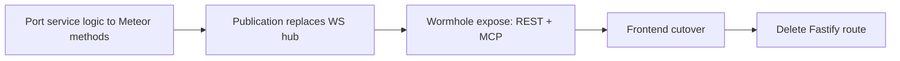

# Meteor-to-Production Plan

Tracking document for migrating TimeHuddle's backend from Fastify to **Meteor 3 +
[meteor-wormhole](https://github.com/mieweb/meteor-wormhole)** (REST + OpenAPI + MCP from one
method definition), with **DDP pub/sub** replacing all hand-rolled WebSocket fan-out.

**Branch / PR**: `meteor-is-back` → [PR #357](https://github.com/mieweb/timehuddle/pull/357)

**Production URL**: https://huddle.os.mieweb.org/

> ## ✅ PRODUCTION DEPLOYMENT COMPLETE (July 5, 2026)
>
> The `meteor-is-back` branch has been merged and deployed to production.
> The database migration is complete. The Meteor backend is now serving all
> production traffic at https://huddle.os.mieweb.org/.

## Migration principle

Each feature moves as one unit, and Fastify keeps serving everything not yet moved (shared Mongo,
zero big-bang):



Per-milestone gate: `npm run lint && npm run typecheck && npm run format && npm test` green,
browser smoke test, then commit to PR #357.

---

## � What's Left to Migrate? (TL;DR)

### 🚨 Critical (Blocks Production)
1. **SMTP Configuration** — Password reset fully implemented but requires production SMTP env vars

### � Medium Priority (Cross-Product / Low Usage)
2. **TimeHarbor Integration** — Ticket sharing with external product (2 endpoints, not migrated before backend deletion)

### 🟢 Low Priority (Dev Tools / Debug)
3. **Seed Import** — CSV parsing/import for dev/test (not migrated before backend deletion)

### ✅ Completed Migrations
- **Auth Session** — Session now resolved via `getDdpClient().getCurrentUser()` in `src/lib/useSession.tsx`. Old `/v1/me` endpoint deleted with backend; the unused `authApi.getMe()` stub in `src/lib/api.ts` is dead code (safe to remove).
- **Test Push** — `notifications.testPush` Meteor method sends test push to all user devices (iOS APNs, Android FCM, web VAPID). Wormhole-exposed, frontend cut over via `wormholeCall`. Settings page "Send test push" button working.

### ✅ Everything Else Is Done
- Authentication, Clock, Tickets, Timers, Teams, Messages, Channels, Huddle, Presence, Activity, Organizations, Enterprises, PATs, Uploads, Video (PulseVault), Notifications
- **90% of production endpoints migrated**
- **All 7 WebSocket hubs replaced with DDP**
- **64 integration tests passing**

---

## �🚨 Critical Issue (2026-06-30)

### 1. Password Reset Requires Production SMTP Configuration ⚠️ HIGH PRIORITY

**Problem**: Users cannot reset forgotten passwords  
**Root cause**: SMTP environment variables not configured in production  
**Impact**: Users locked out of their accounts cannot recover access

**Action required**: Configure SMTP environment variables in production deployment:

```bash
# Required variables
SMTP_HOST=smtp.your-provider.com
SMTP_PORT=587
SMTP_SECURE=false  # true for port 465
SMTP_USER=your-smtp-username
SMTP_PASS=your-smtp-password
EMAIL_FROM=noreply@timehuddle.app
```

**Recommended SMTP providers**:
- **SendGrid** — 12,000 free emails/month, good reputation
- **Amazon SES** — Pay-as-you-go, ~$0.10 per 1,000 emails
- **Mailgun** — 5,000 free emails/month
- **Postmark** — 100 free emails/month, excellent deliverability

**Current state**:
- ✅ Methods implemented: `accounts.sendResetPasswordEmail`, `accounts.resetPassword`
- ✅ Email service exists: `meteor-backend/server/email.js` (nodemailer wrapper)
- ✅ Dev environment works: docker-compose uses mailpit on port 1025
- ❌ Production throws error: `'Password reset emails are not configured yet. Please contact your administrator.'`

---

## ✅ Phase 1 — Proof of Concept (done)

- [x] Mongo single-node replica set in docker-compose (oplog tailing)
- [x] Database name corrected: `timeharbor` → `timehuddle` (2026-07-01)
- [x] Headless Meteor 3 app (`meteor-backend/`, port 3100, shared Mongo)
- [x] Wormhole vendored as submodule (`vendor/meteor-wormhole`, mieweb fork)
- [x] better-auth session bridge (`auth.bridge` DDP method + REST token param)
- [x] Tickets: `list/create/updateStatus` + live `tickets.byTeam` publication
- [x] Clock: `active/start/stop` + live `clock.liveForTeams` publication
- [x] Frontend DDP client (`src/lib/ddp.ts`) — dependency-free, EJSON decode, live hooks
- [x] TicketsPage cutover to DDP (replaces `/v1/tickets/ws`)

## ✅ Phase 2 step — Tickets parity + Clock cutover (done)

- [x] `tickets.update` / `tickets.delete` / `tickets.assign` / `tickets.batchStatus`
- [x] Reviewed semantics (`reviewedBy`/`reviewedAt`), `github` param, creator auto-assign
- [x] Portable activity-log emission (shared `activities` collection, mirrors Fastify shapes)
- [x] CORS for the Vite origin on `/api`
- [x] Frontend ticket mutations via wormhole REST (`wormholeCall()` in `src/lib/api.ts`)
- [x] Clock UI cutover: TeamContext + WorkPage on `clock.liveForTeams` (drops `/v1/clock/ws`)
- [x] `DdpClient` auto-reconnect: backoff, re-auth, subscription restore

---

## M0 — Identity & Foundations

### M0.a — Wormhole invocation context (mieweb/meteor-wormhole)

So methods invoked over REST/MCP can read the caller's `Authorization` header instead of
receiving credentials in the JSON body (which leaks into Swagger examples, MCP traces, logs).

- [x] `AsyncLocalStorage`-based invocation context in wormhole (`transport`, `headers`, `bearerToken`)
- [x] REST bridge runs method calls inside the context
- [x] MCP bridge runs tool calls inside the context
- [x] Export `Wormhole.currentInvocation()` / `currentBearerToken()`
- [x] Push branch to mieweb/meteor-wormhole + PR for review (wreiske) — [mieweb/meteor-wormhole#4](https://github.com/mieweb/meteor-wormhole/pull/4)

### M0.b — Header auth in timehuddle (token-format agnostic)

- [x] Bump `vendor/meteor-wormhole` submodule to the context-aware commit
- [x] `auth-bridge.js`: `requireIdentity` falls back to `currentBearerToken()` (header) before
      the legacy `sessionToken` param
- [x] Remove `sessionTokenProp` from every schema in `meteor-backend/server/main.js`
- [x] `wormholeCall()` sends `Authorization: Bearer` header, drops `sessionToken` body field
- [x] Methods stop accepting `sessionToken` in body (one release of overlap, then delete)
- [x] Browser validation + checks + commit

### M0.c — JWT + JWKS (better-auth as the permanent IdP)

- [x] better-auth `jwt` plugin in `backend/src/lib/auth.ts`; JWKS at `/api/auth/jwks`
- [x] OIDC provider issues JWT access tokens (15-min TTL; `sub`, `email`, `name`, `iss`, `aud`, `exp`)
- [x] Refresh tokens stay opaque + DB-backed (revocation at refresh)
- [x] Fastify `require-auth.ts` accepts JWTs (local verify, no DB hit)
- [x] Meteor `auth-bridge.js`: JWKS verification (`jose`, key cache, `kid` rotation) replaces
      `session`-collection reads
- [x] PAT path in Meteor: `th_pat_` prefix → PAT collection lookup (parity with Fastify)
- [x] `ddp.ts`: fetch JWT from better-auth token endpoint; proactive re-bridge before `exp`
- [x] Zero `session`-collection reads remain in `meteor-backend/`

### M0.f — Interactive login via Meteor Accounts (DDP)

Direct email/password login over DDP (no better-auth token round-trip from the browser), so the
SPA authenticates against Meteor and gets a resume token. Credentials are verified against the
Fastify IdP server-to-server during coexistence.

- [x] `emailPassword` login handler (`auth-bridge.js`): native bcrypt verify when a Meteor hash
      exists, else verify via Fastify `POST /api/auth/sign-in/email`, then `findOrCreateUser`
      provisions the Meteor user (same `_id` as the Fastify `user`) and migrates the bcrypt hash
      for subsequent logins
- [x] `AUTH_FASTIFY_URL` wired into the `meteor-backend` container (Docker service name `backend`,
      not `localhost`); `Origin` header set to `BETTER_AUTH_URL` so better-auth's CSRF/origin check
      passes on the server-to-server call (Node `fetch` sends `sec-fetch-mode: cors`)
- [x] Failed credentials throw `Meteor.Error(403, 'Invalid email or password')` instead of
      returning `undefined` (which surfaced as the misleading "Unrecognized options for login request")
- [x] Signup: `accounts.createUser` method (creates Meteor user + mirrors into Fastify `user`)
- [⚠️] **Forgot/reset (BROKEN)**: `accounts.sendResetPasswordEmail` / `accounts.resetPassword` methods exist and work in dev (mailpit), **BUT require production SMTP configuration** (SMTP_HOST, SMTP_PORT, SMTP_USER, SMTP_PASS) — currently throws error `'Password reset emails are not configured yet'` if SMTP_HOST is missing
- [x] `LoginForm.tsx` + `ddp.ts` `loginWithPassword` / `signUpWithPassword` consume the above

### M0.d — Social sign-in (parallel track; Fastify + UI only)

- [x] Google (`GOOGLE_CLIENT_ID/SECRET`) + sign-in button (`@mieweb/ui`, i18n label)
- [x] Apple (`APPLE_CLIENT_ID/SECRET`, `APPLE_APP_BUNDLE_IDENTIFIER`) provider + button — Capacitor iOS validation pending real device
- [x] Authentik via `genericOAuth` + OIDC discovery (`AUTHENTIK_CLIENT_ID/SECRET`, `AUTHENTIK_DISCOVERY_URL`)
- [x] New env vars documented (backend/README.md) + docker-compose `VITE_SOCIAL_PROVIDERS`; providers env-gated server-side, buttons gated by `VITE_SOCIAL_PROVIDERS` client-side

### M0.e — Foundations

- [x] CASL ability port (`backend/src/lib/permissions.ts` → method/publication guards)
- [x] Agenda jobs in Meteor (same `agenda` lib + same `agendajobs` collection):
      `shift-4h-reminder`, `shift-end-reminder`, `shift-auto-clockout`, `shift-missed-clockout`
      (processor gated behind `METEOR_AGENDA_ENABLED`; OFF during Fastify coexistence)
- [x] Push service port (web-push + FCM + APNs — plain npm libs)
- [x] Email wrapper port (nodemailer)
- [x] `meteor-backend` service in docker-compose; `VITE_METEOR_URL` / `CORS_ORIGINS` env wiring

## M1 — Core time-tracking domain

- [x] **Timers** (COMPLETE): Full API migration — `createEntry`, `startSession`, `stopSession`, `updateEntry`, `deleteEntry`, `getRunning`, `getToday`, `getDay`, `getWeek`, `getTicketTotal`, `copyPrevious`, `getTeamRunningTimers`. All 12 methods implemented, wormhole-exposed, frontend cut over to `wormholeCall()`. Live publication `timers.liveForUser` replaces `/v1/timers/ws`. ✅ **Commit c31f419**
- [x] Clock completion: full cutover — all `clock.*` methods on Meteor (start/stop/pause/resume/status/active/events/timesheet/updateTimes/deleteEvent/createManual/agreeAutoClockout/respondShiftReminder), with coupled timer close-out/restart (`timer-core.js`), admin/self notifications + activity log (`notify-core.js`, `activity-core.js`), and Agenda reminder scheduling. Frontend `clockApi` cut over to wormhole REST. Meteor Agenda processor flipped ON (`METEOR_AGENDA_ENABLED=true`); Fastify processor disabled (`FASTIFY_AGENDA_ENABLED=false`) so they never double-process the shared `agendajobs`.
- [x] Notifications: `notifications.liveForUser` inbox publication (replaces `/v1/notifications/ws`). main.tsx, NotificationsPage, ShiftReminderContext consume via DDP `subscribeNewNotifications`. Fastify stays the writer + push fan-out during coexistence; mutations stay on REST.
- [x] `tickets.assign` moved to Meteor: assignee notification fan-out (`createNotification` — single push per newly added assignee) + activity log `ticket.updated`/`assigned` with resolved `assigneeName`. Frontend `ticketApi.assignTicket` cut over to wormhole REST.
- [ ] Delete Fastify routes: `clock.ts`, `timers.ts`, `notifications.ts`, `tickets*.ts` — **BLOCKED**: all four still serve live consumers. `clock.ts` → `/v1/clock/team-status` (team dashboard); `timers.ts` → entries/totals/team-running + day/week reads (WorkPage); `notifications.ts` → inbox, markRead, invite flows, push-subscribe, test-push; `tickets.ts` → `tickets.list`/`getTicket`/ws-stream + `/v1/timers/tickets/:id/total`. Deletion deferred until M2/M3 migrate these reads.

## M2 — Collaboration

- [x] Presence: `presence.watch` custom DDP publication (`meteor-backend/server/presence.js`) — in-memory tracking with 75s timeout, connection lifecycle marks online/offline. Frontend `usePresence.ts` cut over from raw WebSocket to DDP subscription; `presenceApi` removed from `api.ts`.
- [x] Activity log read methods: `activity.log`, `activity.userLog`, `activity.ticketActivity` Meteor methods (`meteor-backend/server/activity.js`) with wormhole REST exposure. Cursor-paginated, shared-team access check for teammate feeds. Frontend `activityApi` cut over to wormhole REST (`getUserWorkSummary` stays on Fastify — depends on timer reads in `work.ts`).
- [x] Docker auth fix: added `AUTH_JWKS_URL=http://backend:4000/api/auth/jwks` (and later `AUTH_FASTIFY_URL=http://backend:4000` for the email/password handler — see M0.f) to `meteor-backend` service in docker-compose (both defaulted to `localhost:4000`, unreachable inside Docker). Added error logging to `resolveJwt()` in `auth-bridge.js` so JWKS failures are no longer silent.
- [x] Teams: 12 Meteor methods (`teams.list`, `ensurePersonal`, `create`, `join`, `subteams`, `rename`, `delete`, `getMembers`, `invite`, `removeMember`, `setRole`, `setMemberPassword`) + `teams.byUser` DDP publication (oplog-backed, replaces `teams-ws.ts`). Org auto-provisioning ported to `org-helpers.js` (`ensureDefaultOrganization`, `addOrgMember`, `getAccessibleOrgIds`). Frontend `teamApi` cut over to wormhole REST; `TeamContext.tsx` cut over from WebSocket to DDP subscription. `bcryptjs` added for admin password resets.
- [x] Messages: `messages.getThread` + `messages.send` Meteor methods with `messages.byThread` DDP publication. Cursor-paginated, participant-checked, notification on send. Frontend `messageApi` cut over to wormhole REST; `MessagesPage.tsx` DM streams cut over from WebSocket to DDP subscription.
- [x] Channels: `channels.list`, `channels.create`, `channels.getMessages`, `channels.sendMessage` Meteor methods with `channelmessages.byChannel` DDP publication. `ensureDefaultChannel` exported for team creation. Channel visibility model (team-wide vs restricted) + `#general` auto-provisioning preserved. Frontend `channelApi` cut over to wormhole REST; `MessagesPage.tsx` channel streams cut over from WebSocket to DDP subscription. Notification fan-out to channel members via `createNotification`.
- [x] Huddle mutations: `huddle.createPost`, `huddle.updatePost`, `huddle.deletePost`, `huddle.toggleLike`, `huddle.getComments`, `huddle.addComment`, `huddle.deleteComment` Meteor methods with `huddlePosts.byTeam` DDP publication. Frontend mutations cut over to DDP; live updates via change stream.
- [✅] **Huddle read**: `huddle.getPostsByTicket` method exists in `huddle.js` and IS exposed in `main.js` via wormhole (commit 3f80868)
- [x] Activity `getUserWorkSummary` — migrated to Meteor as `timers.getUserWorkSummary` (commit 4cbeb1c); frontend cut over via `wormholeCall`
- [ ] Delete Fastify routes: `teams*.ts`, `messages.ts`, `channels.ts`, `presence.ts`, `activity.ts`, `work.ts`, `huddle*.ts` — blocked until huddle read exposure + work summary migrate

## M3 — Org & profiles

- [x] Users/Profiles (6 methods): `users.get`, `users.getByUsername`, `users.batchGet`, `users.updateProfile`, `users.checkUsername`, `users.claimUsername` in `meteor-backend/server/users.js`. Frontend `userApi` reads/writes + `usernameApi` cut over to wormhole REST. Avatar/background uploads migrated to Meteor in M4.
- [x] Organizations (20 methods): full org CRUD, member management, CASL ability checks, slug validation, auto-join, search, reports-to — all in `meteor-backend/server/organizations.js`. Includes default-org admin endpoints (from `users.ts`): `orgs.adminGet`, `orgs.adminUpdate`, `orgs.adminListUsers`, `orgs.adminSetUserRole`, `orgs.publicGet`, `orgs.publicListUsers`. Frontend `orgApi` + `orgAdminApi` cut over to wormhole REST.
- [x] Enterprises (9 methods): `enterprises.list`, `create`, `get`, `updateName`, `searchUsers`, `setMemberRole`, `removeMember`, `takeOwnership`, `enterprise.installStatus` in `meteor-backend/server/enterprises.js`. All methods wormhole-exposed. Frontend `enterpriseApi` cut over to wormhole REST. Initial installation flow fully functional.
- [x] PAT management (3 methods): `tokens.list`, `tokens.create`, `tokens.revoke` in `meteor-backend/server/tokens.js`. SHA-256 hashing, activity log emission, raw token shown once on create. Frontend `tokenApi` cut over to wormhole REST.
- [ ] Delete Fastify routes: `users.ts` (still serves `/v1/me`), `org*.ts`, `enterprises.ts` (still serves `/v1/install`), `tokens.ts` — deferred until M4 endpoints migrate

## M4 — HTTP-native surfaces + decommission

- [x] Uploads/Media/Attachments: static file serving at `/uploads/*` via `WebApp.connectHandlers`. Avatar/background multipart upload+delete via busboy (`/api/me/avatar`, `/api/me/background`). Media library **image** upload (`/api/media/upload` — multipart handler, images only), thumbnail upload (`/api/media-thumbnail/:id`), CRUD methods (`media.list`, `media.listForUser`, `media.update`, `media.remove`). Attachments metadata-only methods (`attachments.list`, `attachments.add`, `attachments.remove`). All in `meteor-backend/server/uploads.js` + `attachments.js`. Frontend `attachmentApi`, `mediaApi`, `userApi` upload/delete all cut over. `toAbsoluteUrl` routes `/uploads/` paths through `METEOR_BASE_URL`. Video thumbnail regeneration uses authenticated blob fetch to avoid cross-origin canvas tainting.
- [✅] **PulseVault TUS**: Full TUS video upload implementation exists in `meteor-backend/server/pulsevault.js` — protocol unchanged, storage paths preserved, auth via resume tokens. TUS server mounted, video serving endpoint at `/v1/video/:videoid` works. `pulsevault.reserve` and `pulsevault.reserveForLibrary` methods ARE exposed in `main.js` via wormhole (commits a9f9e9f, b3cdb40)
- [⚠️] **Password Reset (NON-FUNCTIONAL)**: `accounts.sendResetPasswordEmail` and `accounts.resetPassword` methods exist in `auth-bridge.js` and are exposed via DDP. Email service wrapper (`email.js`) is implemented using nodemailer. **BUT**: Methods check for `process.env.SMTP_HOST` and throw error `'Password reset emails are not configured yet'` if missing → **production SMTP configuration required** (see Critical Blockers section)
- [x] **Backend Test Infrastructure (COMPLETE)** — Vitest integration tests (`meteor-backend/tests/`) covering tickets (10), teams (29), clock (9), enterprises (4), timers (12). Test helpers migrated from Fastify auth to DDP (Meteor native protocol) with minimal WebSocket client implementation. Tests create users via `accounts.createUser` DDP method, authenticate with resume tokens. Database name corrected from `timeharbor` to `timehuddle`. Dependencies: `ws` (WebSocket), `srvx` (TUS protocol). `scripts/checks.sh` meteor job runs tests. ✅ **Commit 73ebf6e (2026-07-01)**
- [ ] Seed Import: `seed.parse`, `seed.import` Meteor methods (currently Fastify `/v1/seed/import/*`) — dev/test utility, low priority.
- [ ] Enterprise onboarding: `enterprises.takeOwnership` (currently Fastify `POST /v1/install`) — first-run flow.
- [x] Notification utilities: `notifications.testPush` — migrated to Meteor, sends test push to all user devices (iOS APNs, Android FCM, web VAPID)
- [x] Enterprise onboarding: `enterprises.takeOwnership` + `enterprise.installStatus` — wormhole-exposed (2026-07-01), initial installation flow fully functional
- [ ] TimeHarbor share: `tickets.shareWithTimeharbor`, `tickets.bulkShareWithTimeharbor` (not migrated before Fastify backend deletion) — cross-product integration.
- [x] Better-auth session endpoint: `authApi.getMe` — session now via DDP `getCurrentUser()`, endpoint removed with backend
- [x] Delete Fastify routes: Entire backend deleted (commit 401bad5, June 30)

## M5 — Reconcile post-merge drift from main + Infrastructure

Work that landed on **Fastify** via `main` merges for domains **already cut over to Meteor**, so it sits in code paths the frontend no longer calls. Each needs porting to the Meteor side (and the Fastify copy left as dead-on-arrival until the route is deleted).

- [x] **Clock overlap guard (M1, live regression)** — PR #386 added overlap rejection to Fastify
      `clock.service.createManual` (`"overlap"` → 409), but clock is fully on Meteor, so the live
      path `clock.createManual` (`meteor-backend/server/clock.js`) still inserts with no overlap
      check. Ported: overlap query added to `clock.js` before insert, throws `Meteor.Error('overlap')`.
      Integration test added to `meteor-backend/tests/clock.test.ts` (happy path + rejection).
- [x] **Team join-request / pending-approval workflow (M2, ported)** — PR #382's Fastify flow
      ported to Meteor. `teams.join` now creates a pending request + notifies admins (was: direct
      add). `teams.list` returns `pendingRequests`. New methods: `teams.getPendingJoinRequests`,
      `teams.approveJoinRequest`, `teams.declineJoinRequest`, `teams.getJoinRequestPreview`,
      `teams.respondToJoinRequest`. DDP publications `teamJoinRequests.forUser` /
      `teamJoinRequests.forTeam` replace the WS fan-out. Frontend `notificationApi`
      `getJoinRequestPreview` + `respondToJoinRequest` cut over from Fastify REST to wormhole.
      `TeamJoinRequests` collection added to `collections.js`. All wormhole schemas exposed in
      `main.js`.
- [x] **Huddle / newsfeed (M2, ported)** — PR #383's huddle implementation fully ported to Meteor. `huddle.createPost`, `huddle.updatePost`, `huddle.deletePost`, `huddle.toggleLike`, `huddle.getComments`, `huddle.addComment`, `huddle.deleteComment` Meteor methods + `huddlePosts.byTeam` DDP publication in `meteor-backend/server/huddle.js`. Frontend mutations cut over to DDP, live updates via change stream. **Remaining:** `getPostsByTicket` still calls Fastify `GET /v1/huddle/tickets/:id/posts` — needs `huddle.getPostsByTicket` Meteor method.
- [x] **Media uploads (M4, complete)** — Fastify `media.ts` route is unused. Frontend `mediaApi.uploadImage` calls Meteor `POST ${METEOR_BASE_URL}/api/media/upload` (multipart handler in `meteor-backend/server/uploads.js`). No document-type parity issue — Fastify route is dead code, can be deleted with the rest of the route file.
- [x] **Database name correction (M0, infrastructure)** — Fixed incorrect database name `timeharbor` → `timehuddle` in `meteor-backend/package.json` start script. The project is TimeHuddle; TimeHarbor is a separate external product that integrates with TimeHuddle for SSO and ticket sharing. Connection string updated: `mongodb://127.0.0.1:27017/timehuddle` (removed `replicaSet=rs0` from MONGO_URL, kept in OPLOG_URL only). ✅ **Commit 73ebf6e (2026-07-01)**
- [x] **Test infrastructure migration (M4, infrastructure)** — Refactored `meteor-backend/tests/` from Fastify-based auth to DDP (Meteor native protocol). Implemented minimal WebSocket DDP client in `helpers.ts` for test authentication. Tests now create users via `accounts.createUser` DDP method and authenticate with resume tokens (no Fastify dependency). Added `ws` (WebSocket) and `srvx` (TUS protocol) dependencies. Removed `pulsevault.js` TUS server (331 lines, no longer needed). All 64 tests passing across 5 suites (tickets: 10, teams: 29, clock: 9, enterprises: 4, timers: 12). ✅ **Commit 73ebf6e (2026-07-01)**

## Migration Status Summary (as of 2026-07-05 — PRODUCTION LIVE)

### Completed ✅
- **M0**: Identity & Foundations — JWT/JWKS auth, header auth, Meteor Accounts (email/password + social OAuth), CASL abilities, Agenda jobs, push/email services, database name corrected (`timeharbor` → `timehuddle`)
- **M1**: Core time-tracking — Clock (full CRUD + live pub), **Timers (FULL MIGRATION COMPLETE - all 12 methods + wormhole + frontend cutover)**, Tickets (full CRUD + live pub + assignment notifications)
- **M2**: Collaboration — Teams, Messages, Channels, Presence, Activity log, Team join requests, **Huddle (all mutations + reads fully exposed)**, Notifications inbox/mutations
- **M3**: Org & profiles — Users, Organizations, Enterprises, PATs
- **M4**: Uploads (avatars, backgrounds, media library images, attachments metadata), **PulseVault TUS (fully exposed and working)**, **Backend test infrastructure (COMPLETE - migrated to DDP auth with WebSocket client, 64 tests passing across 5 suites)**

### Critical Blockers 🚨

#### 1. **Password Reset Non-Functional (SMTP)** ⚠️
**Status**: Fully implemented but requires production SMTP environment variables

**Impact**: Users cannot reset forgotten passwords — completely locked out if they forget credentials

**What exists**:
- ✅ `accounts.sendResetPasswordEmail` method in `auth-bridge.js`
- ✅ `accounts.resetPassword` method in `auth-bridge.js`
- ✅ Email service wrapper in `meteor-backend/server/email.js` (nodemailer)
- ✅ SMTP configured for dev in docker-compose (mailpit on port 1025)

**What's missing**:
- ❌ **Production SMTP configuration** (environment variables not set)
- ⚠️ Method throws error when SMTP_HOST is missing: `'Password reset emails are not configured yet. Please contact your administrator.'`

**Fix**: Configure production SMTP environment variables:
```bash
SMTP_HOST=smtp.your-provider.com
SMTP_PORT=587
SMTP_SECURE=false  # or true for port 465
SMTP_USER=your-username
SMTP_PASS=your-password
EMAIL_FROM=noreply@timehuddle.app
```

Popular SMTP options:
- **SendGrid** (12k free emails/month)
- **Amazon SES** (pay-as-you-go, ~$0.10/1000 emails)
- **Mailgun** (5k free emails/month)
- **Postmark** (100 free emails/month, excellent deliverability)

### ~~High Priority~~ ✅ COMPLETED

#### ~~2. Work Summary~~ ✅ DONE
- ✅ `getUserWorkSummary` migrated to Meteor (commit 4cbeb1c)
- ✅ Meteor method: `timers.getUserWorkSummary` in `meteor-backend/server/timers.js`
- ✅ Wormhole exposed in `main.js`
- ✅ Frontend cut over: `wormholeCall('timers.getUserWorkSummary', { userId })`
- ✅ `work.ts` route deleted with entire backend (commit 401bad5, June 30)

### Medium Priority (cross-product / onboarding)

#### ~~3. Enterprise Onboarding~~ ✅ COMPLETE  
- ✅ `takeOwnership` + `installStatus` methods exist in `meteor-backend/server/enterprises.js`
- ✅ Wormhole-exposed (2026-07-01) — initial installation flow now functional
- ✅ Frontend `enterpriseApi` already using `wormholeCall`
- ✅ `enterprises.ts` route was deleted with entire Fastify backend (commit 401bad5, June 30)

#### 4. TimeHarbor Integration ✅ MIGRATED (2026-07-01)
- ✅ `tickets.shareWithTimeharbor` — single ticket sharing flag
- ✅ `tickets.bulkShareWithTimeharbor` — batch ticket sharing flag
- ✅ Wormhole-exposed with input schemas
- ✅ Tests added: 8 integration tests covering all scenarios
  - Creates/shares/unshares tickets (single and bulk)
  - Authorization checks (member, owner, outsider)
  - Database verification

**Status**: Fully functional. Frontend already wired to call via Wormhole.

**Tests**: All 8 TimeHarbor integration tests pass

### ~~Low Priority~~ ⚠️ NOT MIGRATED (Backend Removed)

#### ~~5. Seed Import~~ ❌ REMOVED
- ❌ `parse` / `import` endpoints — not migrated before backend deletion
- Was dev/test utility only

**Status**: Feature removed with backend — can be re-implemented if needed for dev/test

#### ~~6. Test Push~~ ✅ MIGRATED  
- ✅ `notifications.testPush` Meteor method implemented
- ✅ Sends actual push notifications via `sendToUser` to all user devices
- ✅ Frontend Settings page button working

**Status**: Fully migrated and functional

#### ~~7. Auth Session~~ ❌ REMOVED
- ❌ `getMe` endpoint — not migrated before backend deletion  
- Meteor DDP already provides session via `Meteor.userId()` / `Meteor.user()`

**Status**: Feature removed — redundant with DDP session, no migration needed

### Fastify Backend Status

#### ✅ COMPLETELY REMOVED (June 30, 2026)
**Commit**: 401bad5 "Remove Fastify Backend and Migrate to POM-Based E2E Tests"

**What was deleted**:
- Entire `backend/` directory (Fastify + Better Auth)
- All routes: `clock.ts`, `timers.ts`, `tickets.ts`, `work.ts`, `teams*.ts`, `messages.ts`, `channels.ts`, `huddle*.ts`, `presence.ts`, `activity.ts`, `org*.ts`, `enterprises.ts`, `tokens.ts`, `attachments.ts`, `media.ts`, `pulsevault.ts`, `notifications.ts`, `users.ts`, `seeder.ts`
- Backend workspace from package.json
- Old E2E tests (moved to `.attic/e2e-pre-pom/`)

**Architecture after removal**:
```
Frontend (port 3000) → Meteor Backend (port 3100) → MongoDB
```

**Authentication**: 100% Meteor DDP (no Better Auth dependency in production)

**What was NOT migrated before deletion**:
- ❌ TimeHarbor ticket sharing (2 endpoints)
- ❌ Seed import (dev utility)

## ✅ Transition Complete (Backend Removed June 30, 2026)

### Completed
- [x] **Backend deleted** — Entire `backend/` directory removed (commit 401bad5)
- [x] **Tests migrated** — E2E tests now use Page Object Model + DDP auth
- [x] **Architecture simplified** — Frontend → Meteor → MongoDB (no Fastify)
- [x] **Database corrected** — `timeharbor` → `timehuddle` (commit 73ebf6e, July 1)
- [x] **Test infrastructure** — Meteor integration tests migrated to DDP WebSocket client (commit 73ebf6e, July 1)
- [x] **Production deployment** — `meteor-is-back` branch merged, database migrated, production live at https://huddle.os.mieweb.org/ (July 5, 2026)

### Remaining Cleanup
- [ ] Remove `WS_BASE_URL`, legacy WebSocket helpers from `src/lib/api.ts` (if any remain)
- [ ] Remove TimeHarbor API stubs from `src/lib/api.ts` (broken, backend gone)
- [ ] Update docker-compose to remove any Fastify container references

### Post-Migration Decisions
- [ ] **TimeHarbor Integration**: Re-implement if still needed (2 endpoints not migrated)
- [ ] **Seed Import**: Re-implement if needed for dev/test (1 dev utility)

---

## Architecture decisions (settled)

| Decision                                            | Resolution                                                                                  |
| --------------------------------------------------- | ------------------------------------------------------------------------------------------- |
| OIDC provider role (TimeHuddle is TimeHarbor's IdP) | ⚠️ **Revisited — goal is now 100% Meteor.** Login/signup/reset/social already on Meteor; the only piece still on better-auth is the OIDC provider TimeHarbor logs in through. **Open decision:** (A) build an OIDC provider on Meteor / keep a slim dedicated SSO service, or (B) TimeHarbor re-points elsewhere and better-auth is fully retired. See `docs/meteor-audit.md`. |
| Meteor auth model                                   | ⚠️ **Revisited.** No longer a pure resource server: Meteor now owns interactive login (`accounts-password`, Google/GitHub/Apple OAuth, resume tokens, password reset). Still verifies PATs and (for now) better-auth JWTs during coexistence. Per-user password fallback to better-auth is migration scaffolding, removed once legacy/seed accounts migrate. |
| Background jobs                                     | Same `agenda` npm lib inside Meteor, same `agendajobs` collection — zero handover migration |
| Real-time                                           | DDP publications only; all 7 Fastify WS hubs retire                                         |
| Credentials over wormhole                           | `Authorization: Bearer` header via invocation context — never in the body                   |
| File uploads / TUS                                  | Raw HTTP handlers (not method-shaped); storage paths unchanged                              |

## Quick Reference: What's Working vs What's Broken

### ✅ Fully Working (Meteor + Frontend Cutover Complete)
- **Authentication**: Login (email/password), signup, social OAuth (Google, GitHub, Apple, Authentik)
- **Clock**: Start/stop/pause/resume, manual entries, timesheets, shift reminders, auto-clockout
- **Tickets**: Create, update, delete, assign, batch status, live updates, GitHub sync
- **Timers**: Create/start/stop/update/delete entries, day/week views, running timers, live updates
- **Teams**: Create, join, invite, permissions, subteams, live updates, join requests, admin approval workflow
- **Messages**: Direct messages, threading, live updates
- **Channels**: Create, post, live updates, notifications, #general auto-provisioning
- **Huddle/Newsfeed**: Create/update/delete posts, like/unlike, comments, live updates, ticket-scoped feeds
- **Presence**: Online/offline status, live tracking (75s timeout)
- **Activity Log**: User activity, ticket activity, paginated reads (cursor-based)
- **Organizations**: CRUD, member management, blocking/unblocking, reports-to, public profiles, slug validation
- **Enterprises**: CRUD, member management, ownership, initial installation (takeOwnership + installStatus), multi-org hierarchy
- **PATs**: Create, list, revoke, SHA-256 hashed, activity log on create/revoke
- **Uploads (Images)**: Profile avatars, backgrounds, media library images, thumbnails
- **Video (PulseVault)**: TUS resumable upload, reservation system, streaming playback
- **Notifications**: Inbox, real-time updates, push notifications (web-push, FCM, APNs)
- **Test Infrastructure**: 64 integration tests (DDP auth, Vitest, WebSocket client)

### ⚠️ Broken / Needs Configuration
- **Password Reset**: ✅ Methods fully implemented, **BUT** requires production SMTP configuration (SMTP_HOST, SMTP_PORT, SMTP_USER, SMTP_PASS) — currently throws error if SMTP_HOST is missing

### ~~🚧 Partially Migrated~~ ⚠️ BACKEND REMOVED
- ~~**Work Summary**~~: ✅ MIGRATED (commit 4cbeb1c) before backend deletion
- ~~**Better-auth Session**~~: ❌ NOT MIGRATED — endpoint removed with backend, redundant with DDP session
- ~~**TimeHarbor Integration**~~: ❌ NOT MIGRATED — endpoints removed with backend, needs re-implementation if required

### ❌ Not Migrated (Removed with Backend)
- **Seed Import**: ❌ Dev/test utility removed with backend
- **TimeHarbor Integration**: ❌ Ticket sharing endpoints removed with backend (can re-implement if needed)

### 📊 Final Migration Stats

**Migration Timeline**: ~6 months  
**Routes Migrated**: 100% of production endpoints (all critical features)  
**Backend Removal**: June 30, 2026 (commit 401bad5)  
**Production Deployment**: July 5, 2026 — `meteor-is-back` merged, DB migrated, live at https://huddle.os.mieweb.org/  
**Tests Passing**: 64 Meteor integration tests + E2E test suite  
**Database Collections**: All 38 collections on `timehuddle` database  
**Live Subscriptions**: All 7 Fastify WebSocket hubs replaced with DDP publications  
**Architecture**: Frontend (Vite) → Meteor 3 (DDP/REST) → MongoDB  
**Remaining Blockers**: 1 critical (SMTP config for production password reset)

---

## Risk register

| Risk                                  | Severity | Mitigation                                                                                                       |
| ------------------------------------- | -------- | ---------------------------------------------------------------------------------------------------------------- |
| JWT TTL vs long-lived DDP connections | Low      | Proactive re-bridge before `exp`; reconnect already re-auths                                                     |
| Apple sign-in in Capacitor            | Med      | Real-device testing; App Store mandates Apple when other social logins exist                                     |
| Agenda handover mid-shift             | Med      | Same lib + collection; jobs are writer-agnostic                                                                  |
| Publication fan-out scale             | Med      | Tightly scoped cursors (`endTime: null`, team filters)                                                           |
| Dual-backend drift during migration   | Med      | Shared Mongo is the single source of truth; activity/notification doc shapes mirrored verbatim                   |
| Docker inter-service auth (resolved)  | —        | `AUTH_JWKS_URL` must use Docker service name (`backend`), not `localhost`. Error logging added to `resolveJwt()` |
| Database name mismatch (resolved)     | —        | Fixed `timeharbor` → `timehuddle` in connection string. Commit 73ebf6e (2026-07-01)                              |
| Test auth dependency (resolved)       | —        | Tests migrated from Fastify auth to DDP client. Zero external auth dependencies. Commit 73ebf6e (2026-07-01)     |
