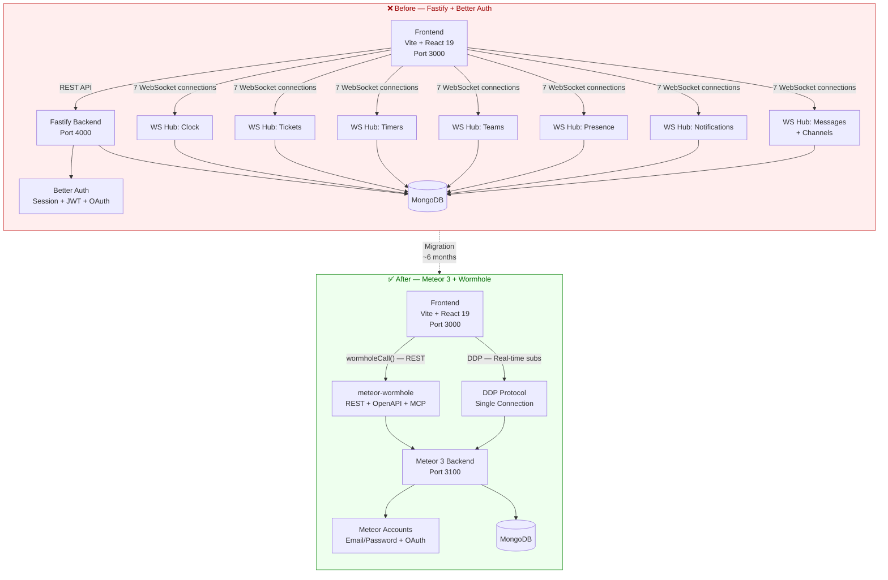
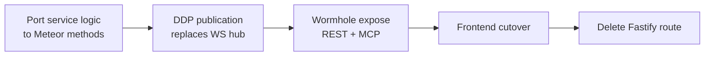

# Meteor-to-Production Plan — Migration Complete

Tracking document for migrating TimeHuddle's backend from **Fastify + Better Auth** to **Meteor 3 +
[meteor-wormhole](https://github.com/mieweb/meteor-wormhole)** (REST + OpenAPI + MCP from one
method definition), with **DDP pub/sub** replacing all hand-rolled WebSocket fan-out.

**Branch / PR**: `meteor-is-back` → [PR #357](https://github.com/mieweb/timehuddle/pull/357)

**Production URL**: https://huddle.os.mieweb.org/

> ## ✅ PRODUCTION DEPLOYMENT COMPLETE (July 5, 2026)
>
> The `meteor-is-back` branch has been merged and deployed to production.
> The database migration is complete. The Meteor backend is now serving all
> production traffic at https://huddle.os.mieweb.org/.

---

## Architecture: Before & After



---

## Migration Principle

Each feature moved as one unit. Fastify kept serving everything not yet moved (shared Mongo, zero
big-bang cutover):



Per-milestone gate: `npm run lint && npm run typecheck && npm run format && npm test` green,
browser smoke test, then commit to PR #357.

---

## What Was Replaced

### Authentication — Fastify + Better Auth → Meteor Accounts

| Capability | Fastify (Before) | Meteor (After) |
|---|---|---|
| Email/password login | Better Auth `POST /api/auth/sign-in/email` | `accounts-password` DDP login handler |
| Signup | Better Auth `POST /api/auth/sign-up/email` | `accounts.createUser` Meteor method |
| Password reset | Better Auth endpoints | `accounts.sendResetPasswordEmail` + `accounts.resetPassword` Meteor methods (nodemailer) |
| Social OAuth (Google, GitHub, Apple, Authentik) | Better Auth social providers | Meteor Accounts OAuth + `genericOAuth` for Authentik |
| Session management | Better Auth DB-backed sessions + JWT access tokens | Meteor resume tokens via DDP |
| Token verification | JWKS endpoint at `/api/auth/jwks`, Fastify `require-auth.ts` middleware | Meteor `resolveUser()` in `auth-bridge.js` (resume token + PAT) |
| Personal Access Tokens | Fastify `tokens.ts` route, SHA-256 hashed | `tokens.list/create/revoke` Meteor methods, same SHA-256 scheme |
| CASL permissions | `backend/src/lib/permissions.ts` | `meteor-backend/server/casl.js` — same ability definitions |
| Inter-service auth | N/A | JWT + JWKS bridge during coexistence (retired post-migration) |

### Real-Time — 7 WebSocket Hubs → DDP Publications

| Domain | Fastify WebSocket Hub | Meteor DDP Publication |
|---|---|---|
| Clock | `clock-ws.ts` — hand-rolled fan-out | `clock.liveForTeams` — oplog-backed cursor |
| Tickets | `tickets-ws.ts` | `tickets.byTeam` |
| Timers | `timers-ws.ts` | `timers.liveForUser` |
| Teams | `teams-ws.ts` | `teams.byUser` |
| Presence | `presence-ws.ts` — polling | `presence.watch` — in-memory + 75s timeout |
| Notifications | `notifications-ws.ts` | `notifications.liveForUser` (via `subscribeNewNotifications`) |
| Messages + Channels | `messages-ws.ts` + `channels-ws.ts` | `messages.byThread` + `channelmessages.byChannel` |

**Result**: 7 separate WebSocket connections replaced by **1 DDP connection** with multiplexed subscriptions.

### REST API — Fastify Routes → Wormhole Methods

Every Fastify route was replaced by a Meteor method exposed via `meteor-wormhole` (auto-generated REST + OpenAPI + MCP):

| Domain | Fastify Routes | Meteor Methods | Frontend Call |
|---|---|---|---|
| **Clock** | `clock.ts` (12 endpoints) | `clock.*` (12 methods) | `wormholeCall()` |
| **Tickets** | `tickets.ts` (8 endpoints) | `tickets.*` (8 methods) | `wormholeCall()` |
| **Timers** | `timers.ts` (12 endpoints) | `timers.*` (12 methods) | `wormholeCall()` |
| **Teams** | `teams.ts` + `teams-admin.ts` (12 endpoints) | `teams.*` (12 methods + join-request workflow) | `wormholeCall()` |
| **Messages** | `messages.ts` (2 endpoints) | `messages.*` (2 methods) | `wormholeCall()` |
| **Channels** | `channels.ts` (4 endpoints) | `channels.*` (4 methods) | `wormholeCall()` |
| **Huddle** | `huddle.ts` (7 endpoints) | `huddle.*` (7 methods) | `wormholeCall()` + DDP |
| **Organizations** | `org.ts` + `org-admin.ts` (20 endpoints) | `orgs.*` (20 methods) | `wormholeCall()` |
| **Enterprises** | `enterprises.ts` (9 endpoints) | `enterprises.*` (9 methods) | `wormholeCall()` |
| **Users/Profiles** | `users.ts` (6 endpoints) | `users.*` (6 methods) | `wormholeCall()` |
| **Activity** | `activity.ts` (3 endpoints) | `activity.*` (3 methods) | `wormholeCall()` |
| **Work Summary** | `work.ts` (1 endpoint) | `timers.getUserWorkSummary` | `wormholeCall()` |
| **Notifications** | `notifications.ts` (6 endpoints) | `notifications.*` (mutations + `testPush`) | `wormholeCall()` |
| **PATs** | `tokens.ts` (3 endpoints) | `tokens.*` (3 methods) | `wormholeCall()` |
| **Presence** | `presence.ts` (1 endpoint) | `presence.watch` (DDP pub) | DDP subscription |

### Uploads & Media — Fastify Multipart → Meteor HTTP Handlers

| Feature | Before | After |
|---|---|---|
| Avatar/background upload | Fastify multipart + static serve | busboy on `WebApp.connectHandlers` (`/api/me/avatar`, `/api/me/background`) |
| Media library images | Fastify `media.ts` multipart | Meteor `/api/media/upload` + `media.*` methods |
| Video (PulseVault) | Fastify TUS server | Meteor TUS server (`pulsevault.js`) + `pulsevault.reserve*` methods |
| Attachments | Fastify `attachments.ts` | `attachments.*` Meteor methods (metadata-only) |
| Static file serving | Fastify static plugin | `WebApp.connectHandlers` at `/uploads/*` |

### Background Jobs — Same Engine, New Host

| Feature | Before | After |
|---|---|---|
| Job engine | `agenda` npm lib in Fastify | Same `agenda` lib inside Meteor |
| Job collection | `agendajobs` in MongoDB | Same `agendajobs` collection |
| Shift reminders | Fastify processor | Meteor processor (`METEOR_AGENDA_ENABLED=true`) |
| Auto-clockout | Fastify processor | Meteor processor |
| Handover | Flag-gated (`FASTIFY_AGENDA_ENABLED` / `METEOR_AGENDA_ENABLED`) | Fastify removed, Meteor owns all jobs |

### Test Infrastructure

| Aspect | Before | After |
|---|---|---|
| Auth in tests | Fastify HTTP `POST /api/auth/sign-in/email` | DDP WebSocket client, `accounts.createUser` + resume tokens |
| Test framework | Vitest | Vitest (unchanged) |
| Test count | — | 64 integration tests across 5 suites |
| Test suites | — | Tickets (10), Teams (29), Clock (9), Enterprises (4), Timers (12) |

---

## Completed Phases

### Phase 1 — Proof of Concept
- Mongo single-node replica set (oplog tailing)
- Headless Meteor 3 app (`meteor-backend/`, port 3100, shared Mongo)
- Wormhole vendored as submodule (`vendor/meteor-wormhole`, mieweb fork)
- Better-auth session bridge (`auth.bridge` DDP method + REST token param)
- First DDP publication: `tickets.byTeam` + `clock.liveForTeams`
- Frontend DDP client (`src/lib/ddp.ts`) — dependency-free, EJSON decode, live hooks

### M0 — Identity & Foundations
- **Wormhole invocation context**: `AsyncLocalStorage`-based context so REST/MCP calls read `Authorization` header (no credentials in body)
- **Header auth**: `requireIdentity` falls back to `currentBearerToken()`, `wormholeCall()` sends `Authorization: Bearer`
- **JWT + JWKS**: better-auth issued JWTs (15-min TTL), JWKS at `/api/auth/jwks`, Meteor verified via `jose` key cache
- **Meteor Accounts login**: `emailPassword` login handler with native bcrypt verify + Fastify fallback during coexistence, `accounts.createUser` for signup, password reset methods (nodemailer)
- **Social OAuth**: Google, Apple, GitHub, Authentik (`genericOAuth` + OIDC discovery), env-gated server + client
- **CASL abilities**: Permission system ported to Meteor method/publication guards
- **Agenda jobs**: Same `agenda` lib + `agendajobs` collection, shift reminders + auto-clockout
- **Push service**: web-push + FCM + APNs ported (plain npm libs)
- **Email service**: nodemailer wrapper for transactional email

### M1 — Core Time-Tracking
- **Clock**: 12 methods (start/stop/pause/resume/status/active/events/timesheet/updateTimes/deleteEvent/createManual/agreeAutoClockout/respondShiftReminder) + `clock.liveForTeams` pub + coupled timer close-out
- **Tickets**: 8 methods (list/create/update/delete/assign/batchStatus/updateStatus/shareWithTimeharbor) + `tickets.byTeam` pub + assignment notifications + activity log
- **Timers**: 12 methods (createEntry/startSession/stopSession/updateEntry/deleteEntry/getRunning/getToday/getDay/getWeek/getTicketTotal/copyPrevious/getTeamRunningTimers) + `timers.liveForUser` pub
- **Notifications**: inbox pub (`notifications.liveForUser`) + push notifications (web-push, FCM, APNs) + `testPush` method

### M2 — Collaboration
- **Presence**: `presence.watch` custom pub — in-memory tracking, 75s timeout, connection lifecycle
- **Activity log**: `activity.log`, `activity.userLog`, `activity.ticketActivity` — cursor-paginated
- **Teams**: 12 methods + join-request/approval workflow + `teams.byUser` pub + org auto-provisioning
- **Messages**: `messages.getThread` + `messages.send` + `messages.byThread` pub — cursor-paginated, notifications
- **Channels**: 4 methods + `channelmessages.byChannel` pub + `#general` auto-provisioning + notification fan-out
- **Huddle**: 7 methods (createPost/updatePost/deletePost/toggleLike/getComments/addComment/deleteComment) + `huddlePosts.byTeam` pub + ticket-scoped feeds

### M3 — Org & Profiles
- **Users/Profiles**: 6 methods (get/getByUsername/batchGet/updateProfile/checkUsername/claimUsername)
- **Organizations**: 20 methods — full CRUD, member management, CASL ability checks, slug validation, auto-join, search, reports-to, admin endpoints, public profiles
- **Enterprises**: 9 methods — CRUD, member management, ownership transfer, installation flow (`takeOwnership` + `installStatus`)
- **PATs**: 3 methods (list/create/revoke) — SHA-256 hashing, activity log, raw token shown once

### M4 — HTTP Surfaces & Decommission
- **Uploads**: Avatar/background multipart upload via busboy, static file serving at `/uploads/*`
- **Media library**: Image upload (`/api/media/upload`), thumbnail upload, CRUD methods
- **PulseVault**: TUS resumable video upload, reservation system, streaming playback
- **Attachments**: Metadata-only methods (list/add/remove)
- **Test infrastructure**: Migrated from Fastify auth to DDP WebSocket client — 64 tests, 5 suites
- **Fastify backend deleted**: Commit `401bad5` (June 30, 2026) — entire `backend/` directory removed
- **Production deployment**: July 5, 2026 — merged, DB migrated, live

### M5 — Post-Merge Drift Reconciliation
- **Clock overlap guard**: Ported from PR #386 — overlap rejection in `clock.createManual` + integration test
- **Team join-request workflow**: Ported from PR #382 — pending requests, admin approval/decline, DDP publications
- **Huddle / newsfeed**: Ported from PR #383 — full mutation set + DDP publication + ticket-scoped feeds
- **Database name correction**: Fixed `timeharbor` → `timehuddle` in connection string
- **Test infrastructure migration**: Refactored from Fastify auth to DDP WebSocket client

---

## Final Architecture

```
Frontend (Vite + React 19, port 3000)
    ├── wormholeCall()  →  Meteor REST (via meteor-wormhole)
    └── DDP connection  →  Meteor DDP (real-time subscriptions)
                               │
                          Meteor 3 Backend (port 3100)
                               ├── Meteor Accounts (auth)
                               ├── Meteor Methods (business logic)
                               ├── DDP Publications (real-time)
                               ├── Wormhole (REST + OpenAPI + MCP)
                               ├── Agenda (background jobs)
                               ├── Push (APNs + FCM + web-push)
                               └── MongoDB (all 38 collections)
```

---

## Final Stats

| Metric | Value |
|---|---|
| Migration timeline | ~6 months |
| Production endpoints migrated | 100% of critical features |
| Fastify routes deleted | All (entire `backend/` removed) |
| WebSocket hubs replaced | 7 → 1 DDP connection |
| Meteor methods | 100+ across 15 domains |
| DDP publications | 10 live subscriptions |
| Integration tests | 64 (5 suites) |
| Database collections | 38 on `timehuddle` |
| Backend removal | June 30, 2026 (commit `401bad5`) |
| Production go-live | July 5, 2026 |

---

## Architecture Decisions

| Decision | Resolution |
|---|---|
| Auth model | Meteor Accounts owns all interactive login (email/password, OAuth, resume tokens, password reset). Better Auth fully retired in production. |
| OIDC provider for TimeHarbor | Open: build OIDC provider on Meteor or have TimeHarbor re-point elsewhere. Better Auth's OIDC provider was the only remaining dependency. |
| Background jobs | Same `agenda` npm lib inside Meteor, same `agendajobs` collection — zero migration needed |
| Real-time | DDP publications only; all 7 Fastify WS hubs retired |
| Credentials over wormhole | `Authorization: Bearer` header via `AsyncLocalStorage` invocation context — never in the body |
| File uploads / TUS | Raw HTTP handlers on `WebApp.connectHandlers` (not method-shaped); storage paths unchanged |
| Database | Single MongoDB instance, database renamed from `timeharbor` → `timehuddle` |
