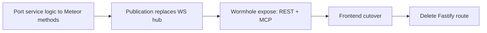

# Meteor-to-Production Plan

Tracking document for migrating TimeHuddle's backend from Fastify to **Meteor 3 +
[meteor-wormhole](https://github.com/mieweb/meteor-wormhole)** (REST + OpenAPI + MCP from one
method definition), with **DDP pub/sub** replacing all hand-rolled WebSocket fan-out.

**Branch / PR**: `meteor-is-back` → [PR #357](https://github.com/mieweb/timehuddle/pull/357)

## Migration principle

Each feature moves as one unit, and Fastify keeps serving everything not yet moved (shared Mongo,
zero big-bang):

Per-milestone gate: `npm run lint && npm run typecheck && npm run format && npm test` green,
browser smoke test, then commit to PR #357.

---

## ✅ Phase 1 — Proof of Concept (done)

- [x] Mongo single-node replica set in docker-compose (oplog tailing)
- [x] Headless Meteor 3 app (`meteor-backend/`, port 3100, shared Mongo)
- [x] Wormhole vendored as submodule (`vendor/meteor-wormhole`, mieweb fork)
- [x] better-auth session bridge (`auth.bridge` DDP method + REST token param)
- [x] Tickets: `list/create/updateStatus` + live `tickets.byTeam` publication
- [x] Clock: `active/start/stop` + live `clock.liveForTeams` publication
- [x] Frontend DDP client (`src/lib/ddp.ts`) — dependency-free, EJSON decode, live hooks
- [x] TicketsPage cutover to DDP (replaces `/v1/tickets/ws`)

## ✅ Phase 2 step — Tickets parity + Clock cutover (done)

- [x] `tickets.update` / `tickets.delete` / `tickets.assign` / `tickets.batchStatus`
- [x] Reviewed semantics (`reviewedBy`/`reviewedAt`), `github` param, creator auto-assign
- [x] Portable activity-log emission (shared `activities` collection, mirrors Fastify shapes)
- [x] CORS for the Vite origin on `/api`
- [x] Frontend ticket mutations via wormhole REST (`wormholeCall()` in `src/lib/api.ts`)
- [x] Clock UI cutover: TeamContext + WorkPage on `clock.liveForTeams` (drops `/v1/clock/ws`)
- [x] `DdpClient` auto-reconnect: backoff, re-auth, subscription restore

---

## M0 — Identity & Foundations

### M0.a — Wormhole invocation context (mieweb/meteor-wormhole)

So methods invoked over REST/MCP can read the caller's `Authorization` header instead of
receiving credentials in the JSON body (which leaks into Swagger examples, MCP traces, logs).

- [x] `AsyncLocalStorage`-based invocation context in wormhole (`transport`, `headers`, `bearerToken`)
- [x] REST bridge runs method calls inside the context
- [x] MCP bridge runs tool calls inside the context
- [x] Export `Wormhole.currentInvocation()` / `currentBearerToken()`
- [x] Push branch to mieweb/meteor-wormhole + PR for review (wreiske) — [mieweb/meteor-wormhole#4](https://github.com/mieweb/meteor-wormhole/pull/4)

### M0.b — Header auth in timehuddle (token-format agnostic)

- [x] Bump `vendor/meteor-wormhole` submodule to the context-aware commit
- [x] `auth-bridge.js`: `requireIdentity` falls back to `currentBearerToken()` (header) before
      the legacy `sessionToken` param
- [x] Remove `sessionTokenProp` from every schema in `meteor-backend/server/main.js`
- [x] `wormholeCall()` sends `Authorization: Bearer` header, drops `sessionToken` body field
- [x] Methods stop accepting `sessionToken` in body (one release of overlap, then delete)
- [x] Browser validation + checks + commit

### M0.c — JWT + JWKS (better-auth as the permanent IdP)

- [x] better-auth `jwt` plugin in `backend/src/lib/auth.ts`; JWKS at `/api/auth/jwks`
- [x] OIDC provider issues JWT access tokens (15-min TTL; `sub`, `email`, `name`, `iss`, `aud`, `exp`)
- [x] Refresh tokens stay opaque + DB-backed (revocation at refresh)
- [x] Fastify `require-auth.ts` accepts JWTs (local verify, no DB hit)
- [x] Meteor `auth-bridge.js`: JWKS verification (`jose`, key cache, `kid` rotation) replaces
      `session`-collection reads
- [x] PAT path in Meteor: `th_pat_` prefix → PAT collection lookup (parity with Fastify)
- [x] `ddp.ts`: fetch JWT from better-auth token endpoint; proactive re-bridge before `exp`
- [x] Zero `session`-collection reads remain in `meteor-backend/`

### M0.f — Interactive login via Meteor Accounts (DDP)

Direct email/password login over DDP (no better-auth token round-trip from the browser), so the
SPA authenticates against Meteor and gets a resume token. Credentials are verified against the
Fastify IdP server-to-server during coexistence.

- [x] `emailPassword` login handler (`auth-bridge.js`): native bcrypt verify when a Meteor hash
      exists, else verify via Fastify `POST /api/auth/sign-in/email`, then `findOrCreateUser`
      provisions the Meteor user (same `_id` as the Fastify `user`) and migrates the bcrypt hash
      for subsequent logins
- [x] `AUTH_FASTIFY_URL` wired into the `meteor-backend` container (Docker service name `backend`,
      not `localhost`); `Origin` header set to `BETTER_AUTH_URL` so better-auth's CSRF/origin check
      passes on the server-to-server call (Node `fetch` sends `sec-fetch-mode: cors`)
- [x] Failed credentials throw `Meteor.Error(403, 'Invalid email or password')` instead of
      returning `undefined` (which surfaced as the misleading "Unrecognized options for login request")
- [x] Signup: `accounts.createUser` method (creates Meteor user + mirrors into Fastify `user`)
- [x] Forgot/reset: `accounts.sendResetPasswordEmail` / `accounts.resetPassword` methods
- [x] `LoginForm.tsx` + `ddp.ts` `loginWithPassword` / `signUpWithPassword` consume the above

### M0.d — Social sign-in (parallel track; Fastify + UI only)

- [x] Google (`GOOGLE_CLIENT_ID/SECRET`) + sign-in button (`@mieweb/ui`, i18n label)
- [x] Apple (`APPLE_CLIENT_ID/SECRET`, `APPLE_APP_BUNDLE_IDENTIFIER`) provider + button — Capacitor iOS validation pending real device
- [x] Authentik via `genericOAuth` + OIDC discovery (`AUTHENTIK_CLIENT_ID/SECRET`, `AUTHENTIK_DISCOVERY_URL`)
- [x] New env vars documented (backend/README.md) + docker-compose `VITE_SOCIAL_PROVIDERS`; providers env-gated server-side, buttons gated by `VITE_SOCIAL_PROVIDERS` client-side

### M0.e — Foundations

- [x] CASL ability port (`backend/src/lib/permissions.ts` → method/publication guards)
- [x] Agenda jobs in Meteor (same `agenda` lib + same `agendajobs` collection):
      `shift-4h-reminder`, `shift-end-reminder`, `shift-auto-clockout`, `shift-missed-clockout`
      (processor gated behind `METEOR_AGENDA_ENABLED`; OFF during Fastify coexistence)
- [x] Push service port (web-push + FCM + APNs — plain npm libs)
- [x] Email wrapper port (nodemailer)
- [x] `meteor-backend` service in docker-compose; `VITE_METEOR_URL` / `CORS_ORIGINS` env wiring

## M1 — Core time-tracking domain

- [x] Timers: `timers.liveForUser` publication (replaces `/v1/timers/ws` ping), WorkPage DDP cutover. Mutations + day/week reads stay on Fastify REST during coexistence.
- [x] Clock completion: full cutover — all `clock.*` methods on Meteor (start/stop/pause/resume/status/active/events/timesheet/updateTimes/deleteEvent/createManual/agreeAutoClockout/respondShiftReminder), with coupled timer close-out/restart (`timer-core.js`), admin/self notifications + activity log (`notify-core.js`, `activity-core.js`), and Agenda reminder scheduling. Frontend `clockApi` cut over to wormhole REST. Meteor Agenda processor flipped ON (`METEOR_AGENDA_ENABLED=true`); Fastify processor disabled (`FASTIFY_AGENDA_ENABLED=false`) so they never double-process the shared `agendajobs`.
- [x] Notifications: `notifications.liveForUser` inbox publication (replaces `/v1/notifications/ws`). main.tsx, NotificationsPage, ShiftReminderContext consume via DDP `subscribeNewNotifications`. Fastify stays the writer + push fan-out during coexistence; mutations stay on REST.
- [x] `tickets.assign` moved to Meteor: assignee notification fan-out (`createNotification` — single push per newly added assignee) + activity log `ticket.updated`/`assigned` with resolved `assigneeName`. Frontend `ticketApi.assignTicket` cut over to wormhole REST.
- [ ] Delete Fastify routes: `clock.ts`, `timers.ts`, `notifications.ts`, `tickets*.ts` — **BLOCKED**: all four still serve live consumers. `clock.ts` → `/v1/clock/team-status` (team dashboard); `timers.ts` → entries/totals/team-running + day/week reads (WorkPage); `notifications.ts` → inbox, markRead, invite flows, push-subscribe, test-push; `tickets.ts` → `tickets.list`/`getTicket`/ws-stream + `/v1/timers/tickets/:id/total`. Deletion deferred until M2/M3 migrate these reads.

## M2 — Collaboration

- [x] Presence: `presence.watch` custom DDP publication (`meteor-backend/server/presence.js`) — in-memory tracking with 75s timeout, connection lifecycle marks online/offline. Frontend `usePresence.ts` cut over from raw WebSocket to DDP subscription; `presenceApi` removed from `api.ts`.
- [x] Activity log read methods: `activity.log`, `activity.userLog`, `activity.ticketActivity` Meteor methods (`meteor-backend/server/activity.js`) with wormhole REST exposure. Cursor-paginated, shared-team access check for teammate feeds. Frontend `activityApi` cut over to wormhole REST (`getUserWorkSummary` stays on Fastify — depends on timer reads in `work.ts`).
- [x] Docker auth fix: added `AUTH_JWKS_URL=http://backend:4000/api/auth/jwks` (and later `AUTH_FASTIFY_URL=http://backend:4000` for the email/password handler — see M0.f) to `meteor-backend` service in docker-compose (both defaulted to `localhost:4000`, unreachable inside Docker). Added error logging to `resolveJwt()` in `auth-bridge.js` so JWKS failures are no longer silent.
- [x] Teams: 12 Meteor methods (`teams.list`, `ensurePersonal`, `create`, `join`, `subteams`, `rename`, `delete`, `getMembers`, `invite`, `removeMember`, `setRole`, `setMemberPassword`) + `teams.byUser` DDP publication (oplog-backed, replaces `teams-ws.ts`). Org auto-provisioning ported to `org-helpers.js` (`ensureDefaultOrganization`, `addOrgMember`, `getAccessibleOrgIds`). Frontend `teamApi` cut over to wormhole REST; `TeamContext.tsx` cut over from WebSocket to DDP subscription. `bcryptjs` added for admin password resets.
- [x] Messages: `messages.getThread` + `messages.send` Meteor methods with `messages.byThread` DDP publication. Cursor-paginated, participant-checked, notification on send. Frontend `messageApi` cut over to wormhole REST; `MessagesPage.tsx` DM streams cut over from WebSocket to DDP subscription.
- [x] Channels: `channels.list`, `channels.create`, `channels.getMessages`, `channels.sendMessage` Meteor methods with `channelmessages.byChannel` DDP publication. `ensureDefaultChannel` exported for team creation. Channel visibility model (team-wide vs restricted) + `#general` auto-provisioning preserved. Frontend `channelApi` cut over to wormhole REST; `MessagesPage.tsx` channel streams cut over from WebSocket to DDP subscription. Notification fan-out to channel members via `createNotification`.
- [x] Huddle mutations: `huddle.createPost`, `huddle.updatePost`, `huddle.deletePost`, `huddle.toggleLike`, `huddle.getComments`, `huddle.addComment`, `huddle.deleteComment` Meteor methods with `huddlePosts.byTeam` DDP publication. Frontend mutations cut over to DDP; live updates via change stream. `getPostsByTicket` still on Fastify (GET `/v1/huddle/tickets/:id/posts`) — needs Meteor method `huddle.getPostsByTicket`.
- [ ] Huddle read: `huddle.getPostsByTicket` method (blocked — needs implementation)
- [ ] Activity getUserWorkSummary (depends on timer reads — deferred to M4)
- [ ] Delete Fastify routes: `teams*.ts`, `messages.ts`, `channels.ts`, `presence.ts`, `activity.ts`, `work.ts`, `huddle*.ts` — blocked until huddle read + work summary migrate

## M3 — Org & profiles

- [x] Users/Profiles (6 methods): `users.get`, `users.getByUsername`, `users.batchGet`, `users.updateProfile`, `users.checkUsername`, `users.claimUsername` in `meteor-backend/server/users.js`. Frontend `userApi` reads/writes + `usernameApi` cut over to wormhole REST. Avatar/background uploads migrated to Meteor in M4.
- [x] Organizations (20 methods): full org CRUD, member management, CASL ability checks, slug validation, auto-join, search, reports-to — all in `meteor-backend/server/organizations.js`. Includes default-org admin endpoints (from `users.ts`): `orgs.adminGet`, `orgs.adminUpdate`, `orgs.adminListUsers`, `orgs.adminSetUserRole`, `orgs.publicGet`, `orgs.publicListUsers`. Frontend `orgApi` + `orgAdminApi` cut over to wormhole REST.
- [x] Enterprises (7 methods): `enterprises.list`, `create`, `get`, `updateName`, `searchUsers`, `setMemberRole`, `removeMember`, `installStatus` in `meteor-backend/server/enterprises.js`. Frontend `enterpriseApi` cut over to wormhole REST. `takeOwnership` stays on Fastify (M4 onboarding) — **migrated 2026-06-25**.
- [x] PAT management (3 methods): `tokens.list`, `tokens.create`, `tokens.revoke` in `meteor-backend/server/tokens.js`. SHA-256 hashing, activity log emission, raw token shown once on create. Frontend `tokenApi` cut over to wormhole REST.
- [ ] Delete Fastify routes: `users.ts` (still serves `/v1/me`), `org*.ts`, `enterprises.ts` (still serves `/v1/install`), `tokens.ts` — deferred until M4 endpoints migrate

## M4 — HTTP-native surfaces + decommission

- [x] Uploads/Media/Attachments: static file serving at `/uploads/*` via `WebApp.connectHandlers`. Avatar/background multipart upload+delete via busboy (`/api/me/avatar`, `/api/me/background`). Media library image upload (`/api/media/upload`), thumbnail upload (`/api/media-thumbnail/:id`), CRUD methods (`media.list`, `media.listForUser`, `media.update`, `media.remove`). Attachments metadata-only methods (`attachments.list`, `attachments.add`, `attachments.remove`). All in `meteor-backend/server/uploads.js` + `attachments.js`. Frontend `attachmentApi`, `mediaApi`, `userApi` upload/delete all cut over. `toAbsoluteUrl` routes `/uploads/` paths through `METEOR_BASE_URL`. Video thumbnail regeneration uses authenticated blob fetch to avoid cross-origin canvas tainting.
- [x] PulseVault TUS resumable uploads: raw WebApp handlers in `meteor-backend/server/pulsevault.js` — protocol unchanged, storage paths preserved, auth via resume tokens
- [x] Port remaining backend test suites to Meteor methods — Vitest integration tests (`meteor-backend/tests/`) covering tickets (10), teams (11), clock (9). `scripts/checks.sh` gains `meteor` job. Infrastructure: `helpers.ts` (auth + wormhole wrapper), `setup.ts`, `vitest.config.ts`.
- [ ] Timers: Full timer API migration — `createEntry`, `startSession`, `stopSession`, `updateEntry`, `deleteEntry`, `getRunning`, `getToday`, `getDay`, `getWeek`, `getTicketTotal`, `copyPrevious`, `getTeamRunningTimers` (all currently on Fastify `/v1/timers/*`). Blocks work summary migration + deletion of `timers.ts`, `work.ts`.
- [ ] Seed Import: `seed.parse`, `seed.import` Meteor methods (currently Fastify `/v1/seed/import/*`) — dev/test utility, low priority.
- [ ] Enterprise onboarding: `enterprises.takeOwnership` (currently Fastify `POST /v1/install`) — first-run flow.
- [ ] Notification utilities: `notifications.testPush` (currently Fastify `POST /v1/notifications/test-push`) — debug endpoint.
- [ ] TimeHarbor share: `tickets.shareWithTimeharbor`, `tickets.bulkShareWithTimeharbor` (currently Fastify `PATCH /v1/tickets/:id/timeharbor-share`, `PATCH /v1/tickets/bulk-timeharbor-share`) — cross-product integration.
- [ ] Better-auth session endpoint: `authApi.getMe` (currently Fastify `GET /v1/me`) — last session-dependent read after Meteor owns all auth.
- [ ] Delete Fastify routes: `timers.ts`, `work.ts`, `seeder.ts`, `enterprises.ts` (`/v1/install`), `notifications.ts` (`test-push`), `tickets.ts` (TimeHarbor share), `users.ts` (`/v1/me`) — blocked until above endpoints migrate

## M5 — Reconcile post-merge drift from main

Work that landed on **Fastify** via `main` merges for domains **already cut over to Meteor**, so it sits in code paths the frontend no longer calls. Each needs porting to the Meteor side (and the Fastify copy left as dead-on-arrival until the route is deleted).

- [x] **Clock overlap guard (M1, live regression)** — PR #386 added overlap rejection to Fastify
      `clock.service.createManual` (`"overlap"` → 409), but clock is fully on Meteor, so the live
      path `clock.createManual` (`meteor-backend/server/clock.js`) still inserts with no overlap
      check. Ported: overlap query added to `clock.js` before insert, throws `Meteor.Error('overlap')`.
      Integration test added to `meteor-backend/tests/clock.test.ts` (happy path + rejection).
- [x] **Team join-request / pending-approval workflow (M2, ported)** — PR #382's Fastify flow
      ported to Meteor. `teams.join` now creates a pending request + notifies admins (was: direct
      add). `teams.list` returns `pendingRequests`. New methods: `teams.getPendingJoinRequests`,
      `teams.approveJoinRequest`, `teams.declineJoinRequest`, `teams.getJoinRequestPreview`,
      `teams.respondToJoinRequest`. DDP publications `teamJoinRequests.forUser` /
      `teamJoinRequests.forTeam` replace the WS fan-out. Frontend `notificationApi`
      `getJoinRequestPreview` + `respondToJoinRequest` cut over from Fastify REST to wormhole.
      `TeamJoinRequests` collection added to `collections.js`. All wormhole schemas exposed in
      `main.js`.
- [x] **Huddle / newsfeed (M2, ported)** — PR #383's huddle implementation fully ported to Meteor. `huddle.createPost`, `huddle.updatePost`, `huddle.deletePost`, `huddle.toggleLike`, `huddle.getComments`, `huddle.addComment`, `huddle.deleteComment` Meteor methods + `huddlePosts.byTeam` DDP publication in `meteor-backend/server/huddle.js`. Frontend mutations cut over to DDP, live updates via change stream. **Remaining:** `getPostsByTicket` still calls Fastify `GET /v1/huddle/tickets/:id/posts` — needs `huddle.getPostsByTicket` Meteor method.
- [x] **Media uploads (M4, complete)** — Fastify `media.ts` route is unused. Frontend `mediaApi.uploadImage` calls Meteor `POST ${METEOR_BASE_URL}/api/media/upload` (multipart handler in `meteor-backend/server/uploads.js`). No document-type parity issue — Fastify route is dead code, can be deleted with the rest of the route file.

## Migration Status Summary (as of 2026-06-26)

### Completed ✅
- **M0**: Identity & Foundations — JWT/JWKS auth, header auth, Meteor Accounts (email/password + social OAuth), CASL abilities, Agenda jobs, push/email services
- **M1**: Core time-tracking — Clock (full CRUD + live pub), Timers (live pub only), Tickets (full CRUD + live pub + assignment notifications)
- **M2**: Collaboration — Teams, Messages, Channels, Presence, Activity log, Team join requests, Huddle mutations, Notifications inbox/mutations
- **M3**: Org & profiles — Users, Organizations, Enterprises (except `takeOwnership`), PATs
- **M4 (partial)**: Uploads (avatars, backgrounds, media library, attachments), PulseVault TUS, Meteor test infrastructure

### Remaining Work 🚧

#### High Priority (blocking route deletion)
1. **Timers full API** (`timers.ts`, `work.ts` routes) — all timer CRUD + reads still on Fastify:
   - `createEntry`, `startSession`, `stopSession`, `updateEntry`, `deleteEntry`
   - `getRunning`, `getToday`, `getDay`, `getWeek`, `getTicketTotal`, `copyPrevious`
   - `getTeamRunningTimers` (team dashboard)
   - `getUserWorkSummary` (activity log dependency)
   
2. **Huddle read** (`huddle.ts`, `huddle-ws.ts` routes):
   - `getPostsByTicket` — needs `huddle.getPostsByTicket` Meteor method

#### Medium Priority (cross-product / onboarding)
3. **Enterprise onboarding** (`enterprises.ts` route):
   - `takeOwnership` (POST `/v1/install`) — first-run ownership claim

4. **TimeHarbor integration** (`tickets.ts` route):
   - `shareTicketWithTimeharbor` (PATCH `/v1/tickets/:id/timeharbor-share`)
   - `bulkShareTicketsWithTimeharbor` (PATCH `/v1/tickets/bulk-timeharbor-share`)

#### Low Priority (dev utilities)
5. **Seed Import** (`seeder.ts` route):
   - `parse` (POST `/v1/seed/import/parse`)
   - `import` (POST `/v1/seed/import`)

6. **Debug endpoints**:
   - `testPush` (POST `/v1/notifications/test-push`) in `notifications.ts`

7. **Auth session endpoint** (`users.ts` route):
   - `getMe` (GET `/v1/me`) — last better-auth session read after Meteor owns all interactive auth

### Fastify Routes Ready for Deletion (when migrations above complete)
- `timers.ts`, `work.ts` — blocked by timer API migration
- `huddle.ts`, `huddle-ws.ts` — blocked by huddle read migration
- `enterprises.ts` — blocked by takeOwnership migration
- `tickets.ts` (TimeHarbor share only) — blocked by share endpoints migration
- `seeder.ts` — blocked by seed import migration
- `notifications.ts` (testPush only) — blocked by testPush migration
- `users.ts` (getMe only) — blocked by getMe migration
- Already dead (frontend migrated): `teams*.ts`, `messages.ts`, `channels.ts`, `presence.ts`, `activity.ts`, `org*.ts`, `tokens.ts`, `attachments.ts`, `media.ts`, `clock.ts`

## Finalize Transition

- [ ] Remove `WS_BASE_URL`, `autoReconnectWs`, legacy `openLiveStream` helpers from `src/lib/api.ts`
- [ ] Move `backend/` to `.attic/` — ⚠️ **depends on the TimeHarbor SSO decision** (see Architecture decisions / `docs/meteor-audit.md`): Option A → better-auth extracted to a slim standalone identity service that remains at `/api/auth/*`; Option B → better-auth removed entirely
- [ ] docker-compose + CI (`scripts/checks.sh`) updated; Fastify gone

---

## Architecture decisions (settled)

| Decision                                            | Resolution                                                                                  |
| --------------------------------------------------- | ------------------------------------------------------------------------------------------- |
| OIDC provider role (TimeHuddle is TimeHarbor's IdP) | ⚠️ **Revisited — goal is now 100% Meteor.** Login/signup/reset/social already on Meteor; the only piece still on better-auth is the OIDC provider TimeHarbor logs in through. **Open decision:** (A) build an OIDC provider on Meteor / keep a slim dedicated SSO service, or (B) TimeHarbor re-points elsewhere and better-auth is fully retired. See `docs/meteor-audit.md`. |
| Meteor auth model                                   | ⚠️ **Revisited.** No longer a pure resource server: Meteor now owns interactive login (`accounts-password`, Google/GitHub/Apple OAuth, resume tokens, password reset). Still verifies PATs and (for now) better-auth JWTs during coexistence. Per-user password fallback to better-auth is migration scaffolding, removed once legacy/seed accounts migrate. |
| Background jobs                                     | Same `agenda` npm lib inside Meteor, same `agendajobs` collection — zero handover migration |
| Real-time                                           | DDP publications only; all 7 Fastify WS hubs retire                                         |
| Credentials over wormhole                           | `Authorization: Bearer` header via invocation context — never in the body                   |
| File uploads / TUS                                  | Raw HTTP handlers (not method-shaped); storage paths unchanged                              |

## Risk register

| Risk                                  | Severity | Mitigation                                                                                                       |
| ------------------------------------- | -------- | ---------------------------------------------------------------------------------------------------------------- |
| JWT TTL vs long-lived DDP connections | Low      | Proactive re-bridge before `exp`; reconnect already re-auths                                                     |
| Apple sign-in in Capacitor            | Med      | Real-device testing; App Store mandates Apple when other social logins exist                                     |
| Agenda handover mid-shift             | Med      | Same lib + collection; jobs are writer-agnostic                                                                  |
| Publication fan-out scale             | Med      | Tightly scoped cursors (`endTime: null`, team filters)                                                           |
| Dual-backend drift during migration   | Med      | Shared Mongo is the single source of truth; activity/notification doc shapes mirrored verbatim                   |
| Docker inter-service auth (resolved)  | —        | `AUTH_JWKS_URL` must use Docker service name (`backend`), not `localhost`. Error logging added to `resolveJwt()` |
