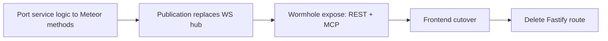

# Meteor-to-Production Plan

Tracking document for migrating TimeHuddle's backend from Fastify to **Meteor 3 +
[meteor-wormhole](https://github.com/mieweb/meteor-wormhole)** (REST + OpenAPI + MCP from one
method definition), with **DDP pub/sub** replacing all hand-rolled WebSocket fan-out.

**Branch / PR**: `meteor-is-back` → [PR #357](https://github.com/mieweb/timehuddle/pull/357)

## Migration principle

Each feature moves as one unit, and Fastify keeps serving everything not yet moved (shared Mongo,
zero big-bang):

Per-milestone gate: `npm run lint && npm run typecheck && npm run format && npm test` green,
browser smoke test, then commit to PR #357.

---

## ✅ Phase 1 — Proof of Concept (done)

- [x] Mongo single-node replica set in docker-compose (oplog tailing)
- [x] Headless Meteor 3 app (`meteor-backend/`, port 3100, shared Mongo)
- [x] Wormhole vendored as submodule (`vendor/meteor-wormhole`, mieweb fork)
- [x] better-auth session bridge (`auth.bridge` DDP method + REST token param)
- [x] Tickets: `list/create/updateStatus` + live `tickets.byTeam` publication
- [x] Clock: `active/start/stop` + live `clock.liveForTeams` publication
- [x] Frontend DDP client (`src/lib/ddp.ts`) — dependency-free, EJSON decode, live hooks
- [x] TicketsPage cutover to DDP (replaces `/v1/tickets/ws`)

## ✅ Phase 2 step — Tickets parity + Clock cutover (done)

- [x] `tickets.update` / `tickets.delete` / `tickets.assign` / `tickets.batchStatus`
- [x] Reviewed semantics (`reviewedBy`/`reviewedAt`), `github` param, creator auto-assign
- [x] Portable activity-log emission (shared `activities` collection, mirrors Fastify shapes)
- [x] CORS for the Vite origin on `/api`
- [x] Frontend ticket mutations via wormhole REST (`wormholeCall()` in `src/lib/api.ts`)
- [x] Clock UI cutover: TeamContext + WorkPage on `clock.liveForTeams` (drops `/v1/clock/ws`)
- [x] `DdpClient` auto-reconnect: backoff, re-auth, subscription restore

---

## M0 — Identity & Foundations

### M0.a — Wormhole invocation context (mieweb/meteor-wormhole)

So methods invoked over REST/MCP can read the caller's `Authorization` header instead of
receiving credentials in the JSON body (which leaks into Swagger examples, MCP traces, logs).

- [x] `AsyncLocalStorage`-based invocation context in wormhole (`transport`, `headers`, `bearerToken`)
- [x] REST bridge runs method calls inside the context
- [x] MCP bridge runs tool calls inside the context
- [x] Export `Wormhole.currentInvocation()` / `currentBearerToken()`
- [x] Push branch to mieweb/meteor-wormhole + PR for review (wreiske) — [mieweb/meteor-wormhole#4](https://github.com/mieweb/meteor-wormhole/pull/4)

### M0.b — Header auth in timehuddle (token-format agnostic)

- [x] Bump `vendor/meteor-wormhole` submodule to the context-aware commit
- [x] `auth-bridge.js`: `requireIdentity` falls back to `currentBearerToken()` (header) before
      the legacy `sessionToken` param
- [x] Remove `sessionTokenProp` from every schema in `meteor-backend/server/main.js`
- [x] `wormholeCall()` sends `Authorization: Bearer` header, drops `sessionToken` body field
- [x] Methods stop accepting `sessionToken` in body (one release of overlap, then delete)
- [x] Browser validation + checks + commit

### M0.c — JWT + JWKS (better-auth as the permanent IdP)

- [x] better-auth `jwt` plugin in `backend/src/lib/auth.ts`; JWKS at `/api/auth/jwks`
- [x] OIDC provider issues JWT access tokens (15-min TTL; `sub`, `email`, `name`, `iss`, `aud`, `exp`)
- [x] Refresh tokens stay opaque + DB-backed (revocation at refresh)
- [x] Fastify `require-auth.ts` accepts JWTs (local verify, no DB hit)
- [x] Meteor `auth-bridge.js`: JWKS verification (`jose`, key cache, `kid` rotation) replaces
      `session`-collection reads
- [x] PAT path in Meteor: `th_pat_` prefix → PAT collection lookup (parity with Fastify)
- [x] `ddp.ts`: fetch JWT from better-auth token endpoint; proactive re-bridge before `exp`
- [x] Zero `session`-collection reads remain in `meteor-backend/`

### M0.d — Social sign-in (parallel track; Fastify + UI only)

- [x] Google (`GOOGLE_CLIENT_ID/SECRET`) + sign-in button (`@mieweb/ui`, i18n label)
- [x] Apple (`APPLE_CLIENT_ID/SECRET`, `APPLE_APP_BUNDLE_IDENTIFIER`) provider + button — Capacitor iOS validation pending real device
- [x] Authentik via `genericOAuth` + OIDC discovery (`AUTHENTIK_CLIENT_ID/SECRET`, `AUTHENTIK_DISCOVERY_URL`)
- [x] New env vars documented (backend/README.md) + docker-compose `VITE_SOCIAL_PROVIDERS`; providers env-gated server-side, buttons gated by `VITE_SOCIAL_PROVIDERS` client-side

### M0.e — Foundations

- [x] CASL ability port (`backend/src/lib/permissions.ts` → method/publication guards)
- [x] Agenda jobs in Meteor (same `agenda` lib + same `agendajobs` collection):
      `shift-4h-reminder`, `shift-end-reminder`, `shift-auto-clockout`, `shift-missed-clockout`
      (processor gated behind `METEOR_AGENDA_ENABLED`; OFF during Fastify coexistence)
- [x] Push service port (web-push + FCM + APNs — plain npm libs)
- [x] Email wrapper port (nodemailer)
- [x] `meteor-backend` service in docker-compose; `VITE_METEOR_URL` / `CORS_ORIGINS` env wiring

## M1 — Core time-tracking domain

- [x] Timers: `timers.liveForUser` publication (replaces `/v1/timers/ws` ping), WorkPage DDP cutover. Mutations + day/week reads stay on Fastify REST during coexistence.
- [x] Clock completion: full cutover — all `clock.*` methods on Meteor (start/stop/pause/resume/status/active/events/timesheet/updateTimes/deleteEvent/createManual/agreeAutoClockout/respondShiftReminder), with coupled timer close-out/restart (`timer-core.js`), admin/self notifications + activity log (`notify-core.js`, `activity-core.js`), and Agenda reminder scheduling. Frontend `clockApi` cut over to wormhole REST. Meteor Agenda processor flipped ON (`METEOR_AGENDA_ENABLED=true`); Fastify processor disabled (`FASTIFY_AGENDA_ENABLED=false`) so they never double-process the shared `agendajobs`.
- [x] Notifications: `notifications.liveForUser` inbox publication (replaces `/v1/notifications/ws`). main.tsx, NotificationsPage, ShiftReminderContext consume via DDP `subscribeNewNotifications`. Fastify stays the writer + push fan-out during coexistence; mutations stay on REST.
- [x] `tickets.assign` moved to Meteor: assignee notification fan-out (`createNotification` — single push per newly added assignee) + activity log `ticket.updated`/`assigned` with resolved `assigneeName`. Frontend `ticketApi.assignTicket` cut over to wormhole REST.
- [ ] Delete Fastify routes: `clock.ts`, `timers.ts`, `notifications.ts`, `tickets*.ts` — **BLOCKED**: all four still serve live consumers. `clock.ts` → `/v1/clock/team-status` (team dashboard); `timers.ts` → entries/totals/team-running + day/week reads (WorkPage); `notifications.ts` → inbox, markRead, invite flows, push-subscribe, test-push; `tickets.ts` → `tickets.list`/`getTicket`/ws-stream + `/v1/timers/tickets/:id/total`. Deletion deferred until M2/M3 migrate these reads.

## M2 — Collaboration

- [x] Presence: `presence.watch` custom DDP publication (`meteor-backend/server/presence.js`) — in-memory tracking with 75s timeout, connection lifecycle marks online/offline. Frontend `usePresence.ts` cut over from raw WebSocket to DDP subscription; `presenceApi` removed from `api.ts`.
- [x] Activity log read methods: `activity.log`, `activity.userLog`, `activity.ticketActivity` Meteor methods (`meteor-backend/server/activity.js`) with wormhole REST exposure. Cursor-paginated, shared-team access check for teammate feeds. Frontend `activityApi` cut over to wormhole REST (`getUserWorkSummary` stays on Fastify — depends on timer reads in `work.ts`).
- [x] Docker auth fix: added `AUTH_JWKS_URL=http://backend:4000/api/auth/jwks` to `meteor-backend` service in docker-compose (was defaulting to `localhost:4000` which is unreachable inside Docker). Added error logging to `resolveJwt()` in `auth-bridge.js` so JWKS failures are no longer silent.
- [x] Teams: 12 Meteor methods (`teams.list`, `ensurePersonal`, `create`, `join`, `subteams`, `rename`, `delete`, `getMembers`, `invite`, `removeMember`, `setRole`, `setMemberPassword`) + `teams.byUser` DDP publication (oplog-backed, replaces `teams-ws.ts`). Org auto-provisioning ported to `org-helpers.js` (`ensureDefaultOrganization`, `addOrgMember`, `getAccessibleOrgIds`). Frontend `teamApi` cut over to wormhole REST; `TeamContext.tsx` cut over from WebSocket to DDP subscription. `bcryptjs` added for admin password resets.
- [x] Messages: `messages.getThread` + `messages.send` Meteor methods with `messages.byThread` DDP publication. Cursor-paginated, participant-checked, notification on send. Frontend `messageApi` cut over to wormhole REST; `MessagesPage.tsx` DM streams cut over from WebSocket to DDP subscription.
- [x] Channels: `channels.list`, `channels.create`, `channels.getMessages`, `channels.sendMessage` Meteor methods with `channelmessages.byChannel` DDP publication. `ensureDefaultChannel` exported for team creation. Channel visibility model (team-wide vs restricted) + `#general` auto-provisioning preserved. Frontend `channelApi` cut over to wormhole REST; `MessagesPage.tsx` channel streams cut over from WebSocket to DDP subscription. Notification fan-out to channel members via `createNotification`.
- [ ] Work summary read method (depends on timer reads — deferred)
- [ ] Delete Fastify routes: `teams*.ts`, `messages.ts`, `channels.ts`, `presence.ts`,
      `activity.ts`, `work.ts`

## M3 — Org & profiles

- [x] Users/Profiles (6 methods): `users.get`, `users.getByUsername`, `users.batchGet`, `users.updateProfile`, `users.checkUsername`, `users.claimUsername` in `meteor-backend/server/users.js`. Frontend `userApi` reads/writes + `usernameApi` cut over to wormhole REST. Avatar/background uploads + `GET /v1/me` deferred to M4 (multipart / better-auth session).
- [x] Organizations (20 methods): full org CRUD, member management, CASL ability checks, slug validation, auto-join, search, reports-to — all in `meteor-backend/server/organizations.js`. Includes default-org admin endpoints (from `users.ts`): `orgs.adminGet`, `orgs.adminUpdate`, `orgs.adminListUsers`, `orgs.adminSetUserRole`, `orgs.publicGet`, `orgs.publicListUsers`. Frontend `orgApi` + `orgAdminApi` cut over to wormhole REST.
- [x] Enterprises (7 methods): `enterprises.list`, `create`, `get`, `updateName`, `searchUsers`, `setMemberRole`, `removeMember` in `meteor-backend/server/enterprises.js`. Frontend `enterpriseApi` cut over to wormhole REST. `getOwnershipStatus` + `takeOwnership` stay on Fastify (M4 onboarding).
- [x] PAT management (3 methods): `tokens.list`, `tokens.create`, `tokens.revoke` in `meteor-backend/server/tokens.js`. SHA-256 hashing, activity log emission, raw token shown once on create. Frontend `tokenApi` cut over to wormhole REST.
- [ ] Delete Fastify routes: `users.ts`, `org*.ts`, `enterprises.ts`, `tokens.ts` — deferred until avatar/background uploads + install endpoints migrate in M4

## M4 — HTTP-native surfaces + decommission

- [x] Uploads/Media/Attachments: static file serving at `/uploads/*` via `WebApp.connectHandlers`. Avatar/background multipart upload+delete via busboy (`/api/me/avatar`, `/api/me/background`). Media library image upload (`/api/media/upload`), thumbnail upload (`/api/media-thumbnail/:id`), CRUD methods (`media.list`, `media.listForUser`, `media.update`, `media.remove`). Attachments metadata-only methods (`attachments.list`, `attachments.add`, `attachments.remove`). All in `meteor-backend/server/uploads.js` + `attachments.js`. Frontend `attachmentApi`, `mediaApi`, `userApi` upload/delete all cut over. `toAbsoluteUrl` routes `/uploads/` paths through `METEOR_BASE_URL`. Video thumbnail regeneration uses authenticated blob fetch to avoid cross-origin canvas tainting.
- [ ] PulseVault TUS resumable uploads: raw WebApp handlers (protocol untouched)
- [x] Port remaining backend test suites to Meteor methods — Vitest integration tests (`meteor-backend/tests/`) covering tickets (10), teams (11), clock (9). `scripts/checks.sh` gains `meteor` job. Infrastructure: `helpers.ts` (auth + wormhole wrapper), `setup.ts`, `vitest.config.ts`.

## M5 — Reconcile post-merge drift from main

Work that landed on **Fastify** via `main` merges for domains **already cut over to Meteor**, so it sits in code paths the frontend no longer calls. Each needs porting to the Meteor side (and the Fastify copy left as dead-on-arrival until the route is deleted).

- [x] **Clock overlap guard (M1, live regression)** — PR #386 added overlap rejection to Fastify
      `clock.service.createManual` (`"overlap"` → 409), but clock is fully on Meteor, so the live
      path `clock.createManual` (`meteor-backend/server/clock.js`) still inserts with no overlap
      check. Ported: overlap query added to `clock.js` before insert, throws `Meteor.Error('overlap')`.
      Integration test added to `meteor-backend/tests/clock.test.ts` (happy path + rejection).
- [x] **Team join-request / pending-approval workflow (M2, ported)** — PR #382's Fastify flow
      ported to Meteor. `teams.join` now creates a pending request + notifies admins (was: direct
      add). `teams.list` returns `pendingRequests`. New methods: `teams.getPendingJoinRequests`,
      `teams.approveJoinRequest`, `teams.declineJoinRequest`, `teams.getJoinRequestPreview`,
      `teams.respondToJoinRequest`. DDP publications `teamJoinRequests.forUser` /
      `teamJoinRequests.forTeam` replace the WS fan-out. Frontend `notificationApi`
      `getJoinRequestPreview` + `respondToJoinRequest` cut over from Fastify REST to wormhole.
      `TeamJoinRequests` collection added to `collections.js`. All wormhole schemas exposed in
      `main.js`.
- [ ] **Huddle / newsfeed (net-new, built on the retired pattern)** — PR #383 added `huddle.ts`,
      `huddle.service.ts`, and a new WS hub `huddle-ws.ts` on Fastify; frontend consumes Fastify REST + WS. Not a regression, but it's a brand-new WebSocket hub for exactly the pattern this
      migration retires. Decide: port now (Meteor methods + `huddlePosts.byTeam` publication) or
      accept as Fastify debt and schedule.
- [ ] **Media document-upload parity (M4)** — Fastify `media.ts` gained an upload route advertising
      image/video/**document**, but frontend `mediaApi` uploads to `METEOR_BASE_URL/api/media/upload`,
      so the Fastify route is dead. Confirm whether it added document-type support absent from
      `meteor-backend/server/uploads.js`; if so port that capability, otherwise drop the Fastify route.

## Finalize Transition

- [ ] Remove `WS_BASE_URL`, `autoReconnectWs`, legacy `openLiveStream` helpers from `src/lib/api.ts`
- [ ] Move `backend/` to `.attic/` (better-auth extracted to a slim standalone identity service that remains at `/api/auth/*`)
- [ ] docker-compose + CI (`scripts/checks.sh`) updated; Fastify gone

---

## Architecture decisions (settled)

| Decision                                            | Resolution                                                                                  |
| --------------------------------------------------- | ------------------------------------------------------------------------------------------- |
| OIDC provider role (TimeHuddle is TimeHarbor's IdP) | better-auth keeps it permanently; never ported to Meteor                                    |
| Meteor auth model                                   | Pure resource server: JWKS-verified JWTs + PAT lookup (the one DB-read exception)           |
| Background jobs                                     | Same `agenda` npm lib inside Meteor, same `agendajobs` collection — zero handover migration |
| Real-time                                           | DDP publications only; all 7 Fastify WS hubs retire                                         |
| Credentials over wormhole                           | `Authorization: Bearer` header via invocation context — never in the body                   |
| File uploads / TUS                                  | Raw HTTP handlers (not method-shaped); storage paths unchanged                              |

## Risk register

| Risk                                  | Severity | Mitigation                                                                                                       |
| ------------------------------------- | -------- | ---------------------------------------------------------------------------------------------------------------- |
| JWT TTL vs long-lived DDP connections | Low      | Proactive re-bridge before `exp`; reconnect already re-auths                                                     |
| Apple sign-in in Capacitor            | Med      | Real-device testing; App Store mandates Apple when other social logins exist                                     |
| Agenda handover mid-shift             | Med      | Same lib + collection; jobs are writer-agnostic                                                                  |
| Publication fan-out scale             | Med      | Tightly scoped cursors (`endTime: null`, team filters)                                                           |
| Dual-backend drift during migration   | Med      | Shared Mongo is the single source of truth; activity/notification doc shapes mirrored verbatim                   |
| Docker inter-service auth (resolved)  | —        | `AUTH_JWKS_URL` must use Docker service name (`backend`), not `localhost`. Error logging added to `resolveJwt()` |
