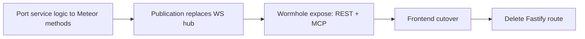

# Meteor-to-Production Plan

Tracking document for migrating TimeHuddle's backend from Fastify to **Meteor 3 +
[meteor-wormhole](https://github.com/mieweb/meteor-wormhole)** (REST + OpenAPI + MCP from one
method definition), with **DDP pub/sub** replacing all hand-rolled WebSocket fan-out.

**Branch / PR**: `meteor-is-back` → [PR #357](https://github.com/mieweb/timehuddle/pull/357)

## Migration principle

Each feature moves as one unit, and Fastify keeps serving everything not yet moved (shared Mongo,
zero big-bang):

Per-milestone gate: `npm run lint && npm run typecheck && npm run format && npm test` green,
browser smoke test, then commit to PR #357.

---

## ✅ Phase 1 — Proof of Concept (done)

- [x] Mongo single-node replica set in docker-compose (oplog tailing)
- [x] Headless Meteor 3 app (`meteor-backend/`, port 3100, shared Mongo)
- [x] Wormhole vendored as submodule (`vendor/meteor-wormhole`, mieweb fork)
- [x] better-auth session bridge (`auth.bridge` DDP method + REST token param)
- [x] Tickets: `list/create/updateStatus` + live `tickets.byTeam` publication
- [x] Clock: `active/start/stop` + live `clock.liveForTeams` publication
- [x] Frontend DDP client (`src/lib/ddp.ts`) — dependency-free, EJSON decode, live hooks
- [x] TicketsPage cutover to DDP (replaces `/v1/tickets/ws`)

## ✅ Phase 2 step — Tickets parity + Clock cutover (done)

- [x] `tickets.update` / `tickets.delete` / `tickets.assign` / `tickets.batchStatus`
- [x] Reviewed semantics (`reviewedBy`/`reviewedAt`), `github` param, creator auto-assign
- [x] Portable activity-log emission (shared `activities` collection, mirrors Fastify shapes)
- [x] CORS for the Vite origin on `/api`
- [x] Frontend ticket mutations via wormhole REST (`wormholeCall()` in `src/lib/api.ts`)
- [x] Clock UI cutover: TeamContext + WorkPage on `clock.liveForTeams` (drops `/v1/clock/ws`)
- [x] `DdpClient` auto-reconnect: backoff, re-auth, subscription restore

---

## M0 — Identity & Foundations

### M0.a — Wormhole invocation context (mieweb/meteor-wormhole)

So methods invoked over REST/MCP can read the caller's `Authorization` header instead of
receiving credentials in the JSON body (which leaks into Swagger examples, MCP traces, logs).

- [x] `AsyncLocalStorage`-based invocation context in wormhole (`transport`, `headers`, `bearerToken`)
- [x] REST bridge runs method calls inside the context
- [x] MCP bridge runs tool calls inside the context
- [x] Export `Wormhole.currentInvocation()` / `currentBearerToken()`
- [x] Push branch to mieweb/meteor-wormhole + PR for review (wreiske) — [mieweb/meteor-wormhole#4](https://github.com/mieweb/meteor-wormhole/pull/4)

### M0.b — Header auth in timehuddle (token-format agnostic)

- [x] Bump `vendor/meteor-wormhole` submodule to the context-aware commit
- [x] `auth-bridge.js`: `requireIdentity` falls back to `currentBearerToken()` (header) before
      the legacy `sessionToken` param
- [x] Remove `sessionTokenProp` from every schema in `meteor-backend/server/main.js`
- [x] `wormholeCall()` sends `Authorization: Bearer` header, drops `sessionToken` body field
- [ ] Methods stop accepting `sessionToken` in body (one release of overlap, then delete)
- [x] Browser validation + checks + commit

### M0.c — JWT + JWKS (better-auth as the permanent IdP)

- [ ] better-auth `jwt` plugin in `backend/src/lib/auth.ts`; JWKS at `/api/auth/jwks`
- [ ] OIDC provider issues JWT access tokens (15-min TTL; `sub`, `email`, `name`, `iss`, `aud`, `exp`)
- [ ] Refresh tokens stay opaque + DB-backed (revocation at refresh)
- [ ] Fastify `require-auth.ts` accepts JWTs (local verify, no DB hit)
- [ ] Meteor `auth-bridge.js`: JWKS verification (`jose`, key cache, `kid` rotation) replaces
      `session`-collection reads
- [ ] PAT path in Meteor: `th_pat_` prefix → PAT collection lookup (parity with Fastify)
- [ ] `ddp.ts`: fetch JWT from better-auth token endpoint; proactive re-bridge before `exp`
- [ ] Zero `session`-collection reads remain in `meteor-backend/`

### M0.d — Social sign-in (parallel track; Fastify + UI only)

- [ ] Google (`GOOGLE_CLIENT_ID/SECRET`) + sign-in button (`@mieweb/ui`, i18n label)
- [ ] Apple (`APPLE_CLIENT_ID/TEAM_ID/KEY_ID/PRIVATE_KEY`) + Capacitor iOS validation
- [ ] Authentik via `genericOAuth` + OIDC discovery (`AUTHENTIK_ISSUER/CLIENT_ID/CLIENT_SECRET`)
- [ ] Account-linking behavior documented; new env vars in `.env.example` + docker-compose

### M0.e — Foundations

- [ ] CASL ability port (`backend/src/lib/permissions.ts` → method/publication guards)
- [ ] Agenda jobs in Meteor (same `agenda` lib + same `agendajobs` collection):
      `shift-4h-reminder`, `shift-end-reminder`, `shift-auto-clockout`
- [ ] Push service port (web-push + FCM + APNs — plain npm libs)
- [ ] Email wrapper port (nodemailer)
- [ ] `meteor-backend` service in docker-compose; `VITE_METEOR_URL` / `CORS_ORIGINS` env wiring

## M1 — Core time-tracking domain

- [ ] Timers: methods + publication (replaces `/v1/timers` WS), WorkPage cutover
- [ ] Clock completion: breaks (pause/resume), timesheet queries, auto-clockout agreement
- [ ] Notifications: inbox publication per user + push fan-out
- [ ] Move `tickets.assign` to Meteor (unblocked by notifications)
- [ ] Delete Fastify routes: `clock.ts`, `timers.ts`, `notifications.ts`, `tickets*.ts`

## M2 — Collaboration

- [ ] Teams: roster CRUD, join codes, roles + `teams.byUser` publication (replaces `teams-ws.ts`)
- [ ] Messages + Channels: thread/channel publications + push on new message
- [ ] Presence: publication keyed on DDP connection lifecycle
- [ ] Activity log + Work summary read methods
- [ ] Delete Fastify routes: `teams*.ts`, `messages.ts`, `channels.ts`, `presence.ts`,
      `activity.ts`, `work.ts`

## M3 — Org & profiles

- [ ] Users/Profiles (16 endpoints): profile CRUD, preferences, admin tools
- [ ] Organizations + Enterprises (18 endpoints): CRUD, membership, seats, hierarchy
- [ ] PAT management endpoints (verification already done in M0.c)
- [ ] Delete Fastify routes: `users.ts`, `org*.ts`, `enterprises.ts`, `tokens.ts`

## M4 — HTTP-native surfaces + decommission

- [ ] Uploads/Media/Attachments: multipart + static via Meteor `WebApp.connectHandlers`
- [ ] PulseVault TUS resumable uploads: raw WebApp handlers (protocol untouched)
- [ ] Port remaining backend test suites to Meteor methods
- [ ] Remove `WS_BASE_URL`, `autoReconnectWs`, legacy `openLiveStream` helpers from `src/lib/api.ts`
- [ ] Move `backend/` to `.attic/` (better-auth extracted to a slim standalone identity service
      that remains at `/api/auth/*`)
- [ ] docker-compose + CI (`scripts/checks.sh`) updated; Fastify gone

---

## Architecture decisions (settled)

| Decision                                            | Resolution                                                                                  |
| --------------------------------------------------- | ------------------------------------------------------------------------------------------- |
| OIDC provider role (TimeHuddle is TimeHarbor's IdP) | better-auth keeps it permanently; never ported to Meteor                                    |
| Meteor auth model                                   | Pure resource server: JWKS-verified JWTs + PAT lookup (the one DB-read exception)           |
| Background jobs                                     | Same `agenda` npm lib inside Meteor, same `agendajobs` collection — zero handover migration |
| Real-time                                           | DDP publications only; all 7 Fastify WS hubs retire                                         |
| Credentials over wormhole                           | `Authorization: Bearer` header via invocation context — never in the body                   |
| File uploads / TUS                                  | Raw HTTP handlers (not method-shaped); storage paths unchanged                              |

## Risk register

| Risk                                  | Severity | Mitigation                                                                                     |
| ------------------------------------- | -------- | ---------------------------------------------------------------------------------------------- |
| JWT TTL vs long-lived DDP connections | Low      | Proactive re-bridge before `exp`; reconnect already re-auths                                   |
| Apple sign-in in Capacitor            | Med      | Real-device testing; App Store mandates Apple when other social logins exist                   |
| Agenda handover mid-shift             | Med      | Same lib + collection; jobs are writer-agnostic                                                |
| Publication fan-out scale             | Med      | Tightly scoped cursors (`endTime: null`, team filters)                                         |
| Dual-backend drift during migration   | Med      | Shared Mongo is the single source of truth; activity/notification doc shapes mirrored verbatim |
