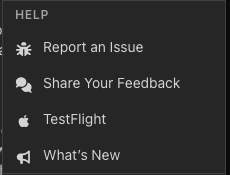

The largest release since TimeHuddle started updating itself. Retroactive edits
to a timesheet now go through an approval queue, notifications open the exact
thing they are about, and attaching a screenshot to a Huddle post takes one
keystroke.

## Time changes now go through approval

Editing hours after the fact used to be silent. It now creates a request that an
admin has to rule on:

- Submitting a retroactive change asks for a justification — a sentence on why
  the recorded time was wrong.
- Admins get a review queue with everything waiting on them, and can approve or
  decline each request with the original and the proposed times side by side.
- The person who asked sees the outcome on their timesheet: pending while it
  waits, declined if it was turned down, with the reviewer's decision attached.
- Pending requests are flagged from anywhere on the Dashboard, not only when you
  happen to be looking at the Timesheet.

Brand-new entries still need a video; adjusting an entry that already exists no
longer does, though you can always attach one.

## Notifications take you to the right place

Tapping a notification used to drop you on the Dashboard and leave you to find
what it was about. Each one now opens its subject directly — a clock event opens
the Huddle post for that session, a timesheet request opens that request, a
mention opens that post and highlights it. Tapping the same notification twice
re-highlights rather than doing nothing, and links that arrive while the app is
already open are honoured instead of being dropped.

On iOS and Android this also works from outside the app: a `timehuddle://` link
opens straight to the page it names.

## Attaching things to a Huddle post

- **Paste a screenshot** straight into the composer — no saving it to disk first.
- **One progress bar** for the whole upload, however many files it covers,
  rather than a separate indicator per file.
- **Images are compressed before they upload**, which makes posting from a phone
  on mobile data noticeably faster, and the size cap for other media went up.
- Videos recorded in Pulse Cam now attach reliably when started from the
  composer or from a QR scan.

## Clock and timesheet corrections

- The clock status card shows which ticket you are currently on.
- Weekly timesheet totals now match the sum of the sessions displayed beneath
  them — they could previously differ by a minute or two from rounding.
- A ticket's priority can be cleared back to **none** once it has been set.
- Sessions that run past midnight are handled correctly when resolving the
  running ticket.
- Pull down to refresh works on every page that has something to refresh.
- Member rows on the Teams and Dashboard pages line up again.

## Release notes, in the app

Notes like this one now ship with the app. Open the account menu and choose
**What's New** — anything published since you last looked is marked, and the
count clears once you have read it. They are also readable without signing in,
from the link in the site header.

## Withdrawn

**Messages** and the **Media Library** have been removed. Both were partly built
and neither was ready to depend on, so they have been taken out rather than left
half-working. Direct messaging may return once it can be done properly; posting
in Huddle covers most of what Messages was used for in the meantime.
