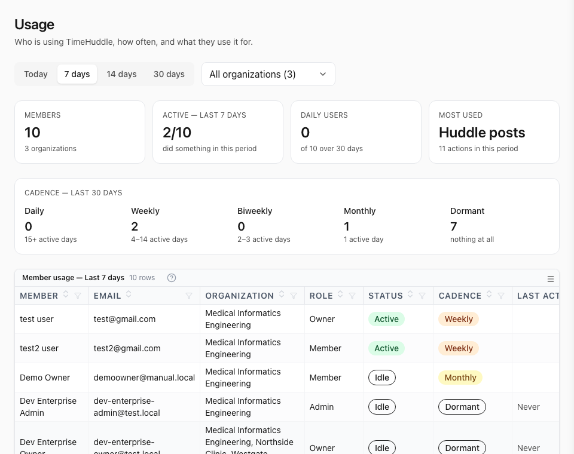

The largest release since TimeHuddle started updating itself. Retroactive edits
to a timesheet now go through an approval queue, notifications open the exact
thing they are about, and attaching a screenshot to a Huddle post takes one
keystroke.

## Time changes now go through approval

Editing hours after the fact used to be silent. It now creates a request that an
admin has to rule on:

- Submitting a retroactive change asks for a justification — a sentence on why
  the recorded time was wrong.
- Admins get a review queue with everything waiting on them, and can approve or
  decline each request with the original and the proposed times side by side.
- The person who asked sees the outcome on their timesheet: pending while it
  waits, declined if it was turned down, with the reviewer's decision attached.
- Pending requests are flagged from anywhere on the Dashboard, not only when you
  happen to be looking at the Timesheet.

Brand-new entries still need a video; adjusting an entry that already exists no
longer does, though you can always attach one.

## Notifications take you to the right place

Tapping a notification used to drop you on the Dashboard and leave you to find
what it was about. Each one now opens its subject directly — a clock event opens
the Huddle post for that session, a timesheet request opens that request, a
mention opens that post and highlights it. Tapping the same notification twice
re-highlights rather than doing nothing, and links that arrive while the app is
already open are honoured instead of being dropped.

On iOS and Android this also works from outside the app: a `timehuddle://` link
opens straight to the page it names.

## Attaching things to a Huddle post

- **Paste or drag a screenshot** straight into the composer — no saving it to
  disk first. It appears in the post as you write, where you put it, so you can
  see what you are about to send. Dragging one in used to look like it worked
  and then fail on **Post** with nothing but "Failed to post".
- **Drag in a document** — a PDF, a Word file — and it attaches. Dropping one
  used to do nothing whatsoever.
- **When something does go wrong**, the composer says so in place, naming the
  file and the reason, and keeping what you had written and where your cursor
  was rather than interrupting with a browser popup. A file too large or of a
  type we cannot take is refused straight away instead of after the wait, and a
  post that cannot be sent says why — so you can fix it and retry without
  retyping anything.
- **Attachments are listed by the name you gave them**, not by the internal one
  the server stored them under.
- **One progress bar** for the whole upload, however many files it covers,
  rather than a separate indicator per file.
- **Images are compressed before they upload**, which makes posting from a phone
  on mobile data noticeably faster, and the size cap for other media went up.
- Videos recorded in Pulse Cam now attach reliably when started from the
  composer or from a QR scan.
- **Edit post** always opens a working editor. It could come up as an empty box
  with no toolbar and no sign of the post you were editing, with no way to
  change it. Editing two people at once, live, is switched off for the moment —
  that was the part that could take the editor down with it.

## Clock and timesheet corrections

- The clock status card shows which ticket you are currently on.
- Weekly timesheet totals now match the sum of the sessions displayed beneath
  them — they could previously differ by a minute or two from rounding.
- A ticket's priority can be cleared back to **none** once it has been set.
- Sessions that run past midnight are handled correctly when resolving the
  running ticket.
- Pull down to refresh works on every page that has something to refresh.
- Member rows on the Teams and Dashboard pages line up again.

## Release notes, in the app

Notes like this one now ship with the app. Open the account menu and choose
**What's New** — anything published since you last looked is marked, and the
count clears once you have read it. They are also readable without signing in,
from the link in the site header.

## Usage, for organization owners

If you run an organization, there is a new **Usage** entry in your account menu
under Admin. It answers the question you cannot get from a member list: who is
actually using TimeHuddle, how often, and what for.

If you run more than one organization, the picker at the top switches between
them or rolls them all into one list, where an **Organization** column shows who
belongs where and anyone in two of them appears once.

Every member gets a row. Alongside their name, email, role and whether they are
blocked, you get:

- **Cadence** — Daily, Weekly, Biweekly, Monthly or Dormant, worked out from how
  many separate days they did something over the last 30. This does not move
  when you change the period above, so it is a fair read of the habit rather
  than of the week you happen to be looking at.
- **What they use** — a column each for clock sessions, Huddle posts, comments,
  tickets, work timers and Pulse videos, plus a **Top feature** column that
  names the one they lean on most.
- **Last active** — when they last did anything at all, or "Never".

The buttons at the top switch the counts between today and the last 7, 14 or 30
days. The table sorts, filters and groups by any column, and exports, so "who
has not clocked in this fortnight" is a sort away.

Picking an organization changes **who is listed**, not which of their actions
count: the numbers are each person's own TimeHuddle activity, because some of
what they do — uploading a Pulse video, running a work timer — is not tied to an
organization at all.

You only see the organizations you own or administer, and the numbers behind the
page are refused to anyone else.

## Inviting people to a team

Sharing a team used to mean handing over its **join code**, and anyone who
opened a link built from that code was added to the team on the spot. The code
was printed on the team page for every member to see, it never changed, and
nothing could be done about it once it was out.

Teams now have a proper **invite link**. Open **Share** on the Teams page and an
admin can generate one:

- The link carries a secret that has nothing to do with the team code, so
  knowing the code does not let anyone construct one.
- **Your team's own setting still decides who gets in.** If the team accepts
  join requests automatically, opening the link joins straight away. If it
  reviews its joiners — the default — the link brings them to you for approval
  like any other route in. A link is a private, revocable way to reach the
  team; it is not a way around your own rule.
- It expires after 7 days, and an admin can revoke it at any time. Generating a
  replacement retires the previous link in the same breath.
- Opening the link while already signed in now works. It previously did nothing
  at all unless you happened to be signed out — the one case anyone ever tested.
- Opening a link you have already used simply takes you to the team, rather than
  complaining or adding you twice.
- Because only a fingerprint of the link is stored, it is shown **once**, when
  you generate it. If you lose it, generate a new one.

Only team admins and organization owners can create or revoke a link.

### The join code asks, rather than lets in

The team code is how you _name_ a team, not permission to enter one. Joining
with a code — typed in, or from a QR code or link built from one — now creates a
request for an admin to approve, the way typing the code on the Join screen
always did. Teams that have turned on **accept join requests automatically** are
unaffected: those members are still added straight away.

**If you have already shared a QR code or link made from a team code, it keeps
working, but people who open it now wait for approval instead of walking in.**
To share something that admits people directly, generate an invite link.

Admins can also issue their team a **new code** from Team Settings, which
retires the old one everywhere it has been shared or printed.

## Withdrawn

**Messages** and the **Media Library** have been removed. Both were partly built
and neither was ready to depend on, so they have been taken out rather than left
half-working. Direct messaging may return once it can be done properly; posting
in Huddle covers most of what Messages was used for in the meantime.
