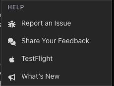
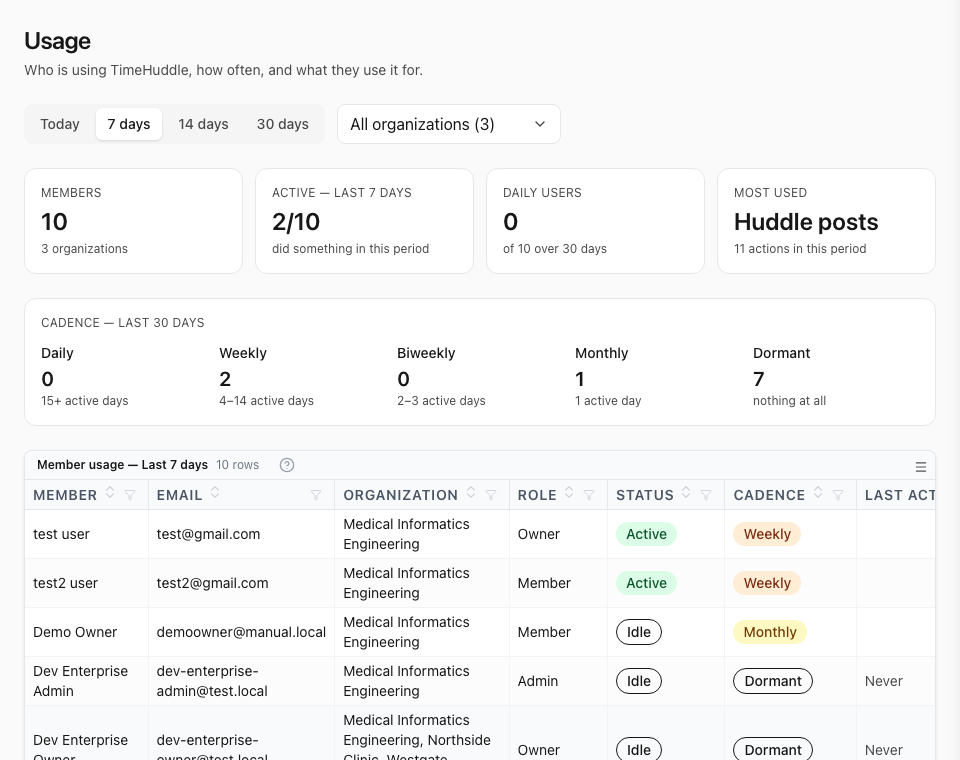

The largest release since TimeHuddle started updating itself. Retroactive edits
to a timesheet now go through an approval queue, notifications open the exact
thing they are about, and attaching a screenshot to a Huddle post takes one
keystroke.

## Time changes now go through approval

Editing hours after the fact used to be silent. It now creates a request that an
admin has to rule on:

- Submitting a retroactive change asks for a justification — a sentence on why
  the recorded time was wrong.
- Admins get a review queue with everything waiting on them, and can approve or
  decline each request with the original and the proposed times side by side.
- The person who asked sees the outcome on their timesheet: pending while it
  waits, declined if it was turned down, with the reviewer's decision attached.
- Pending requests are flagged from anywhere on the Dashboard, not only when you
  happen to be looking at the Timesheet.

Brand-new entries still need a video; adjusting an entry that already exists no
longer does, though you can always attach one.

## Notifications take you to the right place

Tapping a notification used to drop you on the Dashboard and leave you to find
what it was about. Each one now opens its subject directly — a clock event opens
the Huddle post for that session, a timesheet request opens that request, a
mention opens that post and highlights it. Tapping the same notification twice
re-highlights rather than doing nothing, and links that arrive while the app is
already open are honoured instead of being dropped.

On iOS and Android this also works from outside the app: a `timehuddle://` link
opens straight to the page it names.

## Attaching things to a Huddle post

- **Paste or drag a screenshot** straight into the composer — no saving it to
  disk first. It appears in the post as you write, where you put it, so you can
  see what you are about to send. Dragging one in used to look like it worked
  and then fail on **Post** with nothing but "Failed to post".
- **Drag in a document** — a PDF, a Word file — and it attaches. Dropping one
  used to do nothing whatsoever.
- **When something does go wrong**, the composer says so in place, naming the
  file and the reason, and keeping what you had written and where your cursor
  was rather than interrupting with a browser popup. A file too large or of a
  type we cannot take is refused straight away instead of after the wait, and a
  post that cannot be sent says why — so you can fix it and retry without
  retyping anything.
- **Attachments are listed by the name you gave them**, not by the internal one
  the server stored them under.
- **One progress bar** for the whole upload, however many files it covers,
  rather than a separate indicator per file.
- **Images are compressed before they upload**, which makes posting from a phone
  on mobile data noticeably faster, and the size cap for other media went up.
- Videos recorded in Pulse Cam now attach reliably when started from the
  composer or from a QR scan.
- **Edit post** always opens a working editor. It could come up as an empty box
  with no toolbar and no sign of the post you were editing, with no way to
  change it. Editing two people at once, live, is switched off for the moment —
  that was the part that could take the editor down with it.

## Clock and timesheet corrections

- The clock status card shows which ticket you are currently on.
- Weekly timesheet totals now match the sum of the sessions displayed beneath
  them — they could previously differ by a minute or two from rounding.
- A ticket's priority can be cleared back to **none** once it has been set.
- Sessions that run past midnight are handled correctly when resolving the
  running ticket.
- Pull down to refresh works on every page that has something to refresh.
- Member rows on the Teams and Dashboard pages line up again.

## Release notes, in the app

Notes like this one now ship with the app. Open the account menu and choose
**What's New** — anything published since you last looked is marked, and the
count clears once you have read it. They are also readable without signing in,
from the link in the site header.

## Usage, for organization owners

If you run an organization, there is a new **Usage** entry in your account menu
under Admin. It answers the question you cannot get from a member list: who is
actually using TimeHuddle, how often, and what for.

If you run more than one organization, the picker at the top switches between
them or rolls them all into one list, where an **Organization** column shows who
belongs where and anyone in two of them appears once.

Every member gets a row. Alongside their name, email, role and whether they are
blocked, you get:

- **Cadence** — Daily, Weekly, Biweekly, Monthly or Dormant, worked out from how
  many separate days they did something over the last 30. This does not move
  when you change the period above, so it is a fair read of the habit rather
  than of the week you happen to be looking at.
- **What they use** — a column each for clock sessions, Huddle posts, comments,
  tickets, work timers and Pulse videos, plus a **Top feature** column that
  names the one they lean on most.
- **Last active** — when they last did anything at all, or "Never".

The buttons at the top switch the counts between today and the last 7, 14 or 30
days. The table sorts, filters and groups by any column, and exports, so "who
has not clocked in this fortnight" is a sort away.

Picking an organization changes **who is listed**, not which of their actions
count: the numbers are each person's own TimeHuddle activity, because some of
what they do — uploading a Pulse video, running a work timer — is not tied to an
organization at all.

You only see the organizations you own or administer, and the numbers behind the
page are refused to anyone else.

## Your Redmine issues, and finding the rest

With Redmine connected, the Tickets table now shows **your** Redmine issues rather
than every issue your account can see: the ones assigned to you, and any other
issue you have started a timer on. They appear in the table on their own — there
is nothing to add.

Everything else is a search away. Click into the search bar and a list of
suggestions opens under it: your assigned issues plus the ones you logged time on,
worked on recently or watch, each marked with why it is there — _Assigned_,
_Logged 2 days ago_, _Timer running_. Start typing and the table filters as it
always has, while the suggestions narrow to match; after a moment, **More from
Redmine** adds matching issues that are not in your table yet. The search bar
understands:

- words from an issue's **title**
- **#1234** for an issue by number
- a **Redmine link** pasted straight in
- **@name** for what someone is working on — their name, not their login

In the suggestions:

- **Enter** or a click opens the issue.
- The green **▶**, or **Shift+Enter**, starts a timer on it and adds it to your
  table and My Board, even when it is someone else's issue. The chip switches to
  _Timer running_, and back again the moment the timer stops.
- Once you have 500 pinned issues, a timer still starts, but the issue is not
  added to your table or My Board, and a message tells you so.
- The **×**, or **Delete**, hides a suggestion you do not want offered. Only the
  suggestion goes: an issue in your table stays there, it is still found by
  search, nothing changes in Redmine, and it comes back on its own after 15
  days, or as soon as it is assigned to you. **Settings → Redmine → Hidden suggestions** brings one back
  sooner.

An issue's own page has the same timer. **Start timer** in its header adds the
issue to your table and My Board if it is not there yet, then starts timing it;
the button reads **Stop timer** while that issue is being timed, wherever you
started it.

Anything on **My Board** stays in your table, even after the issue is closed or
reassigned — a board entry no longer disappears with nothing but "no longer
available" to show for it. If a board entry really is gone (the issue was
deleted, or you can no longer see it), the notice says so and **Remove them**
clears it off your board.

**Delete** in the bulk action bar, on the Tickets tab or My Board, now works on
Redmine issues too. It takes them out of your table and off My Board —
TimeHuddle only, never Redmine — and the confirmation says so. One assigned to
you stays out until you start a timer on it, or until it is assigned to you
again. TimeHuddle tickets in the same selection are still deleted for good, and
the dialog lists the two apart.

Its **Activity** now also shows the time people logged on the issue in Redmine
itself — the latest ten entries, with who logged it, how long, and their
comment — alongside the issue's Redmine history and your own TimeHuddle timers.
Time you sent from TimeHuddle appears once, as your timer, not twice. Switch
between **My activity** and **All** at the top of the section.
The page keeps itself up to date: come back to its tab after working in Redmine
and it shows what changed, without a reload.

An issue's page also has the same **Attachments** section as a TimeHuddle
ticket: add a link, or record a video with **Upload video with Pulse**. These
stay in TimeHuddle, where anyone whose Redmine account can see the issue finds
them. They are not added to the issue in Redmine.

## Sending your time to Redmine

Once you have clocked out, the Clock page offers **Send work entries to
Redmine**: your ticket time, one row per issue per day, with the activity to
log it under. Sent entries are permanent in Redmine, so the dialog is where you
check them. Time you track on a day after sending it is offered again on its
own, and goes to Redmine as a further entry.

- If Redmine refuses an entry, the dialog now says why in Redmine's own words —
  for example "Activity is not included in the list" — instead of just
  "rejected".
- **Never send** (the bin icon on a row) drops time you don't want in Redmine,
  such as an entry it keeps refusing. Nothing is sent, the time stays in
  TimeHuddle, and that row stops being offered; only time you track on that day
  later shows up again.

## Starting a timer when you are not clocked in

A ticket timer needs you to be clocked in. Starting one while you are clocked
out — from My Board, the search suggestions, the Work page or a Redmine issue's
page, for a TimeHuddle ticket or a Redmine issue alike — now asks once, and then
finishes the job:

- **Clock In Now** clocks you in and starts the timer you asked for.
- If your team asks for **today's plan** first, you are taken to the Clock page
  to write it. The page shows which timer is waiting, and as soon as you post
  the plan and clock in, that timer starts and you are taken back to where you
  were. **Cancel** there if you change your mind.

Every timer start now says so in a message naming the ticket, including when it
stopped another one: "Stopped Fix login. Timer started on #1234". And while a
timer is running, the Clock page tells you that clocking out will stop it.

## The full account menu on phones

On a phone, or in a narrow browser window, tapping your avatar showed only
Profile, Settings, What's New and Sign out. It now shows the same **Admin** and
**Help** entries as a wider screen, so you can reach Enterprise, Members, Usage,
Report an Issue, Share Your Feedback and TestFlight from the menu you already
know.

The **More** sheet in the bottom bar now lists the same entries too. It used to
leave out **Usage**, and organization admins who were not in an enterprise got
no Admin section there at all.

## Withdrawn

**Messages** and the **Media Library** have been removed. Both were partly built
and neither was ready to depend on, so they have been taken out rather than left
half-working. Direct messaging may return once it can be done properly; posting
in Huddle covers most of what Messages was used for in the meantime.

**Send to TimeHarbor** is gone from the ticket menu.
