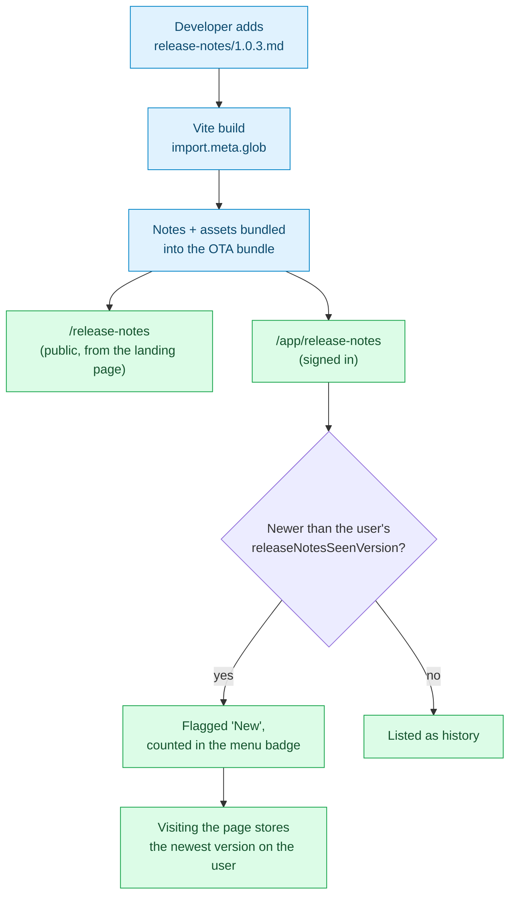

# release-notes/

**One markdown file per shipped version.** The app reads this folder directly:
[`src/features/release-notes/`](../src/features/release-notes/) bundles every file
here into the frontend build and renders them in two places — `/app/release-notes`
for signed-in users, who also get unread flagging, and `/release-notes` for
everyone else, linked from the landing page. Write for both: a note is read by
people who have not signed up yet.

These files are written for **users**, not for the changelog. If a change is
invisible to the person using TimeHuddle, it does not belong here — that is what
the git history and the PR description are for.

## The rule

```
release-notes/
  README.md          ← you are here (never rendered in-app)
  1.0.2.md           ← the note for version 1.0.2
  assets/
    1.0.2/           ← every image or clip referenced by 1.0.2.md
      clock-in.png
```

- **The filename is the version.** `1.0.2.md` is the note for `1.0.2` — the same
  version the OTA bundle ships under. The file's `version:` field must match its
  own filename, or the note is dropped from the page at build time. Nothing
  reports that, so check the page after adding a note.
- **Anything that isn't `<semver>.md` is ignored**, so this README never shows up
  in the app.
- **Assets live under `assets/<version>/`** — one folder per release, so deleting
  an old note never orphans someone else's screenshot.

## Adding a note

1. Decide the version. It is whatever `package.json` `version` will be when this
   change is published — check
   [`.github/workflows/ota-publish.yml`](../.github/workflows/ota-publish.yml):
   a push to `main` publishes a bundle at the current `package.json` version.
   If a note for that version already exists, **add to it** rather than creating
   a second file.
2. Copy the template below to `release-notes/<version>.md`.
3. Put any screenshots in `release-notes/assets/<version>/`.
4. Look at it: `npm run dev` → `/release-notes` (no login) or `/app/release-notes`.
   This is the only check there is — a bad version, a bad date or an image path
   that points at nothing drops the note from the page with no error anywhere,
   so if your release is missing, that is why.

### Template

```markdown
---
version: 1.0.3
date: 2026-09-25
title: A short, user-facing headline
---

A one- or two-sentence lead explaining what changed and why anyone should care.
Write it the way you'd explain it to a colleague who does not work on this code.

## The thing that changed

What it does now, and what it replaced. Screenshot if the change is visual:


## The other thing

- Short bullets are fine for smaller items
- Each one says what a user can now do
```

Required frontmatter fields — all three, no others are read:

| Field     | Format           | Notes                                                  |
| --------- | ---------------- | ------------------------------------------------------ |
| `version` | semver (`1.0.3`) | Must equal the filename                                |
| `date`    | `YYYY-MM-DD`     | The day it ships, not the day you wrote it             |
| `title`   | plain text       | Shown as the release headline; keep it under ~60 chars |

## Assets

| Kind              | Format                                      | Where                |
| ----------------- | ------------------------------------------- | -------------------- |
| Still screenshot  | `.png` (`.jpg` for photographic content)    | `assets/<version>/`  |
| Short interaction | animated `.gif` or `.webp`, **under ~2 MB** | `assets/<version>/`  |
| Longer demo       | **YouTube link**, not a committed file      | in the markdown body |

Everything in `assets/` is bundled into the app's JavaScript build, and that
build is what gets pushed to phones as an OTA update. A 20 MB screen recording
in this folder is a 20 MB download for every user on cellular data, so:

- **Crop and compress stills.** Full-desktop screenshots of a single button are
  the most common offender.
- **Reach for a GIF only when motion is the point** — a drag, a transition, a
  multi-step flow. A still plus a sentence beats an 8 MB loop.
- **Video never gets committed.** Upload it to YouTube and link it. The app
  already renders YouTube links via
  [`@timehuddle/youtube`](../packages/youtube/), so a bare URL on its own line is
  enough.

Reference assets with a path relative to this folder — `assets/1.0.3/clock-in.png`
— and always give the image real alt text. The build rewrites that path to the
hashed bundle URL; a path that matches no file drops the whole note from the
page, so check it renders before you ship.

## How a note reaches the user



The "already seen" marker lives on the user document in the Meteor backend
(`releaseNotesSeenVersion`), not in `localStorage` — so a user who reads the
notes on their laptop does not see them flagged as new on their phone.

## Prior art

The model here is deliberately VS Code's: notes are keyed by **version** rather
than by a timestamp, because "everything since your last login" breaks for anyone
who happens to log in halfway through a deploy. Keep a Changelog's
`Added/Changed/Fixed` headings are a reasonable fallback structure for a release
with a lot of small items, but prose beats a category list when there is one
thing worth talking about.
