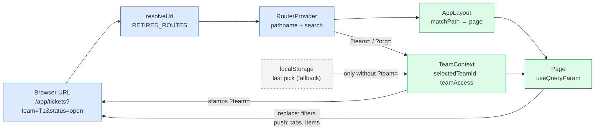

# Routing and URL Scheme

The URL is the source of truth for **where the user is and what they are looking at**. Copying the address bar, reloading, opening a new tab or pressing Back must land on the same view. Issue [#618](https://github.com/mieweb/timehuddle/issues/618) tracks the rollout; the params table below is the current state of it.

There is no router library. [`router.tsx`](router.tsx) provides `RouterProvider` and the helpers below, and [`AppLayout.tsx`](AppLayout.tsx) maps paths to pages.

## The Three Rules

| Part of the URL           | Meaning                       | Example                           |
| ------------------------- | ----------------------------- | --------------------------------- |
| **Path**                  | The resource being looked at  | `/app/tickets/665f…`              |
| **`?team=` / `?org=`**    | The scope (which team or org) | `/app/dashboard?team=665a…`       |
| **Any other query param** | View state                    | `?tab=team`, `?status=open&q=bug` |

- **Scope** is owned by [`TeamContext`](../lib/TeamContext.tsx). `?team=` wins over the team remembered in `localStorage`, which is only the fallback for a URL without one. A URL team also selects its org. Team-scoped pages get the selected team stamped into the URL automatically, so pages never write `?team=` themselves.
- **Resource paths that already belong to a scope** (`/app/tickets/:ticketId`, `/app/profile/:idOrUsername`) don't get `?team=` stamped on.
- **A URL that names a team or org the user can't access is never swapped for one they can.** `useTeam().teamAccess` / `orgAccess` become `'forbidden'` and the page shows a no-access state. (`?org=` is only read this way when no `?team=` already implies an org.)
- **A shared link points at the public web origin**, not at whatever the app is loaded from: inside the native shell `window.location.origin` is `capacitor://localhost`. Build share links with `absoluteAppUrl()` from [`lib/useCopyLink.ts`](../lib/useCopyLink.ts), which falls back to `VITE_PUBLIC_APP_URL` (then the backend host) on native.

## Writing to the URL: `replace` vs `push`

| Change                                           | Mode      | Why                                         |
| ------------------------------------------------ | --------- | ------------------------------------------- |
| Typing in a search box, picking a filter         | `replace` | Back shouldn't step through every keystroke |
| Switching team or org                            | `replace` | A scope change isn't a place to go back to  |
| Switching a tab, opening a panel, item or thread | `push`    | Back should undo it                         |

```tsx
import { useQueryParam, useQueryParams } from '@ui/router';

// One param. `replace` is the default.
const [status, setStatus] = useQueryParam('status');
setStatus('open'); // → ?status=open, no history entry

// Something Back should undo.
const [tab, setTab] = useQueryParam('tab', { mode: 'push' });

// Several params at once.
const { params, setParams } = useQueryParams();
setParams({ view: 'timesheet', member: null }, 'push'); // null or '' removes a key
```

Path params use `matchPath('/app/tickets/:ticketId', pathname)`, which returns `{ ticketId }` or `null`.

**Never** call `window.history.*` or parse `window.location.search` in a page. Go through these helpers, so `RouterProvider` re-renders the page on every change, Back included.

## Params by Page

| Page                            | Params                                                                                      |
| ------------------------------- | ------------------------------------------------------------------------------------------- |
| Teams `/app/teams/:teamId`      | the team is in the path; `/app/teams` redirects to the selected team                        |
| Tickets `/app/tickets`          | none yet — its search, filters and tab are component state (see #618 follow-up)             |
| Ticket `/app/tickets/:ticketId` | none — copy it with **Copy Link**                                                           |
| Dashboard                       | `tab=me\|team`, `view=timesheet`, `member`, `request`                                       |
| Huddle                          | `view=me` (Personal), `conversation`, `q`; `post` resolves to the `conversation` holding it |
| Work                            | `date=YYYY-MM-DD` (today when absent)                                                       |
| Profile                         | `tab` (Feed when absent)                                                                    |
| Org Members                     | `q`                                                                                         |
| Org Usage                       | `period`, `usageOrg` — not `org`, which is the app-wide scope                               |

Search boxes use `useSearchParam(name)`: the page filters as you type and the URL follows once typing pauses.

## Pages Kept Mounted

Most pages unmount when you leave and refetch when you come back. A page listed in `KEPT_ROUTES` in [`AppLayout.tsx`](AppLayout.tsx) is instead mounted on its first visit and kept, hidden by `<Activity mode="hidden">`, behind every other page, so its view, scroll position, drafts and data are still there on return ([#669](https://github.com/mieweb/timehuddle/issues/669)).

| Route                                                                                         | Kept                 | Why                                                                    |
| --------------------------------------------------------------------------------------------- | -------------------- | ---------------------------------------------------------------------- |
| Dashboard, Work, Huddle, Teams, Activity Log, Organization                                    | yes, `<Activity>`    | Visited often, and each holds a load, a view or a draft worth keeping  |
| Tickets                                                                                       | yes, its own wrapper | Mounted at boot and only made invisible elsewhere, so it keeps running |
| Clock, Settings, Notifications, Release Notes, Enterprise, Seeder, Hi, Org Members, Org Usage | no                   | Little state to lose, or should show fresh data on arrival             |
| Profile, Ticket detail, Redmine issue detail                                                  | no                   | Keyed by id: a fresh mount per id is the intended behavior             |

**Deciding for a new route.** Keep it only when all of these hold: users leave it and come back often, it holds state worth keeping (a view, scroll, a half-typed form, an expensive load), and it is not keyed by id. Otherwise let it unmount: a kept page costs memory for the rest of the session.

**What a kept page has to get right:**

- **Effects pause while hidden.** Every effect is cleaned up on hide and run again on show, so its listeners and subscriptions are off while away, and its loads run again on return. A return must reload **quietly**, behind the data already on screen: no spinner and no skeleton. `useScopeChange` ([`lib/useScopeChange.ts`](../lib/useScopeChange.ts)) tells a new team, org, user or week, which should clear and show loading, from a return, which should not.
- **Reset on a real scope change, not on cleanup.** Clear data when the team, org or user actually changes, never in an effect cleanup, which now also runs on every hide.
- **Each kept page sees its own URL.** `AppLayout` gives every kept page the location it was last on screen at, so a hidden page keeps rendering the view it was left on instead of reading the visible page's params (and unmounting its panels meanwhile). The sidebar link back is a bare path, one naming no view, only the scope (`team`, `org`), so on return the remembered view is restored before the page renders, under the scope selected now; a link that names any view param wins. `AppLayout` also restores each kept page's scroll position in `<main>`.
- **Only the newest load may write.** A load left in flight on hide can answer after the return's load, possibly for another team or week. `useLatestRequest` ([`lib/useLatestRequest.ts`](../lib/useLatestRequest.ts)) retires every earlier load when a new one begins.
- **Never write the URL while hidden.** Paused effects already can't; don't do it from render either.
- **No media, toasts or sounds while hidden.** `<Activity>` keeps the DOM alive, so a playing `<video>` keeps playing: give it `usePauseOnHide` ([`usePauseOnHide.ts`](usePauseOnHide.ts)), which also covers media in a dialog or portal. Huddle pauses everything under its root.
- **Pull-to-refresh** is registered by an effect, so a hidden page's handler is already off.

**Loading states.** A first load, or a real scope change, shows a skeleton in the shape of the content ([`PageSkeleton.tsx`](PageSkeleton.tsx)), with one polite live region announcing it. `Spinner` stays for inline progress: in a button, a row or a card header.

A signed-out visitor who opens an `/app/...` link signs in and comes back to it ([`lib/returnTo.ts`](../lib/returnTo.ts)).

## Legacy Links That Must Keep Working

Notification payloads and bookmarks already in the wild use these. They are read as aliases and normalised to the new name the next time the URL is written.

| Legacy                                          | Now                                            |
| ----------------------------------------------- | ---------------------------------------------- |
| `?teamId=`                                      | `?team=`                                       |
| `?postId=`                                      | `?post=`                                       |
| `?memberId=`                                    | `?member=`                                     |
| `?requestId=`                                   | `?request=`                                    |
| `/app/timesheet`, `/app/messages`, `/app/media` | `RETIRED_ROUTES` in [`router.tsx`](router.tsx) |

## Paths That Don't Resolve

A path with no entry in `ROUTES` and no dynamic match renders the not-found state, under the URL that was asked for. It is **not** swapped for the dashboard: a mistyped or stale link that quietly showed a different page left the URL and the content disagreeing, so copying it, reloading it or switching a tab on it all carried the dead path along. Retired paths are rewritten in `resolveUrl` before the route table sees them, so they redirect as before.

Repeated slashes are collapsed first (`//app/timesheet` → `/app/timesheet`). Besides missing the route table, a leading `//` is a protocol-relative URL that makes `history.pushState` throw a cross-origin `SecurityError`.

## How a URL Becomes a Page


