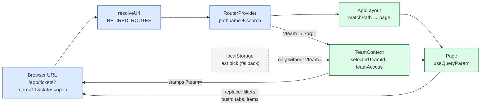

# Routing and URL Scheme

The URL is the source of truth for **where the user is and what they are looking at**. Copying the address bar, reloading, opening a new tab or pressing Back must land on the same view. Issue [#618](https://github.com/mieweb/timehuddle/issues/618) tracks the rollout; [`docs/deep-linking-618-plan.md`](../../docs/deep-linking-618-plan.md) shows which pages are done.

There is no router library. [`router.tsx`](router.tsx) provides `RouterProvider` and the helpers below, and [`AppLayout.tsx`](AppLayout.tsx) maps paths to pages.

## The Three Rules

| Part of the URL           | Meaning                       | Example                           |
| ------------------------- | ----------------------------- | --------------------------------- |
| **Path**                  | The resource being looked at  | `/app/tickets/665f…`              |
| **`?team=` / `?org=`**    | The scope (which team or org) | `/app/dashboard?team=665a…`       |
| **Any other query param** | View state                    | `?tab=team`, `?status=open&q=bug` |

- **Scope** is owned by [`TeamContext`](../lib/TeamContext.tsx). `?team=` wins over the team remembered in `localStorage`, which is only the fallback for a URL without one. A URL team also selects its org. Team-scoped pages get the selected team stamped into the URL automatically, so pages never write `?team=` themselves.
- **Resource paths that already belong to a scope** (`/app/tickets/:ticketId`, `/app/profile/:idOrUsername`) don't get `?team=` stamped on.
- **A URL that names a team or org the user can't access is never swapped for one they can.** `useTeam().teamAccess` / `orgAccess` become `'forbidden'` and the page shows a no-access state. (`?org=` is only read this way when no `?team=` already implies an org.)
- **A shared link points at the public web origin**, not at whatever the app is loaded from: inside the native shell `window.location.origin` is `capacitor://localhost`. Build share links with `absoluteAppUrl()` from [`lib/useCopyLink.ts`](../lib/useCopyLink.ts), which falls back to `VITE_PUBLIC_APP_URL` (then the backend host) on native.

## Writing to the URL: `replace` vs `push`

| Change                                           | Mode      | Why                                         |
| ------------------------------------------------ | --------- | ------------------------------------------- |
| Typing in a search box, picking a filter         | `replace` | Back shouldn't step through every keystroke |
| Switching team or org                            | `replace` | A scope change isn't a place to go back to  |
| Switching a tab, opening a panel, item or thread | `push`    | Back should undo it                         |

```tsx
import { useQueryParam, useQueryParams } from '@ui/router';

// One param. `replace` is the default.
const [status, setStatus] = useQueryParam('status');
setStatus('open'); // → ?status=open, no history entry

// Something Back should undo.
const [tab, setTab] = useQueryParam('tab', { mode: 'push' });

// Several params at once.
const { params, setParams } = useQueryParams();
setParams({ view: 'timesheet', member: null }, 'push'); // null or '' removes a key
```

Path params use `matchPath('/app/tickets/:ticketId', pathname)`, which returns `{ ticketId }` or `null`.

**Never** call `window.history.*` or parse `window.location.search` in a page. Go through these helpers, so `RouterProvider` re-renders the page on every change, Back included.

## Params by Page

| Page                            | Params                                                                          |
| ------------------------------- | ------------------------------------------------------------------------------- |
| Teams `/app/teams/:teamId`      | the team is in the path; `/app/teams` redirects to the selected team            |
| Tickets `/app/tickets`          | none yet — its search, filters and tab are component state (see #618 follow-up) |
| Ticket `/app/tickets/:ticketId` | none — copy it with **Copy Link**                                               |
| Dashboard                       | `tab=me\|team`, `view=timesheet`, `member`, `request`                           |
| Huddle                          | `conversation`, `q`; `post` resolves to the `conversation` holding it           |
| Work                            | `date=YYYY-MM-DD` (today when absent)                                           |
| Profile                         | `tab` (Feed when absent)                                                        |
| Org Members                     | `q`                                                                             |
| Org Usage                       | `period`, `usageOrg` — not `org`, which is the app-wide scope                   |

Search boxes use `useSearchParam(name)`: the page filters as you type and the URL follows once typing pauses.

A signed-out visitor who opens an `/app/...` link signs in and comes back to it ([`lib/returnTo.ts`](../lib/returnTo.ts)).

## Legacy Links That Must Keep Working

Notification payloads and bookmarks already in the wild use these. They are read as aliases and normalised to the new name the next time the URL is written.

| Legacy                                          | Now                                            |
| ----------------------------------------------- | ---------------------------------------------- |
| `?teamId=`                                      | `?team=`                                       |
| `?postId=`                                      | `?post=`                                       |
| `?memberId=`                                    | `?member=`                                     |
| `?requestId=`                                   | `?request=`                                    |
| `/app/timesheet`, `/app/messages`, `/app/media` | `RETIRED_ROUTES` in [`router.tsx`](router.tsx) |

## How a URL Becomes a Page


