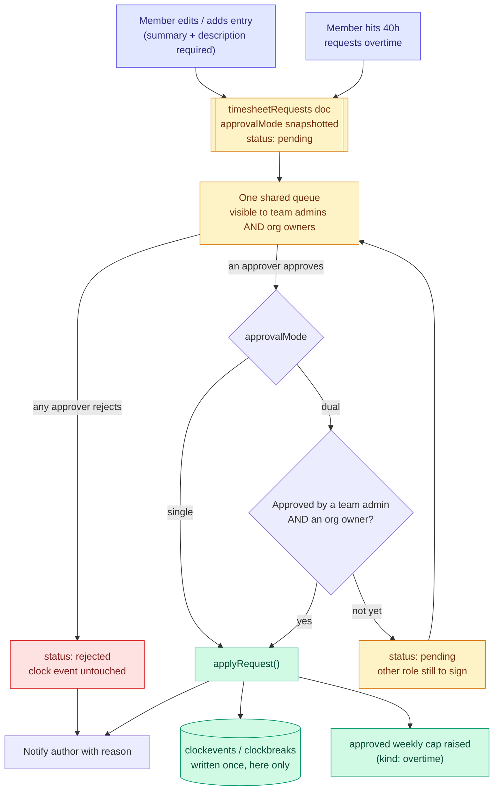

# Timesheet Approval & 40-Hour Barrier — Implementation Plan

Two related controls on recorded time:

1. **Justified edits** — every manual timesheet entry and every edit to an existing one carries a short summary + a description, and lands in an approval queue. **Either the team admin or the org owner can approve it** — whoever gets there first. A team that wants a second pair of eyes turns on owner review and then needs both.
2. **40h/week barrier** — a person is warned when they cross 40 recorded hours in a week, and cannot start a _new_ shift past that line without an approved overtime request.

Both run through **one approval engine**. An overtime request is just a third `kind` of timesheet request, so the queue, the notifications, the publication, and the approve/reject methods are written once.

---

## Decisions taken

| Question                    | Decision                                                                                                                               |
| --------------------------- | -------------------------------------------------------------------------------------------------------------------------------------- |
| Do edits apply immediately? | **No.** The clock event is untouched; proposed values live in a request doc and are written only on final approval.                    |
| Who approves                | **One approval, from either role.** Team admin _or_ org owner resolves it. A team may switch on `requireOwnerApproval` to demand both. |
| 40h enforcement             | **Warn at 40h, block new clock-ins past it.** A running shift is never cut off.                                                        |
| Who counts toward 40h       | **Per person, across all their teams** — not per team.                                                                                 |

The pending-request model means **zero migration**: existing `clockevents` documents are never reshaped, and with the feature toggle off the system behaves exactly as it does today.

---

## Flow



`approvalMode` is **snapshotted onto the request when it is filed**, not read live from team settings. An admin flipping the toggle must not silently unblock — or re-block — requests already sitting in the queue.

---

## 1. Data model

### New collection: `timesheetRequests`

Registered in [meteor-backend/server/collections.js](meteor-backend/server/collections.js) alongside the others (`idGeneration: 'MONGO'`).

```js
{
  _id,
  kind: 'edit' | 'manual' | 'overtime',
  userId,                    // whose timesheet this concerns (the subject)
  createdBy,                 // who filed it — usually === userId, but an admin may file on someone's behalf
  teamId,                    // scoping team; org is resolved from it at read time
  clockEventId,              // set for kind 'edit'; null for 'manual' and 'overtime'

  summary,                   // required, <= 80 chars — the "short" shown in the queue row
  description,               // required, <= 1000 chars — the justification

  // kind: 'edit' | 'manual'
  proposed: { startTime, endTime, breaks: [{ startTime, endTime, type }] },

  // kind: 'overtime'
  overtime: { weekStartMs, weekEndMs, observedSeconds, requestedCapSeconds },

  approvalMode: 'single' | 'dual',   // snapshotted from team settings at file time
  decisions: [                       // append-only; one entry per person who acted
    { role: 'team' | 'org', by, at, decision: 'approved' | 'rejected', note }
  ],
  status: 'pending' | 'approved' | 'rejected' | 'cancelled',

  createdAt, updatedAt, resolvedAt
}
```

An append-only `decisions` array rather than two fixed `teamApproval` / `orgApproval` slots. In single mode there is no meaningful "side" to file a decision under — the approver's role is recorded as provenance, not as a slot that must be filled. One array serves both modes, and it doubles as the audit trail.

Two deliberate omissions, per the **Core Model Data Discipline** rule in `CLAUDE.md`:

- **No `orgId`.** It is derivable from `teamId` → `teams.orgId`; the owner queue resolves it at query time.
- **No snapshot of the current event values.** The canonical values stay in `clockevents`; the approval UI reads both and renders the diff.

`status` is _derived_ from `decisions` after every action — never set by a client:

| `approvalMode` | Resolves to `approved` when…                                        | Resolves to `rejected` when…          |
| -------------- | ------------------------------------------------------------------- | ------------------------------------- |
| `single`       | **any one** eligible approver approves — team admin or org owner    | **any one** eligible approver rejects |
| `dual`         | a team admin **and** an org owner have each approved (in any order) | **any one** eligible approver rejects |

A rejection is decisive in both modes: one "no" ends it, and the other role never has to weigh in. Approval is where the two modes differ.

### Indexes

Created in a `Meteor.startup` block in the new module, mirroring the pattern already used in [meteor-backend/server/org-helpers.js](meteor-backend/server/org-helpers.js#L22-L34):

```js
{ userId: 1, status: 1 }
{ teamId: 1, status: 1 }
{ clockEventId: 1 }  // unique, partialFilterExpression: { status: 'pending', kind: 'edit' }
```

The partial unique index is what prevents two competing pending edits on the same clock session — enforced by the database, not by a read-then-write race.

### No changes to `clockevents`

The clock event schema is untouched. Pending state is discovered by joining on `clockEventId`, which the timesheet method already has the ids for.

---

## 2. Backend — new files

### `meteor-backend/server/timesheet-approvals-core.js`

Pure engine, no Meteor method context — same shape as [clock-core.js](meteor-backend/server/clock-core.js), so it is unit-testable without DDP.

- `deriveStatus(request)` — the rule table above, driven off `approvalMode` + `decisions`.
- `recordDecision(request, { role, approverId, decision, note })` — appends to `decisions` and returns the next request doc. Re-deciding by the same person replaces their prior entry rather than stacking a second one.
- `applyRequest(request)` — **the only place that writes a request's values into `clockevents` / `clockbreaks`.** Reuses `toBreakEntries`, `normalizeBreakEntries`, `classifyBreak`, and `computeDeductedBreakSeconds` from `clock-core` so `accumulatedTime` is computed identically to a live clock-out. Re-runs the overlap check at apply time (the world may have changed since the request was filed) and returns `{ ok: false, reason: 'overlap' }` rather than corrupting the sheet.
- `resolveApproverRoles(userId, team)` → `{ isTeamAdmin, isOrgOwner }`.

### `meteor-backend/server/clock-week.js`

- `WEEKLY_LIMIT_SECONDS = 40 * 3600` (overridable per org — see §6).
- `weekBoundsFor(ms)` — Monday 00:00 → next Monday 00:00, server-local. Written to take a timezone argument from day one even though v1 passes the server default.
- `weeklyWorkSeconds(userId, weekStartMs, weekEndMs, now)` — sums `computeWorkSeconds` across **all** the user's clock events overlapping the week, in every team, clipping sessions at the week boundary.
- `approvedCapSeconds(userId, weekStartMs)` — the org's limit, or the `requestedCapSeconds` of an approved overtime request covering that week.

Pending (unapproved) hours never count toward the total — consistent with the pending model.

---

## 3. Backend — modified methods

All in [meteor-backend/server/clock.js](meteor-backend/server/clock.js).

| Method                      | Change                                                                                                                                                                                                       |
| --------------------------- | ------------------------------------------------------------------------------------------------------------------------------------------------------------------------------------------------------------ |
| `clock.createManual` (L459) | Requires `summary` + `description`. Keeps all existing validation (past-only, end-after-start, overlap) but **inserts a `manual` request instead of a clock event**. The event is created by `applyRequest`. |
| `clock.updateTimes` (L360)  | Requires `summary` + `description`. No longer mutates the event — files an `edit` request. The existing permission check (owner or team admin) becomes the check on _who may file_, not on who may apply.    |
| `clock.deleteEvent` (L430)  | Cancels any pending request for that event, so the queue never shows orphans.                                                                                                                                |
| `clock.start` (L126)        | New weekly gate before the insert (below).                                                                                                                                                                   |

### The 40h gate in `clock.start`

```js
const { start, end } = weekBoundsFor(now);
const worked = await weeklyWorkSeconds(userId, start, end, now);
const cap = await approvedCapSeconds(userId, start);
if (worked >= cap) {
  throw new Meteor.Error('weekly-limit', 'Weekly hour limit reached', {
    workedSeconds: worked,
    capSeconds: cap,
    weekStartMs: start,
  });
}
```

This mirrors the existing `plan-required` throw at [clock.js:216](meteor-backend/server/clock.js#L216), so the frontend error path is a pattern the codebase already has.

### New methods

| Method                                                                                 | Purpose                                                                                         |
| -------------------------------------------------------------------------------------- | ----------------------------------------------------------------------------------------------- |
| `timesheet.myRequests({ status })`                                                     | The author's own requests, for the "Pending review" badges.                                     |
| `timesheet.approverQueue({ status })`                                                  | Everything awaiting the caller as team admin or org owner — one list, both roles.               |
| `timesheet.approve({ requestId, note })`                                               | Role recorded from the caller. Idempotent — a repeat approve is a no-op, not a second decision. |
| `timesheet.reject({ requestId, note })`                                                | `note` **required** — a rejection without a reason is useless to the author.                    |
| `timesheet.cancel({ requestId })`                                                      | Author withdraws while pending.                                                                 |
| `clock.requestOvertime({ teamId, weekStartMs, requestedHours, summary, description })` | Files an `overtime` request.                                                                    |
| `clock.weeklyStatus({ teamId })`                                                       | `{ workedSeconds, capSeconds, weekStartMs, pendingOvertimeRequestId }` for the progress bar.    |

Every one needs a matching `Wormhole.expose(...)` block in [meteor-backend/server/main.js](meteor-backend/server/main.js#L964) — the frontend reaches methods only through `wormholeCall`.

### Publication

`timesheet.requestsForApprover` — live queue for the sidebar badge, modelled on `teamJoinRequests.forTeam` in [team-join-requests.js](meteor-backend/server/team-join-requests.js#L63-L70): resolve the caller's admin teams + owned orgs' teams, then `find({ teamId: { $in: allowed }, status: 'pending' })`.

### Notifications

Add `notifyTimesheetApprovers(request)` to [notify-core.js](meteor-backend/server/notify-core.js) — resolves team admins ∪ org owners, dedupes, and fans out via the existing `createNotification`. New `data.type` values, each with a deep-link `url`:

`timesheet-approval-request` · `timesheet-approved` · `timesheet-rejected` · `weekly-limit-reached` · `overtime-approved`

### The 40h warning job

[agenda.js](meteor-backend/server/agenda.js) already schedules the 4h break and 7h45m shift-end reminders on clock-in. Add `scheduleWeeklyLimitWarning(eventId, userId, teamId, startMs)`, delayed by `cap - workedSoFar` seconds, firing a `weekly-limit-reached` notification with a CTA to the overtime form. Cancel it in `cancelClockJobs`; reschedule when an approved edit changes the week's totals.

---

## 4. Authorization rules

Add `resolveTimesheetApprovalRoles(userId, teamId)` to [permissions.js](meteor-backend/server/permissions.js). It needs the two roles kept **distinct**, so it must not reuse `isTeamAdminOrOrgOwner` from `org-helpers.js` — that helper deliberately conflates them. Export the currently module-private `resolveOrgRoleForTeam` (L66) for the owner side.

Three rules that make approval mean something:

1. **No self-approval.** A decision counts only from an approver who is _not_ the subject (`request.userId`). This is the one rule that holds in both modes — in single mode it is the _only_ thing stopping a team admin from rubber-stamping their own edits.
2. **One person, both hats.** In dual mode, an approver who is both team admin and org owner of that team satisfies both roles with one click (recorded as two `decisions` entries with the same `by`). Making them click twice is theatre.
3. **No eligible approver → auto-approve, with the reason recorded.** If no eligible non-subject approver exists in a required role, that requirement is satisfied automatically so requests can never hang forever.

**Single mode makes rule 3 almost redundant, which is a real argument for it as the default.** `ensureDefaultOrganization` creates orgs with an empty `owners` array — under mandatory dual approval, _every_ request on a default install would hang waiting for an owner who does not exist. In single mode the team admin simply approves and the org owner is irrelevant. The dual-mode escalation path is unchanged: org owners → enterprise owners/admins (`isEnterpriseElevatedForTeamOrg` already exists at [permissions.js:75](meteor-backend/server/permissions.js#L75)) → auto.

**Guard the toggle against the empty-owner trap.** `requireOwnerApproval` must refuse to turn on when the team's org has no owner and no enterprise-elevated user above it — otherwise an admin enables it and quietly freezes their own queue. The error should say which is missing and how to fix it, not just "not allowed".

---

## 5. Frontend

| File                                                                                  | Change                                                                                                                                                                                                                                                  |
| ------------------------------------------------------------------------------------- | ------------------------------------------------------------------------------------------------------------------------------------------------------------------------------------------------------------------------------------------------------- |
| [src/lib/api.ts](src/lib/api.ts#L1332)                                                | `timesheetApi` wrappers + `TimesheetRequest` type; `ClockEvent.pendingRequestId?`.                                                                                                                                                                      |
| **new** `src/features/clock/TimesheetEntryForm.tsx`                                   | Time fields + Summary (`Input`) + Description (`Textarea`), with required-field validation. **Replaces three near-identical modal bodies** that exist today.                                                                                            |
| [PersonalTimesheetPanel.tsx](src/features/clock/PersonalTimesheetPanel.tsx#L677-L911) | Both modals switch to the shared form; submit files a request and shows "Sent for approval".                                                                                                                                                            |
| [AdminTimesheetPanel.tsx](src/features/teams/AdminTimesheetPanel.tsx#L274)            | Same shared form; an admin's own edit is a request too (auto-satisfying their side).                                                                                                                                                                    |
| [TimesheetRow.tsx](src/features/clock/TimesheetRow.tsx#L226-L240)                     | `Pending review` / `Changes rejected` `Badge` with an `aria-label` naming which approvals are outstanding.                                                                                                                                              |
| **new** `src/features/clock/ApprovalsPanel.tsx`                                       | Approver queue: request cards, current-vs-proposed diff, Approve / Decline `Button`s, decline-note `Modal`. One list for both roles; a dual-mode card states which role is still outstanding, a single-mode card says the approval applies immediately. |
| [TeamsPage.tsx](src/features/teams/TeamsPage.tsx#L1048)                               | The two settings toggles, beside the existing auto-accept-joins switch; `requireOwnerApproval` nested under and disabled unless approvals are on.                                                                                                       |
| **new** `src/features/clock/OvertimeRequestModal.tsx`                                 | Opened from the blocked clock-in and from the 40h banner.                                                                                                                                                                                               |
| [ClockPage.tsx](src/features/clock/ClockPage.tsx#L266)                                | Catch `weekly-limit` from `clockApi.start` where `plan-required` is already handled; weekly progress bar (`worked / cap`).                                                                                                                              |
| [AppLayout.tsx](src/ui/AppLayout.tsx#L199-L229)                                       | Route the five new notification types.                                                                                                                                                                                                                  |

All controls from `@mieweb/ui`; all user-facing strings through the i18n layer; `aria-live` on the queue so approve/reject outcomes are announced.

---

## 6. Settings

- **Team** — `teams.updateSettings` ([teams.js:458](meteor-backend/server/teams.js#L458)) gains two booleans, following the existing `requirePlanForClock` pattern:
  - `requireTimesheetApproval` — turns the whole feature on for the team. **Default `false`**, so deploying changes nothing until a team opts in.
  - `requireOwnerApproval` — the extra pair of eyes. **Default `false`** (single approval). When on, requests filed by this team snapshot `approvalMode: 'dual'` and need both a team admin and an org owner. Only meaningful when the first toggle is on, so the UI nests it beneath and disables it otherwise.
- **Org** — `weeklyHourLimitSeconds` on the organization document, default 40h. Orgs on a 37.5h or 45h week shouldn't be forced to 40, and hard-coding it would guarantee a rewrite later.

---

## 7. Tests

Run against the isolated `timehuddle-meteor-test` database (port 3101), per existing convention.

**`clock-week.test.js`** — week bounds incl. a DST transition; a session spanning the Sunday/Monday boundary; multi-team summation; cap raised by an approved overtime request.

**`timesheet-approvals-core.test.js`** — single mode: one team-admin approval applies it, and so does one org-owner approval alone. Dual mode: one approval leaves it pending, both apply it, either order. Both modes: any rejection resolves it immediately and the event is untouched; self-approval refused; no-eligible-approver auto-approves with a reason; repeat approval by the same person is a no-op; apply-time overlap → `ok: false`, nothing written. Plus the snapshot rule — flipping `requireOwnerApproval` does not change the mode of a request already in the queue.

**Method-level** — `createManual` creates a request and no clock event; `updateTimes` leaves the event byte-identical; `clock.start` throws `weekly-limit` at cap and succeeds one second under it; the partial unique index rejects a second pending edit.

**Frontend** — `TimesheetRow` pending/rejected badges; form refuses empty summary or description; `timesheetUtils` maths unchanged.

---

## 8. Phasing

**Phase 1 — approval engine + justified edits.** Collection, indexes, `timesheet-approvals-core` (both modes — they are two branches of one `deriveStatus`, not two features), permission resolver, modified `createManual`/`updateTimes`, approve/reject/cancel methods, Wormhole exposures, notifications, `ApprovalsPanel`, shared `TimesheetEntryForm`, both team settings. Shippable alone.

**Phase 2 — 40h barrier.** `clock-week`, the `clock.start` gate, the Agenda warning job, `clock.requestOvertime` (reusing the Phase 1 engine), `OvertimeRequestModal`, weekly progress bar.

**Phase 3 — polish.** Org-level weekly limit, reports/exports excluding pending changes, approver digest notification, no-org-owner warning in team settings.

Phase 1 and Phase 2 are separate PRs. Within Phase 1, the backend engine + methods is one PR and the UI is a second — the engine is independently testable and that keeps each diff reviewable.

---

## 9. Open questions

1. **Week start & timezone** — plan assumes Monday 00:00 in the server's local zone. If members span timezones, the boundary needs to be the org's zone, and `weekBoundsFor` should take it as an argument from the start.
2. **Ordinary clock-out** — not touched. A normal clock-in/out records no description; the plan-post wrap-up gate at [clock.js:208](meteor-backend/server/clock.js#L208) already covers "what did you do". Say so if you want a description on every clock-out too — it is a different, much noisier requirement.
3. **Retroactive limit** — an approved edit can push a _past_ week over 40h. The plan records it and notifies approvers; it does not retroactively invalidate. Worth confirming that is the intent for payroll.
4. **Cross-team 40h** — a person in two teams under two different orgs hits one shared 40h ceiling, but their overtime request is scoped to one team's approvers. Assumes teams share an org in practice; needs a rule if not.
5. **Per-request escalation** — the team setting is a standing rule for everything. The adjacent idea is a per-request **"Send to org owner"** button, letting an admin escalate the one 6-hour correction while approving the routine ones alone. It is a small addition to the same engine (flip that request's `approvalMode` to `dual` before recording the decision), but it is a second mechanism doing a similar job, so it is deliberately left out of Phase 1. Say if you want it.
6. **Should overtime always need the owner?** Overtime is the request kind that actually costs money, and there is a case for it requiring the org owner regardless of the team's toggle. Currently it follows the team setting like every other kind.
