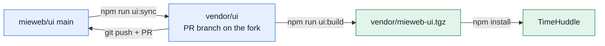

# vendor/

Code TimeHuddle builds from source instead of installing from npm.

| Path              | What it is                                                                                         |
| ----------------- | -------------------------------------------------------------------------------------------------- |
| `meteor-wormhole` | Submodule: Meteor package that exposes methods over REST, loaded by `meteor-backend`.              |
| `ui`              | Submodule: our fork of [mieweb/ui](https://github.com/mieweb/ui), on a branch that becomes a PR.   |
| `mieweb-ui.tgz`   | `@mieweb/ui` packed from `ui`. The app installs it (`"@mieweb/ui": "file:vendor/mieweb-ui.tgz"`). |
| `.ui-tarball-commit` | The `ui` commit the tarball was built from, so `ui:build` can skip an unchanged rebuild.        |

## Why `@mieweb/ui` is vendored

Changes TimeHuddle needs from `@mieweb/ui` (see [`docs/superchat-inbox-gaps.md`](../docs/superchat-inbox-gaps.md))
are built in the library itself, on a branch that is sent upstream as a PR, rather than worked
around in this app. Vendoring lets the app use that branch before it is released.

`ui` points at the fork `Dharp02/ui`, branch `feat/superchat-host-extension-points`, with
`mieweb/ui` as its `upstream` remote. CI and Docker never check the submodule out: they install
the committed tarball.

## Working on the library

1. Make the change in `vendor/ui` (it's a normal git checkout; use `pnpm`, never `npm`, there).
2. Commit it in `vendor/ui` and push to the fork: `git -C vendor/ui push`.
3. `npm run ui:build` rebuilds `vendor/mieweb-ui.tgz` and refreshes `package-lock.json`.
4. Commit the submodule pointer, the tarball, `.ui-tarball-commit` and `package-lock.json` together.

To pull in upstream changes: `npm run ui:sync`. It merges `mieweb/ui` `main` into the branch
(a merge, so the branch never needs a force-push) and rebuilds. Then push `vendor/ui` and commit
as in step 4.

The build takes a few minutes; it is skipped when `vendor/ui` hasn't moved. `npm run ui:build -- --force`
rebuilds anyway.

## Going back to npm

Once the PR is merged and released: set `"@mieweb/ui"` back to the released version, run
`npm install`, and remove the `ui` submodule, the tarball, `.ui-tarball-commit`, the `ui:*` scripts
and the `COPY vendor/mieweb-ui.tgz` lines in the `Dockerfile`. The previous round of this is
archived in [`.attic/mieweb-ui-tarball/`](../.attic/mieweb-ui-tarball/README.md).
